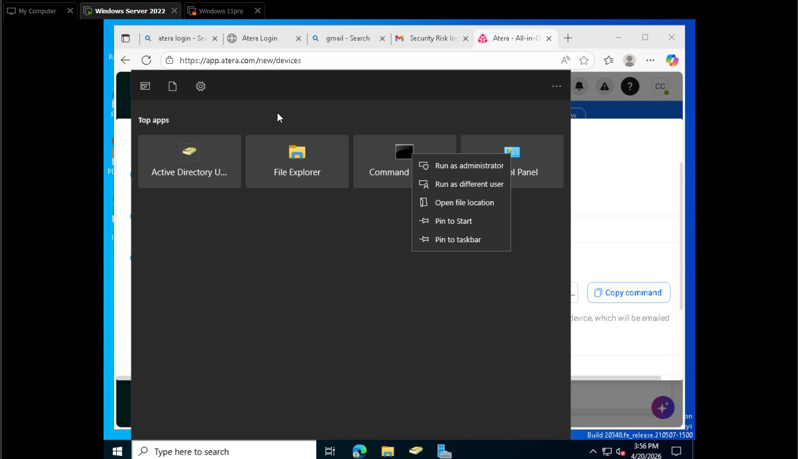
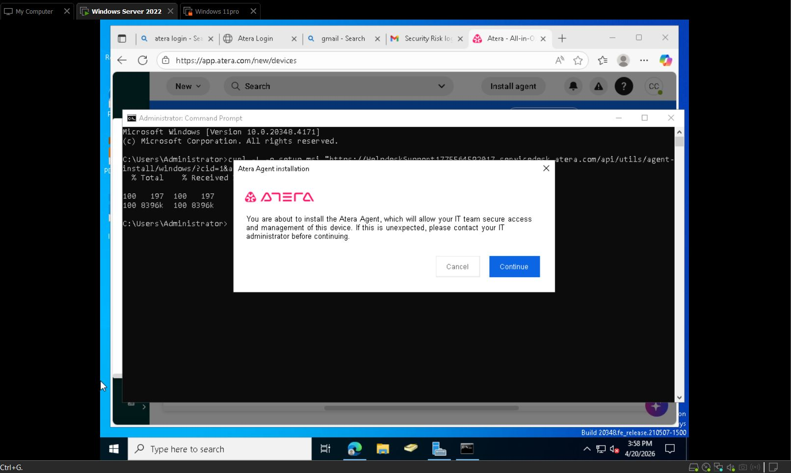
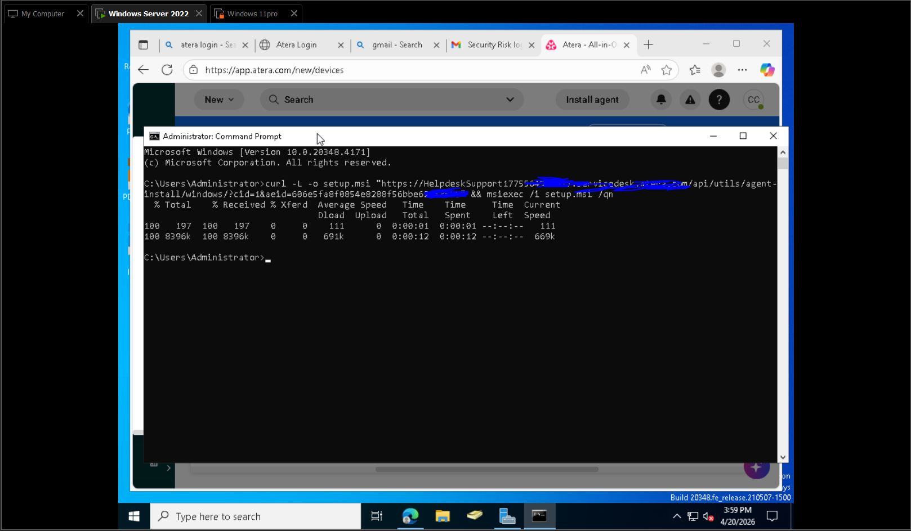
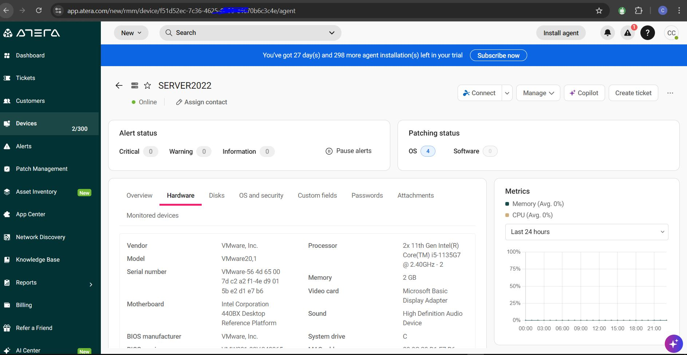
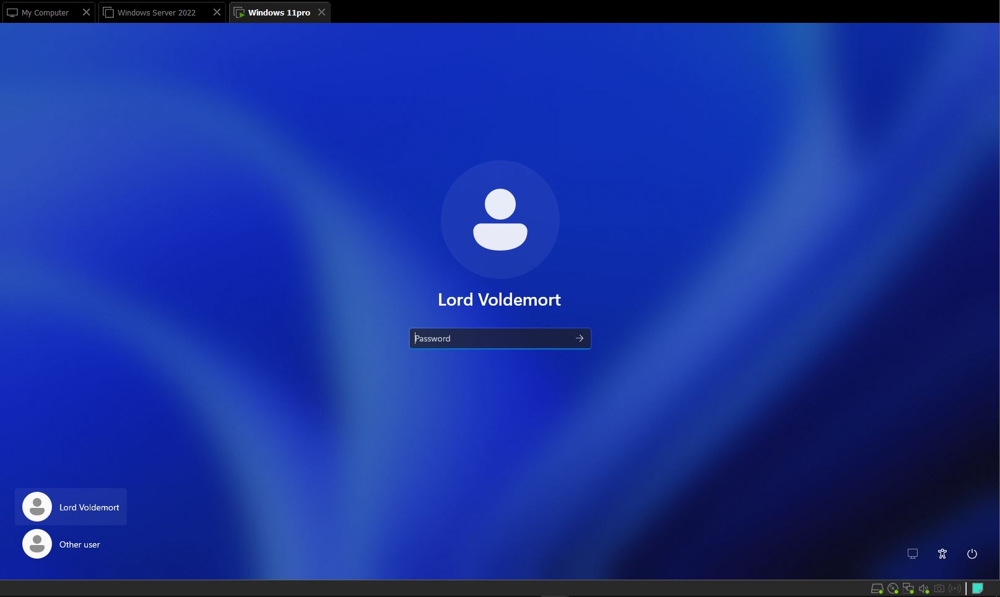
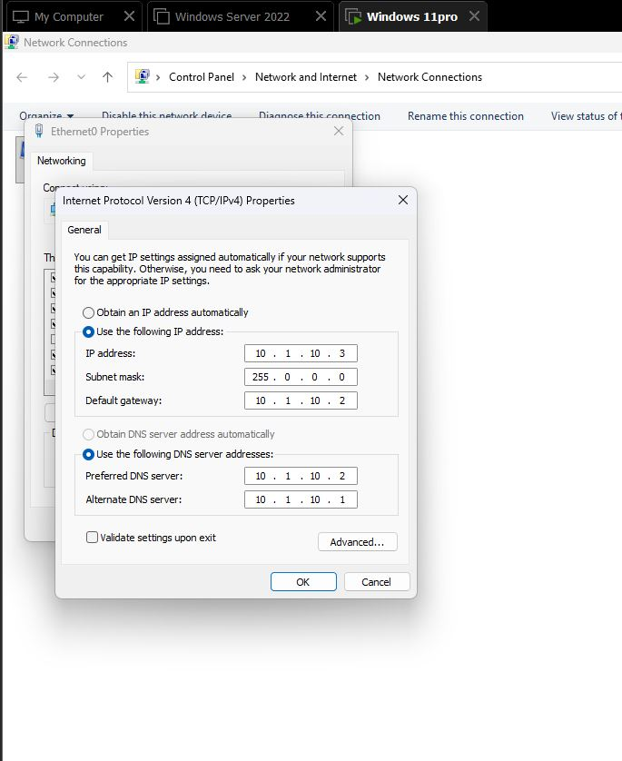
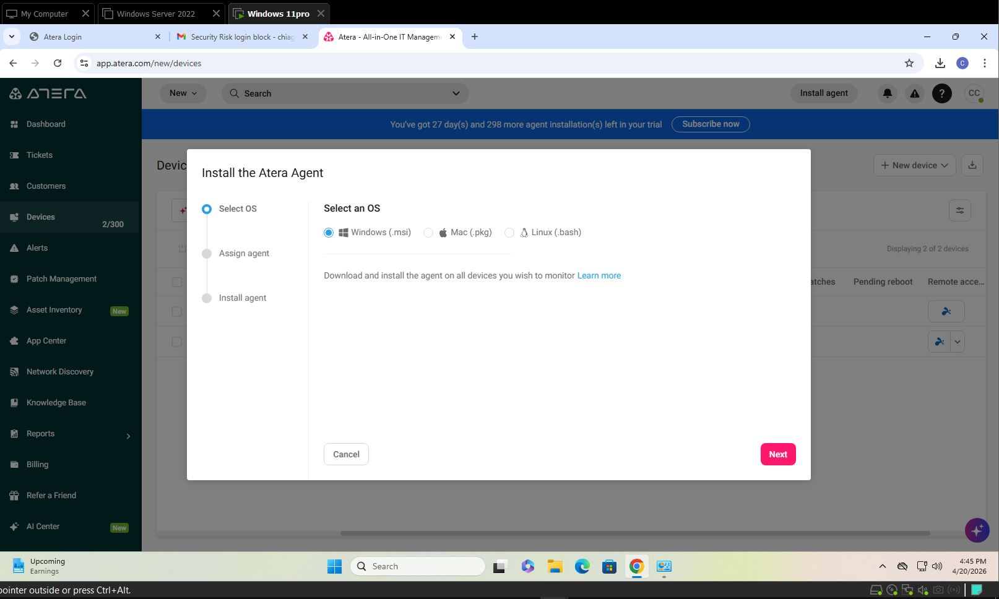
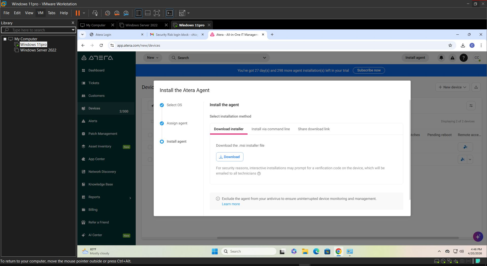
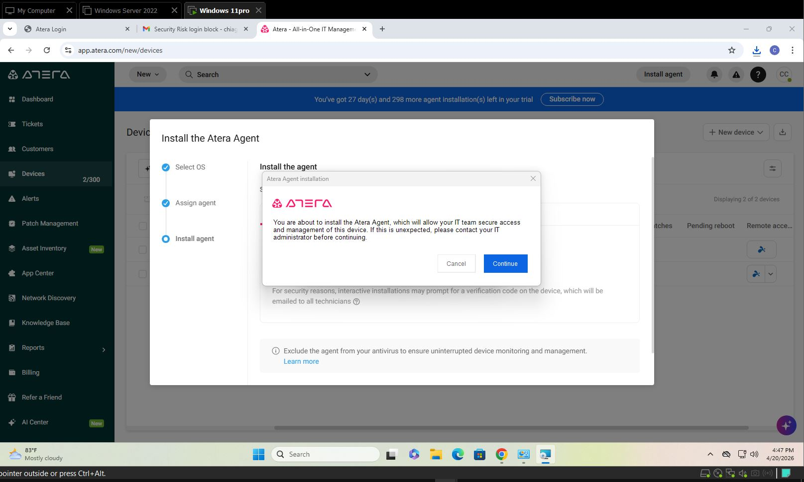

## RMM Overview and Agent Installation

### RMM (Remote monitoring management)
- It is a single pane of glass for accessing all information on a system  
### System Software Inventory
- View and manage all software on the OS

### Importance of RMM
- RMM is an important asset for MSPs and technicians to:
  - View and manage devices from a single dashboard
  - Perform updates and app installation
  - Run scripts  
  - Handle patch management  
- Ensures nothing gets missed  
---
## Installing New Agents on Atera

### Supported Systems
- Windows  10
- Windows Server  
- Windows 11  
- Linux device(ubuntu)  
---
## Installing Agent on Windows Server 2022
- Click on **New Agent**  
- Select OS → Windows  
- Click **Next** → Select Installer  
- Run script via Command Line (as Administrator)  

- Run the script → Atera Agent Installation

- Agent installs successfully  on windows server 2022

### Device Overview (Windows Server 2022)
The overview of my windows server 2022 on atera showing the following 
- Available patches  
- Hardware  
- Disks  
- Connectivity  
- Remote support access 


---
## Windows 11 Agent Installation Overview
- Use the same installation method  
- Steps followed:
  - Logged into virtual machine (VMware Pro)  
  - Powered on Windows 11 Pro  

  - Logged in  and changed the ip address from static to dynamic ip address

  - Opened Chrome → Accessed Atera account  
  - Clicked **Install Agent** on the Windows 11 Pro device 

### Installation
- Install the agent → Download → Installation completed successfully  

- Windows 11 device is now installed and ready to be managed via Atera RMM 




### Device Overview (Windows 11 Pro)
- Navigate to the device overview page  
- Displays:
  - Device information  
  - Hardware  
  - Disk details  

### Device Management Capabilities
From the device dashboard, you can:
- Wake the device (Wake-on-LAN if supported)  
- Schedule reboot  
- Restart device  
- Connect remotely to the device  
- Monitor health and performance  
---
## Installing Agent on Linux (Ubuntu)

### Installation Steps
- Follow the same general process used for Windows:
  - Access your virtual machine  
  - Log in with your credentials  
  - Open a browser (e.g., Firefox)  
  - Log in to your Atera account  
  - Navigate to **Install Agent**  

- Open terminal on Ubuntu  
- Paste the installation script provided by Atera  
- Execute the script  
---
## Issue Encountered

### Error Description
- During installation, the system returned a **.NET Core dependency error**  
- This prevented the agent from completing installation  

### Root Cause
- Missing required **.NET runtime dependencies**  
- As a result:
  - The agent failed to create the required systemd service file:
    - `AteraAgent.service`  
  - Service remained in a **"not found"** or inactive state  
---
## Troubleshooting Steps

### 1. Log Analysis
- Checked service status using:
  ``bash
  systemctl status ateraagent.service
- Verified that the service was not properly registered

### 2. Cleanup Process

- Removed partial installation files to avoid conflicts:
    
    ```
    sudo rm -rf /usr/lib/atera-agent
    ```
    
- Ensured a clean environment for reinstallation

### 3. Dependency Resolution

- Installed required .NET runtime packages:
    
    ```
    sudo apt updatesudo apt install -y dotnet-runtime-6.0
    ```
    
    (Version may vary depending on Atera requirements)
    

### 4. Reinstallation

- Re-ran the Atera installation script after resolving dependencies
- Confirmed successful installation
---
## Verification

- Checked service status:
    
    ```
    systemctl status ateraagent.service
    ```
    
- Confirmed:
    - Service is active and running
    - Agent successfully registered in Atera dashboard
    - Device appears online
