# Patch Management with Atera RMM

## Overview
Patch management is the process of identifying, testing, and applying software updates (patches) to computers, servers, and applications.
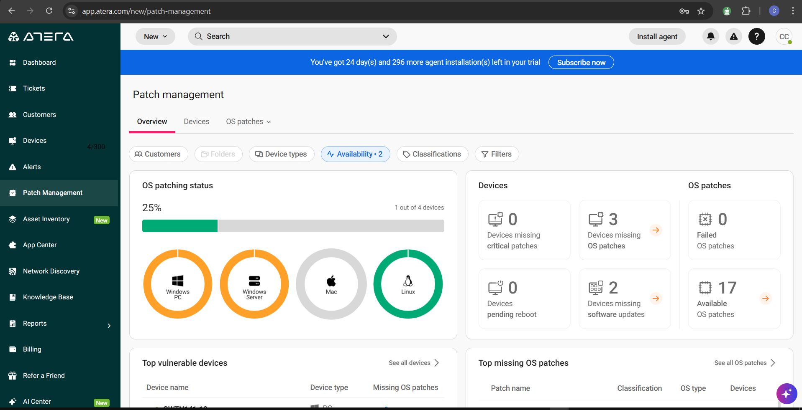
It is a core security practice that ensures client machines are protected against cyber threats and vulnerabilities.
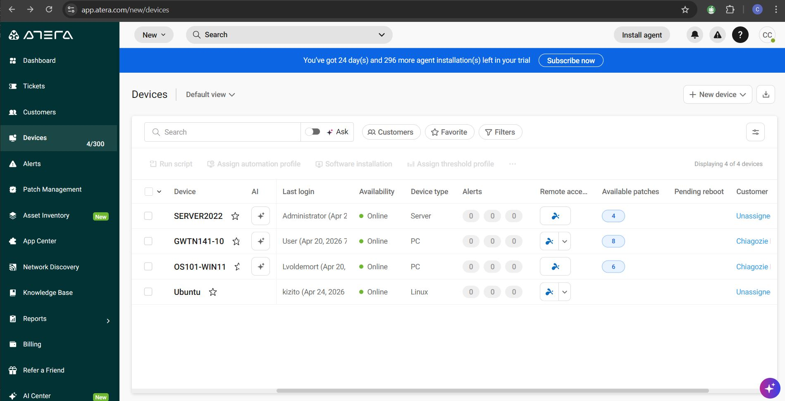

---
## Getting Started with Patch Management

- Navigate from the **Dashboard** → **Patch Management**
- This section provides an overview of patching status, including:
  - Available OS patches
  - Missing patches
  - Devices already patched
  - Devices that do not require updates
  - Devices that require critical attention
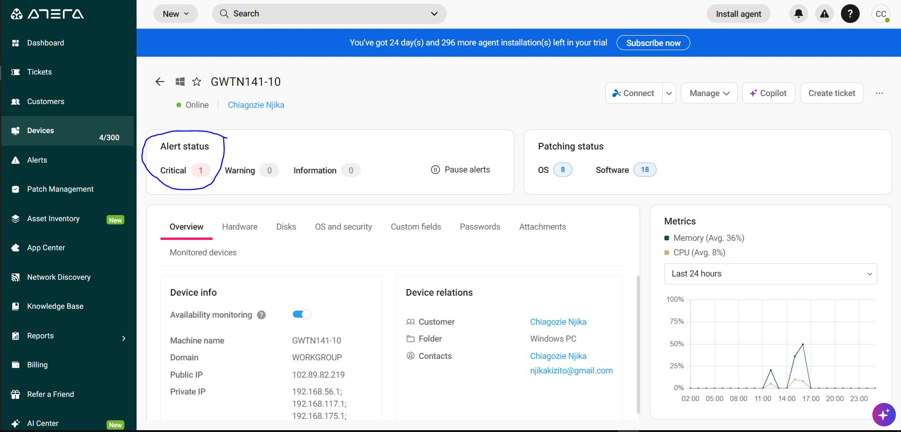
---
## Installing OS Patches

- Go to **OS Patches** → **Available Patches**
- Select the patches you want to deploy
- Click **Install** for selected Windows devices
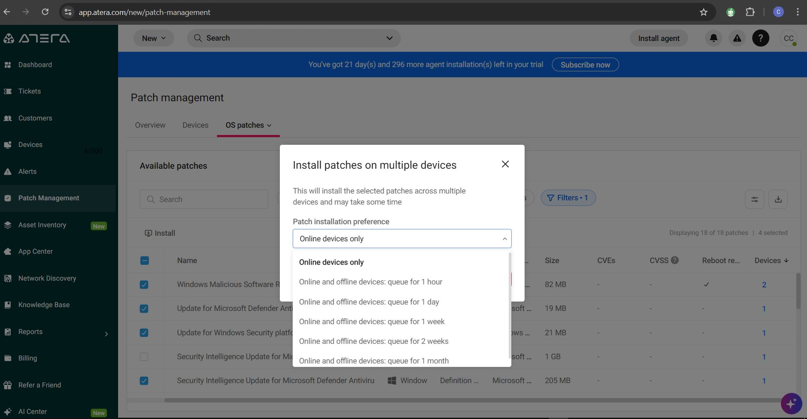
### Example
- Installed patches for:
  - Windows 10
  - Windows 11
- Installed updates for:
  - Malicious Software Removal Tool
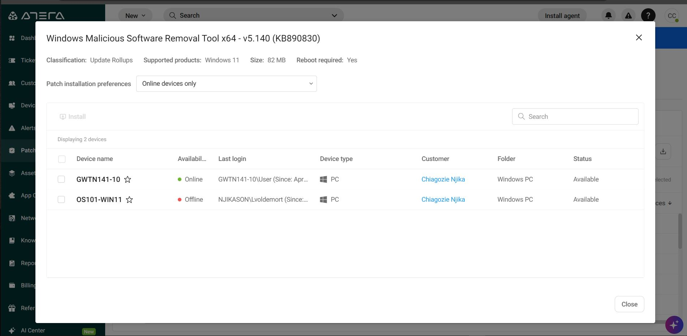
---

## Patch Management and IT Automation

Automating patch management ensures systems stay updated without interrupting users during working hours.
### Benefits
- Zero disruption to client productivity
- Consistent update deployment
- Improved security posture
## Configuration Details

- **Profile Name:** Off-hour Patch Management & Automation  
- **Deployment Schedule:** Weekly  
- **Execution Time:** Saturday at 01:00 AM
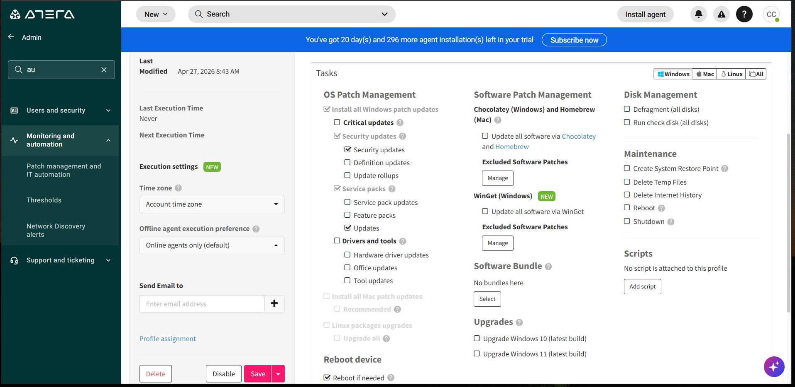

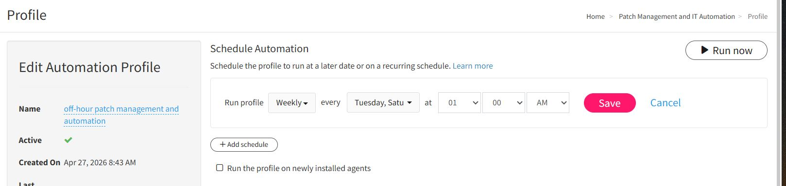
Atera RMM patch management allows IT teams to:
- Monitor patch status across devices
- Deploy updates efficiently
- Automate routine maintenance
- Maintain security compliance across environments
# Advanced Patch Management with Atera RMM

## Patch Categories Included

The patch management policy includes the following update categories:

- Critical Updates
- Security Updates
- Hardware Driver Update
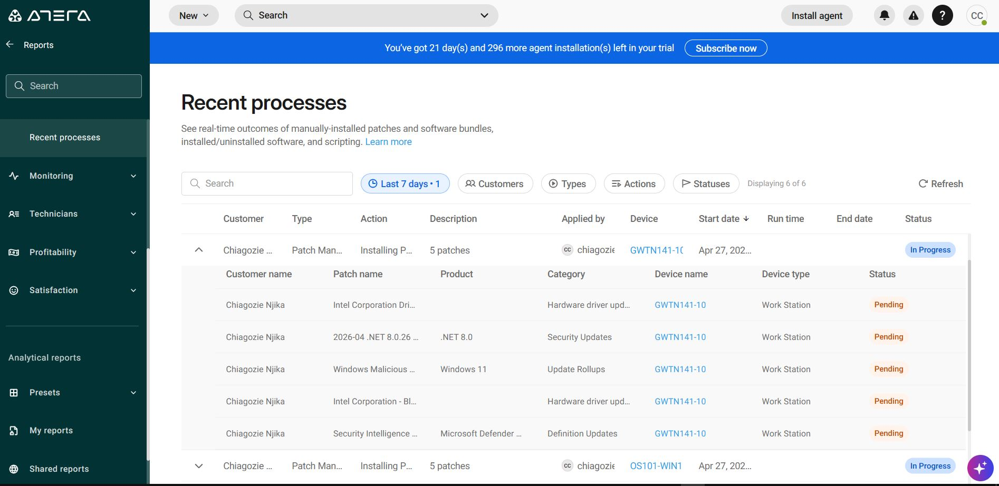
---
## Target Devices

The patch deployment policy was configured to apply to:

- Windows 11 Endpoints
- Windows 10 Endpoints
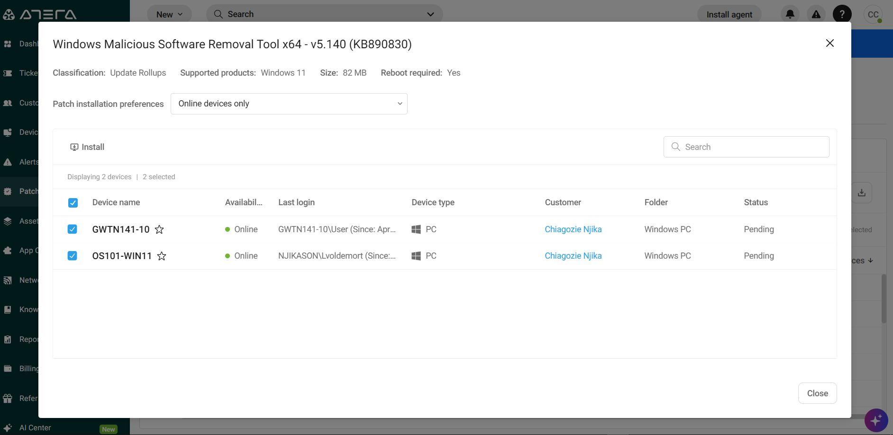
---
## Running the Patch Deployment

- Cross-checked the selected update categories and target devices
- Clicked **Run Now** to begin deployment

This ensures the environment remains secure and compliant while maintaining maximum uptime for end users during active working hours.
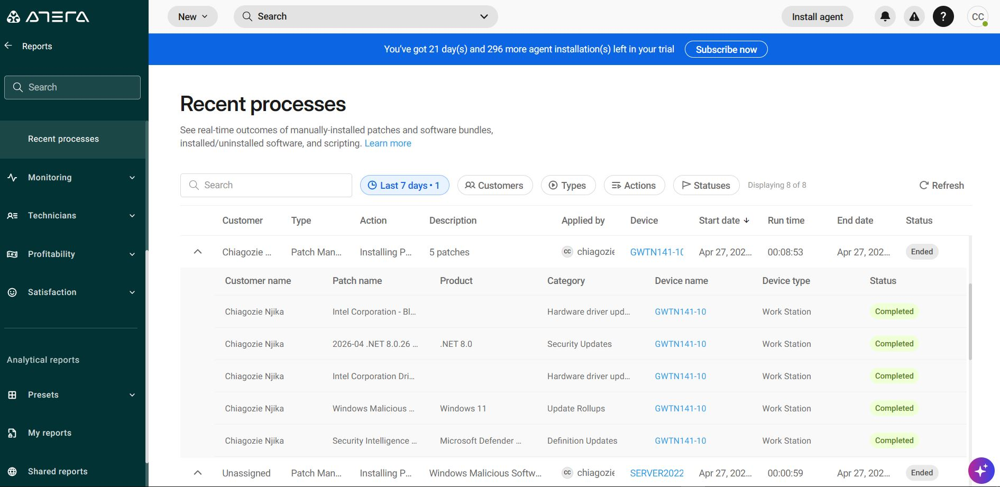

---
## System Reboot After Patch Installation

After patch updates were installed on the Windows 11 device:

- The system displayed a prompt requesting a reboot to complete the installation
- Selected **Reboot Now** since the device was currently online
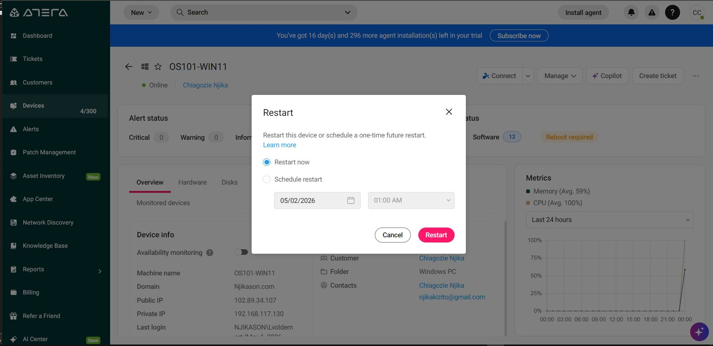

Following the reboot:
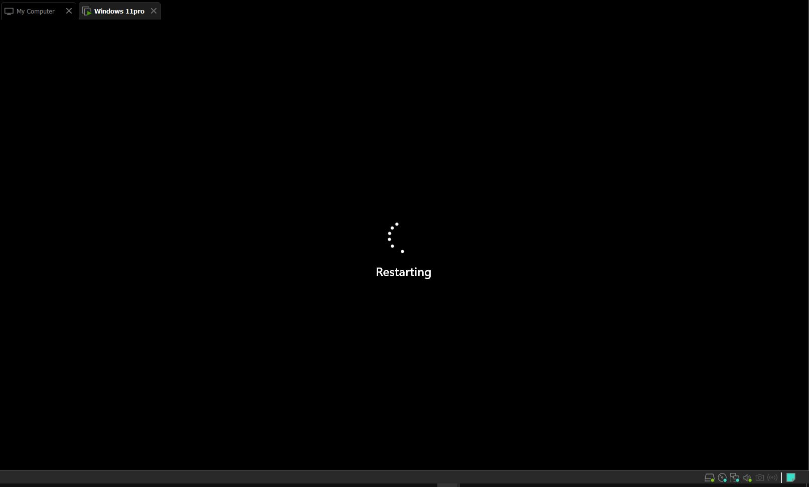

- Recent processes and general reports confirmed that the patch update completed successfully
- The device returned to normal operational status

---
# Device Management Using Atera RMM

## Managing Endpoints and Servers

Atera RMM provides centralized management for servers and endpoint devices.

### Remote Support

While traditional remote desktop control tools such as:

- Splashtop
- AnyDesk

are commonly used for user-facing software troubleshooting and training sessions, Atera also provides background management tools that allow technicians to resolve system-level issues without interrupting the end user.

---
## Background Management Features

Atera enables technicians to:

- Monitor device health
- Perform patch management
- Execute scripts remotely
- Restart services
- Access PowerShell and Command Prompt
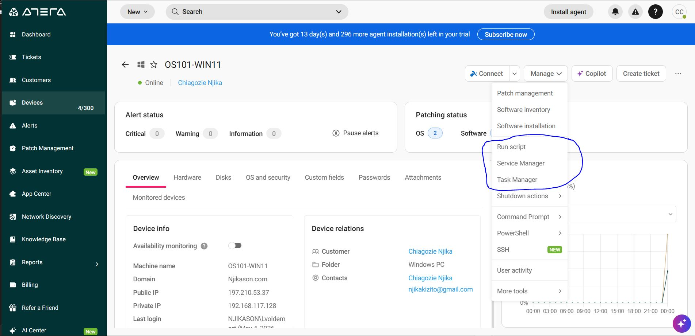
- Monitor alerts and system events
- Troubleshoot performance issues silently in the background
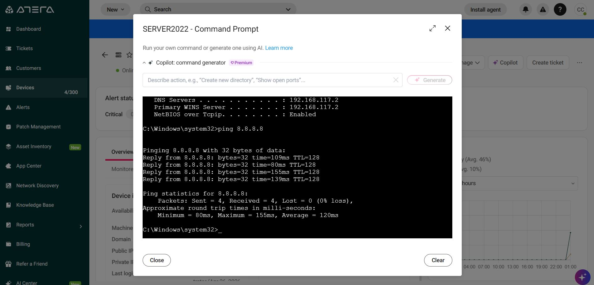
This approach helps ensure:

- Minimal downtime
- Faster issue resolution
- Improved operational efficiency for Tier 1 and Tier 2 support teams
- Better end-user experience

# Background System Management with Atera RMM

## Overview

Background system management allows IT support teams to troubleshoot, configure, and maintain Windows servers and endpoint devices without interrupting the end user or taking control of their screen.

This approach enables technicians to resolve issues silently in the background while users continue working normally.

---
# Key Background Actions Performed Using Atera

## Remote Task Manager

Atera provides remote access to Task Manager functionality, allowing technicians to:

- Identify high CPU usage processes
- Monitor memory consumption
- Detect unresponsive applications
- Terminate problematic applications remotely
- Improve overall system performance

