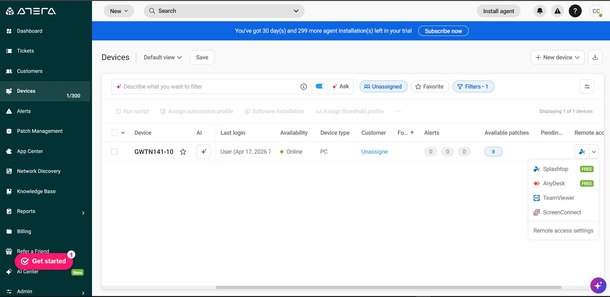
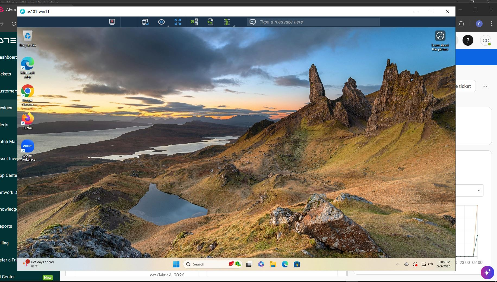
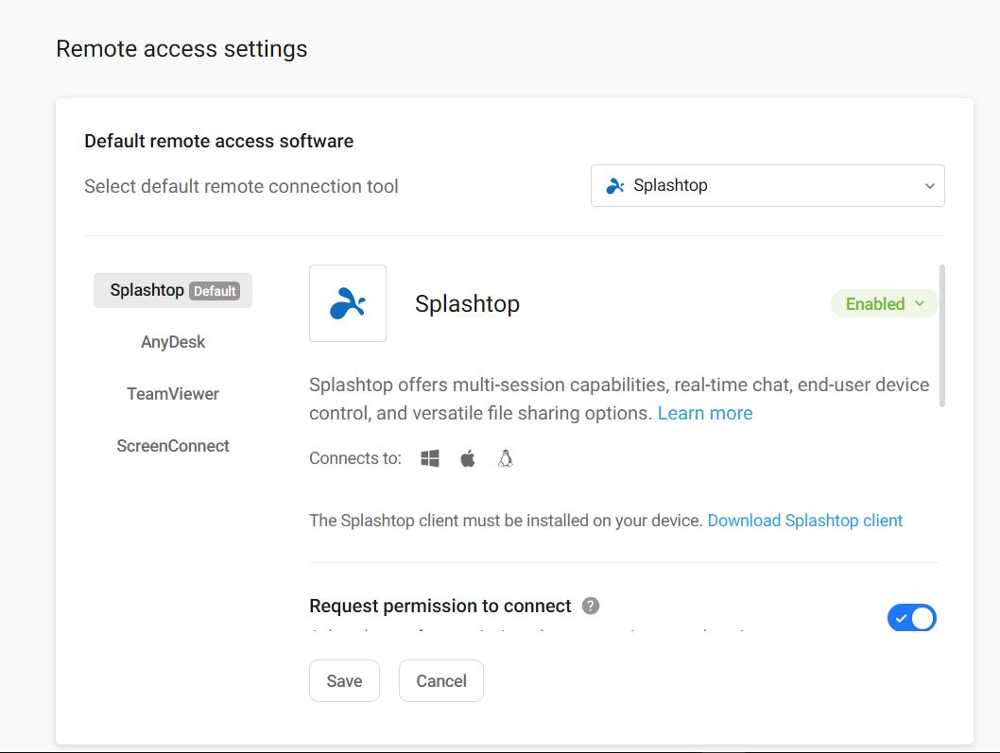
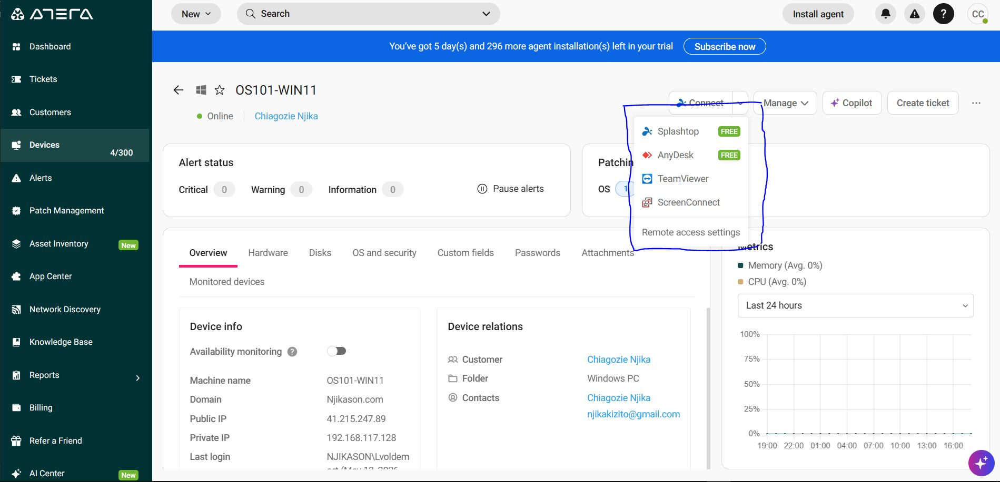
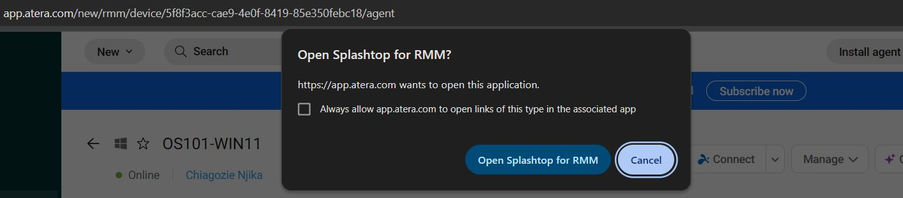
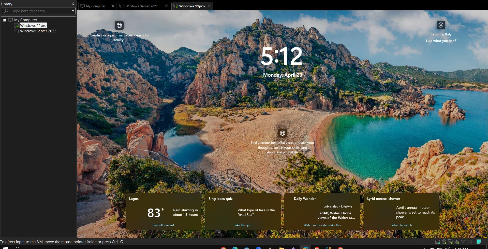
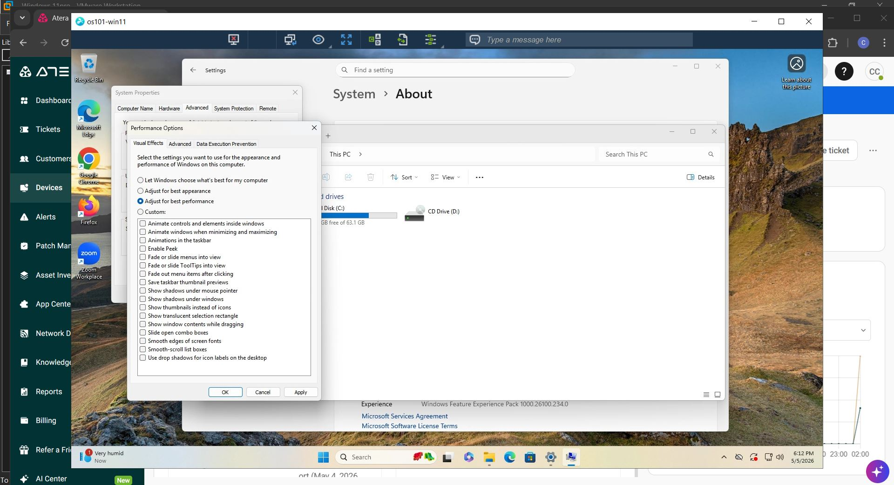
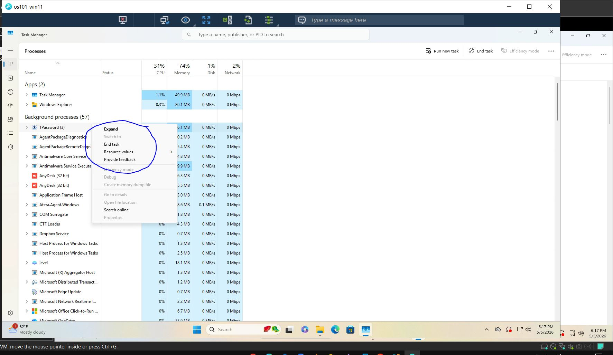
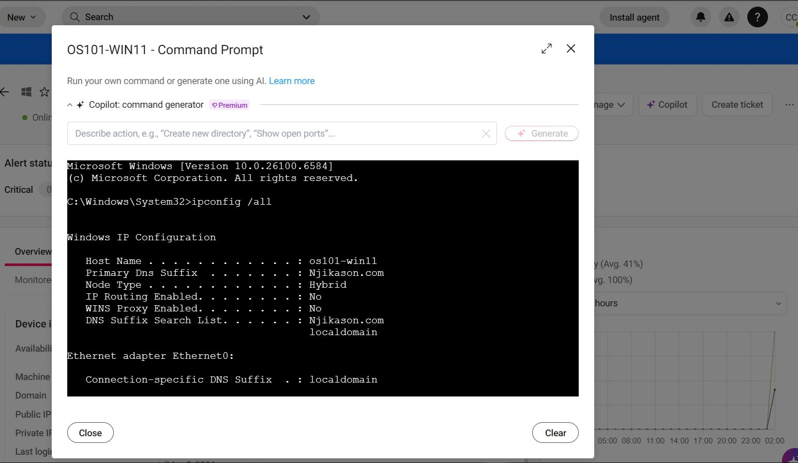

# Remote Connection with Atera RMM

Remote connection tools such as:

- Splashtop
- AnyDesk
- ScreenConnect

Allow IT technicians to securely view and control a client's screen remotely in order to provide immediate troubleshooting and technical support for end users.

---
## Splashtop Integration in Atera

Splashtop is a secure, high-performance remote access solution integrated into Atera.

It enables IT administrators to remotely control:

- Windows devices
- macOS devices

from their workstation through the Atera platform.
### Benefits
- Fast remote connectivity
- Secure remote access
- Simplified troubleshooting
- Centralized device management
- Improved support efficiency
---
# Getting Started with Splashtop

### Prerequisites

Before using Splashtop through Atera:

- Ensure the Atera agent is installed on the target device
- Confirm the device is online and accessible
- Verify that remote access features are enabled

---
## Accessing a Device Remotely

### Steps Performed

1. Navigate to the target device in Atera
2. Open the **General Settings** or **Remote Access** section
3. Download or launch the Splashtop client
4. Connect to the remote machine

Once connected, technicians can seamlessly access and manage the device remotely.

---

## Security and Permissions

Splashtop integration within Atera provides:

- Encrypted remote sessions
- Secure authentication
- Permission-based access control
- Safe remote support capabilities

This ensures that remote support sessions remain secure while allowing IT teams to efficiently troubleshoot and resolve issues.

# Remote Support for End Users with Atera RMM

As an IT helpdesk technician, remote support tools allow quick access to a client system in order to reproduce issues, troubleshoot problems, and assist end users efficiently.

---

# Remote Access for Windows Devices

### Steps Performed

1. Open the target Windows 11 device in the Atera dashboard
2. Click on **Connect**
3. Connect to the device remotely using:
   - Splashtop
   - AnyDesk

This provides direct remote access to troubleshoot performance issues and user-related problems.

---

## Remote Troubleshooting

During the remote session, technicians can:

- Analyze system performance
- Monitor running applications
- Identify resource-heavy processes
- Terminate unnecessary applications
- Resolve performance bottlenecks

### Example

Used Task Manager to stop applications consuming excessive system resources in order to improve overall performance.

---

# Background Remote Management

Atera also supports background management without taking over the user’s screen.

Technicians can remotely:

- Run PowerShell commands
- Access Command Prompt
- Execute scripts
- Perform administrative tasks silently in the background

This minimizes disruption for the end user while troubleshooting issues.

---

# File Transfer with Splashtop

Splashtop allows secure file transfer between the technician’s system and the remote device.

### Steps Performed

1. Open the remote session using Splashtop
2. Select **File Transfer**
3. Transfer files from the local device to the remote Windows 11 machine
### Benefits

- Secure file movement
- Fast transfer speeds
- Simplified remote support operations
- Reduced need for email attachments or external storage
---
# User Communication During Support Sessions

The IT helpdesk can also communicate directly with end users during remote sessions through built-in chat functionality.

This ensures:

- Clear communication
- Better troubleshooting coordination
- Improved support experience for end users

# Remote Support Session Using Atera and Splashtop

Once the user disconnects from the remote support session, I can reconnect to the Windows Server 2022 device for further troubleshooting and support.

## Reconnecting to a Device

1. Navigate to **Devices**.
2. Select **Windows Server 2022**.
3. Click **Connect**.
4. Choose **Splashtop** or **AnyDesk** from the remote connection options.
5. Wait for the remote session to establish successfully.

## Password Reset for User Accounts

If a user reports that they cannot log in to the system and requests a password reset:

1. Open **Atera RMM**.
2. Navigate to the **Windows Server 2022** device.
3. Connect to the server using **Splashtop**.
4. Open **Active Directory (AD)**.
5. Locate the user account.
6. Right-click the user account.
7. Select **Reset Password**.
8. Enter the new password.
9. Enable the option:
    - `User must change password at next logon`
10. Apply the changes.

## Importance of Remote Connectivity

Remote connectivity is essential for technical support because it allows IT administrators and support technicians to:

- Troubleshoot issues quickly
- Perform system maintenance remotely
- Reduce downtime for end users
- Access devices securely from different locations
- Improve response time for support requests

Reliable remote access tools such as Splashtop and AnyDesk help ensure efficient and secure remote administration.