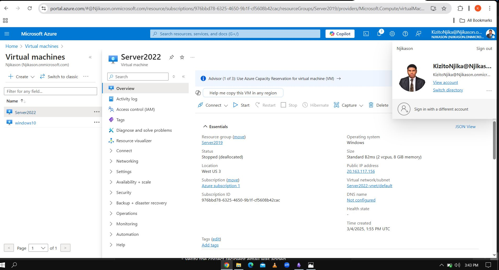
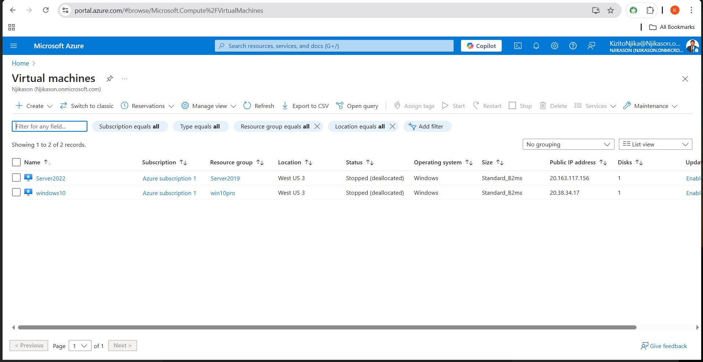
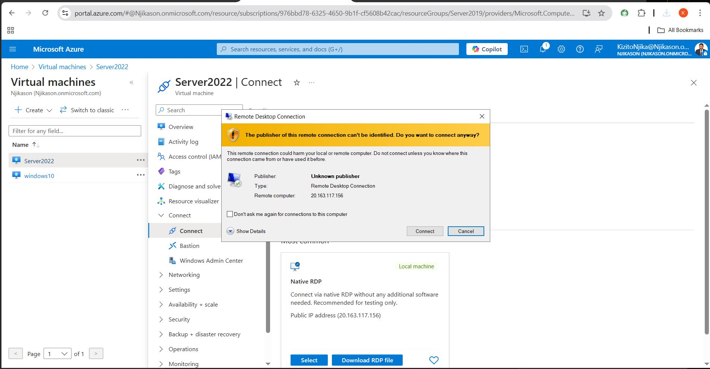
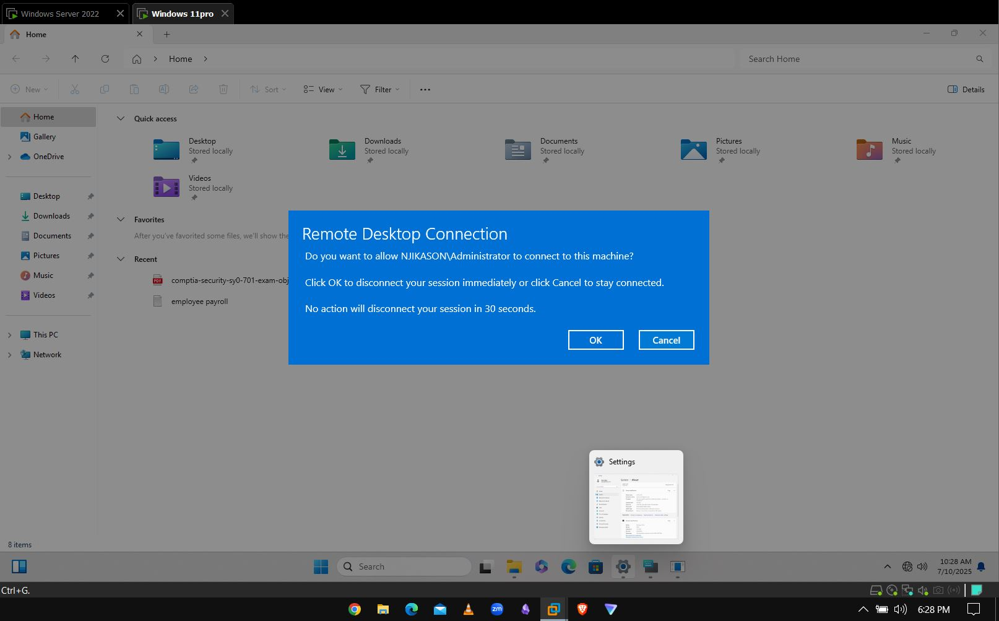

### Virtual Machine with Azure

**Step 1**  
- Log into Microsoft Azure Services  
- Click on the Virtual Machine  
- Then on Create -> Create Azure Virtual Machines  
- You create a Resource group (A Resource group is a collection of resources that shares lifecycle, permissions and policies)  
- Name the Resource group -> Homelab  
- Instance details -> Virtual machine name -> Server 2019  
- Image (Choose Server 2019 Data Center or Server 2022)

### Administrator Account

**Create Username**: helpdesk  
**Password**: Chigozie798  
- Review & Create (Once the validity is good)  
- Create

---

### After Azure Virtual Machine has been Created, you can login by:

**Using Connect**  
- Download RDP  
- Click on the RDP  
- Then enter your password and login  
  - **Server Name**: DCNY-01

---

### Log into the Windows 11 PC

- Connect  
- Download RDP  
- Click on the downloaded RDP  
- Click Connect  
- Enter password and Connect  

**Rename the PC**  
**Domain Name**: Njikason.com

**Directory Services Restore Mode (DSRM) Password**:  
- Capital123  

*(Run PowerShell as an administrator)*

---

```powershell
PS C:\users\helpdesk> Import-Module activedirectory
PS C:\users\helpdesk> get-command new-aduser
