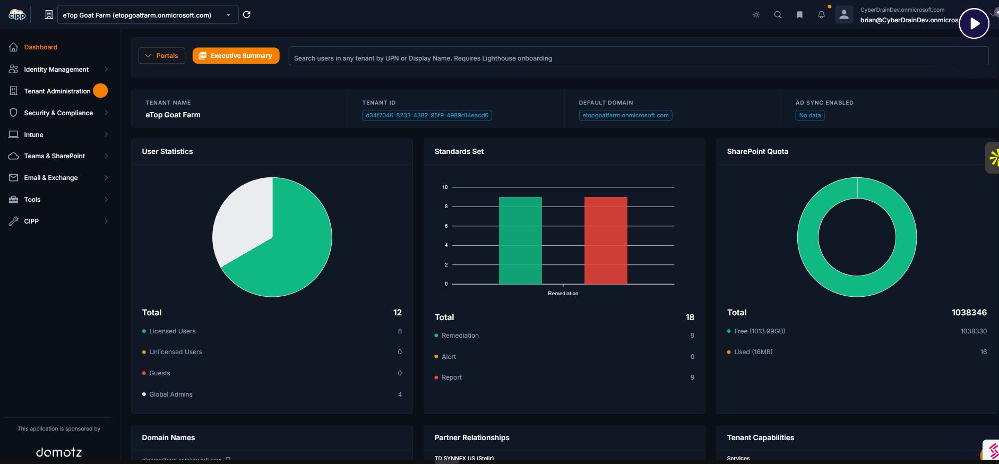

# CIPP (Cyberdrain Improved Partner Portal)
## 1. Introduction

**CIPP (Cyberdrain Improved Partner Portal)** is an open-source, multi-tenant management platform designed for Managed Service Providers (MSPs). It serves as a centralized "single pane of glass" for administering Microsoft 365 environments.

Instead of logging into each client's tenant individually, CIPP allows administrators to:

- Switch between tenants instantly via a unified top bar.
    
- Apply configurations to all tenants simultaneously.
    
- Automate routine tasks like onboarding and offboarding.

### Hosting Models

CIPP is flexible and can be deployed in two ways depending on your organization’s needs:

- **Self-Hosted (Open Source):**
    
    - **Definition:** You deploy CIPP into your own Azure tenant.
        
    - **Cost:** The software is free, but you pay for the underlying Azure consumption (Functions, Storage, KeyVault, etc.).
        
    - **Maintenance:** You are responsible for updates, backups, and security of the CIPP instance.
        
- **Hosted (SaaS):**
    
    - **Definition:** You pay a subscription fee to use a managed version of CIPP hosted by the developers.
        
    - **Cost:** Monthly per-user or per-tenant fee.
        
    - **Maintenance:** Updates, security patching, and infrastructure management are handled by the CIPP team.
---
## 2. Security & Permissions (GDAP)

CIPP relies on **GDAP (Granular Delegated Admin Privileges)** to function securely.

### What is GDAP?

GDAP is a Microsoft security feature that allows MSPs to manage customer tenants with "least privilege" access. Unlike the older DAP (Delegated Admin Privileges), which granted broad Global Admin rights, GDAP allows you to request specific roles for specific durations.

### GDAP Roles & The Role Wizard

To manage clients effectively, you must map roles in CIPP to groups in your partner tenant.

- **Role Mapping:** You select roles (e.g., _Application Administrator_, _Intune Administrator_, _Exchange Administrator_).
    
- **Group Creation:** CIPP creates a corresponding group for each role in your partner tenant (e.g., `M365 GDAP Exchange Admin`).
    
- **Assignment:** You add your technicians to these groups to grant them permissions across client tenants.
    
---
## 3. Tenant Onboarding (Step-by-Step)

Onboarding a tenant involves two distinct phases: establishing the relationship with Microsoft, and then syncing that relationship into CIPP.

### Phase 1: Establish the Relationship (Microsoft Partner Center)

Before a tenant appears in CIPP, you must have a valid CSP and GDAP relationship.

1. **Invite the Client:** Log into Microsoft Partner Center and send a reseller relationship request (CSP) to the client.
    
2. **Request GDAP Relationship:**
    
    - In CIPP, go to **Tenant Administration** → **GDAP Invite Wizard**.
        
    - Select the roles you need and generate an invite link.
        
3. **Client Approval:** The client (or a Global Admin on their side) must click the link and approve the relationship.
    

### Phase 2: Onboard into CIPP

Once the relationship exists in Microsoft's backend, follow these steps to make the tenant manageable in CIPP:

1. **Navigate to Administration:** Go to **Tenant Administration** → **Tenant Onboarding**.
    
2. **Sync Tenants:** Click the **Refresh/Sync** button. CIPP will query the Microsoft Partner Center API to find new relationships.
    
    - _Note: It may take 15–30 minutes after client approval for Microsoft's APIs to report the new relationship._
        
3. **GDAP Check:**
    
    - Locate the new tenant in the list.
        
    - Run the **GDAP Check** to verify that the roles are active and valid.
        
4. **Permissions Check:**
    
    - Run the **Permissions Check** to ensure CIPP’s service principal has the necessary rights to read/write data to the tenant.
        
5. **Finalize:** Once both checks pass, the tenant is fully onboarded and will appear in the tenant selector bar.

---
## 4. Identity & User Management

This module consolidates all user-related actions, replacing the standard Microsoft 365 Admin Center for day-to-day tasks.

### User Overview

Navigate to **Identity Management** → **Administration** → **Users**. Clicking on a user (e.g., _Alex Allen_) opens a detailed profile containing:

- **M365 & OneDrive Details:** Storage usage, licensing, and last login time.
    
- **Security Posture:** Applied Conditional Access policies and compromise remediation history.
     
- Microsoft 365 management details  
- OneDrive details  
- Last login details  
- Applied Conditional Access policies  
- Compromise remediation information  

### User Actions (Day-to-Day)

- **Quick Actions:** Reset passwords, send MFA push notifications, and unlock accounts.
    
- **Edit User:** Modify properties, contact info, and licenses.
    
- **JIT (Just-In-Time) Admin:** Create a temporary admin account for a technician that automatically expires after a scheduled start and end date.
    
### Lifecycle Automation

- **Bulk Add Wizard:** Create multiple users across tenants simultaneously using templates.
    
- **Offboarding Wizard:** A critical tool for employee departures. It automates:( select the tenant> select the person you want to offboard> then select the following action on what to disable)
    
    - Disabling sign-in.
        
    - Converting the user mailbox to a Shared Mailbox.
        
    - Removing licenses.
        
    - Canceling future calendar events.
---
## 5. Device Management (Intune)

Manage endpoints (laptops, mobiles) across all tenants from one view.

### Devices

Navigate to **Intune** → **Devices**.

- **Device Actions:** Perform remote actions such as _Wipe_, _Retire_, _Fresh Start_, _Sync_, or _Rename_.
    
- **Autopilot:** Manage Autopilot device hashes and profiles for zero-touch deployment.
    

### Applications

Navigate to **Intune** → **Applications**.

- **Add Applications:** Deploy apps (e.g., Microsoft Store apps) to specific tenants or groups.
    
- **Application Queue:** Monitor the status of app deployments.
    

### Configuration Policies

- **Compliance Policies:** Create and assign templates that dictate device security requirements (e.g., BitLocker enabled, minimum OS version).
    
- **Apply Policy Wizard:** Deploys MDM policies to multiple tenants in three steps:
    
    1. Select Tenants.
        
    2. Configure Policy.
        
    3. Confirm Deployment.
        

---

## 6. Collaboration & Content

Manage the structure and security of Teams, SharePoint, and OneDrive.

### Teams

- **List Teams:** View all Teams, their privacy status (Public/Private), and member counts.
    
- **Management:** Create new Teams or modify existing ones.
    

### SharePoint

- **Site Management:** View storage usage, add new sites, or bulk edit site settings.
    
- **Permissions:** Add or remove user access to specific SharePoint libraries.
    

### OneDrive

- **Inspector:** View OneDrive status for specific users and modify permissions (e.g., granting a manager access to a terminated employee's files).
    

---

## 7. Email & Exchange Administration

Comprehensive tools for managing mail flow and mailboxes.

### Mailbox Management

- **General Actions:** Convert to Shared Mailbox, configure delegation rights, and edit mailbox permissions.
    
- **Tools:**
    
    - **Message Trace:** instantly trace emails across the last 10 days to troubleshoot delivery issues.
        
    - **Quarantine:** Release or block quarantined emails.
        

### Resources & Contacts

- **Resource Management:** Manage room and equipment mailboxes.
    
- **Contacts:** Create and edit global contacts or deploy contact templates to standardize address books.
---
## 8. Advanced Tools & Automation

### Conditional Access (CA)

- **Multi-Tenant Deployment:** Apply a standard baseline CA policy to multiple tenants at once.(150 standards)
    
- **Report-Only Mode:** Deploys policies in a "log-only" state to test their impact without locking users out.
    
### Scheduler

Automates CIPP maintenance tasks. You can schedule scripts or compliance checks to run at specific times and push the results to:

- A PSA (Professional Services Automation) tool.
    
- A Webhook (for custom integrations).
    
- Email reports.
    

### Template Library

A repository that allows you to "snapshot" a tenant's configuration (e.g., Intune policies or Transport rules) and save it as a template to deploy to other clients

# Relationships

* Contains all the recommended roles.

* Navigate to:  
  **Relationship → View Relationship → Start Onboarding → Open Relationship in Partner Center**

* Available actions:
  - Enable automatic extension  
  - Remove global admin from relationship  
  - Reset role mapping  

---

# Standards & Drift

Standards ensure consistent configurations across your Microsoft 365 tenants by re-applying baseline settings every four hours or evaluating drift every twelve hours.  

This automatic enforcement and drift detection helps prevent unauthorized changes and maintain security.
## Types of Standards

### Classic

* Traditional standards that have been available and used in CPP for some time.

---
# Drift Templates

Drift templates provide continuous monitoring of tenant configurations to detect unauthorized changes.

* Each tenant can only have **one drift template** applied at a time.
* Monitors all security standards, Conditional Access policies, and Intune.
* Detects changes made outside of CPP.
