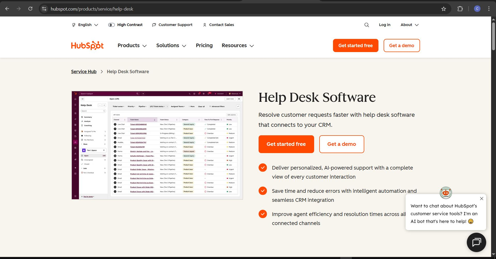
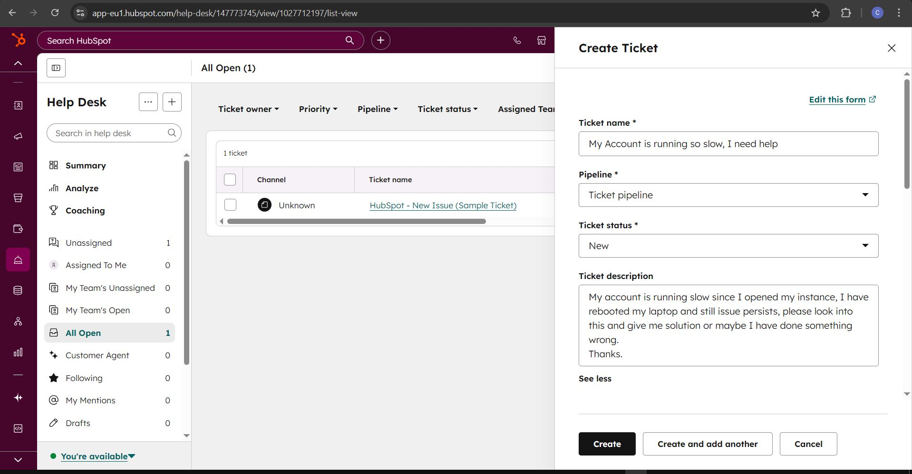
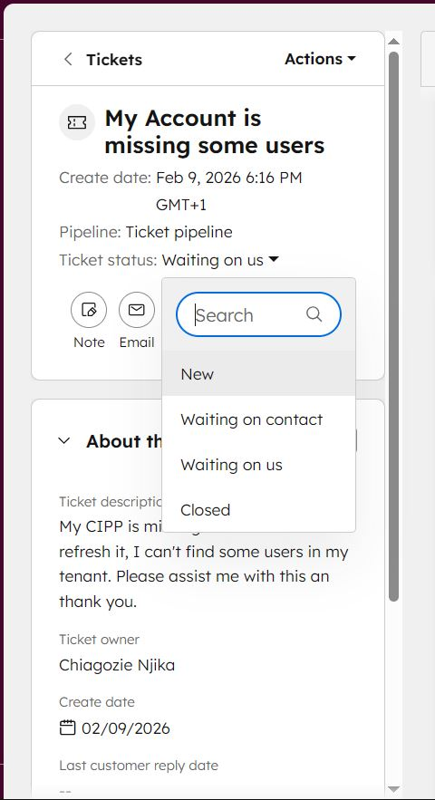
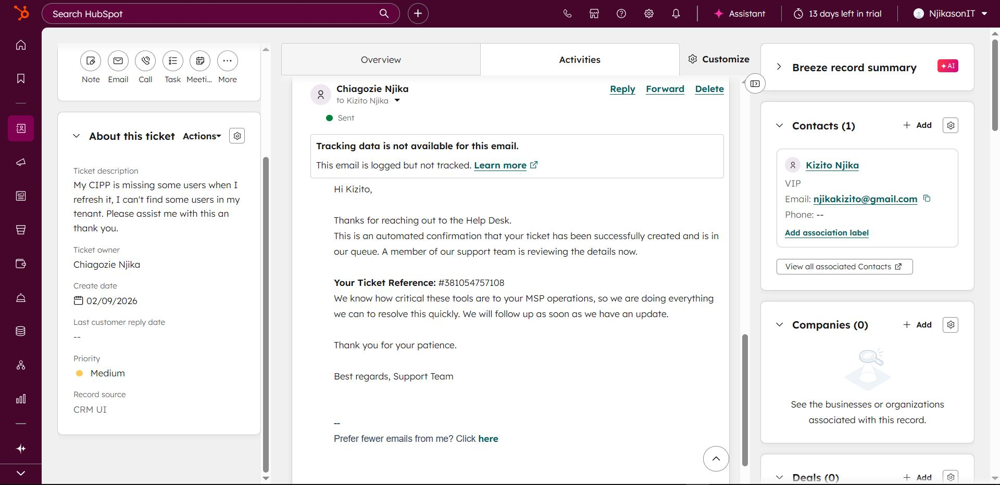
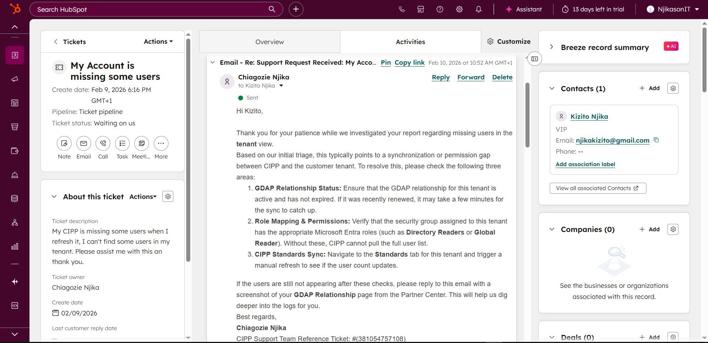
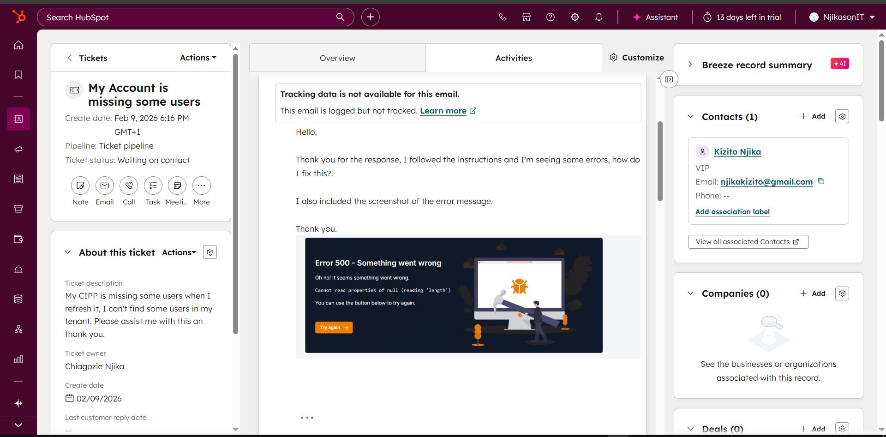
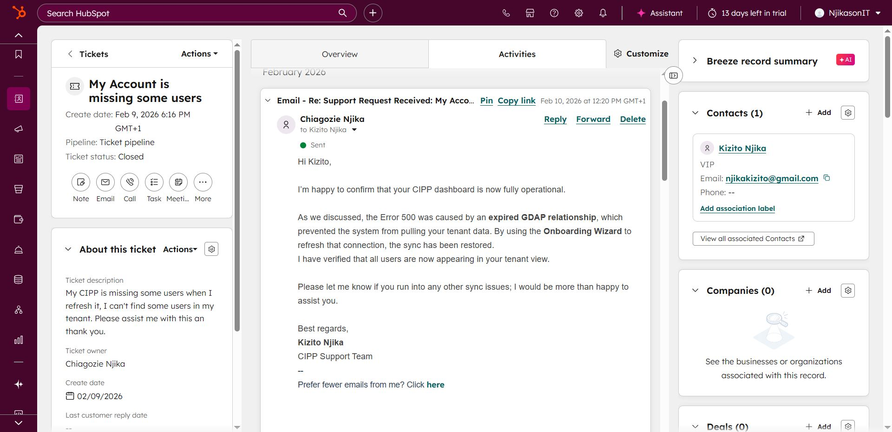

## 1. Introduction

**HubSpot Ticketing System** is a core component of the Service Hub designed to help teams record, organize, and track customer issues in a shared inbox.

It serves as a central repository for all support requests, ensuring that no customer issue falls through the cracks. Because it is integrated with the HubSpot CRM, agents have a full view of the customer's history, including:

- Contact details (Name, Company, Location).
    
- Past conversations and emails.
    
- Previous ticket history.
**Goal:** To prioritize, manage, and resolve tickets efficiently while improving customer satisfaction and agent productivity.

---
# Communication

- Communication (responding and giving solutions to problems).  
- Using internal notes to document technical steps, actions taken & professional attitude towards ticket priority.  
- Follows Escalation Process → If I can’t resolve it, put in internal notes & escalate to tier 2.  
- Knowledge Base → is very important to search for solutions & contribute to most re-occurring issues and document solutions.  
---
# Creating New Ticket in HubSpot

- Navigate to help desk and click on + to create ticket.  
- Fill in the ticket name → ticket status as New → Ticket description of what the problem is about → then save whether it’s chat, email or phone conversations.  

- Priority set → Associate ticket with (the person that called in with the problem) → Companies & create the ticket.  

- Reached out to the client acknowledging that I created a ticket and currently working on it with their ticket reference.  

- I created a template that gets sent to the client when they contact support team so that they know we got the email and working on it, rather than keeping them on loops.  

- Ticket is being set at Waiting on us, or waiting on contact 

---
# CIPP Troubleshooting & Support Scenarios

## Case Study 1: Tenant Sync Failure (Error 500)

### 1. Issue Description

**Symptom:** A user reports that specific tenants are missing users in the dashboard, or data is not populating. **Error Message:** The user later confirms receiving an **API Error 500** (Internal Server Error) when trying to load tenant data.

### 2. Initial Triage & Investigation

Upon receiving the ticket, the following standard checks were advised:

- **GDAP Relationship Status:** Is the relationship still active in the Microsoft Partner Center?
    
- **Role Mapping:** Are the correct roles (e.g., _Global Reader_, _User Administrator_) mapped to the CIPP security groups?
    
- **Standard Sync:** Has the user attempted a manual "Tenant Sync" within CIPP?

When the issue persisted, I requested:

- Specific tenant details (Tenant ID or Name).
    
- Screenshots of the error message to confirm the specific API failure code.

### 3. Root Cause Analysis

**Diagnosis:** **Expired GDAP (Granular Delegated Admin Privileges).**

- **Technical Explanation:** CIPP relies on the Microsoft Graph API to fetch user data. When GDAP expires, the Service Principal no longer has permission to read the data. The API call returns a `null` or `403 Forbidden` response, which the CIPP frontend often interprets and displays as a generic "500 Internal Server Error."
    
### 4. Resolution

**Action Taken:** Guided the user to the **Onboarding Wizard** for permission remediation.

- **Step 1:** Navigate to **Tenant Administration** > **Onboarding Wizard**.
    
- **Step 2:** Locate the affected tenant.
    
- **Step 3:** Re-run the **Permissions Check** and **GDAP Check**.
    
- **Step 4:** If prompted, re-consent to the application permissions. This refreshes the Service Principal’s access tokens.
**Outcome:** The "Missing Users" populated immediately after the wizard completed. **Status:** Ticket Closed.

---
## Case Study 2: System Slowness & Performance

### 1. Issue Description

**Symptom:** The user reports significant lag when navigating menus or loading data. **User Statement:**

> "My account is running slow since I opened/logged into my instance. I have rebooted my PC and the issue still persists."

### 2. Investigation

- **Client-Side Check:** The user rebooted their workstation, ruling out local RAM/CPU issues.
    
- **Scope:** confirmed if this was affecting all users or just one (likely the whole instance).
### 3. Root Cause Analysis

**Diagnosis:** **Azure Function "Cold Starts."**

- **Technical Explanation:** CIPP is built on a "Serverless" architecture using **Azure Functions**. To save costs, Azure "spins down" (turns off) the backend resources when they are not being used.
    
    - **Cold Start:** When a user logs in after a period of inactivity (e.g., first thing in the morning), Azure must physically "spin up" the server to process the request. This can cause a 10–30 second delay on the first few clicks.
        
    - **Warm State:** Once the server is running, subsequent clicks are fast.
### 4. Resolution

**Action Taken:** Educated the user on Azure hosting behavior.

- **Explanation:** "Since CIPP is a self-hosted app on Azure, what you are experiencing is likely a 'Cold Start.' The backend goes to sleep to save you money on hosting costs. The initial slowness is the system waking up."
    
- **Verification:** Asked the user to click through 3–4 menus rapidly. The user confirmed that after the initial lag, the speed returned to normal.
    
- **Outcome:** Issue resolved by user education; no technical fix required.
## Case Study 3: Sponsorship Access & GitHub Linking (403 Errors)

### 1. Issue Description

**Symptom:** A managed service provider (MSP) sponsored the CIPP project using their corporate GitHub Organization account but could not access the "Sponsor-Only" features or deployment portal. **User Statement:** _"I just sponsored. This is my username for GitHub. Add a manual to log into the management portal."_

### 2. Investigation & Constraint

- **Constraint:** The CIPP management portal uses GitHub OAuth for authentication.
    
- **The Problem:** You cannot "log in" as a GitHub Organization (e.g., `@MyMSPCompany`). You must log in as an individual user (e.g., `@JohnDoe-Tech`).
    
- **Error:** The system saw the Organization as the sponsor, but the individual user (`JohnDoe-Tech`) had no entitlement linked, resulting in a **403 Forbidden** error.
    

### 3. Resolution

**Action Taken:**

- **Manual Linking:** Accessed the backend entitlement database and manually linked the user’s personal GitHub username (`JohnDoe-1998`) to the corporate Organization's Sponsor ID.
    
- **User Instruction:** Replied to the ticket instructing the user to log out and log back in. The system now recognizes their personal account as a valid seat under the corporate sponsorship.
    
- **Status:** Ticket Closed.
---

## Case Study 4 : "Out of Date" Warning After Update

### 1. Issue Description

**Symptom:** The user performed a CIPP update via the backend, but the dashboard continued to display a red banner saying "Version Out of Date." **User Statement:** _"I updated my CIPP. It is showing it is out of date. How can I resolve this?"_

### 2. Root Cause Analysis

**Diagnosis:** **Aggressive Browser Caching.** CIPP (v7+) relies heavily on client-side JavaScript. When the backend updates, the user's browser (Chrome/Edge) often holds onto the _old_ version of the `.js` and `.css` files to speed up loading. The browser essentially "thinks" it is still running the old version, even though the server is updated.

### 3. Resolution

**Action Taken:**

- **Hard Reload Instruction:** Instructed the user that a standard "Refresh" button click is insufficient.
    
    - **Chrome/Edge:** Press `F12` to open Developer Tools -> Right-click the Refresh icon -> Select **"Empty Cache and Hard Reload"**.
        
    - **Firefox:** Click the padlock icon -> Clear Cookies and Site Data.
        
- **Expectation Setting:** Noted that in rare cases involving Azure CDNs, global propagation can take up to 48 hours, but the "Hard Reload" usually fixes it instantly.
    
- **Result:** User confirmed the banner disappeared.

---
## Case Study 5: Tenant Access Denied (Invalid Grant)

### 1. Issue Description

**Symptom:** A user could manage most clients but was locked out of one specific tenant. **Error Code:** The user provided a screenshot showing an **Invalid Grant (AADSTS50076)** error when trying to perform actions.

### 2. Initial Investigation

**Troubleshooting Steps Provided:**

1. **Refresh:** Instructed the user to manually trigger a Tenant Refresh from CIPP.
    
2. **Permissions Check:** Asked the user to verify their CIPP application permissions.
    
3. **GDAP Verification:** Checked the GDAP relationship status in the Partner Center.
    
4. **Access Check:** Ran the "Permissions Check" tool within CIPP.
    

### 3. Root Cause Analysis

**Diagnosis:** **Expired or Revoked Refresh Token.** The "Invalid Grant" error typically indicates one of three things:

1. The user's password was changed recently.
    
2. The user's account is blocked by a Conditional Access policy (e.g., an MFA challenge).
    
3. The admin consent (GDAP permissions) was revoked or expired.
    
### 4. Resolution

**Action Taken:**

- **Generate New Relationship:** Instructed the user to create a new GDAP relationship using a template that specifically includes **write permissions** (e.g., _Exchange Administrator_ + _User Administrator_).
    
- **Result:** The user confirmed access was restored immediately after recreating the relationship with the correct permissions.