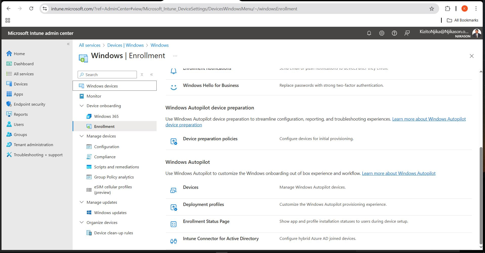
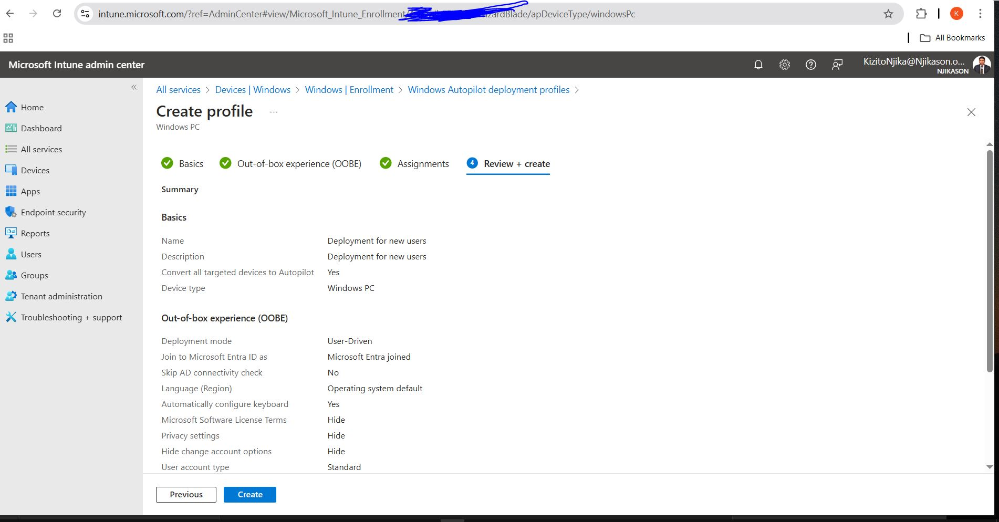
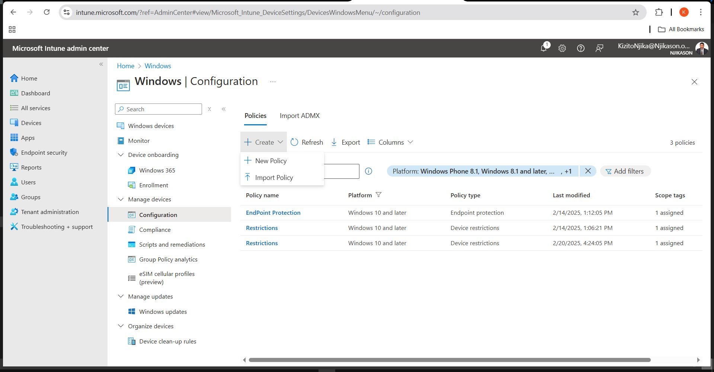
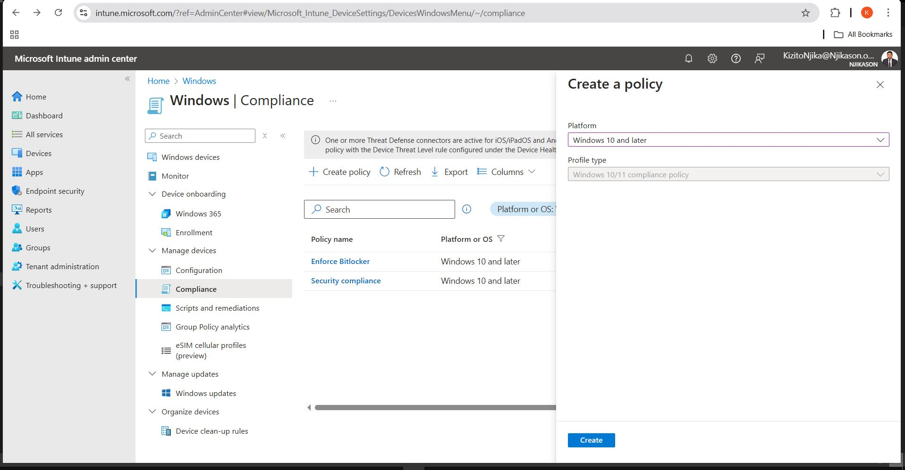
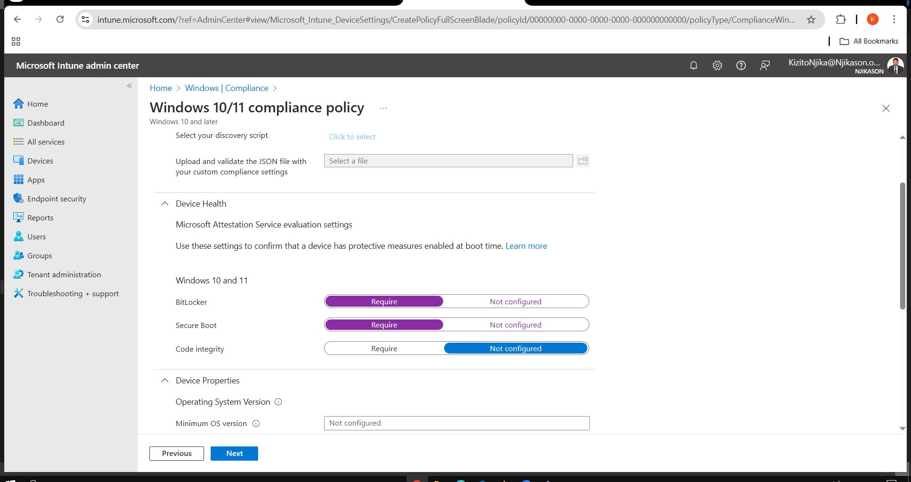
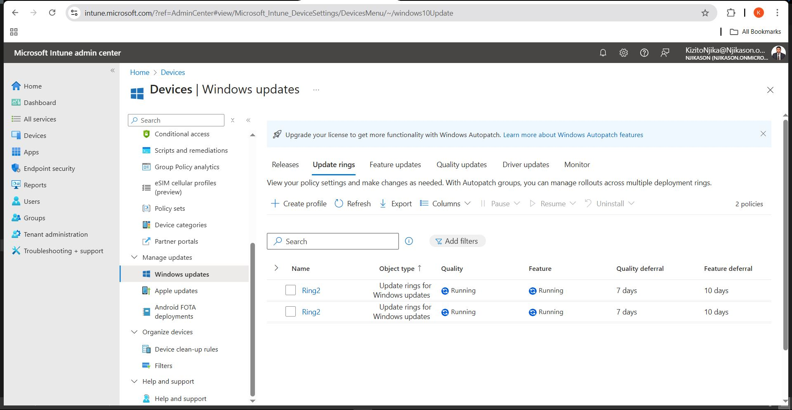

# Device Enrollment for Windows Machines

## Microsoft Intune and Admin Center

**Microsoft Intune** is a cloud-based service that focuses on **mobile device management (MDM)** and **mobile application management (MAM)**. It helps organizations control how devices such as **Windows PCs, Macs, iOS, and Android** access corporate data.

**Microsoft Intune Admin Center** is the web-based management interface for Intune, allowing IT administrators to manage devices, configure policies, deploy apps, and ensure compliance.

---

## Microsoft Intune Admin Center

- **Devices (Overview)**: Shows everything from all devices, monitor, device onboarding, manage devices. It shows the **overview** of device info in Intune.
    

## Setting up base equipment to manage devices

- **Devices > Enroll devices > Windows devices** → Click on **Enroll** →
    

## Select Deployment Profiles (Under Windows Autopilot)

- **Windows Autopilot Deployment Profiles** → Select **Create Profile** →
    
- **Windows PC** → Basics (**Give it a Name/Description**)
    
- **Convert all targeted devices to Autopilot?** → **YES** →
    
- **Out of the Box Experience (Deployment mode: join to Azure AD or hybrid, User account: Admin or Standard, allow pre-provisioned deployment (Yes/No))** →
    
- **Assignments (Add groups + Add all devices)** → **Rules & Create**
    

## Next Configuration

- **Configurations** → Create → New policy (**Windows 10 and later**) →
    
- **Profile type (Templates name: Device Restrictions)** →
    
- **Select the Restrictions you want the devices to have and click Next** →
    
- **Assignments (Add groups/all devices/Add all devices)** →
    
- **Apply & auditing**
    

## Rules

- **Assign Profile** → **OS Edition** → **Windows 10/11 Enterprise or Home** → Click **Next** → **Create**
    

> **Note**: You can do the same and create other policies like **Domain Name, Endpoint protection, Email, etc.**

## Next Compliance

- **Compliance refers to the process of ensuring that devices should meet specific security and configuration requirements before they can access corporate resources.**
    

### Compliance Policies

- **These define the security requirements that devices must meet.**
    
    - Require **BitLocker encryption**
        
    - Enforce **password complexity**
        
    - Require a **specific OS version (Windows 10/11)**
        
    - Ensure **anti-virus/anti-malware is enabled**
        

### Conditional Access Integration

- Compliance policies can be used with **Entra ID Conditional Access** to **block or restrict access** to company resources if a device is **non-compliant**.
    

### Monitoring & Reporting

- **Intune provides reports on device compliance status, helping IT admins take action.**

## Rules
Assign Profile -> OS Edition -> Windows 10/11 (Enterprise or Home) -> Click Next -> Create  

**Note:** (You can do the same and create other policies like Domain Name, Endpoint protection, Email, etc.)  

## How it Works
Compliance -> Create policy (Windows 10 and later) -> Basics (Name, Enforce BitLocker) -> Compliance settings -> Add in for non-compliance ⚠ -> Notification for users for non-compliance policy -> Assignments (Add all users) -> Review & Create

## Windows Updates
### Update Rings
(This is to make sure updates are created)
- **Basics:** Update ring settings (Update Windows 10 devices to latest Windows 11 release)
- **Assignments:** Add groups (users)
- **Review & Create**

### Why is this important?
- Helps IT admins control Windows updates across all managed devices.
- Ensures stability by delaying updates to test compatibility before deployment.
- Prevents disruptive updates from installing automatically.
- Allows gradual rollout of new Windows versions to avoid potential issues.
