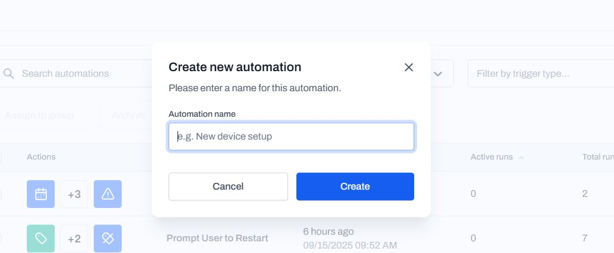
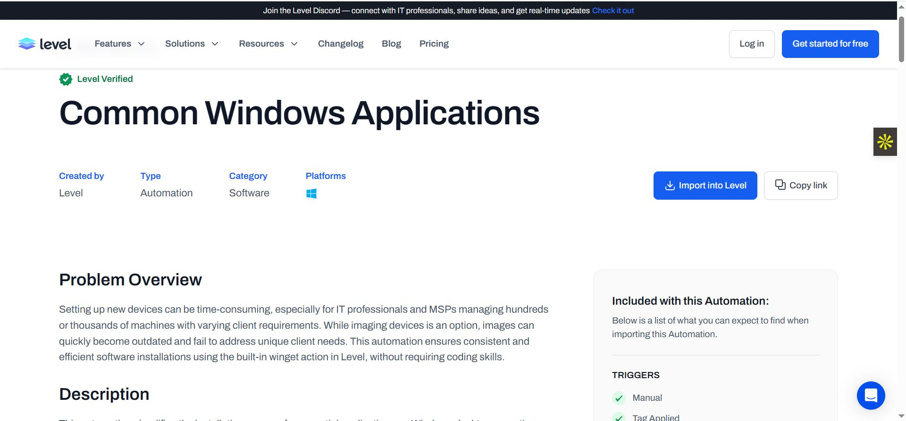
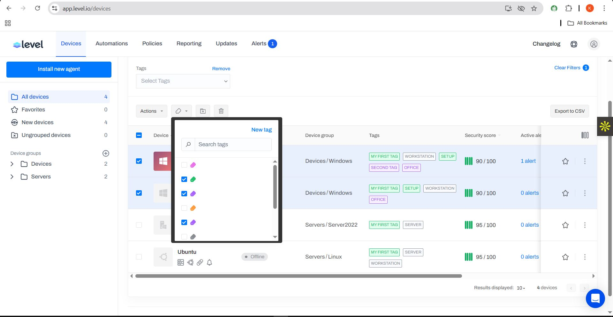

# Automations with Level

## What is automation?  
Automation is the process of using technology to perform tasks with minimal human interaction, making work faster, more consistent and less error-prone.  

- Supercharge your workflow and handle repetitive tasks with automations.  

---
## Getting Started with Automations using Level platform  

Automation has two main components:  
1. **Triggers** – Criteria that Level watches to determine if and when automation should target a device.  
2. **Actions** – A set of commands that will be on devices when they match a trigger.  
---
## Steps  
- Navigate to **Automations**  
- Click on **Create** → Create new automation → Name (Install application) → Create  

- Click on **Manual** → Perform these actions → Tag : added office tag which, when applied to a device, the action takes place.  

- Clicked on the **+ Icon** → Scroll down to App management → Install winget → and Save.  
- Clicked on the **+ Icon** to install winget packages.  

- Scroll down to **App management** → Select **Install Winget package**  
- Step Configuration → Added the package ID (7zip.7zip)  

### Next Add Conditions  
- Condition 1: Select **OS (Operating System)**  
- Equal to → Select a value to compare → **Windows 10**
- Save  

## Testing Automation  
- Added a device to test → It was a success  
- Added 7zip application to my Window 10  

- Tested the same automation on a Windows 11 machine → It worked successfully  
- Installed Winget 7zip  

---
# Automation with Library (Using Level)

- Level already has a curated library of ready-to-go deploy automations  
- The Level has automation scripts for many combinations you need  

## Getting Started  
- Go to the website → Top corner → **Resources → Library**  
- Click on **Library** → I’m automating common Windows applications  

- The automation installs Edge, Chrome, Firefox, 1Password, Zoom, Notion, etc.  
## Import into Level  
- Just click on **Import into Level** → Now the automation is ready  

- Looking at the trigger: it has the setup tag  

- Then get the condition as **Platform equal to Windows** (meaning only Windows will get the install)  and its now running

## Automation Testing and Conditions

- Added some conditions to the app because one device already had the download.  
- To test the automation → Checked on the two devices and applied the **Setup tag**. 

- Selected the two devices → **Run automation** → Selected the right automation → **Common Windows applications**.  

- It started running on the two devices.  

- Success on the Windows 10 device (skipped apps already installed).  

- it was a success on Windows 11 device almost installed the whole application but one didn't install 

---

# Prompt User to Restart on Ubuntu Linux (Automation)
Automation using the prompt user to restart on a linux ubuntu device
- Trigger & tag is **Restart** → Condition set for platform equal to **Linux** → Saved. 

- Notification → User approval → Asking the user to restart.  
- Prompt: 180 mins, 3 attempts, and if failed → force the restart.  
- Down the pipeline → Restart endpoint → Linux (Ubuntu) → Remove tag once restart applied.  
- Ran the test → It worked → System rebooted (**Success**).  

---
# OsQuery Monitor- Uptime

- Reached out to Level library & imported the automation script
- Ran the automation on a linux and windows 10 device

---
# Automation on Windows Server 2022

* **Running Windows patching on Server 2022**  
  -> Imported the Automation Script from the Library.  

* Navigated to the Automation. Since I want to patch, I turned off the schedule (Weekly), turned off upgrade to 3rd party applications.  
  -> Clicked on Devices -> Selected the Server 2022 -> Click on Action -> Run automation -> Imported -> Windows patching & Run Automation.  

* Ran the Automation -> Started installing all patches and updates to my Server 2022.  
  -> After a while, the patching was completed.  

* It was a success and my Security Score on Server 2022 went from **60% to 95%**, meaning it's in good condition.  

---
# Run Linux Patching Automation

* **Running Linux patching on Ubuntu**  
  -> Imported the Automation Script from the Library.  

* Navigated to the Automation, automatically turned off weak weekly updates and upgrade to 3rd party applications (turned off).  

* Navigated to my Linux (Ubuntu machine).  
  -> Click on Action -> Run automation -> Selected Imported group -> Linux patching & Run automation.  

* Within minutes, the patching was completed successfully.  

* **Linux patched & enabled firewall protection increased the Security Score from 65% to 95%.**
