# Duo Mobile / MFA

##  What is Duo Mobile?
Duo Mobile is a mobile application developed by Cisco that supports **multi-factor authentication (MFA)**.  
It is used to verify a user’s identity by requiring a second step of verification in addition to a username and password.
When logging into an account that has Duo enabled, the user will receive a **push notification** on their mobile device.  
The user must approve the login attempt in the Duo app to gain access.

**Note:** Guiding the user through the process is very vital for the role of an IT Helpdesk agent working in IT.
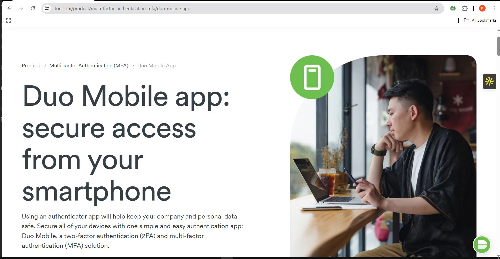

---
##  What is Multi-Factor Authentication?
Multi-Factor Authentication (MFA) is a **security system** that requires more than one method of authentication to verify a client’s identity.

MFA is a **key defense** against account breaches, phishing, and unauthorized access—especially in business and enterprise environments.

> One of the roles of helpdesk is to help users sign in into Duo.

---
##  Setting up Duo Mobile

Setting up Duo Mobile is **simple and straightforward**:

1. Go to the website: [signup.duo.com](https://signup.duo.com)
2. Fill out the **Sign-up Form**:
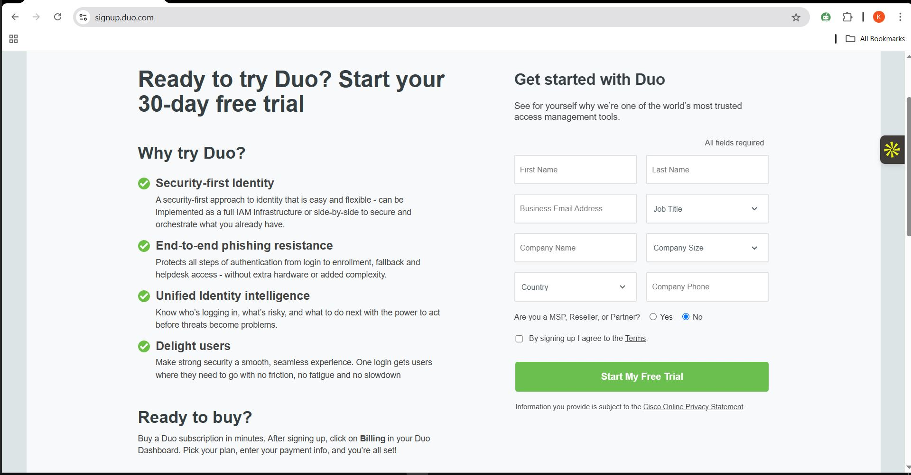
   - Full name  
   - Work email  
   - Phone number  
   - Country  
3. Click on **Sign Up** and **Verify your email address**
4. You will be prompted to verify your phone number
5. Install Duo Mobile on a smartphone and link it as your admin device.
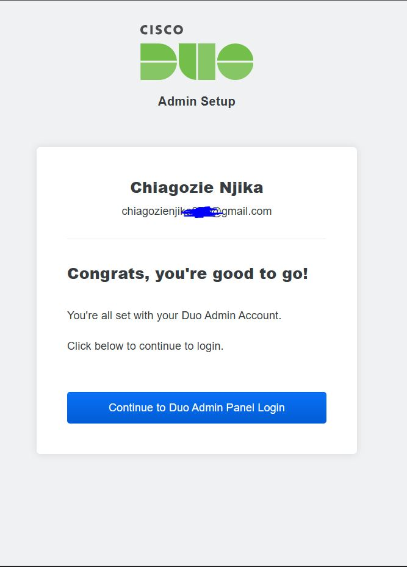
---
## Duo Mobile Dashboard

### Users
- Add, manage, and remove user accounts.
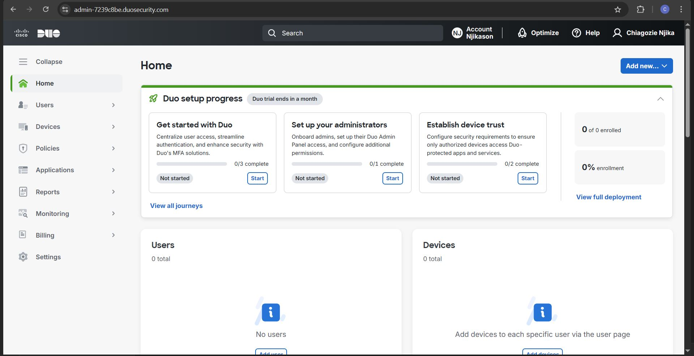
### Devices
- Shows all registered phones, hardware tokens, etc.
### Policies
- Set up rules for MFA (such as require MFA, allowed devices, geolocation rules).
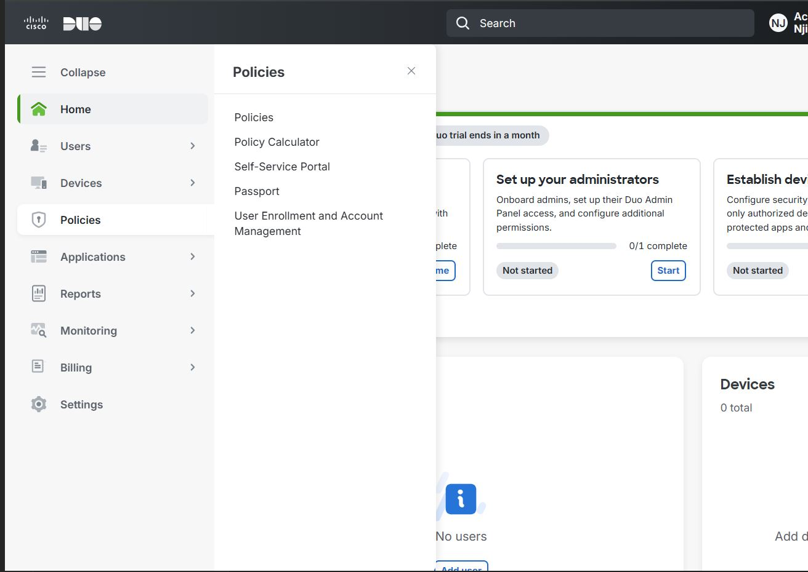
### Applications
- Where you integrate Duo with services like Microsoft 365, VPNs, RDP, etc.
### Reports, Monitoring & Billings
- These are essential parts of Duo for reports and monitoring.
- Check billing and usage data.
---
## Creating a User Account on Duo

1. Navigate to:
   - Users → Add Users (also supports Bulk End Users or Import Users)
2. Enter the username and email address of the user.
3. Click **Add User**.
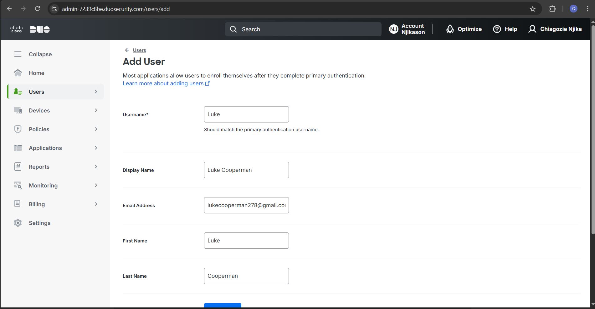
## Send an Enrollment Email

- The user receives an email for Duo Security enrollment.
- The user enrolls with Duo Mobile app by adding their phone number and fingerprint to enroll successfully.
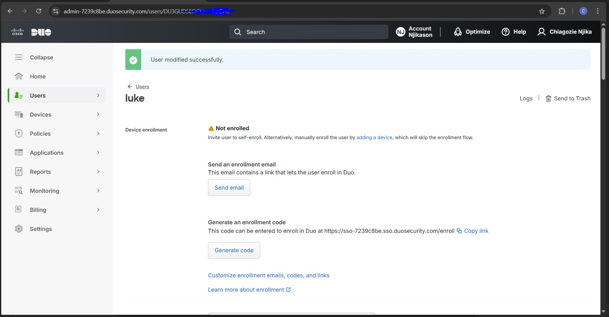
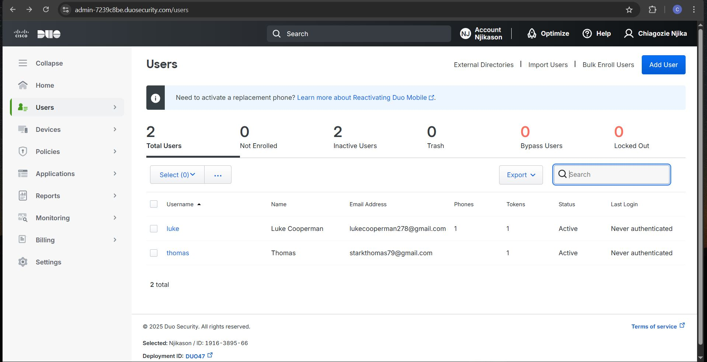

##  Notes
- **NB:** MFA should always be active.
- Never use **Bypass** (which allows skipping two-factor authentication).
- Always seek management approval before granting a bypass.
---
## Groups
- Groups make it easy to manage users in a more simplified way.
- Manage applications at scale and quickly enable or disable users in bulk.
- Navigate to:
  - `Users` → `Groups` → `Add Groups`
  - Name the group and add a description, then click **Add Group**.
  - Add users to the group:
    - Select users to add
    - Click **Add users to group**
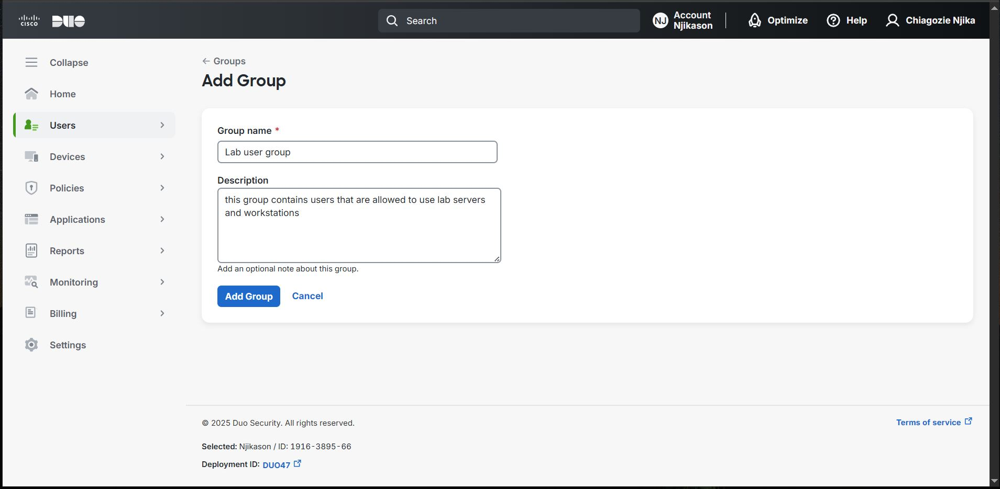
---
## Adding Administrator
- Assign an administrator with fewer powers to complete simple tasks.
- Add the name and email address.
- Since I’m aiming for Help Desk, I assign the **Help Desk** role.
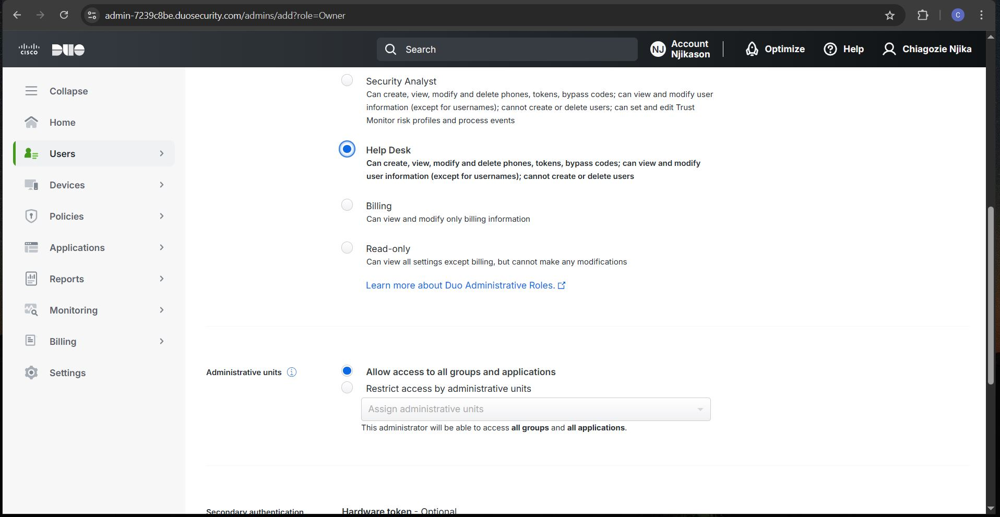
---
## Applications
- Applications: Integrate Duo into one or more of your services.
- You can protect as many applications with Duo as you need.
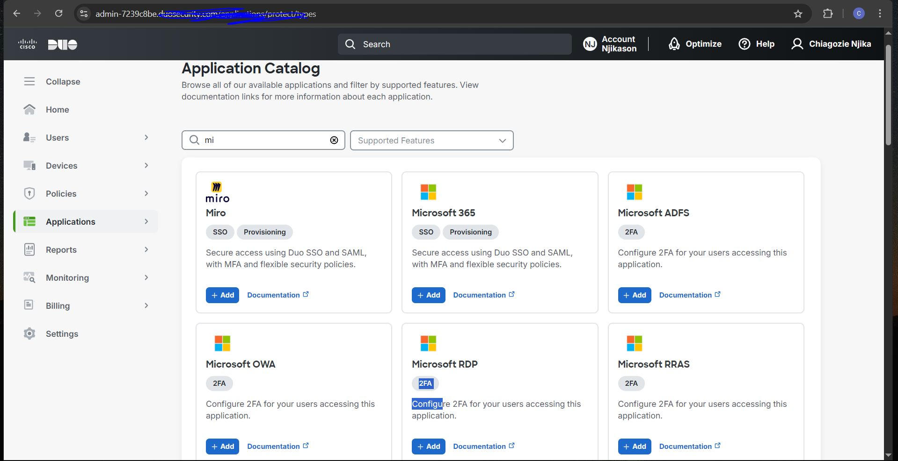
# Enabling MFA for Windows Server (via Duo)

## Adding Duo to Applications

Once you navigate to:
- `Applications` → `Protect Applications`
- Select the application and click on **Add**

> So when a user tries to access Microsoft RDP, it must prompt for 2-factor authentication.
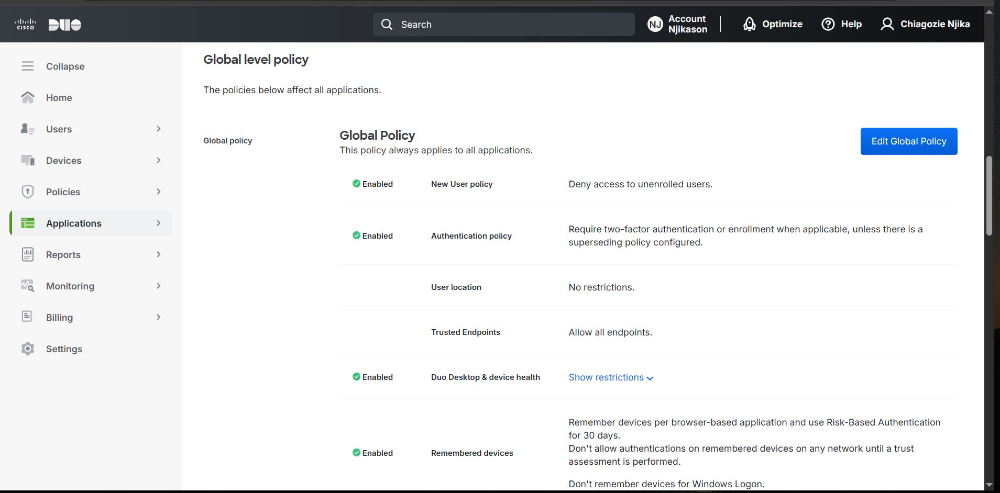
---

## Enabling MFA on Windows Server 2022

Adding an extra layer of defense for Windows Server is really important to avoid cyber attacks and helps to harden security. Only approved individuals are allowed to access the Windows Server.

### Steps:

- Log into the **Duo Mobile App** (with credentials and push log-in with your mobile phone)
- Navigate to `Dashboard` → `Select Applications`
- Select application: **Microsoft RDP**
- Find application and search for **Microsoft RDP** on server
- Join through the policies and click **Save**
- Click on **RDP Documentation** to integrate Duo with your Microsoft RDP deployment
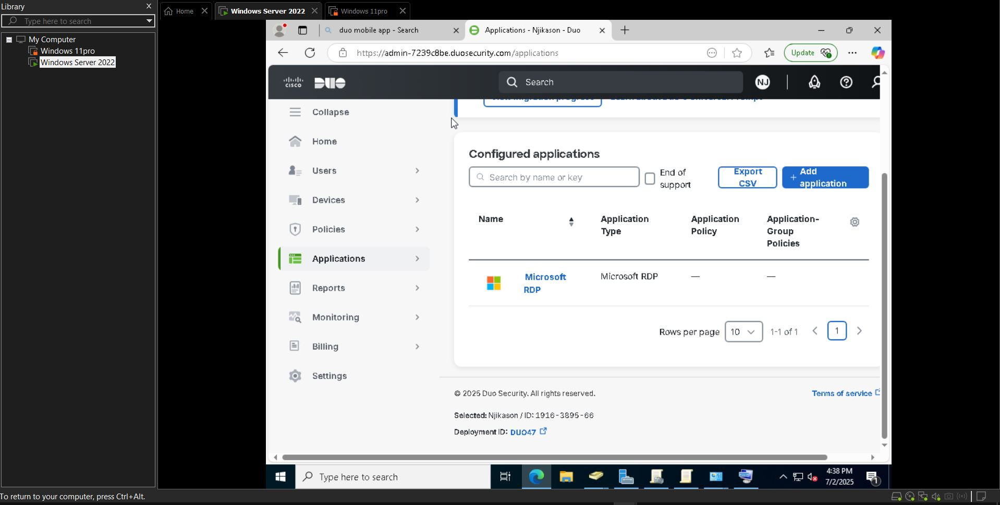
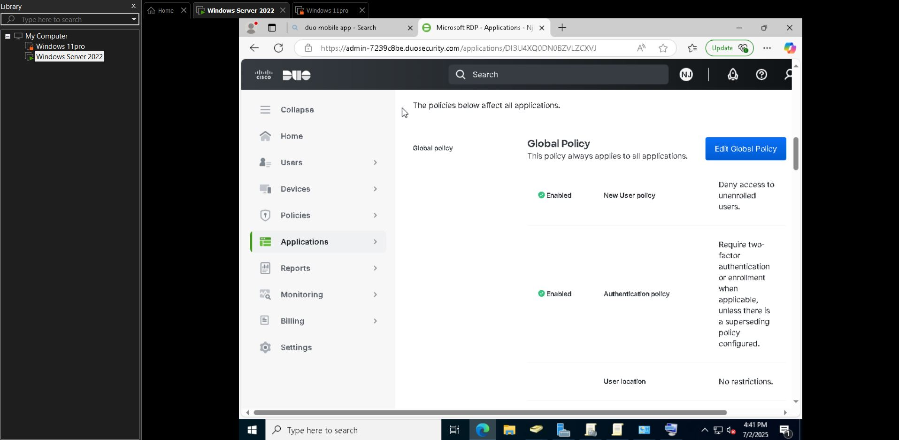

---
## Final Configuration
- Scroll down to:
  - **Duo authentication for Windows Logon Installer Package (No 8)**
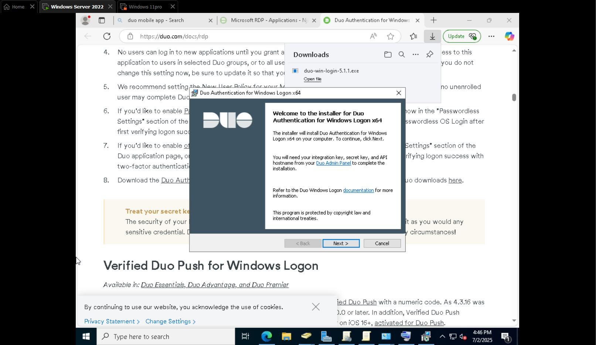
### Integration:
- Copy the **API hostname**
- Navigate back to the details and paste the API hostname
- Add the **Integration Key** and **Security Key** from the deployment log
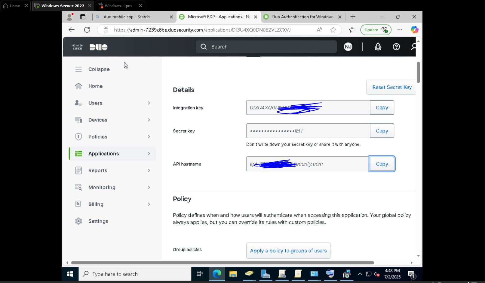
## Testing Duo After Final Install
- Click on video and finish the installation.
- Once it's done, test if it works.
- Go to `Devices` → `Phones or Endpoint` → Devices enrolled to Duo.
- You will see all the devices managed by your organization.
- For my test, I only have one device here (sent from Luke for use).
- You can send Duo push to verify the user’s identity.
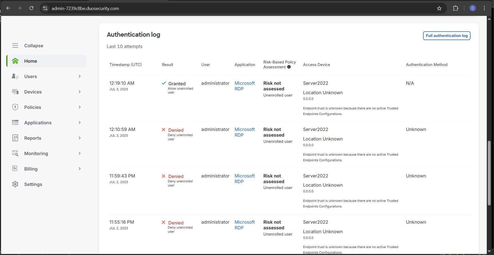
---
## Troubleshooting Duo Help Desk Issues

### Scenario:
User gets a new phone. When trying to log in to their email or VPN, the Duo prompt fails or doesn’t show.
### Steps:
- Verify user's identity.
- Check if they still have access to Duo on old phone or not.
- Navigate to Duo Admin Panel → `Users` → Scroll down to the user.
- Remove/delete old device → Add a new device.
- Choose Mobile → Enter their number → They install the Duo app.
- Scan the QR Code.
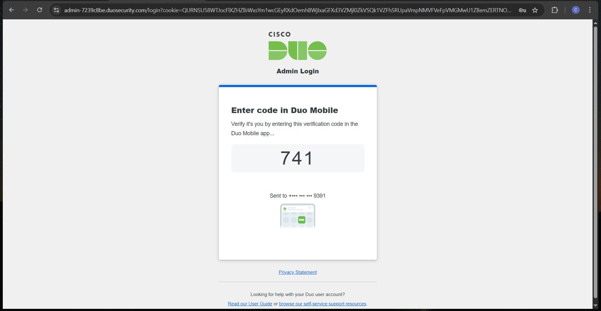

---

**Note:** Guiding the user through the process is very vital for the role of an IT Helpdesk agent.
