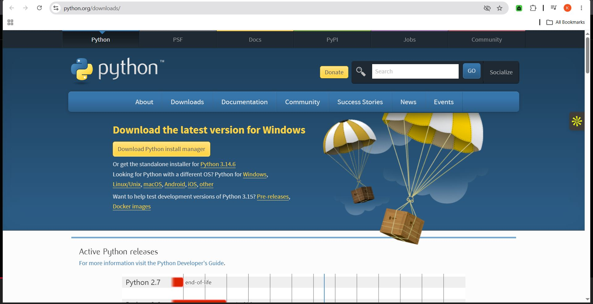
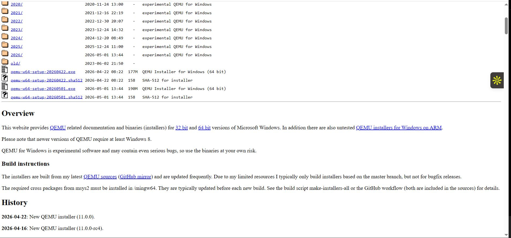
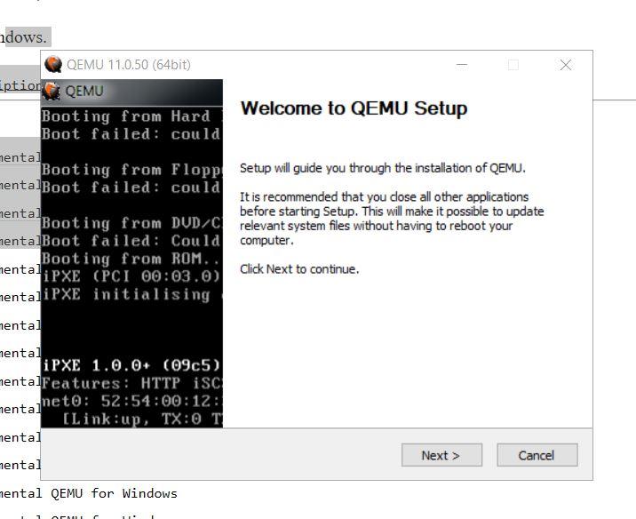
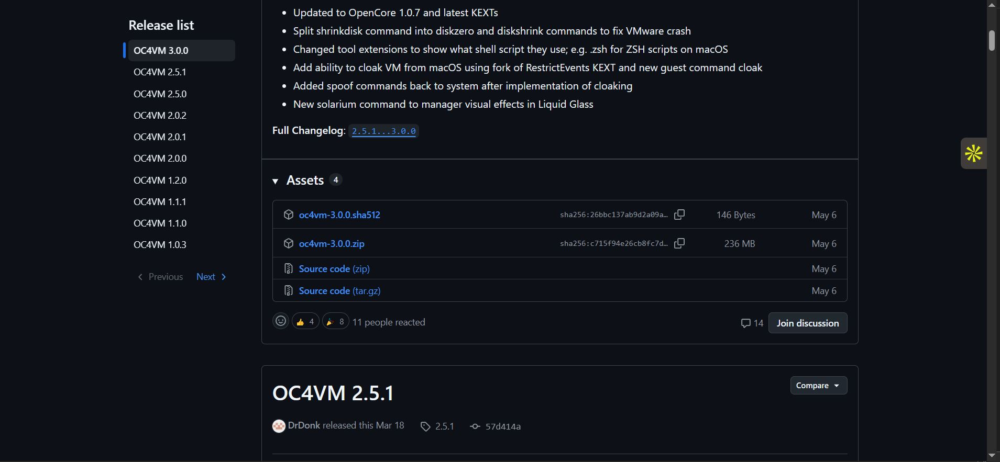
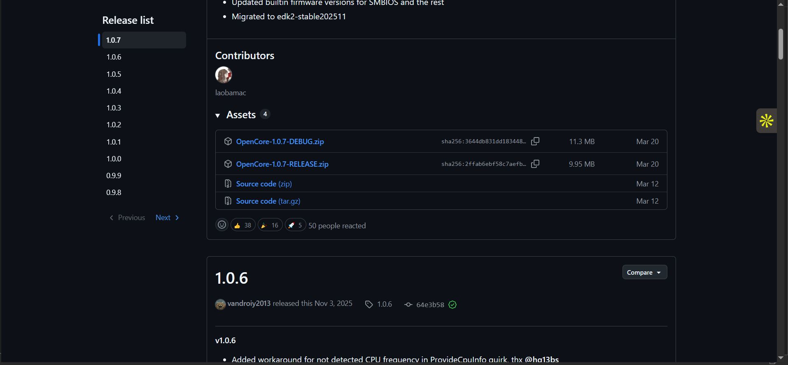
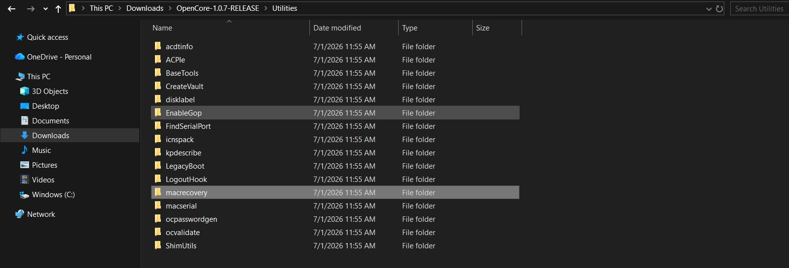
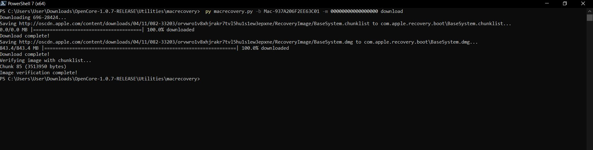
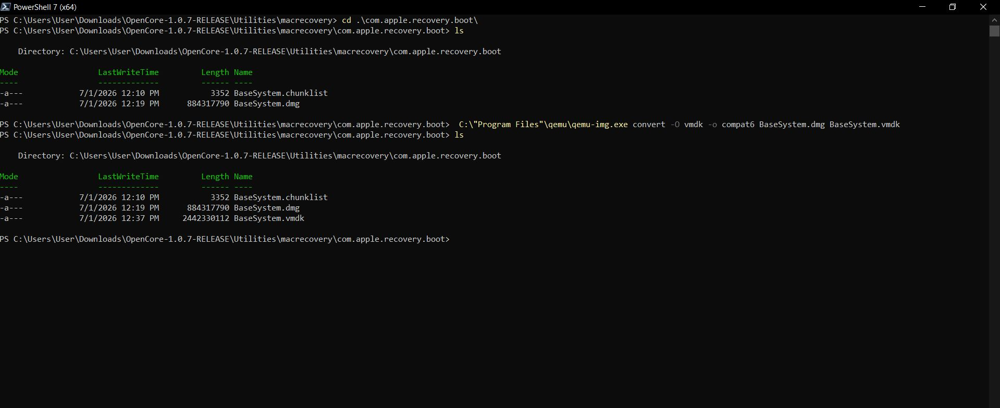
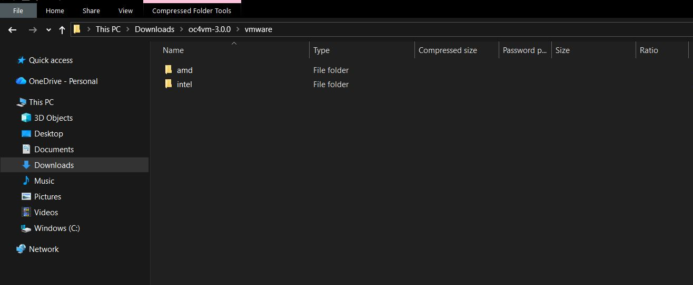

# macOS Documentation

## What is macOS?

macOS is the proprietary Unix-based operating system developed by Apple Inc. It is designed to run on Macintosh (Mac) computers.

Unlike Microsoft Windows, macOS combines an intuitive graphical user interface (GUI) with powerful command-line capabilities, making it suitable for both everyday users and IT professionals.

---
# Project Objective

The goal of this project is to configure and document a fully functional virtualized macOS environment (macOS 15 Sequoia) using a VMware hypervisor on standard Windows hardware.

This project also serves as a learning platform to:

- Master macOS installation and configuration
- Understand system administration workflows
- Develop technical support skills for macOS environments

---
# Why Learn macOS for IT Support?

To provide private and enterprise-level technical support, technicians must possess a strong understanding of multiple operating systems rather than relying on a single platform.

Understanding macOS enables technicians to:

- Confidently troubleshoot end-user issues
- Support mixed operating system environments
- Expand their technical skill set
- Increase employability in modern IT environments
---
# Benefits of Learning macOS

Learning macOS provides access to enterprise environments where multiple operating systems coexist.

Advantages include:

- Supporting Apple devices alongside Windows and Linux systems
- Gaining experience with enterprise IT administration
- Understanding the Apple ecosystem
- Working with macOS-specific management tools
- Building knowledge of Apple's security architecture

This knowledge helps technicians transition smoothly into modern IT support roles and Managed Service Provider (MSP) environments.

# Getting Started with macOS Installation

## Overview

Before installing macOS Sequoia in a virtual environment, several prerequisite tools and packages must be downloaded and installed. These tools are required to prepare the virtualization environment and support the macOS installation process.

---
# Prerequisites

The following software must be installed before proceeding:

- Python 3
- QEMU
- VMware Workstation Pro
- OCVM (OpenCore VMware Package)
- OpenCorePkg
---
# Installing Python 3

Python is required by several scripts used during the macOS installation process.
## steps

1. Visit the official Python website:
   - https://www.python.org
2. Download the latest stable release of **Python 3**.
3. Run the installer.
4. Complete the installation wizard.

---
# Installing QEMU

QEMU provides virtualization components required during the macOS setup.
## Steps

1. Visit the official download page:
   - https://qemu.weilnetz.de/w64/
1. Download the latest stable Windows release.

2. Launch the installer.
3. Complete the QEMU installation wizard.
4. Verify that QEMU has been installed successfully.

---
# Installing VMware Workstation Pro

VMware Workstation Pro is used as the virtualization platform for running macOS.

## Steps

1. Visit the official VMware website.
2. Download the latest version of **VMware Workstation Pro**.
3. Complete any required registration.
4. Download and install the software.

> For this lab environment, VMware Workstation Pro was already installed from previous virtualization projects.

---
# Downloading OCVM

The next package required is **OCVM (OpenCore VMware Package)**.

GitHub Repository:

- https://github.com/DrDonk/OCVM/releases

## Steps

1. Open the GitHub releases page.
2. Download the latest stable release.
3. For this project, Version **3.0** was selected.
4. Extract the downloaded package.

---

# Understanding OpenCore

OpenCore is a sophisticated bootloader that injects and patches configuration data in memory rather than modifying files directly on disk.

Using OpenCore makes it possible to achieve a near-native macOS experience on unsupported hardware and virtual machines.

## Benefits

- Near-native macOS performance
- Improved compatibility
- Flexible boot configuration
- Better support for newer macOS releases

For the best compatibility, always download the latest stable release unless your lab specifically requires an older version.

---

# Downloading OpenCorePkg

OpenCorePkg contains the OpenCore bootloader and supporting files required during the installation process.

GitHub Repository:

- https://github.com/acidanthera/OpenCorePkg

## Steps

1. Navigate to the GitHub repository.
2. Download the latest release.
3. Extract the package.
4. Prepare the files for the macOS installation process
- Extract the downloaded **OpenCore 1.0.7 Release ZIP** from GitHub since it is compressed.

---
## Step 2: Download the macOS Sequoia Base System

The next step is to download the **macOS Sequoia Base System** image.

This is done using a tool called **macrecovery**, which is included in the OpenCore package.

### Steps

1. Navigate to the extracted **OpenCore 1.0.7 Release** folder.
2. Open the `Utilities` folder.
3. Launch either **PowerShell** or **Terminal**.

To download the Base System image for the macOS version you want to install, provide the appropriate **Board ID** for the latest supported version.

Example command:

```bash
py macrecovery.py -b Mac-937A206F2EE63C01 -m 00000000000000000 download
```



---

## Convert the Downloaded Base System

After the Base System download is complete, use **QEMU** to convert the downloaded image.

### Navigate to the Download Location

Use PowerShell to navigate to the folder where the files were downloaded:

```powershell
cd .\com.apple.recovery.boot\
```

You can use the `ls` command to verify that the downloaded files are present.


---
## Convert the BaseSystem Image

Navigate to the QEMU installation directory (example):

```powershell
C:\Program Files\qemu\
```

Run the following command:

```powershell
qemu-img.exe convert -O vmdk -o compat6 BaseSystem.dmg BaseSystem.vmdk
```

This converts the downloaded `BaseSystem.dmg` into a VMware-compatible `BaseSystem.vmdk` disk image.


- Using the `ls` command shows you the pathway of the file.
- Using File Explorer, locate the `com.apple.recovery.boot` file.

## Step 2: Create the VMware Virtual Machine

- Create the VMware virtual machine using the template provided in the **OCA4VM** package.

### Prepare the VMware Template

1. Navigate to the **OCA4VM** folder.
2. Open the folder.
3. Go to:
   - `VMware`
   - `VMware`
   - `Intel & AMD`
4. Copy the **Intel** folder (since I am using an Intel laptop).

### Organize the Files

1. Go to the **Documents** folder.
2. Paste the copied Intel folder.
3. Rename the folder to **macOS**.
4. Move the `BaseSystem.vmdk` file from:

   `Utilities → macrecovery → com.apple.recovery.boot`

   into the newly renamed **macOS (Intel)** virtual machine folder inside **Documents**.

## Step 3: Open VMware Workstation Pro

1. Open **VMware Workstation Pro**.
2. From the top-left menu:
   - Click **File**
   - Select **Open**
3. Navigate to:

   `Documents → Virtual Machine → macOS`

4. Open the macOS virtual machine file.

### Configure the Virtual Machine

- Click **Edit Virtual Machine Settings**.
- Configure the following:
  - **Memory:** 8 GB (can be increased to 16 GB)
  - **Hard Disk:** SATA (128 GB)

### Add the BaseSystem Disk

The `BaseSystem.vmdk` file will be used for the macOS installation.

1. Click **Hard Disk (SATA)**.
2. Click **Add**.
3. Select **Hard Disk**.
4. Click **Next**.

# Continuing macOS Installation in VMware

## Attach the Base System Disk

- Select **Disk Type** as **SATA**.
- Click **Next**.
- Select **Use an Existing Virtual Disk**.
- Click **Browse** and choose the **BaseSystem.vmdk** file.
- Click **Finish**.
- Choose **Keep Existing Format**.
- Click **OK**.

## Boot the Virtual Machine

- Power on the virtual machine.
- OpenCore will detect a single bootable drive, which is the **Base System** we created that contains the macOS Recovery environment.

## Install macOS Sequoia

1. Wait for the Apple logo to appear.
2. After a few minutes, select your preferred language.
3. Click **Next**.
4. Select **Reinstall macOS Sequoia**.
5. Click **Continue**.
6. Accept the license agreement.
7. Select **Macintosh HD** as the installation destination.
8. Click **Continue**.

- The installation process will take some time to complete.

## Complete the Initial Setup

After macOS finishes installing:

- Select your country or region.
- Follow the setup wizard.
- Create a user account with a username and password.

macOS has now been successfully installed inside VMware Workstation Pro.

# Enable Shared Folders Between Host and macOS

1. Open **VMware Settings**.
2. Select the **Options** tab.
3. Click **Shared Folders**.
4. Set the option to **Always Enabled**.
5. Click **Add**.
6. The **Add Shared Folder Wizard** will open.
7. Select the folder you want to share.
8. Click **OK**.
9. Restart macOS.

After restarting:

1. Open **Finder**.
2. Click **Go** from the top menu.
3. Select **Computer**.
4. The **VM Shared Folder** will appear.
5. Open it to access shared files.
6. You can copy files from the shared folder or use images as wallpapers if needed.