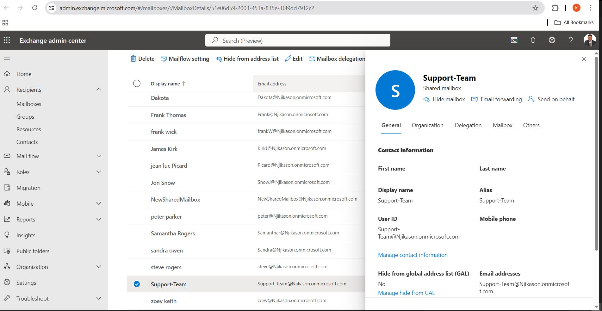
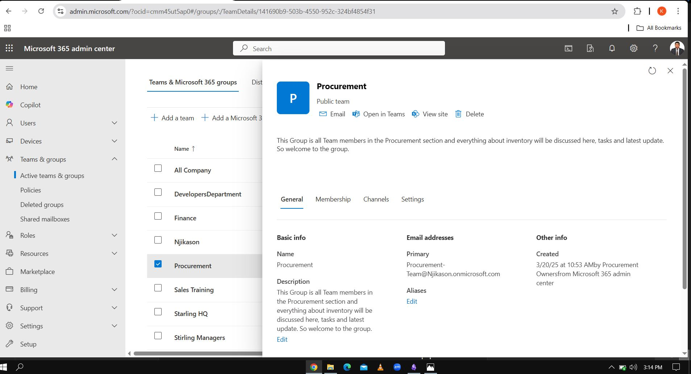
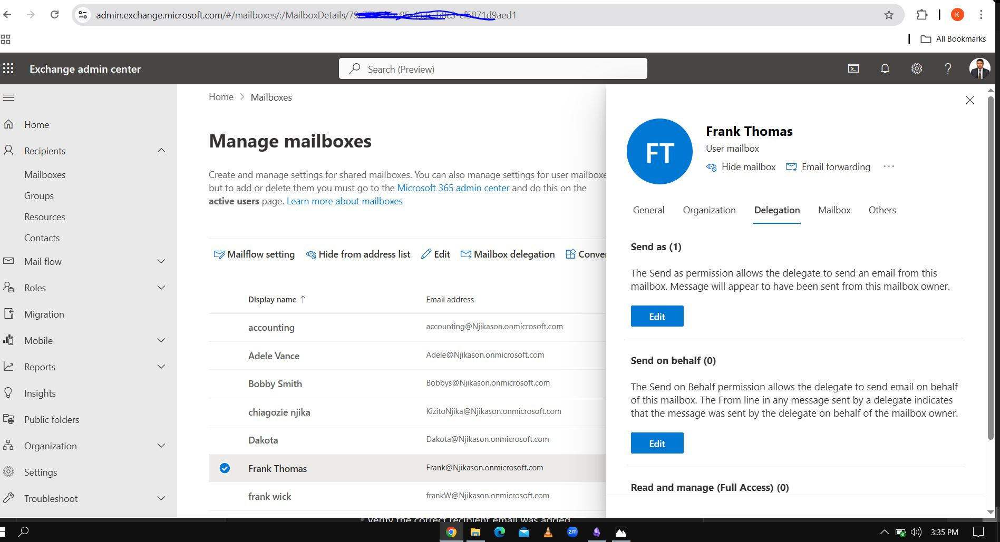

# Exchange Administration

Microsoft Exchange Administration involves managing **email services, mail flow, recipients, security policies**, and troubleshooting email-related issues within an organization.  

As a **IT Support** technician, you will handle tasks related to **user mailboxes, shared mailboxes, groups, email forwarding, message tracing, and mail flow rules** using the **Exchange Admin Center (EAC)** or **PowerShell**.

---

## Key Responsibilities in Exchange Administration  

### 1️ Managing Recipients (Mailboxes, Groups, Contacts, and Resources)  
- Create, modify, and delete **user mailboxes**.  
- Manage **shared mailboxes** and **distribution groups**.  
- Configure **resource mailboxes** for meeting rooms and equipment.  
- Create **mail contacts** for external users.  
### 2️ Mail Flow Management  
- Configure **mail transport rules** (to filter or route emails).  
- Monitor **email queues** and troubleshoot undelivered emails.   

### 3 Message Tracking & Troubleshooting  
- Use **Message Trace** to investigate email delivery issues.  
- Check **Remote Domains & Accepted Domains** for external email communication.  
- Monitor **alerts and audit logs** for compliance.  

---

### 1. How to Create a Shared Mailbox

A **shared mailbox** allows multiple users to access and send emails from a single mailbox (e.g., `Support-Team@Njikason.onmicrosoft.com`).  

#### **Steps:**  
1. Go to **Exchange Admin Center**.  
2. Navigate to **Recipients > Mailboxes**.  
3. Click **Add Mailbox > Shared Mailbox**.  
4. Enter a **name** (e.g., "Procurement-Team") and **email address** (e.g., `Support-Team@Njikason.onmicosoft.com).  
5. Click **Create** and wait for the mailbox to be provisioned.  
6. Assign users who should have access by clicking **Add Members**.  
7. Click **Save**.  

✅ **Users can now access this shared mailbox in Outlook under "Shared Mailboxes."**  

---

###  2. How to Create a Group (Distribution List & Microsoft 365 Group)

Groups allow multiple users to receive emails sent to a single email address.  

#### **For a Distribution List:**  
1. Go to **Recipients > Groups**.  
2. Click **Add Group > Select Distribution**.  
3. Enter a **name, email, and description**.  
4. Add members who should receive emails sent to this group.  
5. Click **Create**.  

#### **For a Microsoft 365 Group (with shared resources like Teams & SharePoint):**  
1. Go to **Microsoft 365 Admin Center > Groups > Active Groups**.  
2. Click **Add Group > Choose Microsoft 365 Group**.  
3. Enter a **name, email, and description**.  
4. Set **permissions** (Public or Private).  
5. Click **Create**. 
6. You can also create **Microsoft 365 Group** in Exchange Admin portal as-well.

✅ **Now, emails sent to the group email address will be received by all members.**  

---

### **3. How to Manage Resources (Meeting Rooms & Equipment Mailboxes)**

A **resource mailbox** is used to schedule **meeting rooms or equipment**.  

#### **Steps:**  
1. Go to **Recipients > Resources**.  
2. Click **Add Resource > Choose Room Mailbox or Equipment Mailbox**.  
3. Enter a **name** (e.g., "Conference Room A") and **email address**.  
4. Configure **booking options** (auto-accept requests or manual approval).  
5. Click **Save**.  

✅ **Users can now book this resource when scheduling meetings in Outlook.**  

---

### **4. How to Perform Message Trace (Track Email Deliveries & Failures)**  

**Message Trace** helps track if an email was successfully delivered, delayed, or failed.  

#### **Steps:**  
1. Go to **Mail Flow > Message Trace**.  
2. Click **Start a Trace**.  
3. Enter the **sender or recipient email address**.  
4. Select a **time range** (e.g., last 7 Days).  
5. Click **Search**.  
6. Review the results:  
   - **Delivered** – The email was successfully sent.  
   - **Pending** – The email is still processing.  
   - **Failed** – The email was not sent (check the error code for details).  

✅ **This helps troubleshoot missing emails for users.**  

---

### **5. How to Configure Mail Flow Rules (Transport Rules)**  

Mail Flow Rules control how emails are processed based on conditions (e.g., block certain attachments or forward emails).  

#### **Steps:**  
1. Go to **Mail Flow > Rules**.  
2. Click **+ Add Rule**.  
3. Enter a **rule name** (e.g., "Block ZIP Attachments").  
4. Select **Apply this rule if…** (e.g., "Attachment includes .zip files").  
5. Choose an **action** (e.g., "Reject the message with an explanation").  
6. Click **Save**.  

✅ **Useful for compliance and security policies.**  

---

### **6. How to Manage Accepted & Remote Domains  

- **Accepted Domains**: Defines which domains Exchange should handle mail for.  
- **Remote Domains**: Configures how emails are sent to external recipients.  

#### **Steps to Add an Accepted Domain:**  
1. Go to **Mail Flow > Accepted Domains**.  
2. Click **+ Add Domain**.  
3. Enter the **domain name** (e.g., `Njikason.onmicrosoft.com).  
4. Select **Authoritative** (if this is your primary domain).  
5. Click **Save**.  

✅ **Ensures that Exchange recognizes the company’s email domain.**  

---

### **7. How to Assign Exchange Admin Roles to Users**  

Exchange permissions are managed via **Admin Roles**.  

#### **Steps:**  
1. Go to **Roles > Admin Roles**.  
2. Click **+ Add Role Group**.  
3. Select a **role** (e.g., "Help Desk" ).  
4. Add users who need this role.  
5. Click **Save**.  

✅ **Ensures that Level 1 IT Support has limited access without full admin privileges.**  

---

# Exchange Admin Center - Email Forwarding & Delegate Access
 
As an IT Support professional, you'll often need to configure **email forwarding** (to automatically send emails to another mailbox) or **delegate access** (allowing someone else to send or manage emails on behalf of a user). This guide walks you through both processes step by step.

---

## 📤 Email Forwarding in Exchange Admin Center  

###  What is Email Forwarding?  
Email forwarding allows you to automatically send incoming emails from one mailbox to another. This is useful when:  
- A user is on vacation or leave.  
- Someone is transitioning to a new role.  
- An executive needs their emails forwarded to an assistant.  

###  How to Enable Email Forwarding   
1. Go to **Recipients** > **Mailboxes**.  
2. Click on the mailbox you want to configure.  
3. Under **Mail Flow Settings**, click **Manage** next to **Email Forwarding**.  
4. Toggle **“Forward all emails sent to this mailbox”** to **ON**.  
5. Enter the recipient’s email address.    
6. Click **Save**.  

✅ Now, all incoming emails will be forwarded to the chosen address!  

### How to Disable Email Forwarding  
1. Navigate to **Mail Flow Settings** > **Email Forwarding**.  
2. Toggle the forwarding option **OFF**.  
3. Click **Save**.  

---

## 👥 Delegate Access (Send As, Send on Behalf, Full Access)  

###  What is Delegate Access?  
Delegate access lets a user **send, read, or fully manage another mailbox’s emails**. This is helpful when:  
- An assistant needs to send emails on behalf of an executive.  
- A shared mailbox requires multiple people to send and receive emails.  
- A user temporarily needs access to another mailbox.  

###  Types of Delegate Access  
- **Send on Behalf:** The delegate can send emails on behalf of the mailbox owner. The recipient sees: `Sent on behalf of [Owner Name]`.  
- **Send As:** The delegate can send emails that appear to come directly from the owner. No "on behalf" label.  
- **Full Access:** The delegate can **open, read, delete, and manage** all emails in the mailbox.  

###  How to Assign Delegate Access   
1. Go to **Recipients** > **Mailboxes**.  
2. Click the mailbox that needs delegate access.  
3. Scroll down to **Mailbox Permissions**.  
4. Click **Manage mailbox delegation**.  
5. Add users under:  
   - **Send As** (if they should send emails as the mailbox owner).  
   - **Send on Behalf** (if emails should show "on behalf of").  
   - **Full Access** (if they need full control).  
7. Click **Save**.  

✅ Now, the selected users have the required access!  

###  How to Remove Delegate Access  
1. Navigate to **Mailbox Permissions** > **Manage mailbox delegation**.  
2. Remove the user from **Send As, Send on Behalf, or Full Access**.  
3. Click **Save**.  

 **Pro Tip:** For shared mailboxes, permissions can also be managed via **Microsoft 365 Admin Center** under **Teams & Groups > Shared Mailboxes**.

---

## Troubleshooting  
✅ **Email forwarding isn’t working?**  
- Check if there’s a conflicting **mail flow rule** in **Exchange Admin Center > Mail Flow > Rules**.  
- Ensure the forwarding user’s mailbox isn’t full.  
- Verify the correct recipient email was added.  

✅ **Delegate access isn’t working?**  
- If the user can't send emails as the owner, ensure **Send As** permission is set.  
- If emails appear as "on behalf of" instead of directly from the sender, check **Send As vs. Send on Behalf** permissions.  
- Allow time for changes to sync across Microsoft 365 (can take up to **1 hour** according to Microsoft).  

---  
