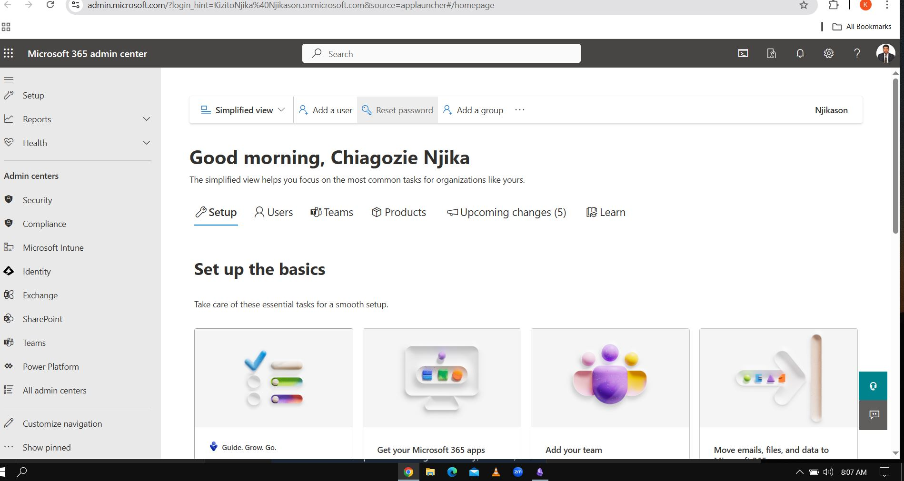
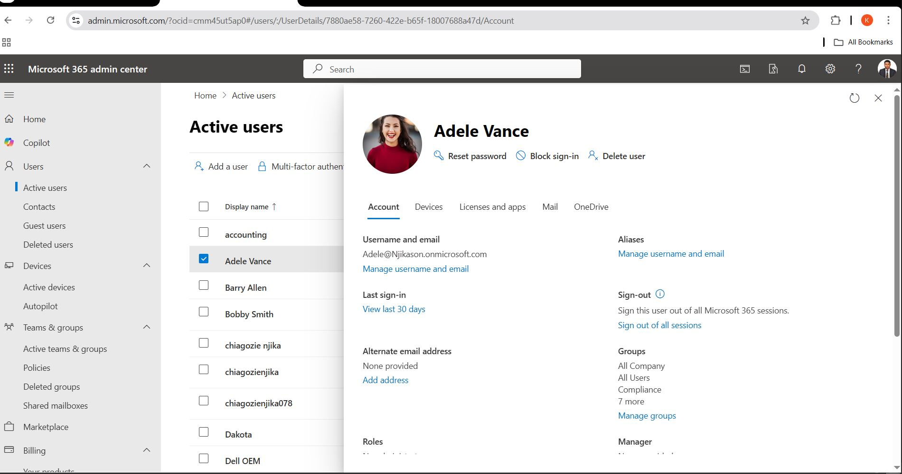
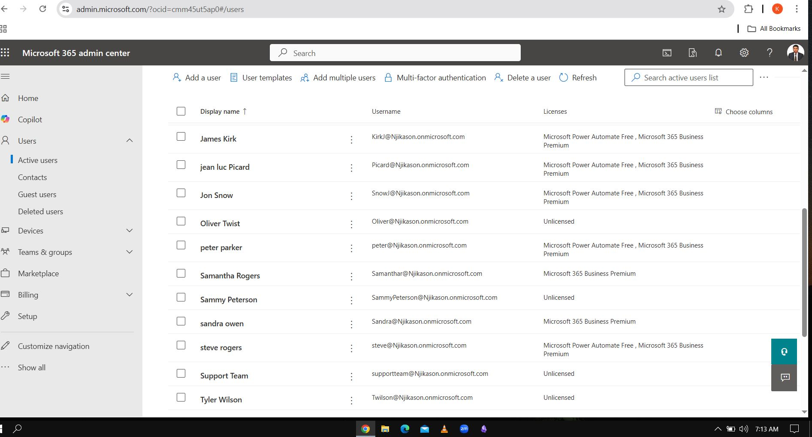
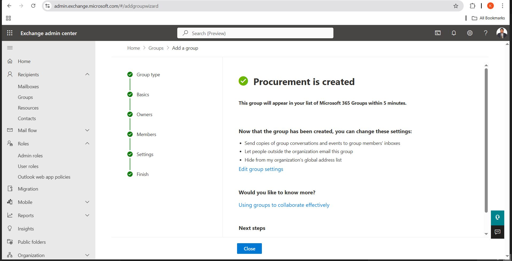

---
# Microsoft 365 Documentation

### What is Microsoft 365?  
Microsoft 365 is a **cloud-based suite of productivity and security tools** offered by Microsoft. It includes **Office apps, cloud storage, email, collaboration tools, and security features** to help businesses manage their IT infrastructure.
### Key Components of Microsoft 365  
- **Exchange Online** – Cloud-based email hosting and management.  
- **SharePoint Online** – Document storage, intranet, and collaboration platform.  
- **Microsoft Teams** – Chat, video conferencing, and team collaboration tool.  
- **Microsoft Intune** – Device and application management (MDM/MAM).  
- **Azure AD (Entra ID)** – Identity and access management (IAM).  

### Role of Microsoft 365 Admin Center  
The **Microsoft 365 Admin Center** is a web-based portal used by IT administrators to:  
- **Manage users and groups**  
- **Assign licenses and subscriptions**  
- **Monitor service health and security**  
- **Configure security and compliance settings**  
- **Manage Microsoft 365 services like Exchange, SharePoint, and Teams**  

---

## 2. User Management  

### Creating, Deleting, and Restoring Users  

#### **Creating a New User in Microsoft 365 Admin Center**  
1. Go to **[Microsoft 365 Admin Center](https://admin.microsoft.com/)**  
2. Navigate to **Users > Active users**  
3. Click **Add a user**  
4. Fill in user details:  
   - **Name**  
   - **Username (email address)**  
   - **Password (auto-generated or manual)**  
   - **Assign a license** (Microsoft 365 Business Premium, E3, etc.)  
   - **Set roles** (User, Admin)  
5. Click **Add user**  
---

#### **Deleting a User**  
1. Go to **Users > Active users**  
2. Select the user you want to delete  
3. Click **Delete user**  

#### **Restoring a Deleted User**  
1. Go to **Users > Deleted users**  
2. Select the user you want to restore  
3. Click **Restore user**  
4. Assign a license (if required)  

---

### Assigning and Managing Licenses  

1. Go to **Users > Active users**  
2. Click on a user’s name  
3. Go to the **Licenses and apps** tab  
4. Select the appropriate Microsoft 365 license (E3, Business Premium, etc.)  
5. Click **Save changes**  

#### **Bulk License Assignment**  
1. Select multiple users  
2. Click **Edit product licenses**  
3. Choose a license and click **Save changes**  

---

### Resetting Passwords and MFA Setup  

#### **Resetting a User’s Password**  
1. Go to **Users > Active users**  
2. Select the user  
3. Click **Reset password**  
4. Choose **Auto-generate** or enter a new password manually  
5. Click **Reset** and notify the user  

#### **Setting Up Multi-Factor Authentication (MFA)**  
1. Go to **Users > Active users**  
2. Click **Multi-factor authentication**  
3. Select the user and enable MFA  
4. The user will be required to set up MFA on their next login with their Device.

---

### Troubleshooting Login Issues  

#### **1. User Can't Sign In (Incorrect Password / Forgot Password)**  
- Reset the password via **Microsoft 365 Admin Center**  

#### **2. Account Locked**  
- Unlock via **Users > Active Users > Reset password**  
- Check **Azure AD Sign-in logs** for failed attempts  

#### **3. MFA Issues (User Lost Access to Authenticator App)**  
- Disable and re-enable MFA for the user  
- Provide a temporary password and instruct them to reconfigure MFA  

---

## 3. Microsoft 365 Groups & Teams  

### Creating and Managing Microsoft 365 Groups  

#### **Creating a Microsoft 365 Group**  
1. Go to **Microsoft 365 Admin Center**/**Microsoft Exchange Admin**  
2. Navigate to **Teams & Groups > Active teams & groups**  
3. Click **Add a group**  
4. Choose **Microsoft 365 Group** and click **Next**  
5. Enter a **Group Name** and **Email Address**  
6. Assign **Group Owners** and **Members**  
7. Click **Create group**  

#### **Managing Group Membership**  
- To add or remove members, go to **Teams & Groups > Active teams & groups**  
- Select the group and click **Members**  
- Add new members or remove existing ones  

---

### Shared Mailboxes vs. Distribution Lists vs. Security Groups  

| Feature              | Shared Mailbox                 | Distribution List              | Security Group       |
| -------------------- | ------------------------------ | ------------------------------ | -------------------- |
| **Purpose**          | Shared email access            | Email forwarding               | Security permissions |
| **Needs License?**   | ❌ No                           | ❌ No                           | ❌ No                 |
| **Can Send Emails?** | ✅ Yes                          | ❌ No                           | ❌ No                 |
| **User Management**  | Members added via Admin Center | Users added via Exchange Admin | Managed in Azure AD  |

#### **Creating a Shared Mailbox**  
1. Go to **Microsoft 365 Admin Center**  
2. Navigate to **Teams & Groups > Shared mailboxes**  
3. Click **Add a shared mailbox**  
4. Enter **Mailbox Name** and **Email Address**  
5. Assign **Members** who can send/receive emails  
6. Click **Save**  

---

### Microsoft Teams Setup and Troubleshooting  

#### **Setting Up a Microsoft Teams Group**  
1. Open **Microsoft Teams**  
2. Click **Teams > Join or create a team**  
3. Click **Create a team**  
4. Choose **From scratch** or **From an existing group**  
5. Select **Private** (for restricted access) or **Public** (anyone can join)  
6. Name your team and add members  

---

## How to Give Full Rights to Someone’s Mailbox in Microsoft 365 (Delegated Access)

1. Log into the **Microsoft 365 Admin Center**  
   - Go to [admin.microsoft.com](https://admin.microsoft.com) and sign in with an admin account.

2. Navigate to **Users → Active Users**  
   - Search for and select the mailbox user you want to delegate access to.

3. Go to **Mail tab → Manage Mailbox Permissions**  
   - Under **Mailbox permissions**, click **Manage mailbox permission**.

4. Grant **Full Access**  
   - Under the **Full Access** section, click **Add Permissions**.  
   - Search for the users who need full access and select them.

5. Click **Save Changes**.

6. Wait for permissions to apply.

---

## How to Convert a User Mailbox to a Shared Mailbox

1. Sign in to the **Microsoft 365 Admin Center**  
   - Go to [admin.microsoft.com](https://admin.microsoft.com) and log in with an admin account.

2. Navigate to **Active Users**  
   - In the left pane, go to **Users → Active Users**.

3. Select the **User Mailbox**  
   - Find and select the user whose mailbox you want to convert.

4. Click on **Mail Settings**  
   - Under **More Actions**, click **Convert to Shared Mailbox**.

---

## Assigning Permissions and Licenses

- **Required Action:**  
  - Assign **Permission** (if needed).  
  - If users need access, go to **Mail → Manage Mailbox Permissions**, and add users to **Full Access** and/or **Send As**.

---

## How to Add a Contact in Microsoft 365

- **For Organization-Wide Contacts**  
  1. Sign in to the **Microsoft 365 Admin Center**.  
  2. Navigate to **Contacts Management**  
     - In the left pane, go to **Teams & Groups → Contacts**.

  3. Add a contact in **Microsoft 365 Admin Center, Exchange Admin Center, or Outlook Web**.  
     - The method depends on whether you want to add a **personal contact** or a **global contact** for the organization.

---
##  Summary  
- **Microsoft 365 Admin Center** is the central hub for managing users, devices, and groups.  
- **User management** involves creating, deleting, and restoring accounts, managing licenses, and troubleshooting login issues.  
- **Groups & Teams** help organize communication and collaboration through Microsoft 365 Groups, shared mailboxes, and Teams.  

---

