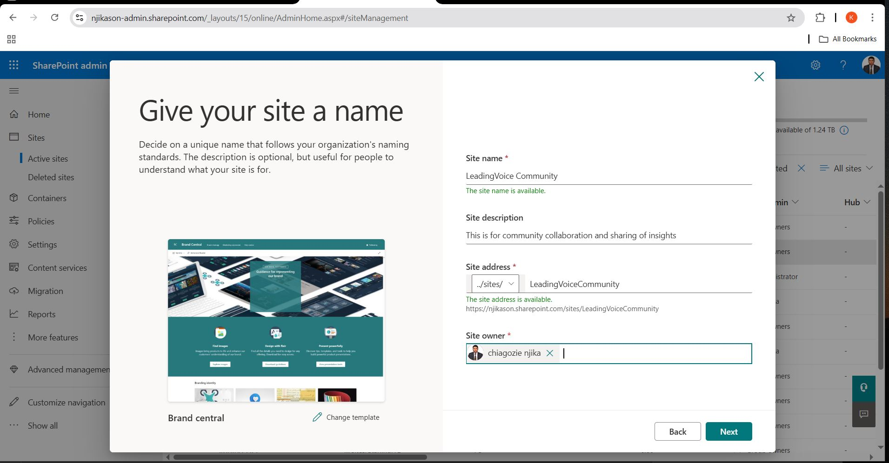
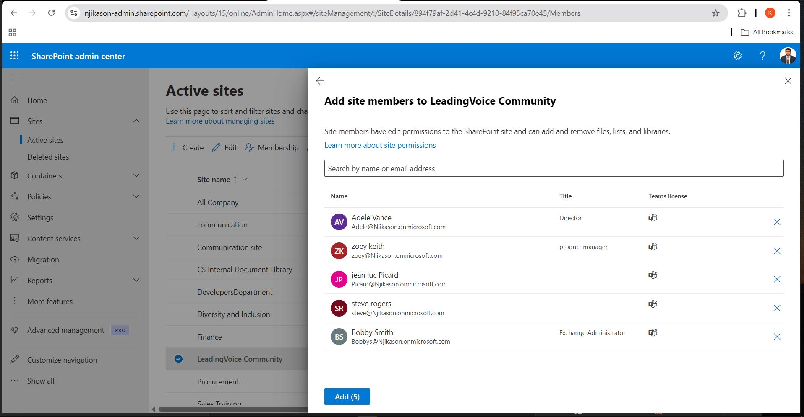
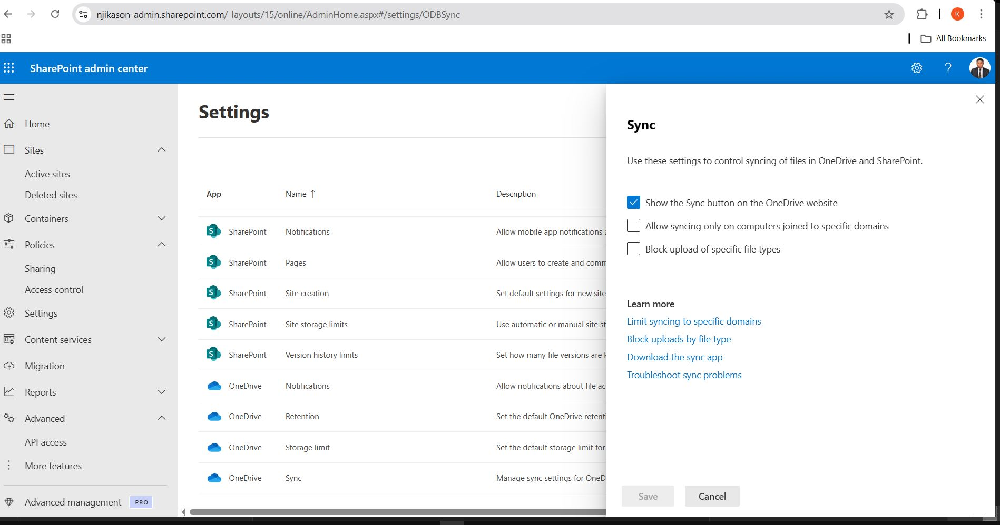

# Introduction to SharePoint  

## What is SharePoint?  
SharePoint is a Microsoft platform that helps organizations **store, manage, and share** documents and information. It is mainly used for:  

- **Collaboration** – Teams can work together on documents in real-time.  
- **Document Storage** – Securely store and organize company files.  
- **Internal Websites (Intranet)** – Create internal portals for company news and resources.  

### **Common Uses of SharePoint**  
Companies use SharePoint for:  
✔ **Storing and organizing files** securely.  
✔ **Creating team and communication sites** for collaboration.  
✔ **Automating workflows and approvals** to streamline processes.  
✔ **Managing company-wide announcements and resources** on intranet pages.  

---

## What is a SharePoint Admin?  
A **SharePoint Admin** is responsible for managing SharePoint in an organization. Their main tasks include:  

### **Key Responsibilities**  
- **Creating and Managing SharePoint Sites** – Setting up team and communication sites.  
- **Controlling Permissions and Access** – Managing who can view and edit content.  
- **Monitoring Site Storage and Usage** – Ensuring storage limits are not exceeded.  
- **Enforcing Security Policies** – Implementing restrictions like external sharing limits.  
- **Troubleshooting Issues** – Resolving errors like missing files and access problems.  
---

# SharePoint Admin Guide for IT Support  

## 1. Creating and Managing Sites  
As an IT support person, you may need to create and manage SharePoint sites.  

### Create a New Site  
1. Go to [Microsoft 365 Admin Center](https://admin.microsoft.com).  
2. Click **SharePoint** under **Admin centers** to open the **SharePoint Admin Center**.  
3. Click **"Create"** at the top of the page.  
4. Choose the type of site:  
   - **Team Site** (for collaboration with a team).  
   - **Communication Site** (for sharing company-wide information).  
5. Enter a **site name** and set **permissions** (private or public).  
6. Click **"Finish"**, and the site will be created.  

### Manage Existing Sites  
1. In the **SharePoint Admin Center**, go to **Sites > Active Sites**.  
2. Find the site you want to manage.  
3. Click on the site name to open settings.  
4. You can:  
   - Change **site owners and members**.  
   - Adjust **site storage limits**.  
   - **Delete or restore** a site.  

---
## 2. Managing Permissions  
Permissions control who can access SharePoint sites and what they can do.  
### Change Site Permissions  
1. In the **SharePoint Admin Center**, go to **Sites > Active Sites**.  
2. Select the site you want to modify.  
3. Click **Membership** to add or remove users.  
4. Assign permissions:  
   - **Owners** (Full control).  
   - **Members** (Can edit).  
   - **Visitors** (Read-only).  
5. Click **Save** to apply changes.  

### Restrict External Sharing  
1. In the **SharePoint Admin Center**, go to **Policies > Sharing**.  
2. Choose whether to allow sharing with external users.  
3. Set restrictions, such as requiring a sign-in or password.  
4. Click **Save**.  

---
## 3. Troubleshooting Issues  
Common SharePoint issues and how to fix them:  
### Users Can’t Access a Site  
1. Verify if the user has the correct **permissions** (see the “Managing Permissions” section).  
2. Ask the user to clear their **browser cache** and try again.  
3. Check if the site is **active** in **Sites > Active Sites**.  

### Missing Files or Documents  
1. Ask the user to check the **Recycle Bin** inside SharePoint.  
2. If the file is not there, check **Sites > Active Sites > Select the site > Click Contents** > See if it’s in another library.  
3. Use **Version History** to restore an earlier version of the file.  

### OneDrive Sync Issues with SharePoint  
Users may report that their OneDrive is not syncing properly with SharePoint.  

#### **Fix OneDrive Sync Issues:**  
1. **Restart OneDrive**  
   - Right-click the OneDrive icon in the system tray.  
   - Click **Close OneDrive**, then reopen it.  

2. **Check OneDrive Account**  
   - Ensure the user is signed into the correct **Microsoft 365 account**.  
   - Open OneDrive settings and confirm the correct SharePoint folder is syncing.  

3. **Check for Sync Errors**  
   - Click the **OneDrive icon** in the taskbar.  
   - Look for error messages and follow suggested fixes.  

4. **Re-Sync the Library**  
   - Open **SharePoint Online** and navigate to the affected document library.  
   - Click **Sync** in the top menu.  
   - If sync does not start, unlink and relink OneDrive:  
     - Open OneDrive settings > **Unlink this PC** > Set up OneDrive again.  

5. **Ensure OneDrive is Updated**  
   - Open OneDrive and go to **Settings > About > Check for updates**.  

6. **Confirm Storage Limits**  
   - Ensure the user is not exceeding their **OneDrive or SharePoint storage limit**.  

---
## 4. Monitoring Usage & Storage  
To ensure SharePoint doesn’t run out of space:  

1. Open the **SharePoint Admin Center**.  
2. Go to **Sites > Active Sites**.  
3. Look at the **Storage Used (GB)** column.  
4. Click on a site to manage storage or increase limits.  

---
## 5. Setting Security Policies  
To keep SharePoint secure, enforce company policies.  
### Prevent External Sharing of Sensitive Data  
1. In the **SharePoint Admin Center**, go to **Policies > Sharing**.  
2. Restrict **Anyone links** (public links).  
3. Require authentication for external users.  
### Enable Multi-Factor Authentication (MFA)  
1. Go to [Microsoft Entra ID (Azure AD)](https://entra.microsoft.com).  
2. Click **Security > MFA**.  
3. Require MFA for all SharePoint users.  

---
## Conclusion  
As an IT support person, my main responsibilities in SharePoint Admin are:  
- Creating and managing sites.  
- Controlling permissions.  
- Fixing common issues.  
- Monitoring storage.  
- Enforcing security policies.  

By following this guide, I can efficiently manage SharePoint for your organization.  

