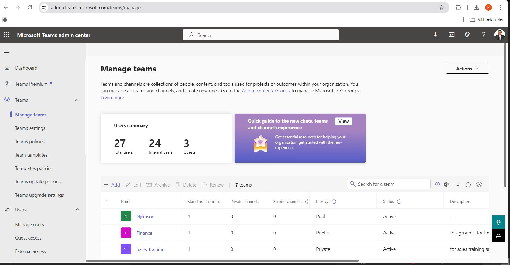
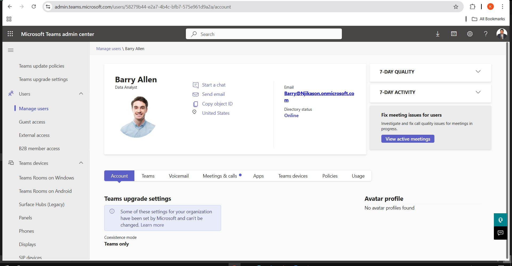
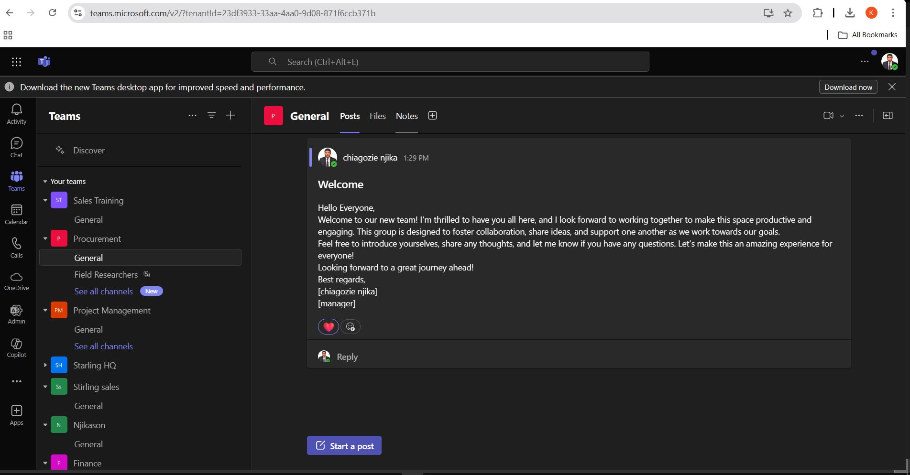

## 1. Introduction to Microsoft Teams

### What is Microsoft Teams?
Microsoft Teams is a collaboration platform within Microsoft 365 that provides chat, video meetings, file sharing, enforce policies and integration with apps to enhance team productivity.

### What is a Microsoft Teams Administrator?
A Microsoft Teams Administrator is responsible for managing Teams settings, user access, policies, and security. Their role includes:
- Managing users, teams, and channels.
- Configuring security, compliance, and guest access.
- Managing meetings, calling, and messaging policies.
- Integrating apps and workflows.

---

## 2. Features of Microsoft Teams Admin Center

The **Teams Admin Center** allows administrators to:
- Manage teams, users, and permissions.
- Configure security and compliance settings.
- Control meeting, calling, and messaging policies.
- Enable guest and external access.
- Integrate third-party applications.
- Apply and enforce Teams policies.

To access the Teams Admin Center, go to [Microsoft Teams Admin Center](https://admin.teams.microsoft.com)and click on Teams.

---

## 3. Managing Teams and Workspaces

### Create a Team
1. Open **Teams Admin Center**.
2. Navigate to **Teams** > **Manage Teams**.
3. Click **+ Add a Team**.
4. Choose **Public** or **Private**.
5. Enter a **Team Name** and **Description**.
6. Click **Create** and add members if needed.

### Delete a Team
1. Go to **Teams Admin Center** > **Manage Teams**.
2. Select the team to delete.
3. Click **Delete** and confirm.

---

## 4. Managing Users in Teams

### Add a User to Teams
1. Open **Teams Admin Center**.
2. Go to **Users** > **Manage Users**.
3. Click **+ Add User**.
4. Enter the user's email or username.
5. Assign roles and click **Save**.

### Manage Existing Users
1. In **Teams Admin Center**, go to **Users**.
2. Select a user to manage their settings.
3. Edit policies, roles, or permissions as needed.

---

## 5. Guest Access in Teams

Guest access allows external users to join a team with limited permissions.

### Enable Guest Access
1. Open **Teams Admin Center**.
2. Navigate to **Org-wide settings** > **Guest Access**.
3. Toggle **Allow guest access in Teams** to **On**.
4. Configure guest permissions (calls, meetings, and messaging).
5. Click **Save**.

### Add a Guest to a Team
1. Open **Microsoft Teams**.
2. Go to the **Team** where you want to add a guest.
3. Click **More options (⋮)** > **Manage Team**.
4. Click **+ Add Member**.
5. Enter the guest’s email address.
6. Click **Add** and assign permissions.

---

## 6. External Access in Teams

External access allows communication with users outside the organization.

### Enable External Access
1. Open **Teams Admin Center**.
2. Go to **Org-wide settings** > **External Access**.
3. Toggle **Allow external access** to **On**.
4. Specify allowed or blocked domains.
5. Click **Save**.

---

## 7. Managing Teams Policies

Policies in Teams help enforce security and compliance.

### Configure Teams Policies
1. Open **Teams Admin Center**.
2. Navigate to **Teams policies**.
3. Click **+ Add** to create a new policy or select an existing one.
4. Set restrictions on messaging, file sharing, or meeting capabilities.
5. Assign the policy to users or groups.
6. Click **Save**.

### Assign Policies to Users
1. In **Teams Admin Center**, go to **Users**.
2. Select a user.
3. Under **Policies**, click **Edit**.
4. Assign the required policies.
5. Click **Save**.

---

## 8. Using Teams Templates

Teams templates allow administrators to create predefined structures for teams.

### Create a Team from a Template
1. Open **Teams Admin Center**.
2. Go to **Teams** > **Manage Teams**.
3. Click **+ Add Team**.
4. Select **Create from Template**.
5. Choose a template that fits your needs.
6. Configure settings and click **Create**.

### Customize a Teams Template
1. Open **Teams Admin Center**.
2. Navigate to **Teams templates**.
3. Select a template to edit.
4. Modify channels, tabs, and settings.
5. Click **Save**.

---

## 9. Managing Channels in Teams

### Add a Channel
1. Open **Teams Admin Center**.
2. Select a **Team**.
3. Click **+ Add Channel**.
4. Enter a **Channel Name** and **Description**.
5. Set **Privacy**:  
   - **Standard**: Everyone in the team can access.  
   - **Private**: Only selected members can access.  
   - **Shared**: Share with users outside the team.
6. Click **Create**.

### Delete a Channel
1. In **Teams Admin Center**, go to **Manage Teams**.
2. Select the team.
3. Under **Channels**, choose the channel to delete.
4. Click **Delete** and confirm.

---

## 10. File Sharing and Collaboration

### Upload and Share Files
1. Open **Teams** and go to a **Team or Channel**.
2. Click the **Files** tab.
3. Click **Upload** and select a file.
4. Click **Share** to set permissions.
!
*Note:* File Sharing is the cloud alternative to network file sharing on windows server (share file/mapping drive)

---

## 11. Managing Meetings & Calls

### Schedule a Meeting
1. Open **Teams** > Click **Calendar**.
2. Click **+ New Meeting**.
3. Add **Title, Date, Time, and Participants**.
4. Click **Send**.

### Manage Call Settings
1. Open **Teams Admin Center**.
2. Navigate to **Voice**.
3. Configure:
   - **Calling Policies**.
   - **Voicemail Settings**.
   - **Call Forwarding Rules**.

---

## 12. Managing Apps and Integrations

### Add an App to Teams
1. Open **Teams Admin Center**.
2. Go to **Teams apps** > **Manage apps**.
3. Click **+ Add an App**.
4. Search for the app and click **Add**.

### Remove an App
1. Open **Teams Admin Center**.
2. Navigate to **Teams apps** > **Manage apps**.
3. Select the app and click **Remove**.

---

## 13. Troubleshooting Teams Issues

### Common Issues and Fixes

#### Teams Login Issues
- Verify the user account in **Microsoft 365 Admin Center**.
- Reset the password if necessary.
- Check **Multi-Factor Authentication (MFA)** settings.

#### Teams Not Loading
- Clear the cache (`%appdata%\Microsoft\Teams\cache`).
- Restart **Teams** and **PC**.
- Check Microsoft 365 service status at [Service Health]

#### Audio/Video Issues in Meetings
- Verify **Microphone and Camera settings** in Teams.
- Run **Windows Troubleshooter** (`Settings > System > Sound`).
- Ensure **Teams is up to date**.

---

## 14. Best Practices for Microsoft Teams Administration

- **Enable Multi-Factor Authentication (MFA)** for security.
- **Limit Guest Access** to protect sensitive data.
- **Use Private Channels** for restricted discussions.
- **Regularly Audit Teams** to remove inactive users.

---
