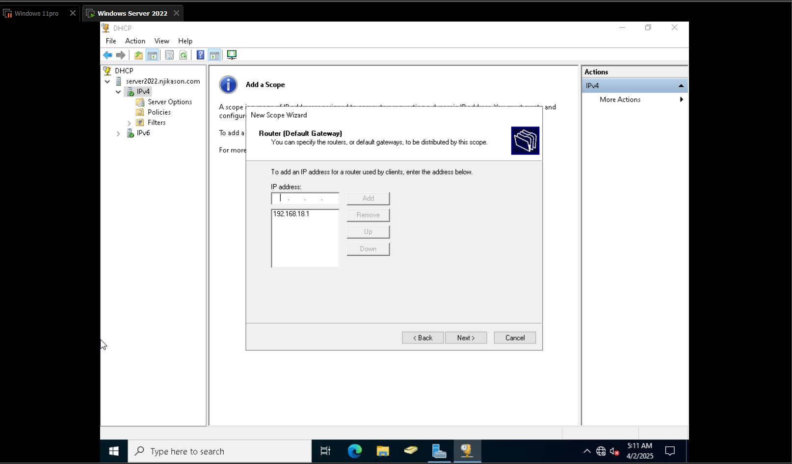
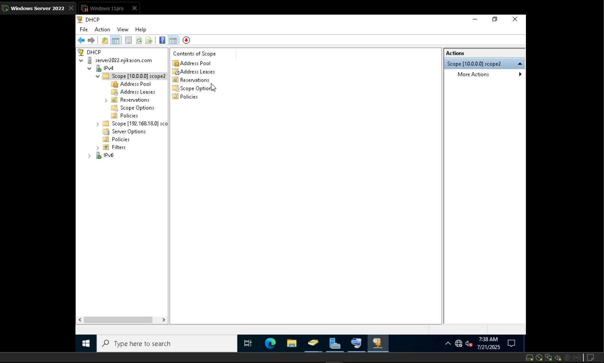
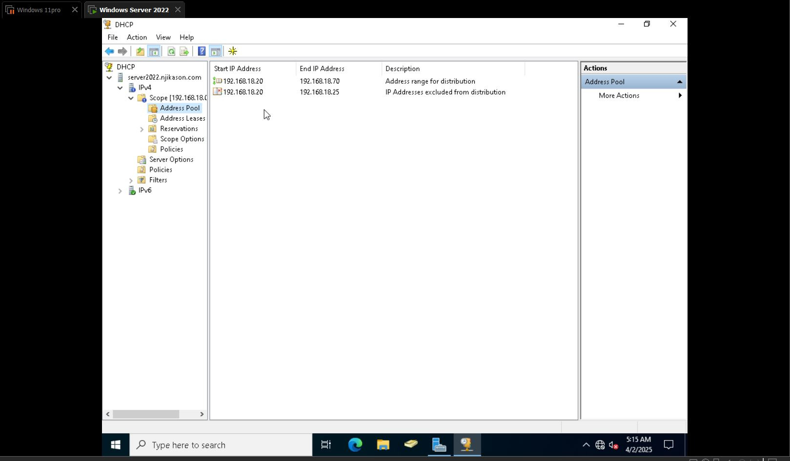
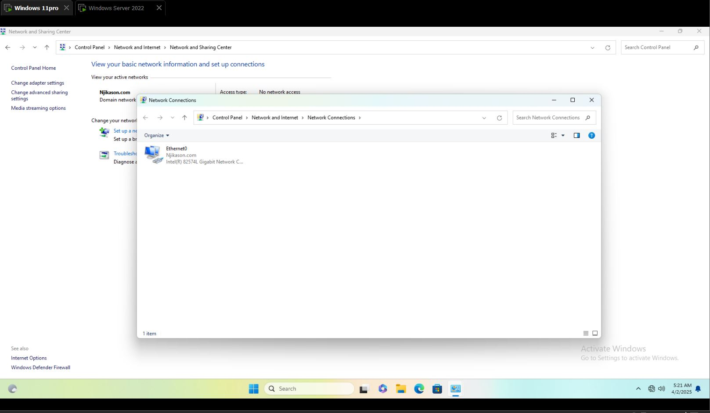
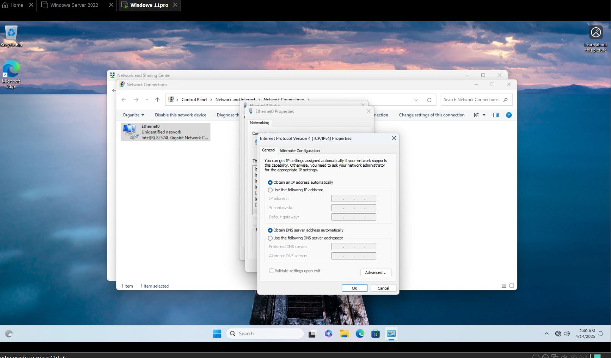

## What is DHCP?

**DHCP (Dynamic Host Configuration Protocol)** is a network protocol that automatically assigns IP addresses and other network settings (such as Subnet Mask, Gateway, and DNS) to devices on a network.
## DHCP Server
A **DHCP Server** is a device (usually a router or Windows Server) that manages IP address allocation dynamically. Instead of manually assigning static IP addresses to every device, the DHCP server automatically provides them based on predefined rules.

## Installing DHCP Server

1. Go to **Server Manager** → **Manage** (click on it) → **Add Roles & Features**  
2. Before you begin → **Next** → **Role-based or Feature-based Installation** → **Next**  
3. Select **Destination Server** as default → **Next**  
4. Click on **DHCP Server** (Add Features) → **Next** → **Confirmation**  
5. Click **Install**

### Post Installation

- Go to **Flag icon** → **Post-deployment Configuration** → **Complete DHCP Configuration**

**DHCP Pool – Install Configuration**  
→ Description → Next  
(Select User’s Credentials) and Commit  

**Go to Tools and click on DHCP**

- Create a Scope (A Scope is a range of IP addresses assigned to Computers requesting a dynamic IP address)  
- Right on IPv4 → New Scope → Next → Scope Name (Name whatever Scope)  
  → Add a description → IP address Range 

Start IP address: 192.168.18.20  
End IP address: 192.168.18.70
- It’s going to reserve 5 IP addresses  
- Length (3d) or (16) recommended 24  
- Subnet mask: 255.255.255.0  
**Add Exclusions and Delay**  
- Exclude IP address for existing systems (Ex: IP address for a printer)  
- Type in the Start IP address and End IP address and click add  

**Lease duration**  
(The lease duration specifies how long a client can use an IP address from this Scope)  
Put in Days, Hours & Minutes you want IP address to last on a Computer → Next  

**Note**: For security reasons (Select 4 hours so it changes)

# DHCP Scope Activation and Client Configuration

- **DHCP Server** → Under it is called **Scope**, where IPs are configured.
- A **Scope** is the range of IP addresses you are going to use on the DHCP Server.

- On the DHCP Server:  
  Right-click on **IPv4** to create a new scope of IP addresses → Welcome wizard → Next → Name the scope →  

  Need to add the IP range (e.g., from `192.168.1.0` to `192.168.1.100`)  
  Subnet mask: `255.255.255.0`

- The address pool is the starting range of IPs defined on the DHCP Server, e.g., from `192.168.1.20` to `192.168.1.70`
---
## Address Lease

- A lease is the range of IP addresses reserved for a specific thing, like a printer.
---
## Reservation of IP Address

- Reservation = Reservation of IP address
- **New Reservation** → Add:
  - Reservation name: `192.168.18.23`
  - MAC address of the printer: `2C:97:6C:17:D8:F4` (no spaces)
  - Description: `Printer IP Address`
  - Click **Add**

- As soon as the printer connects to the internal network, it will get this IP address.

**Configure DHCP options**  
→ Yes and click Next  
→ Default gateway `(192.168.18.1)` → Next  
→ Domain Name and DNS Server (default) → Next  
→ Wins Server → Next  
→ Activate Scope (Yes/No) and Next → Finish  

---
## Log on into Windows machine

- Search → Control Panel → Network and Internet  
- View network status and tasks → Change adapter settings  
- Ethernet → Status → Details → DHCP Enabled  
- No → Click on Properties  
- Click on Internet Protocol Version 4 (TCP/IPv4)  
  → You can see it’s using a static IP address  
  → Change it to *Obtain an IP address automatically*  then
  → OK  

---

> **Note:** Go to the DHCP Scope, right click and activate the scope.
## DHCP

- **DHCP Server** → Under it is called **Scope**, where IPs are configured.

- A **Scope** is the range of IP addresses you are going to use on the DHCP Server.

- On the DHCP Server:  
  Right-click on **IPv4** to create a new scope of IP addresses → Welcome wizard → Next → Name the scope →  
  Need to add the IP range (e.g., from `192.168.1.0` to `192.168.1.100`)  
  Subnet mask: `255.255.255.0`

- The address pool is the starting range of IPs defined on the DHCP Server, e.g., from `192.168.1.20` to `192.168.1.70`

---

## Address Lease

- A lease is the range of IP addresses reserved for a specific thing, like a printer.

---

## Reservation

- Reservation = Reservation of IP address

- **New Reservation** → Add:
  - Reservation name: `192.168.18.23`
  - MAC address of the printer: `2C:97:6C:17:D8:F4` (no spaces)
  - Description: `Printer IP Address`
  - Click **Add**

- As soon as the printer connects to the internal network, it will get this IP address.
