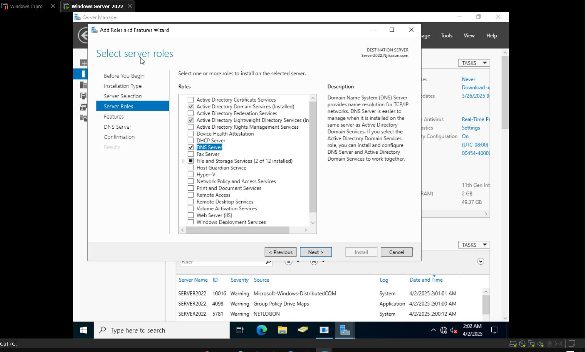

# DNS

## What is DNS?

DNS (Domain Name System) is a protocol that translates human-readable domain names (E.g. google.com) into IP addresses (E.g. 142.250.190.78), allowing computers to locate and communicate with each other over the Internet or a private network.

---
## DNS Server

A DNS Server is a computer or network device that stores and manages domain name records and responds to DNS queries by resolving domain names into IP addresses.

---
> **Tip:** Before installing DNS in the server, the server needs to have a static IP address.

- Navigate to the Server Manager → Local Server → on the page that's up → go to `Ethernet0` → click on it → `Ethernet0 Properties`
- Click on **Internet Protocol Version 4 (TCP/IPv4)** → Properties
  - → Use the following IP address (Static IP address)
- Disable **Internet Protocol Version 6 (TCP/IPv6)** and close

---

> If you go back to the Local Server, you will observe the static IP that was just created.

# Installing DNS Server

1. Go to **Server Manager**  
2. On the top, click on **Manage** → **Add Roles & Features**  
3. Click **Next** before you begin  
4. **Role-based or feature-based installation** → **Next**  
5. **Server Selection** → **Next**  
6. **Server Roles** (click on **DNS Server**) → Add role and click **Next**  
7. Click **Next** and **Install**

---

## Navigating to DNS Zones

1. Navigate to **Tools** on the Server Manager and click on **DNS**  
2. Under **Server 2022**, expand →  
   - **Forward Lookup Zones**  
   - **Reverse Lookup Zones**

---

## Forward Lookup Zones (FLZ)

- A **DNS Zone** that translates a **domain name** (e.g., `nykarson.com`) into an **IP address** (e.g., `172.168.1.10`)  
- It allows users to access websites and network resources using domain names instead of IP addresses

---
## Reverse Lookup Zones (RLZ)

- Performs the **opposite function** of FLZ  
- Translates an **IP address** (e.g., `172.168.1.10`) back into a **domain name** (e.g., `nykarson.com`)  
- It is used for **security**, **logging**, and **troubleshooting**

# Creating a Zone

## Forward Lookup Zone

1. Right-click on **Forward Lookup Zones** → **New Zone** → **Next**
2. **Zone Type** → Select **Primary Zone**, uncheck **Store the zone in Active Directory** → **Next**
3. **Zone Name**: `nykarson.com` → **Zone File** (leave as default) → **Next**
4. **Dynamic Update**: Select **Do not allow** → **Finish**

---
## Reverse Lookup Zone

1. Right-click on **Reverse Lookup Zones** → **New Zone** → **Next**
2. **Zone Wizard** → Select **Primary Zone** → **Next**
3. Skip **Active Directory Zone Replication** → **Next**
4. Choose **IPv4 Reverse Lookup Zone** → **Next**
5. **Network ID**: `10.1.10` → **Next**
6. Select **Do not allow dynamic updates** → **Next** → **Finish**

---

# Creating a New Host (Forward Lookup Zone)

1. Right-click on the zone (`SBT.com`) → **New Host (A or AAAA)**  
2. Enter **Name**: `Test`  
3. Enter **IP Address**: `10.1.10.20` (or any IP address for your organization)

---
# Creating a PTR Record (Reverse Lookup Zone)

1. Right-click on the reverse zone (`10.1.10.in-addr.arpa`) → **New Pointer**
2. Enter **Host Name** → **Browse**  
3. Navigate: `Server 2022` → `Forward Lookup` → `dns.course` (click on it) → **OK**
# Checking our DNS

## Steps:

- Go to the **Server** (right-click → Launch nslookup)
- Type the default IP address: `10.1.10.2`  
  *(This IP address is associated with nykarson.com - Server 2022)*
- Type `10.1.10.20` → It will point back to our newly created host DNS called: `SBT.Com`
- Launch the **nslookup** again and type the host name, not the IP address → It will retrieve the IP address and information.

---
## Creating and Testing DNS Resolution

- Check on `SBT.Com` and create a new host  
  - **Name**: `www`  
  - **IP Address**: `10.1.10.25`
- When you launch **nslookup** and type the IP address, it points back to: `www.SBT.Com`

---
## Confirming with Command Prompt

- To confirm further → Open **CMD** and ping `10.1.10.25` or `www.SBT.Com`
- It is going to ping it with **0% loss**

