# PDQ Deploy

## What is PDQ Deploy?

PDQ Deploy is a remote software deployment tool for Windows environments. It allows you to push software, scripts, patches, and updates to multiple machines simultaneously or on a schedule.

You can see it as your "remote software installer."  
Instead of going from PC to PC, you send out one command and PDQ takes care of the rest.
As a  Helpdesk I might approval from management to install software application to client  

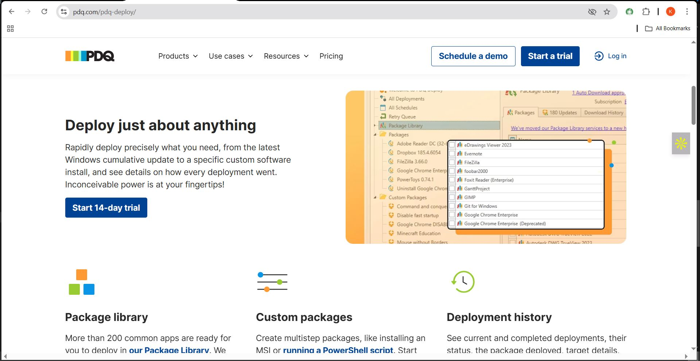

---
## What Does It Do?

- Silently installs applications (e.g. Chrome, Zoom, Adobe Reader)
- Updates software and deploys custom scripts
- Schedules deployments (e.g. install at night)
---
## Setting up PDQ Deploy on Server 2022 (My Lab Environment)

- My Windows Server 2022 has a static IP.  
  In order to download PDQ, I had to change it to a dynamic IP address.
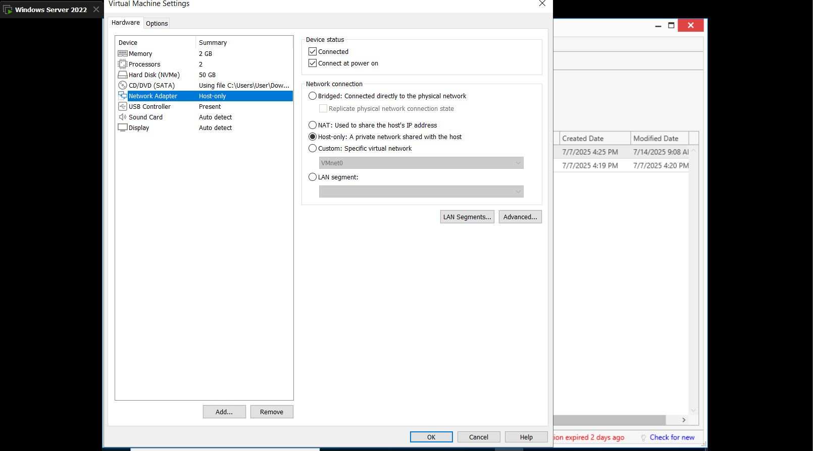
### Steps:
1. Navigate to **Control Panel** → **Network** → **Change Adapter Settings**
2. Go to PDQ official website
3.  Sign up for 14-day trial
4. Fill in my details and verify my email account
5. Download PDQ Deploy and input the license key
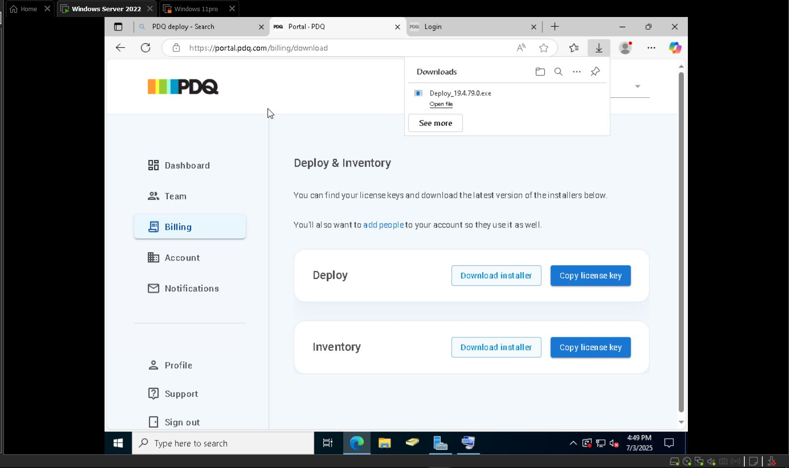
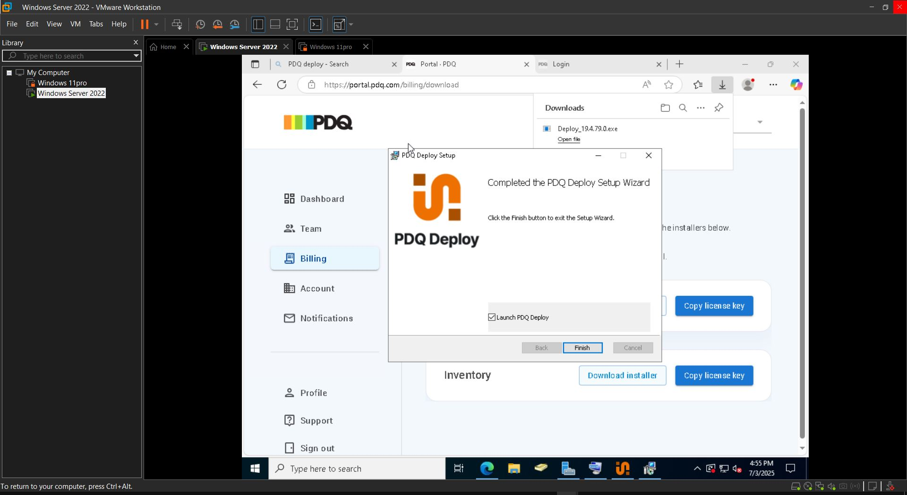
## PDQ Dashboard Overview

- The Dashboard shows:
  - All deployments
  - All apps deployed to endpoints
  - All schedules
  - Retry queue
  - Package Library
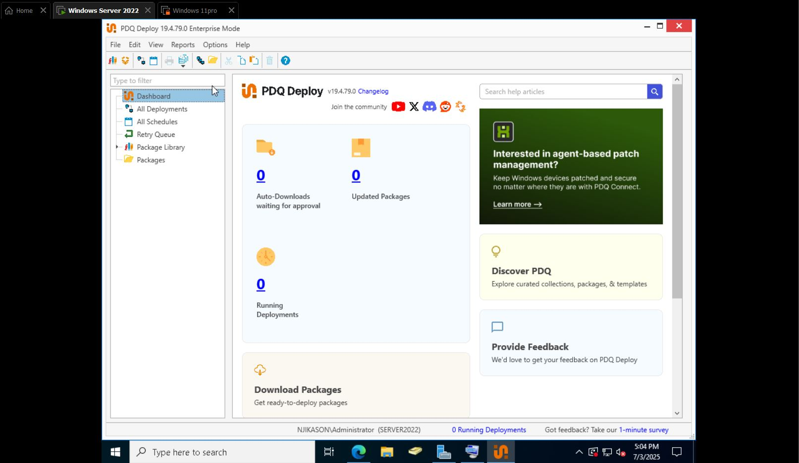
### Package Library
- This is where all the apps are located
---
## Deploying Applications on Server 2022

- Go to **Package Library**
- Select the app (in my lab: Zoom)
- Right-click the app → Select **Download Selected**
- As app downloads, it gets added to local library
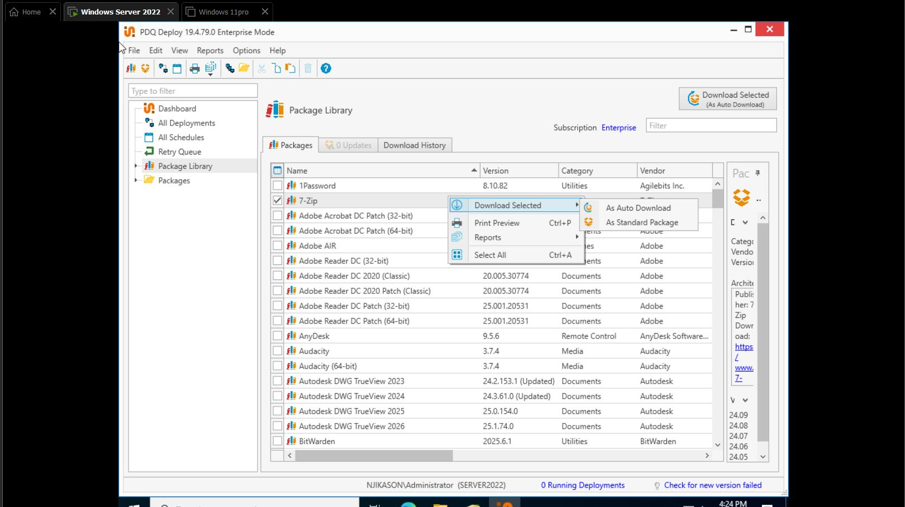
1. Go to **Package**
2. Select the app package
3. Right-click → Select **Deploy Once**
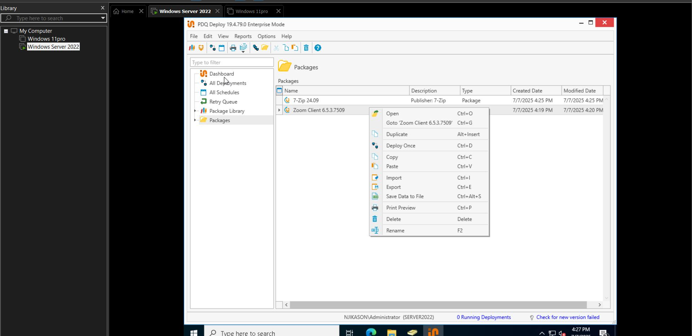
4. On the top right, click on **Targets**
5. Select **Active Directory** → **Computers**
- As you can see, I have two computers.
- Since I'm deploying Zoom to Windows Server 2022:
  - Select it
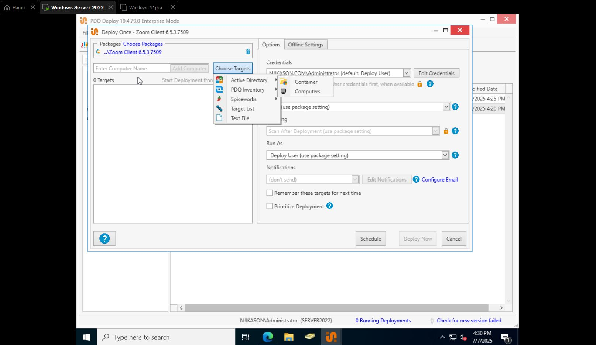
  - Click on the single arrow →
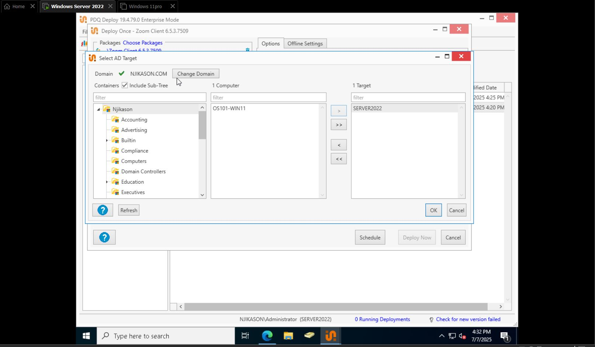
  - Click on **OK**
  - Then **Deploy Now**
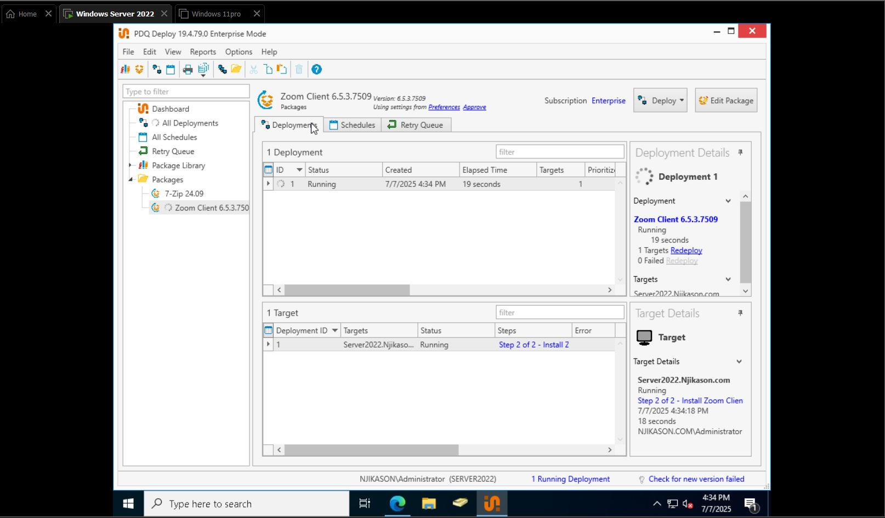
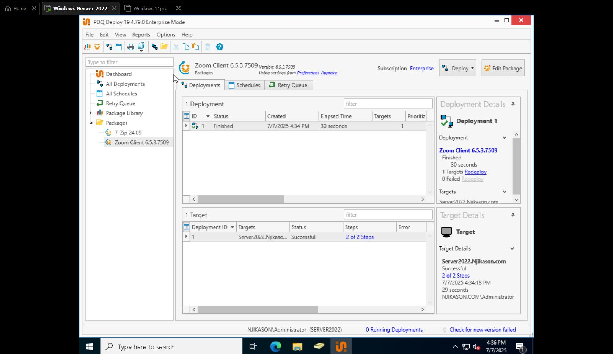

> Now it's completed and fully deployed to my Server 2022.
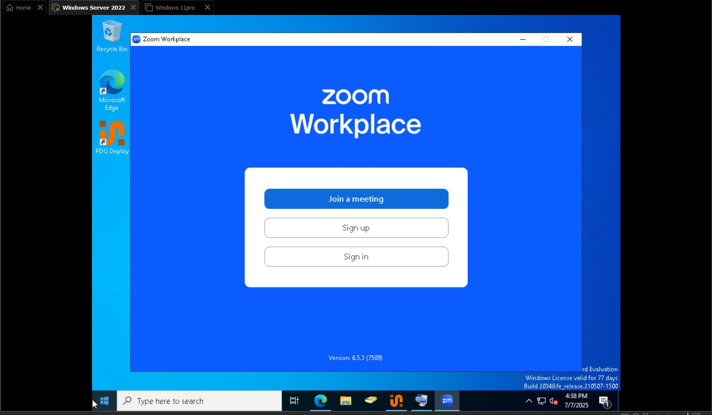
## Deploying 7-Zip with PDQ Deploy on Windows Server 2022

### Deployment Procedure

- Same procedure as deploying Zoom.
- Right-click on the package → **Deploy Once**
- Select **Target** → **Active Directory** → **Containers or Computers**
- Select the computer
- Use the single arrow → **Server2022**
- Click **OK**
- Click **Deploy Now**
- Deployment finished
---
> **Note:**  
> This process allows IT administrators or helpdesk to deploy applications on the back-end without interrupting the users.
### Deploying Software

- From the Inventory, you can enter **PDQ Deploy** and deploy software:
  - Tools → Deploy Package
  - Example: Deploying packages like **7-Zip** and **Zoom**
## Silent Application Deployment Notes

- Check target → Select time to deploy (etc.) → Deploy Now
- Package is then deployed successfully
- On the lab/test machine, you can see the two apps installed silently on it
- This is how applications are installed on a client machine silently without disturbing them
