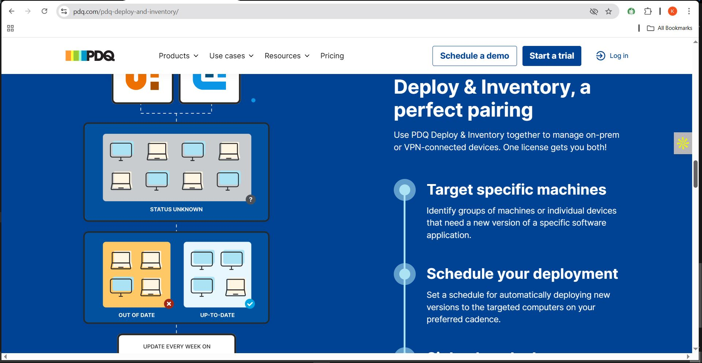
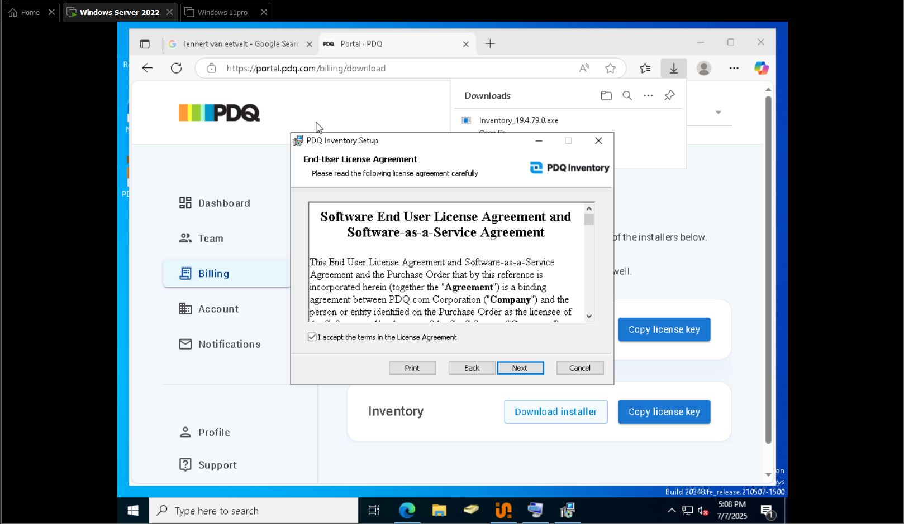
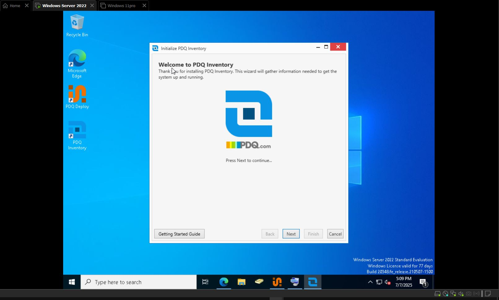
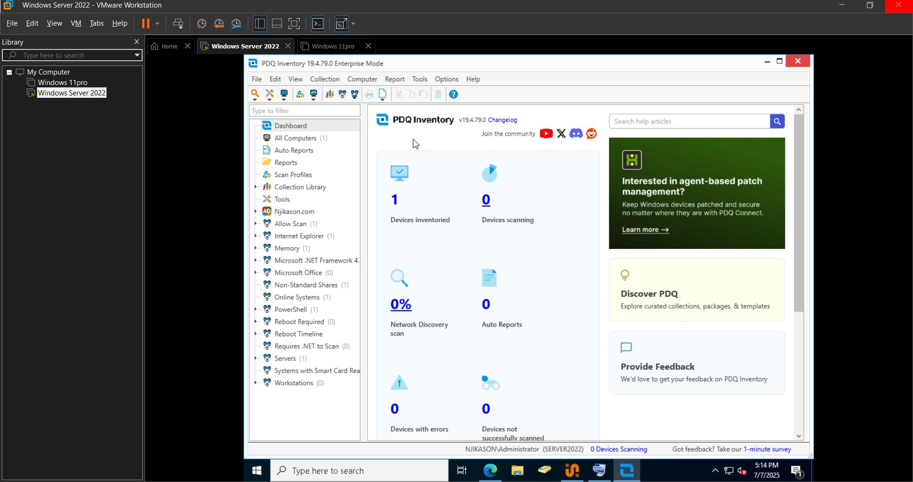
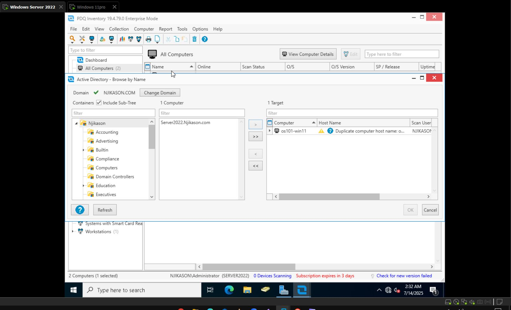
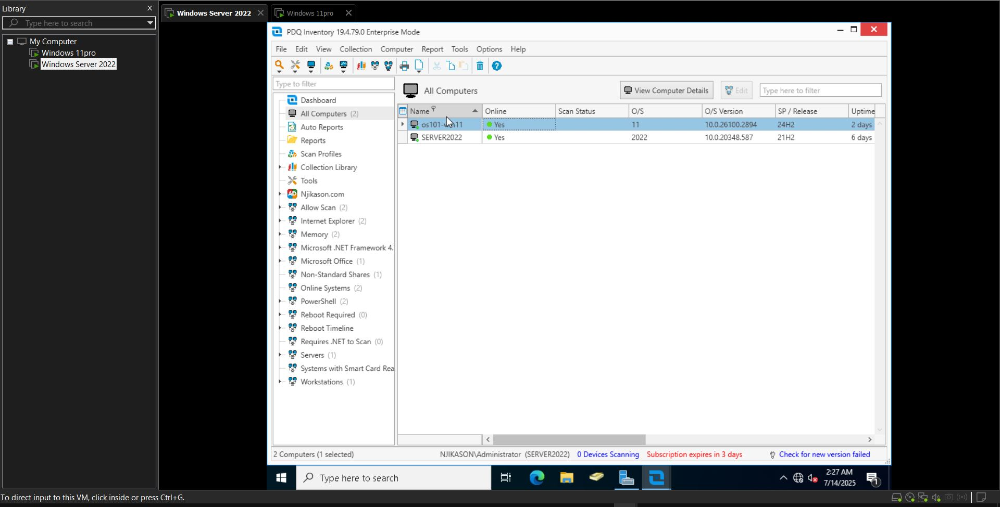
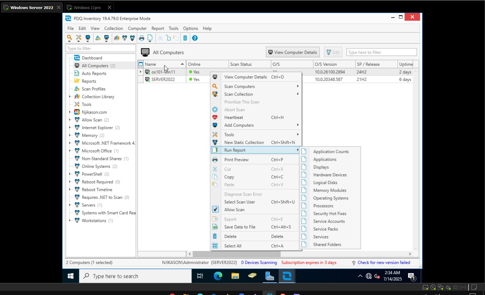
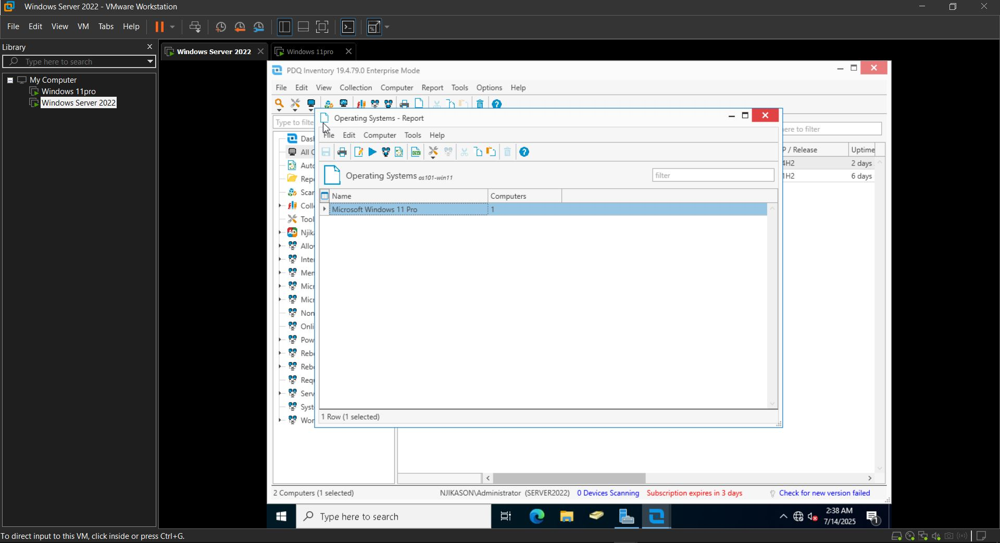
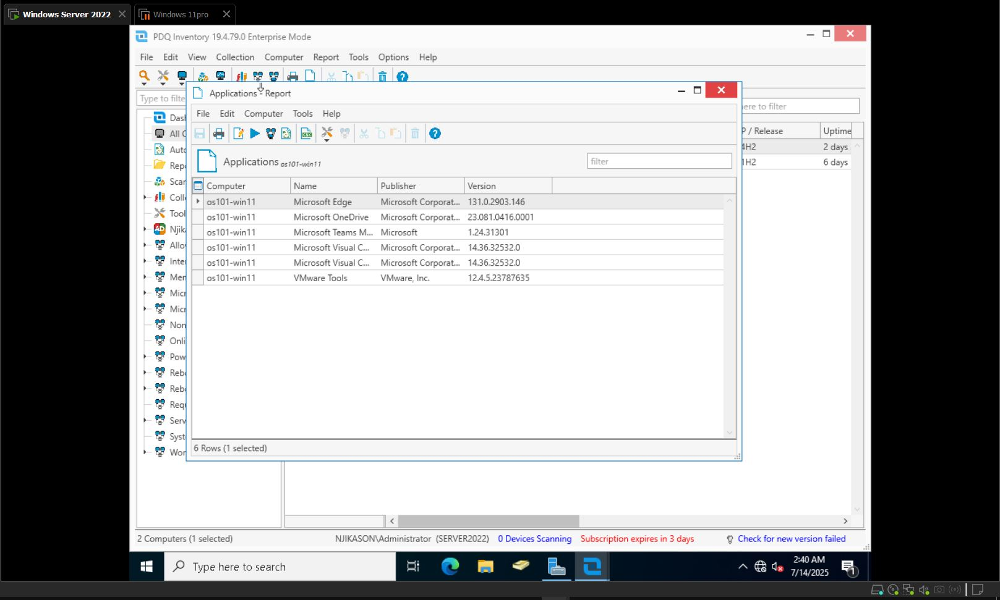

## PDQ Inventory

### What is PDQ Inventory?

PDQ Inventory is a real-time system scanner and asset management tool for Windows machines.  
It scans and gathers system information from all computers on the network (CPU, RAM, installed apps, OS version, etc).  
Think of it as a network map and smart database for everything running on Windows endpoints.

---
### Installing PDQ Inventory
- Download PDQ Inventory and copy the license key.
- Launch the application → Accept terms → Next → Install

- Enter license key and email account → Select **Local**
- Choose installation type → Enter credential password → Finish

### Launch PDQ Inventory

PDQ Inventory gives you a run-down of everything installed on a computer: apps, updates, etc.  
In my project, I have Windows 11 added to the PDQ Inventory.

### Adding Computers

- At the top → **Add Computer** → **Active Directory**
- It shows you all the computers on your Active Directory

- Add to the target → Click **OK**

---
### Running Reports

- If you right-click on a computer → **Run Report**
- It gives an in-depth report on:
  - Applications
  - Operating System
  - Shared Folders

### Shared Folders, Operating System, Applications

- Shared folders on the computer and installed applications can be viewed.
- To do this: Right-click on the computer → **View Computer Info**
- This shows all the details of the computer for general info and Active Directory.

---
### File Sharing

- You can go to `\\shared path` to place a file for the user.
- On the Windows 11 PC, the file is already there if properly shared.
---
### Remote Access

- Remoting into the computer from PDQ Inventory:
  - Click on the computer → On top (Tools) → **Remote Desktop**
  - Click **Connect** → Enter admin password → Now you have access.
- You can remote into Windows 11 from Windows Server without TeamViewer or AnyDesk.

---
### Reboot or Shutdown via PDQ

- PDQ Inventory also allows for **Reboot** or **Shutdown** of the machine:
  - Go to: **Tools** → Reboot / Shutdown → OK
---
### Application Reports

- To generate a report on applications:
  - Right-click on the PC → Scroll to **Run Report** → **Applications**
  - Print preview on the top
  - This reports on all the applications on the Windows 11 machine.
---
### Deploying Software

- From the Inventory, you can enter **PDQ Deploy** and deploy software:
  - Tools → Deploy Package
  - Example: Deploying packages like **7-Zip** and **Zoom**
## Silent Application Deployment Notes

- Check target → Select time to deploy (etc.) → Deploy Now
- Package is then deployed successfully
- On the lab/test machine, you can see the two apps installed silently on it
- This is how applications are installed on a client machine silently without disturbing them
