## PowerShell

### What is PowerShell?
- A **PowerShell Cmdlet** is a lightweight, single-function command built into PowerShell for performing specific tasks.  
- PowerShell is a **command-line shell** and **scripting language** created by Microsoft.  
- A **shell** means you can type commands (like `ping`, `ipconfig`) but with more advanced capabilities.  
- A **scripting language** means you can write a list of commands in a file (a **script**) so they run automatically instead of typing them one by one.  
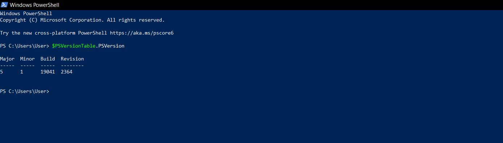
### Why Use PowerShell?
- With PowerShell scripting, you can:
  - Perform **Active Directory tasks** → Create, disable, or reset 50 user accounts at once.  
  - Handle **Microsoft 365 / Intune tasks** → Assign licenses, reset passwords, configure settings.  
  - Run **system checks** → Pull logs, check disk space, list installed software on 100 machines.  
  - Enable **automation** → Instead of manually patching machines or running updates, script it once and run it everywhere. # Downloading Powershell 7.4.5 

* Go to Microsoft’s official GitHub release page:  
  [https://github.com/powershell/powershell/releases](https://github.com/powershell/powershell/releases)  
  → Under **Assets**, download the **.msi installer** for Windows (x64 bit)  
  → Example: `powershell-7.4.5-win-x64.msi`  
  → Run the installer. ✅  
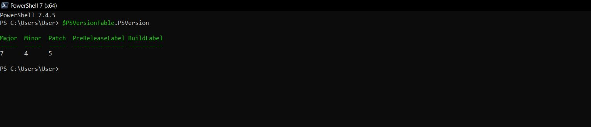
* PowerShell aims to be **cross-platform**, running on **Windows, macOS, and Linux**.  

* Download **Visual Studio Code** to practice PowerShell fundamentals → linked with PowerShell Core.  
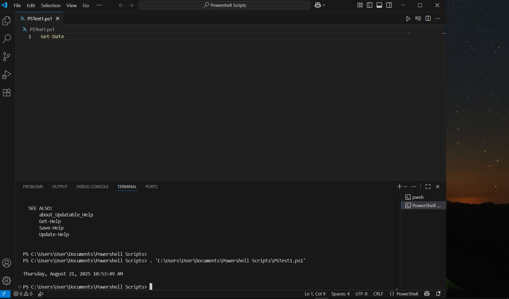

### Notes
- You can always **download a higher version of PowerShell** if your current version is outdated.

## Variables
* A variable is a **named storage location** for data (string, number, object, etc).  
* Always starts with `$` in PowerShell.  
* Think of it as a **container that stores data you can reuse**.  
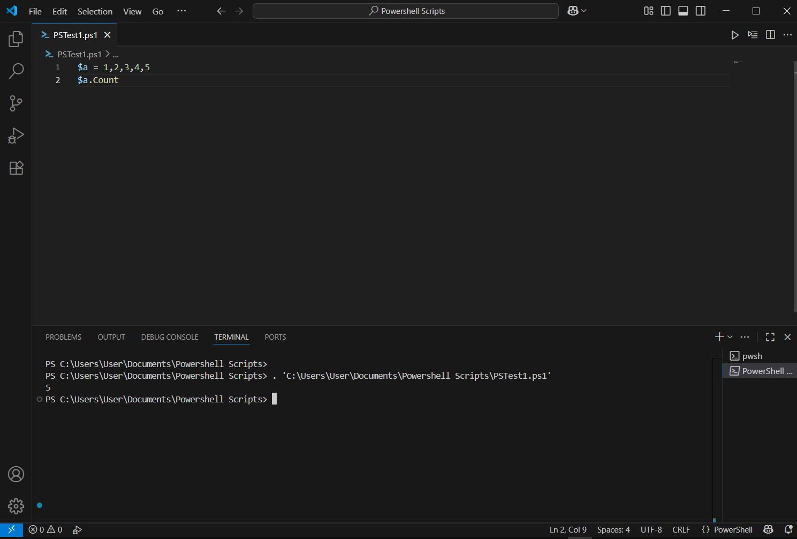
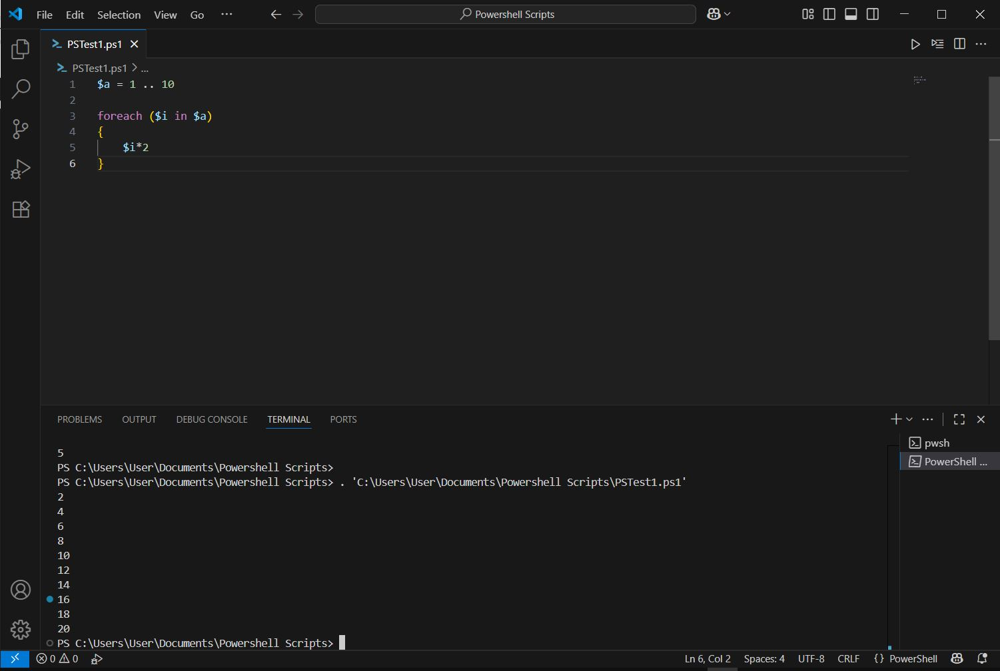
## Alias
* An alias is just a **shortcut (nickname)** for a longer cmdlet, command, or function.  
* It makes typing faster, but the command still runs the **full version** in the background.
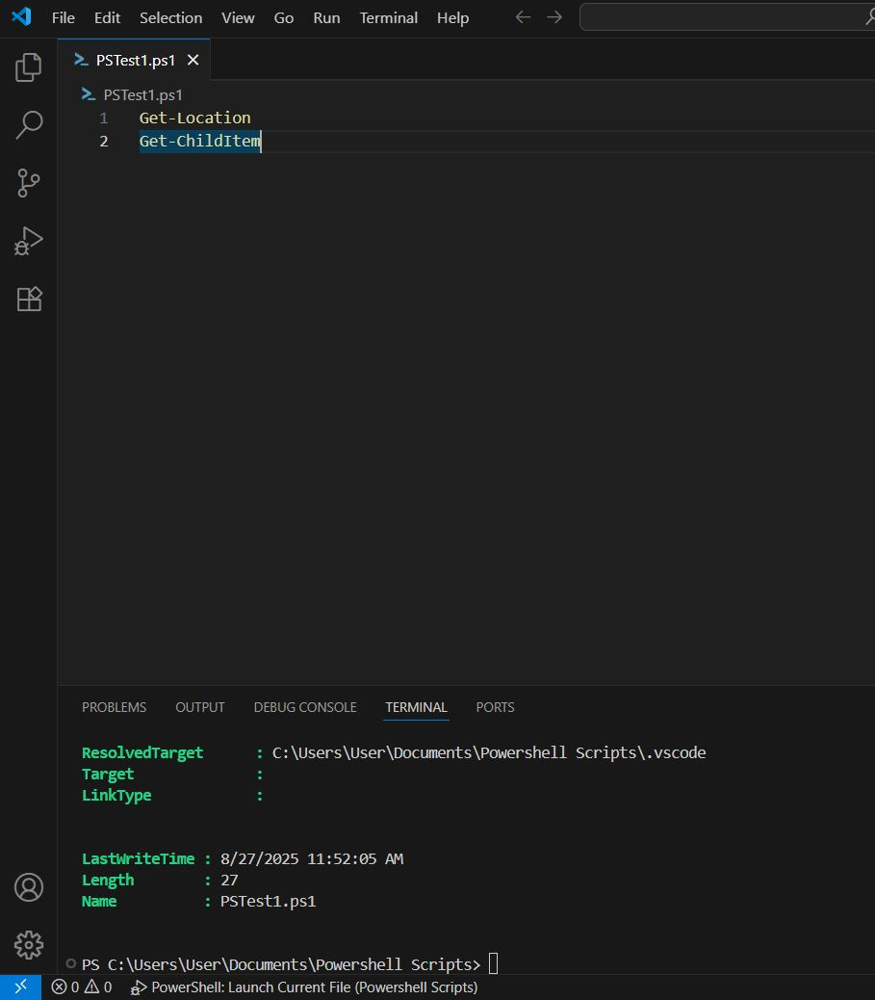
## Comparison Operators
* In PowerShell, comparison operators are used to **compare values** (numbers, strings, or objects).
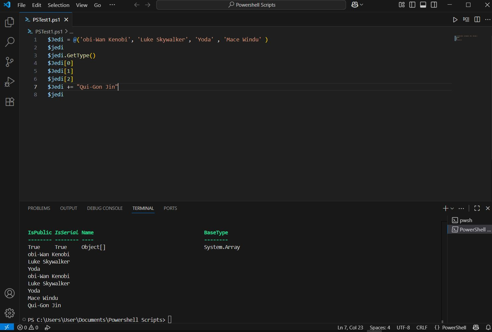
* They return either **True or False**.  
## Arrays
* An array is just a **list of items** stored in a single variable.  
* Instead of having one value, an array can hold **multiple values at once** (numbers, strings, objects, etc).  
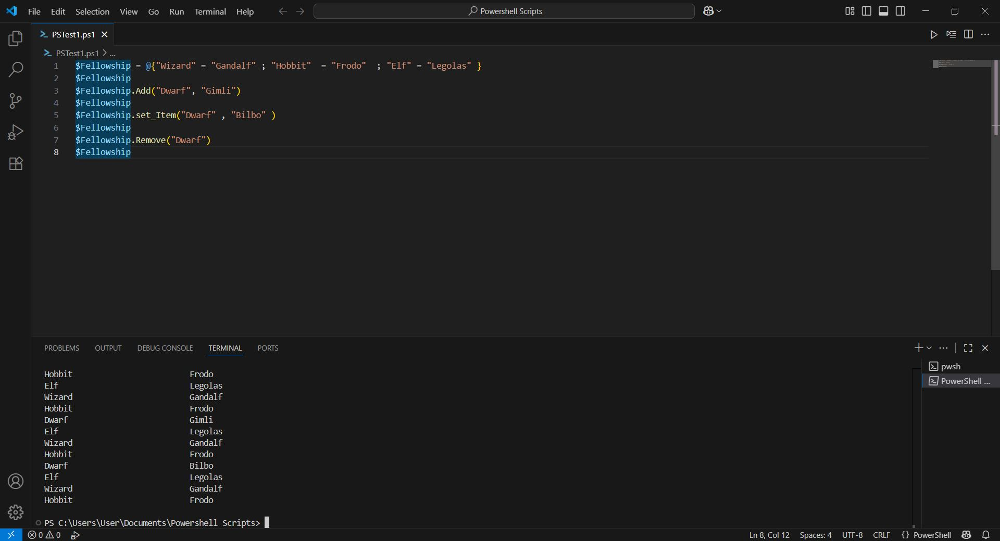
## Hashtable

* A hashtable uses **specific keys**.  
* It is a **data structure** that stores **key–value pairs**.  
## Hashtable Example

`$fellowshipData = @{     Key1 = "Item1"     Key2 = "Item2" }`

A **hashtable** in PowerShell stores data as **key-value pairs**. Keys must be unique, and you can retrieve values by referencing their keys.
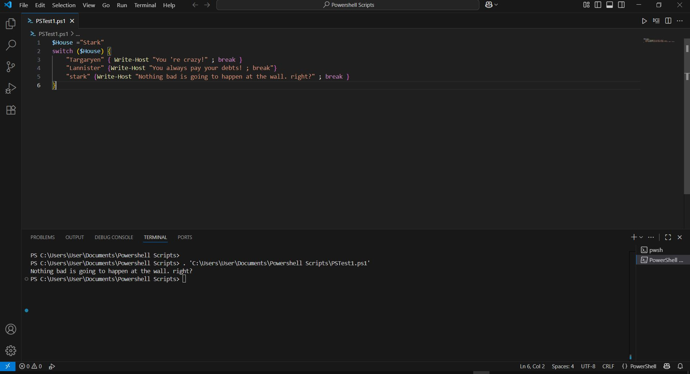
## Functions in PowerShell

A **function** in PowerShell is a reusable block of code that you define once and call multiple times.
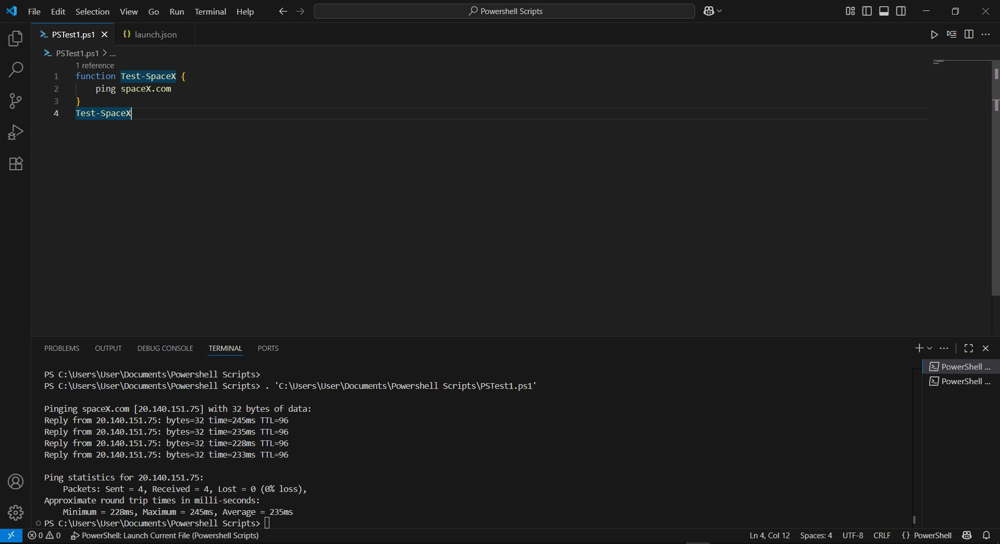
### Syntax

`function Get-Greeting {     param([string]$Name)     "Hello, $Name! Welcome to PowerShell." }`

### Usage

`Get-Greeting -Name "Kizito"`

Functions help you **avoid repeating long scripts** and make your automation modular.

---
## Using the Ping Command

PowerShell allows you to test network connectivity using `Test-Connection` (instead of legacy `ping`).

`Test-Connection google.com -Count 4`

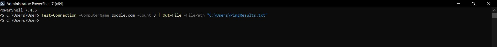
This sends ICMP echo requests and returns the response time, similar to `ping`.

---
## Creating a New File in PowerShell

`New-Item -Path "C:\Users\User\example.txt" -ItemType File`

Creates a blank text file in the specified path.

- `-Path` specifies the location.
    
- `-ItemType File` ensures it's a file (not folder).
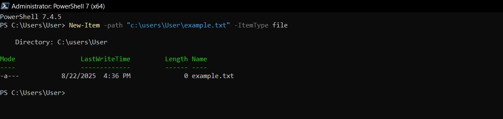

---
## Creating and Saving Command Output to a File

### Example: Save Ping Results

`Test-Connection google.com -Count 4 | Out-File "C:\Users\User\PingResults.txt"`

- `Out-File` saves the output of a command into a text file.
    
- Useful for logging troubleshooting steps.

---
## Delete a File in PowerShell

`Remove-Item -Path "C:\Users\User\example.txt"`

- Deletes the specified file.
    
- Add `-Force` if the file is hidden or read-only.
    
- Add `-Recurse` if deleting a folder with contents.
### Aliases vs Full Cmdlets

- Always prefer **full cmdlets** in scripts (`Remove-Item` instead of `rm`) for readability.
    
- Aliases are good for typing faster interactively.
---

# Breaking-Down a Powershell Script to aid my learning of Powershell automation.

### This is a script used to create new users on Active directory (Bulk user accounts) learning how everything comes together to make automation is important for work environment.

Import-Module ActiveDirectory # Define base OU path $baseOU = "OU=Student,OU=centralUnit,DC=Njikason,DC=com" # Define houses and students $Houses = @{ "Gryffindor" = @("Harry Potter","Hermione Granger","Ron Weasley") "Slytherin" = @("Draco Malfoy","Pansy Parkinson","Blaise Zabini") "Ravenclaw" = @("Luna Lovegood","Cho Chang","Padma Patil") "Hufflepuff" = @("Cedric Diggory","Hannah Abbott","Ernie Macmillan") } # Loop through houses foreach ($House in $Houses.Keys) { $houseOU = "OU=$House,$baseOU" # Create the OU if it doesn't exist if (-not (Get-ADOrganizationalUnit -Filter "DistinguishedName -eq '$houseOU'" -ErrorAction SilentlyContinue)) { New-ADOrganizationalUnit -Name $House -Path $baseOU Write-Host "Created OU: $House" -ForegroundColor Cyan } # Loop through students in each house foreach ($student in $Houses[$House]) { # Split into first/last name $parts = $student.Split(" ") $givenName = $parts[0] $surname = $parts[1] # Define user parameters $userParams = [ordered]@{ Name = $student DisplayName = $student GivenName = $givenName Surname = $surname SamAccountName = ($givenName.Substring(0,1) + $surname).ToLower() UserPrincipalName = ($givenName.Substring(0,1) + $surname + "@Njikason.com").ToLower() Path = $houseOU EmailAddress = ($givenName.Substring(0,1) + $surname + "@Njikason.com").ToLower() Enabled = $true AccountPassword = (ConvertTo-SecureString "Welcome123!" -AsPlainText -Force) ChangePasswordAtLogon = $true } # Create user if not exists if (-not (Get-ADUser -Filter "SamAccountName -eq '$($userParams.SamAccountName)'" -ErrorAction SilentlyContinue)) { New-ADUser @userParams Write-Host "Created user: $student in $House" -ForegroundColor Green } } }
## Loops

A loop goes through each item in a list and does something with it.

- Outer loop → goes through each house.
    
- Inner loop → goes through each student in that house.

`foreach ($House in $Houses.Keys) {     foreach ($student in $Houses[$House]) {         ...     } }`

- A **loop** repeats actions
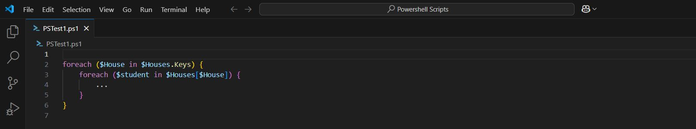
---
##  If Statements

Checks a condition and only runs the code if it’s true.  
Example in the script:

- If the OU does not exist, create it.
    
- If the user does not exist, create them.
`if (-not (Get-ADOrganizationalUnit -Filter "DistinguishedName -eq '$houseOU'")) {     New-ADOrganizationalUnit -Name $House -Path $baseOU }`
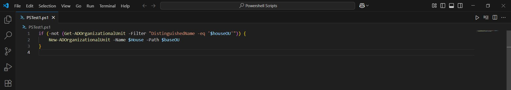
- **If** checks conditions.
    
- `-not` means "if this does not exist."
    
- Here: Create the OU only if it doesn’t exist.
---
##  String Operations

`$parts = $student.Split(" ") $givenName = $parts[0] $surname   = $parts[1]`

- Splits `"Harry Potter"` into `"Harry"` and `"Potter"`.
    
- Useful for building usernames and emails
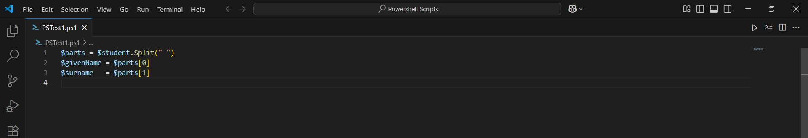
---
## Calculated Properties

`SamAccountName = ($givenName.Substring(0,1) + $surname).ToLower()`

- Builds `hpotter` from `"Harry Potter"`.
    
- `.ToLower()` converts it to lowercase.
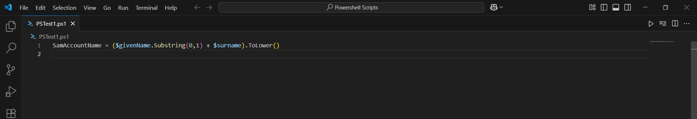
---
## Secure Strings

`AccountPassword = (ConvertTo-SecureString "Welcome123!" -AsPlainText -Force)`

- Creates a **secure password object** for new AD accounts.
    
- Required by `New-ADUser`.
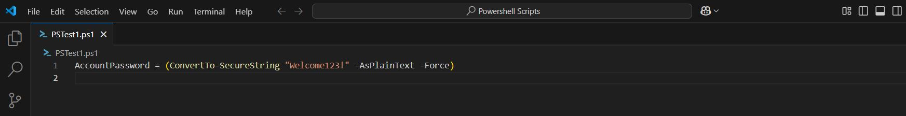
---
##  Splatting

`New-ADUser @userParams`

- **Splatting** passes a hashtable (`@userParams`) as parameters.
    
- Cleaner than writing all parameters in one long line.
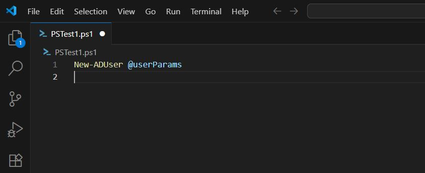
---
##  Write-Host

`Write-Host "Created user: $student in $House" -ForegroundColor Green`

- Displays progress messages in the console.
    
- Helps track what the script is doing.
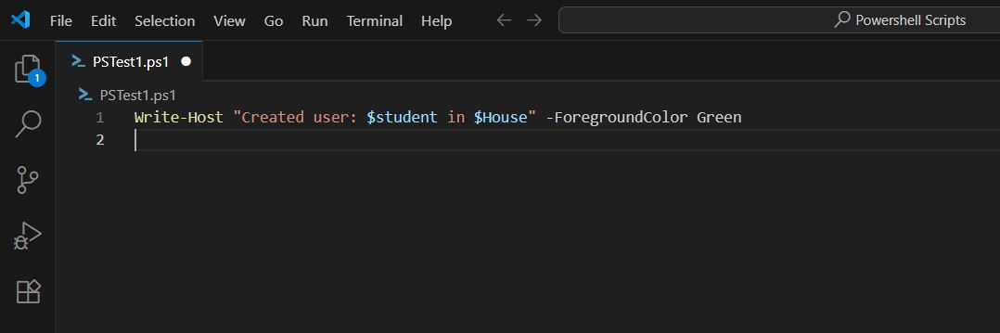
