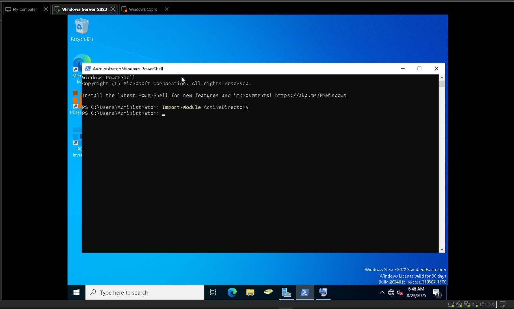
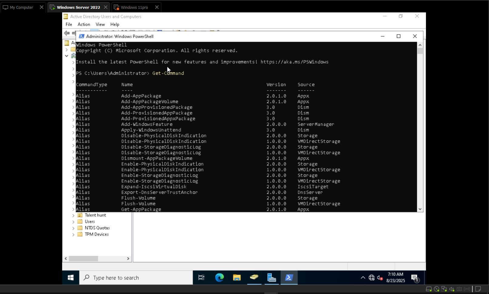
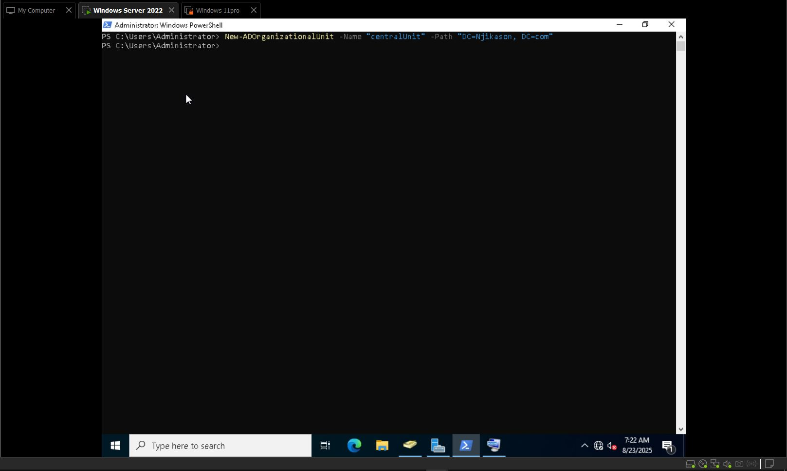
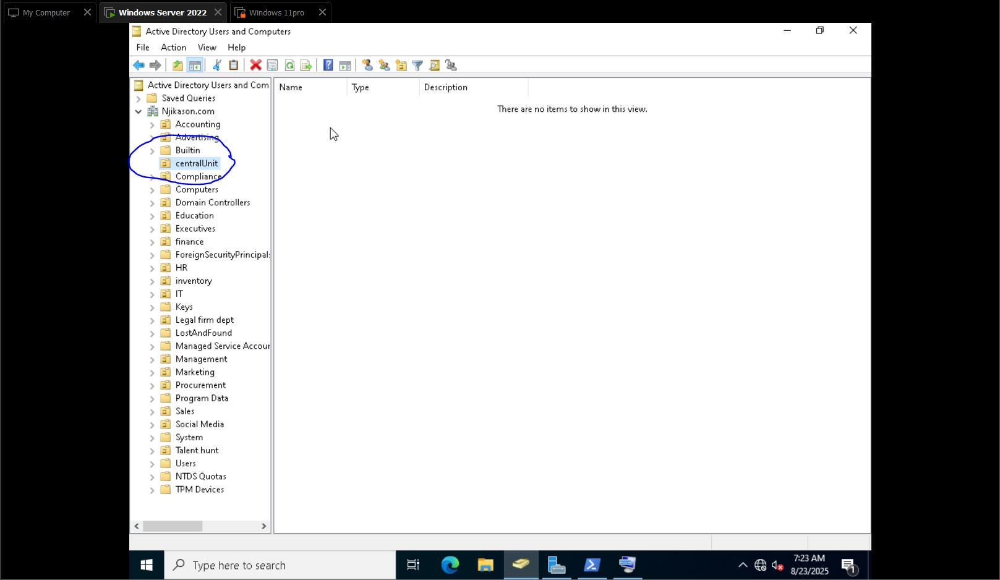
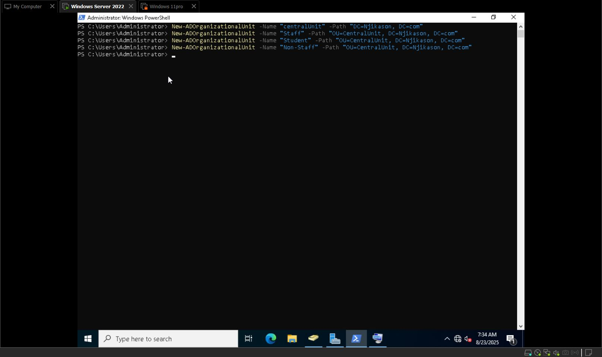
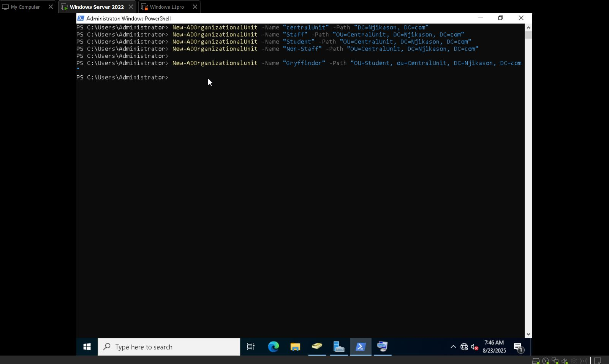
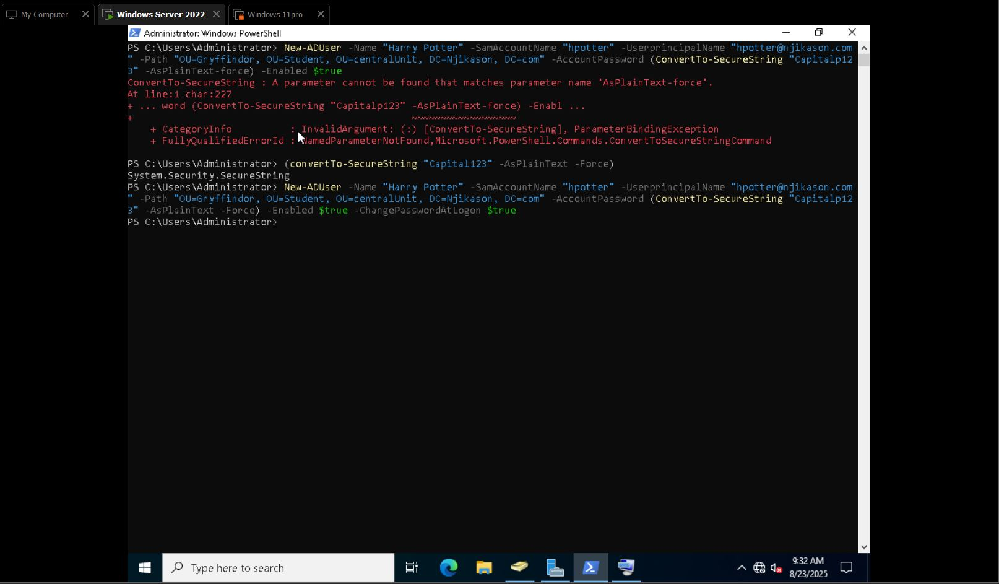
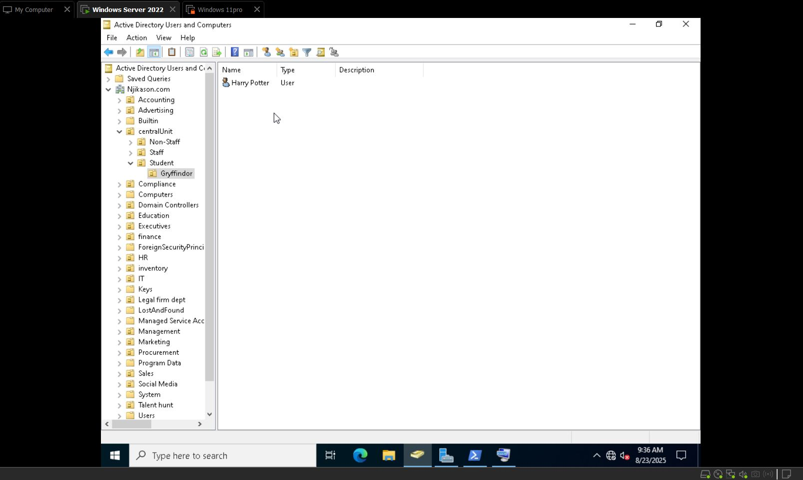

# Powershell Automation (Active Directory)

## Overview
PowerShell Active Directory refers to the use of the Active Directory module for Windows PowerShell to manage and automate tasks in Microsoft Active Directory.  

It uses PowerShell commands (cmdlets) to perform operations such as:
- Creating, modifying, and deleting users and computers  
- Managing groups and organizational units  
- Resetting passwords and unlocking accounts  
- Querying Active Directory for information (e.g., last logon times, group membership)  
- Automating bulk changes across multiple objects  
---
## Getting Started
To work with PowerShell in Active Directory, you need to import the module to get the commands for Active Directory automation.  
##  Steps:
1. Navigate to the Start Menu → search for **PowerShell**  
2. Right-click and **Run as Administrator**  
3. In PowerShell, run:  
   Import-Module Active Directory

4. Get-Command  (shows Different command to use) to run scripts.

## Creating a New Organizational Unit (OU) with PowerShell

You can create a new OU in Active Directory using this cmdlet:

`New-ADOrganizationalUnit -Name "CentralUnit" -Path "DC=Njikason,DC=com"`

- `-Name` specifies the OU name
    
- `-Path` specifies the domain structure where it will be create


# Creating More OUs with PowerShell

* Creating Sub OUs inside Central Unit with PowerShell
* Created another sub OUs under Student for Gryffindor to add a user inside



# Using PowerShell, I created a New User account in Active Directory

  Using the Cmdlet:
  

```
```powershell
New-ADUser -Name "Harry Potter" -SamAccountName "hpotter" -UserPrincipalName "hpotter@Njikason.com" -Path "OU=Gryffindor, OU=Student, OU=CentralUnit, DC=Njikason, DC=com" -AccountPassword (ConvertTo-SecureString "Capitolp123" -AsPlainText -Force) -Enabled $true -ChangePasswordAtLogon $true
```
- Created another User account (Hermione Granger) using the same script.
- 

---
# Get-ADUser

- `Get-ADUser` is used to retrieve information about a User account in Active Directory (AD) and also properties like email, groups, account information.
---
# Adding Email Address to a User

- Adding email address to the user Harry Potter on PowerShell:
    
`Set-ADUser -Identity "hpotter" -Email "harry.potter@njikason.com" -OfficePhone "800-555-7777"`

---
- ## Disable account with PowerShell:
    
`Set-ADUser -Identity "hgranger" -Enabled $false`

- ## To enable the account again:
    

`Set-ADUser -Identity "hgranger" -Enabled $true`


# Resetting Password with PowerShell on Active Directory

* Navigate to PowerShell and type:

```powershell
Set-ADAccountPassword -Identity "hpotter" -Reset -NewPassword (ConvertTo-SecureString "Capitolp123" -AsPlainText -Force)

```

- Then prompt for the user to change their password at the next logon:
    

`Set-ADUser -Identity "hpotter" -ChangePasswordAtLogon $true`

The password has been changed.

---
# Unlocking a User Account in Active Directory

- Navigate to PowerShell → open as Administrator → type:
    
`Unlock-ADAccount -Identity "hpotter" Unlock-ADAccount -Identity "hgranger"`

---
# Creating a Group (Security Group) Using PowerShell

- In PowerShell type:
`Add-ADGroupMember -Identity "Quidditch Players" -Members "hgranger"`
---
# Creating Another User with PowerShell

- Created another user account **Ron Weasley** using PowerShell and added to Gryffindor group OU with created password

---
# Automation in powershell:

### Automation in powershell is the process of writing Scripts to perform repetitive IT tasks without manual efforts. Instead of clicking through GUI (Active Directory users & Computers) you use powershell Cmdlets to Script the process once and re-use it many times.

 As other Learning administration, makes it easy to get work done faster, avoid repetitive task which leads to burn-out.
 
 Powershell can interact with active Directory, Azure, Office 365 SQL, VMware, AWS etc.

 ## Creating a new student account using Automation in powershell.
 
 My Current setup: Directory Setup OU = CastelData, Under it
 
I Want to Run an Automation Script that Creates multiple Organizational Unit (OU) for Slytherin, Ravenclaw and Hupplepuff. -> Each OU will have its student as the Script will Create new Users as well.

 What This Script Does
   - breaks up the OU Creation under
   OU = Student, OU = centralUnit, DC = Njikason, DC = Com.
 if not, it Creates it

 Loops through each house (Gryffindor, Slytherin, Ravenclaw, Hupplepuff)
 Creates Students in each OU with:
   - SamAccountName = first initial + last name (Eg: hpotter, dmalfoy)
   - UPN / Email = Same format + @Mydomain.com
   - Default Password: Welcome123! (forces password change at logon)

* After running the Script, my Active-Directory looks like this. Newly Created accounts.To Test it Even further, I logged in as Draco malfoy, changed the new password. Account is ready.
 ---
## Creating new Users with CSV-driven automation in Powershell

## What is a CSV file for AD User Creation

CSV (Comma-Separated Values) is a simple text file where data is arranged in columns separated by commas.
* Each row in the CSV = One User you want to Create. -> Each Column (header) = a property for the User account (Eg Name, Username, Password, OU)

This file is a blueprint for Powershell. Instead of Creating Users one by one, you load the CSV, loop through each row and Powershell Creates the account Automatically.

It's useful in real IT tasks, if you need to Onboard 50+ new employees doing it manually would take hours.

 With CSV + powershell Scripts, you can Create all users in a few Seconds

1) Press Windows + R, type notepad, Press Enter.

* Creating new Users for Staff, The Current Set-up is OU = centralUnit, OU = Staff => Inside the Staff OU, I'm creating multiple Users at Once Using CSV method

* The Script is

Import-Module Active Directory (loads the Active Directory module needed to use New-ADUser, Get-ADUser etc)

$Staff = Import-CSV -path 'C:\HogwartsStaff.csv'

2) Copy the text below into the notepad (already had the Script)

-> Click File -> Save as -> in File Name, type C:\HogwartsStaff.csv -> Now I have C:\HogwartsStaff.csv

* Create the powershell Script

3) open a new Notepad Window -> Copy The Script looks ->
(Create a Splitting hashtable that holds all the user properties)

SamAccountName = User name for login
UserprincipalName
Path
Accountpassword -> Check if and if the User exists (Get-ADUser)
-> If not found -> Create a New AD User

The Script was Created Using chatgpt
4) * Save it as: C:\Import-HogwartsStaff.ps1
   * Now I have Created two CSV file to Create User

5) * Navigate to powershell -> open as an admin -> Run the Command
   Set-ExecutionPolicy RemoteSigned -Scope Process -Force
   (allows running you Script in this Session)

   * Run the following Script: C:\Import-HogwartsStaff.ps1

6) * After Running, it Created all the Users in the OU = Staff.

 In Work Environment, The Script Should be Tested, Edit the CSV -> Add/Change User attribute (Naming, Convention, password policy).
 
---
# Created Another CSV file for New Users In a different OU using Powershell 

Created a Notepad note -> Copied the Script Inside -> Saved the as C:\Darkligion.csv

Create the Import Script (Used chat-gpt to Create an Import Script) 

Save this as C:\Import-Darkligion.ps1 This Creates & Structure User by Name, SamAccountName, UserprincipalName, Path, Account Password (ConvertTo-SecureString $ulogged.Password -AsPlainText -Force)

Open Powershell as Administrator -> Run the Script

  C:\Import-DarkWizards.ps1 -> It Should Import Created New Users
