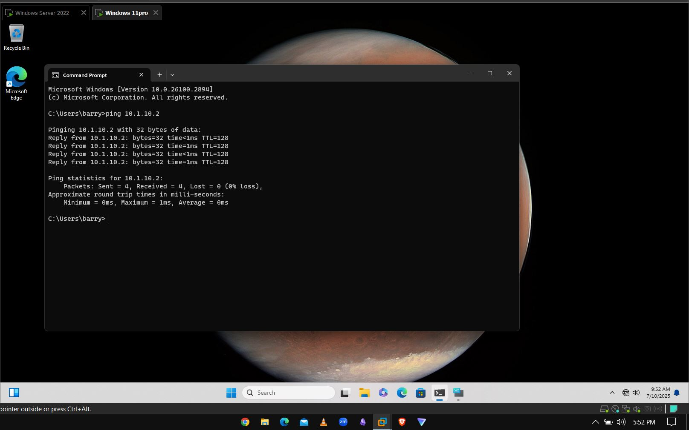
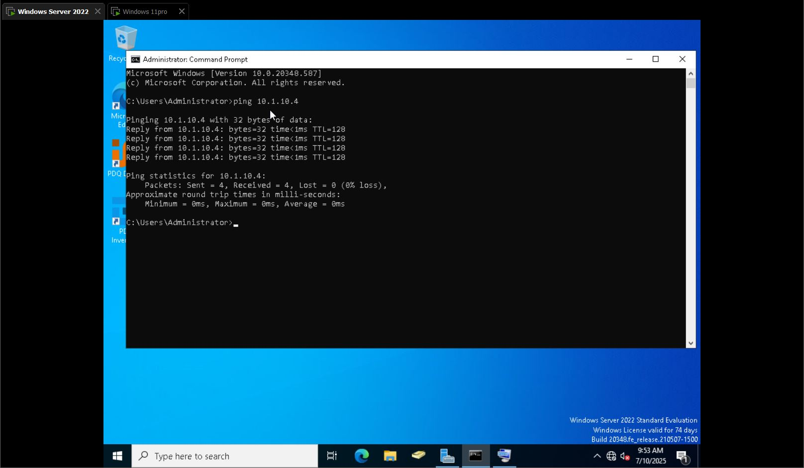

## RDP (Microsoft Remote Desktop Protocol)

### What is RDP?

Remote Desktop Protocol (RDP) is a built-in Microsoft protocol that allows users to remotely connect to and control another Windows computer over a network.  

It’s commonly used by IT Support or System Administrators to:
- Troubleshoot issues
- Configure systems  
- Perform administrative tasks  
All without needing physical access to the device.

---
### Pre-Connection Checklist
- First, make sure both systems can **ping each other** (check network connectivity).
- Confirm they are both **on the same network**.
- Server used: **Server 2022**
- Client machine used: **Windows 11 Pro** (`OS 10.1 - WIn11`)

---
### How to Launch RDP on Windows
1. Press `Win + R`
2. Type `mstsc`
3. Enter the **IP address** or **name** of the user’s computer (e.g., `10.1.10.4`)
4. Then connect:
   - A prompt will appear
   - Click **Yes**
   - Now you’re logged in to the remote machine
---
### Practical Example

- Remoted into a Windows 11 Pro machine from Windows Server.
- Once connected, I can:
  - Push documents into the machine from the server
  - Troubleshoot issues
  - Download applications
  - Find root causes to technical problems
---
**Note:** Always ensure both machines are on the same network before attempting RDP.
