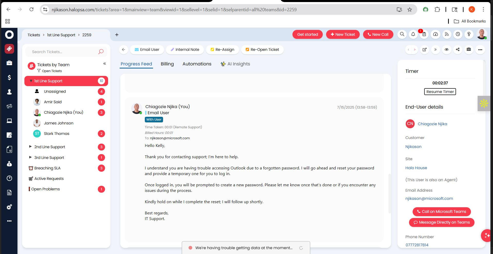

## HaloPSA Ticketing System

HaloPSA is a cloud-based Professional Services Automation (PSA) platform commonly used by Managed Service Providers (MSPs) to manage IT operations. It combines ticketing, asset management, time tracking, billing, and documentation in one system.

- It’s designed to help MSPs deliver efficient, trackable, and customer-focused IT support.

---
### How Level 1 IT Support Uses HaloPSA

I’m documenting how a Level 1 IT Support uses HaloPSA because I would be using the ticketing system daily to receive, investigate, and escalate when needed.

- I signed up for the free trial to practice the ticketing system.
- Home Dashboard gives the overall overview of everything I need to know about HaloPSA: Service Desk, Assets, Knowledge Base, etc.

---
### My Role as a Level 1 IT Support

- Should look for tickets myself (view incoming tickets, create new tickets, update ticket status)
- Communication (using internal notes to document technical steps and actions taken, email users professionally and clearly)
- Follow escalation → if I can’t resolve it, I escalate to Tier 2
- Knowledge Base → is very important to search for solutions and also contribute to the Knowledge Base

## Resolving Tickets

### Viewing Tickets
- This is all the tickets in the ticketing system.
- As a Level 1, I would select tickets by Teams to see tickets assigned to me.

### Tickets by Team
- Opened the team assigned to me.

- User reports Outlook issue with Calendar (to make calendar that is shared).

- Responded to the user, activated a remote session to walk through the client to fix steps.

- Session closed, updated my internal notes, and closed the ticket.

---
### Ticket Example 2
- Ticket was pre-assigned to me by another agent.
- Issue with Outlook not opening, needed a password reset.

- Emailed the user acknowledging the ticket received

- Assisted in resetting the user password.

- Enabled the user to change her password. Confirmed the issue is resolved.

- Updated my ticket note, marked the ticket closed.

## Creating a New Ticket on HaloPSA

- User can’t get access to the shared folder on the H: drive.
- (User called support, so it’s important to create a ticket for it.)
- Created an agent account as a Level 1. This is my dashboard and tickets assigned to my team and me.

### Common Ticket Example
- Can’t log into Outlook Online – got “Something went wrong” once logged in.
- Reached out to the user, advised on the next actions to take.
- Updated my ticket with clear English for easy reference.

> **Note:** Before trying to solve a ticket, it's nice to check if the issue has been solved. Searching through is a good way to see how other tickets are solved.

---
### Printer Issue Example
- User reports printer issue, stopped printing out.
- Emailed the user, suggested to start a remote connection to narrow down the problem.
- Cleared print queue, restarted the Print Spooler, set to use the main tray 1 for printing. Tested printing and it’s working.
- Emailed the user after session:
  - What caused the issue.
  - Thanked them for patience and understanding.
- Updated my ticket note with timestamp and clear documentation.
