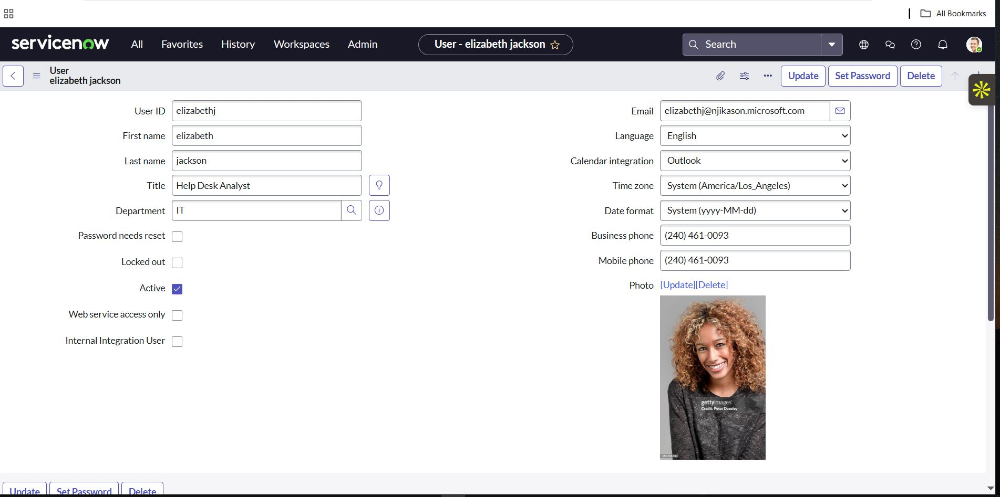

# ServiceNow as a Ticketing System

While ServiceNow can do a lot, its core use for **IT Support** is as a **ticketing system** – a place to manage and track problems users report, requests they make, and the steps Support teams take to resolve those issues.

For most helpdesk or IT support agents, **ServiceNow** is where:

- You receive **tickets** (issues or requests from users).
- **Communicate with users** through *Additional Comments* (Customer Visible).
- **Log** what you're doing in *Internal Work Notes*.
- **Escalate** issues to the right team.
- **Close out** tickets with proper documentation.

> For IT Support, if it’s not in the ticket, it didn’t happen.
# ServiceNow Hands-on Practice (Developer Option)

- **ServiceNow** is a **cloud-based IT Service Management (ITSM)** platform used by organizations to manage:
  - IT support tickets
  - Automate workflows
  - Track service requests across departments

- It is one of the most popular and powerful **ITSM tools** used by medium to large enterprise

---
## Creating a ServiceNow Developer Account

1. Navigate to **Google** and search **ServiceNow Developer**.
2. **Sign up / Start building**:
   - Verify account and get started with the set-up.
   
   
   - *(Help us tune your experience)* → Select **YES** and **describe your job description** (e.g., IT Admin).
    **Agree & Finish Set-up**

# ServiceNow Instance Setup

1. **Click on** `Request Instance`.
2. Once the instance is created:
   - Click on it.
   - Head over to `Workspaces` at the top.
   - Go to `Service Operations Workspace`.

---
# How Different Roles Use ServiceNow

### Companies (as a whole):
- Use it to **centralize service delivery**, **track performance**, **automate tasks**, and **meet compliance or SLA requirements**.

### IT Support (Helpdesk / Service Desk):
- **Create**, **update**, and **resolve** incident and service request tickets.
- Use **Internal Work Notes** for internal documentation.
- Use **Additional Comments** to communicate with users.
# Key Concepts in ServiceNow Ticketing

- It is used to **log & track incidents**.
- Create **Service Requests** (e.g., password resets, software installs).
- **Escalate tickets** to the right support teams.
- Document **resolutions and work notes**.
- Follow **internal SLA (Service Level Agreement)** guidelines.

---
## Core Components of ServiceNow Ticketing

### 1. Incidents
Used when something is **broken** or **not working**.  
Example: *"User can't access Outlook or laptop not working."*

- **Goal**: Restore normal service as quickly as possible.
- IT Support investigates, logs troubleshooting steps, and resolves or escalates.

---
### 2. Service Requests
Used when users want something that isn’t broken.  
Example: *"Request access to SharePoint,"* or *"Software install."*

- Often follows a predefined workflow for **approval** or **fulfillment** (e.g., from a supervisor).

---
### 3. Problems
Used to investigate the **underlying cause** of one or more incidents.  
Example: *If 10 users report VPN dropping every morning, a problem ticket might be opened to identify the root cause.*

# Additional Concepts

- **System admins or specialists** usually handle **problems**.
## Knowledge Base (KB)

- A collection of **how-to articles**, **solutions**, and **troubleshooting guides**.
- Created from resolved tickets or documented procedures.
- Helps technicians solve **common issues faster**.
- Users may also access this for **self-service**.

---
## ServiceNow Dashboard

- On the **left side**, click on the list to see various sections like:
  - **Incidents**
  - **Requests**
  - **Catalog tasks**
  - **Problems**
  - etc.
---
## User Creation in ServiceNow

- **Creating and assigning a new user** (example: a helpdesk agent).
- Assign them the **ServiceDesk** role to handle tickets.
1. Navigate to your **Workspace** → Go to **All** → Filter by **Users** or **Search Users**.
2. Click on **New** (to create a new record).
3. Fill in:
   - **User ID**
   - **First Name**
   - **Last Name**
   - **Department**
4. To assign the user to a group:
   - Scroll down to the **User Groups** section.
   - Select the group → Click **Edit**.
   - Select the group using the **arrow** → Click **Save**.

---
## Incidents on ServiceNow

1. Navigate to **Workspace** → Click **All**.
2. Search for **Incident** or **ServiceDesk** and click the **star** icon to favorite it (makes it show up in the Favorites section).
3. Click on it to see incidents categorized by:
   - **Assigned to me**
   - **Open**
   - **Unassigned**
   - **Resolved**
   - **All**
4. Access related details:
   - **Callers**
   - **Knowledge Base**
   - **Group Work**, etc.
---
# ServiceNow - Incident Creation & Troubleshooting Notes

## Creating an Incident Ticket
- A caller reached out about **Outlook crashing** whenever she tries to log in.
- During the call, it's important to **create a ticket** documenting the issue and steps taken.
1. Inform the user a ticket is being created.
2. Navigate to **Incidents** → Click **New** → Search for the caller.
3. Add the necessary information:
   - **Short Description**
   - **Channel of Communication** (e.g., Phone)
   - **Impact** and **Urgency**
   - **Whether the user is calling** or needs urgent technical help.
4. Set:
   - **Assignment Group**: `Helpdesk`
   - **Assigned To**: `Self`
---
## Example Scenario

- A user called about being **unable to access email**; **Outlook keeps crashing**.
- While still on the call:
  - Quickly opened a ticket.
  - After the call, sent an email requesting to **RDP** into her system.
  - Meanwhile, she can use the **web version** of Outlook on her mobile device.
## Troubleshooting Steps

- **RDP** into the system with the right approval.
- Logged in using **Safe Mode**, and **Outlook opened in normal mode**.
- **Issue resolved.**
## Follow-Up Actions

- Sent an email to the user about the issue being resolved and advised her to **feel free to reach out** if anything happens again.
- Updated my ticket notes on **every step taken** and used **PhraseExpress** to input time, making my ticket note stand out.
- Updated the **Resolution Information**.
- Clicked **Resolve Ticket**.
---
# ServiceNow - VPN Issue Ticket Handling

## Creating a New Incident

- **New Incident** → Enter **Name (Caller)** → Fill out all necessary details.
- Assigned to **Helpdesk** and also **Assigned to me**
- **User unable to connect to VPN.**
- **Sent an email** (acknowledging receipt of the ticket and confirming I'm working on fixing the issue).
  - This also helps in meeting **SLA Compliance**.
## Troubleshooting

- **Issue**: Unable to connect to VPN due to **old password** crashing with new credentials.
- **Action**: Resolved the issue.
## Follow-Up

- Sent an additional comment to the user, instructing her with the **right steps to follow**.
- **User confirmed** access to VPN was restored.
## Final Steps

- Added a **Work Note** detailing my steps with accurate **time stamps**.
- Added **Resolution Notes** and **Resolved the ticket**.
---
# Resolving a Ticket (ServiceNow)

## General Ticket Resolution Flow

- Logged into my account.
- Navigated to **Incidents → Open** → Selected ticket based on **Priorities** → Assigned to Self → Open the ticket.
- Inside the ticket: “Assigned to Self” means SLA won’t be breached.
- Issue: **Unable to access team file share**.
- Contacted the user for further details (using **Additional Comment**).
- Notified the user that the issue is getting resolved.
- Issue fixed → Reached out to the user to confirm access to the file share.
- User confirmed and issue resolved.
- Updated my **Work Notes**.
  - For every step and interaction taken with the user, this should be documented.
  - **Chat logs** can be used for internal purposes.
---
## Performance Problem with Wi-Fi

- Assigned to me.
- The user (**Beatrice Judy**) reported help for connection issues:
  - “Web pages are taking a very long time to load.”
- Reached out to the user via **Additional Comments**.
- Instructed the user on a quick resolution, but issue persisted.
- Remotely connected to the user PC via **ConnectWise ScreenConnect**.
- **Issue: IP Conflict**.
## Resolution Steps
- Release & Renew IP Address → Flush DNS Cache → Restart Network Adapter → Verify IP Configuration.
- Make sure the user has a valid IP (Not starting with `169.x.x.x`).
- Reached out to the user, confirmed the user’s network speed has improved.
- Updated my **Work Notes**.
- Added **Resolution Notes**.
- Resolved the ticket as **Closed**.
---
# Knowledge in ServiceNow

- In **ServiceNow**, Knowledge refers to the **Knowledge Management Module**, a centralized system for:
  - Creating
  - Organizing
  - Sharing
  - Accessing knowledge articles

This helps users and support teams resolve issues more efficiently.
## Knowledge Article

- A **documented solution**, how-to guide, FAQ, or troubleshooting step that provides useful information to users or support staff.
- Similar to internal or external **Help Center** content.
### To Create a New Knowledge Article:
- Navigate to **Knowledge** → **New**

