# Zendesk

Zendesk is a cloud-based ticketing and customer support platform that enables IT teams to efficiently manage and resolve user issues. It centralizes all communication channels and provides tools to track, prioritize, and automate support workflows.

---
## Zendesk as a Tool for IT Support

For IT support, Zendesk functions as a ticketing system that allows IT teams to:

- Log and track incidents and service requests.
- Assign and prioritize tickets based on urgency and impact.
- Collaborate internally with team members using private notes.
- Communicate with end users via email, web forms, or chat.
- Create automations and workflows to reduce manual work.
- Use macros (predefined responses) to resolve common issues faster.
- Access a knowledge base to share articles and self-help guides with users.
- Generate reports and analytics to track support performance (SLAs, response times, etc.).

# Zendesk - Hands-On Practice Notes

## Getting Started

- **Sign up for Zendesk 14-Day Trial.**
- **Create a new ticket** on Zendesk.

---
# Ticketing System Tips

- **Always show empathy for the customer.**  
  Example:  
  > I'm going to have that fixed. Let me help you.  
  > Definitely reach out to IT helpdesk or me if you have any other issues. I hope you have a great day.

- **Make sure to look at old tickets** if you've never seen an issue before.
- **Google is your best friend too.**  
  (Remember: no one knows everything.)
- **Understand where the ticket goes.**
- **Whenever you close a ticket, put notes on it.**
- **Why notes?**  
  You might see that issue again.

- **Be sure to attach all any approved emails** on the ticket or notes inside the ticket.
- **Use the ticket system to your advantage** by looking at old tickets.
- **Follow your tickets that were assigned to you**, even if you gave it to someone else, like Level 2.
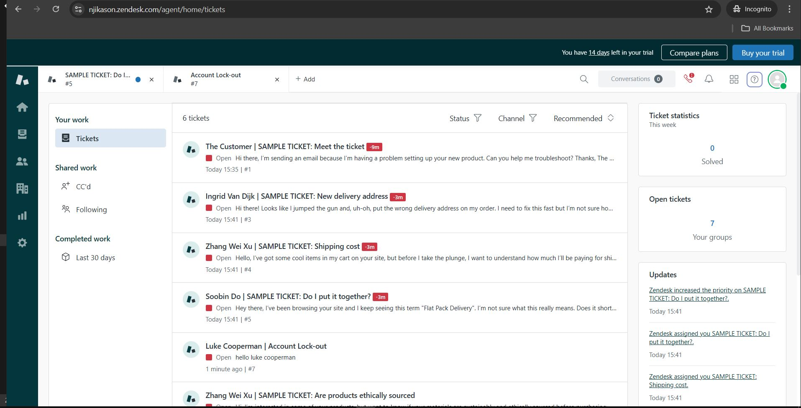
- **Always update your tickets every day.**  
  (Managers check this.)

- **Always communicate with the client after closing a ticket.**  
  Don’t just close the ticket because you feel like it.
---
## Creating and Managing Tickets

1. Navigate to **Zendesk Views** → Add a **ticket**.
2. Fill in the following details:
   - **User**: (Name)
   - **Assigned to**: Self
   - **Tags**: Add tags for easier search
   - **Type**: Incident
   - **Priority**: (Urgent, High, Normal, Low)
   - **Subject**
### Example Scenario:

- User sent an email about **account lockout** after multiple attempts.
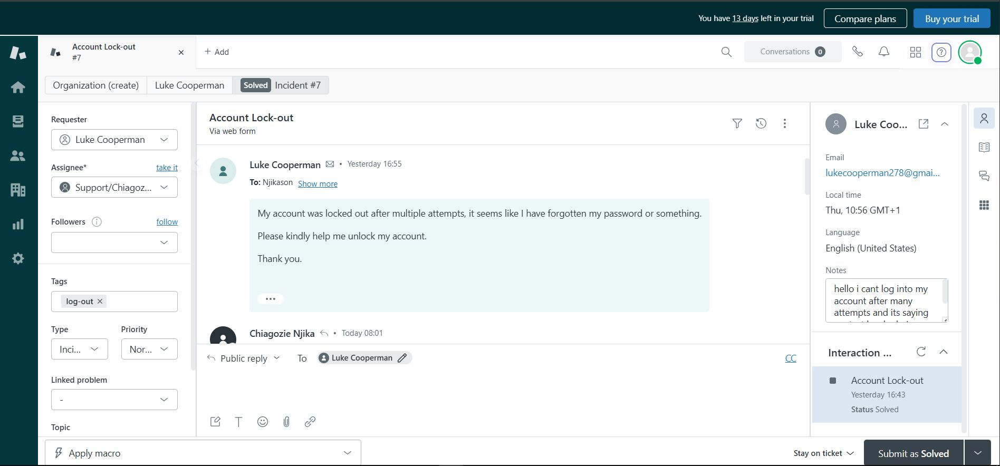
- Reached out to the user, confirmed receiving the ticket and **further steps**.
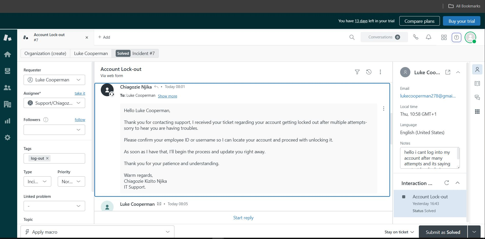
- Took action immediately and **unlocked the account** using **Active Directory Users and Computers**.
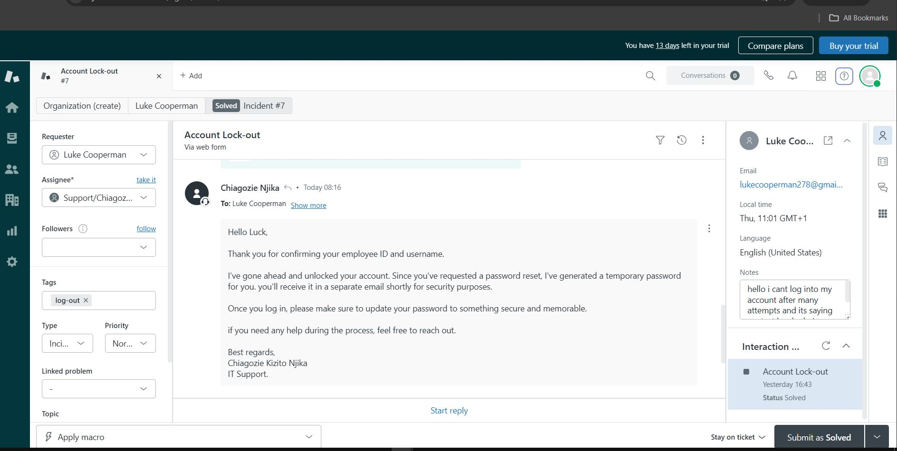
- Added my **ticket notes** and submitted the ticket as **Solved**.
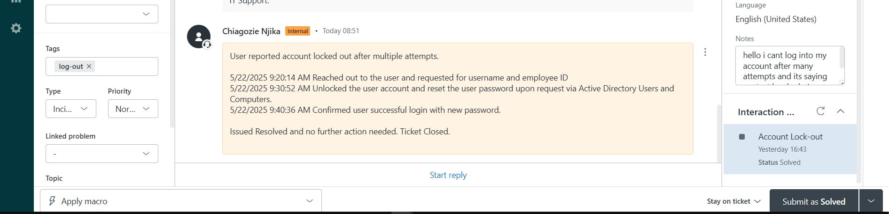
---
# Ticket Management Tips

This helps IT Support or Customer Service Teams manage tickets and provide better support based on group context.
## As a Help Desk Agent (non-admin) using Zendesk
My focus is solely on efficient handling of tickets, documenting well, and providing excellent support.
### Internal Notes
- Use internal notes for logging actions without the user seeing.
- Internal notes are really important to reference back in case the same issue should arise.
- It also helps you follow agents on steps taken to resolve an issue.
- Managers use it to track performance.
### Ticket Fields
- Understanding ticketing system in IT is very important from: Priority, Type, Tags, Group, Assignee.
# Additional Ticket Handling Best Practices

-  I document steps taken, tools used, and resolution steps.  
- Add timestamps if required by your team.  
-  Stay professional, polite, and helpful.  
- Thank the user, apologize where needed, and set expectations
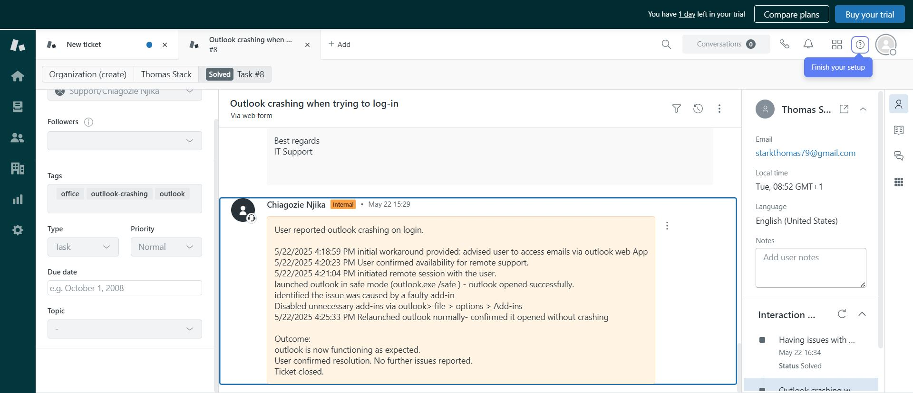
---
## Creating New Ticket for End User

- **User reports**: System has fallen off the domain while trying to log in.
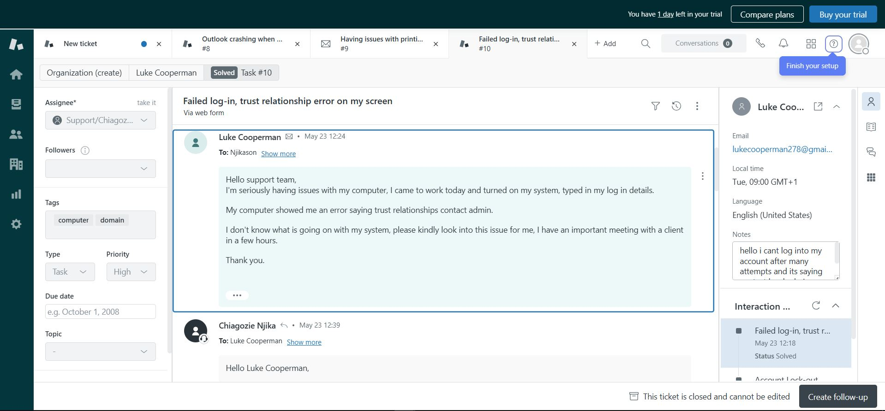
- Reached out to the user and assigned the ticket to myself.

- Set **urgency high** and **type** as Task.
- Verified the issue by remoting into the user’s account.
- Removed and re-added the PC to the company’s domain.
- Reached out to the user to confirm the issue has been resolved.
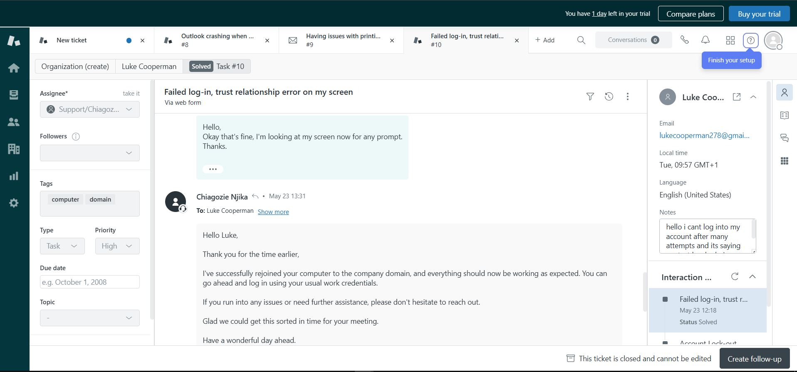
- Updated the **work note** (internal notes). 
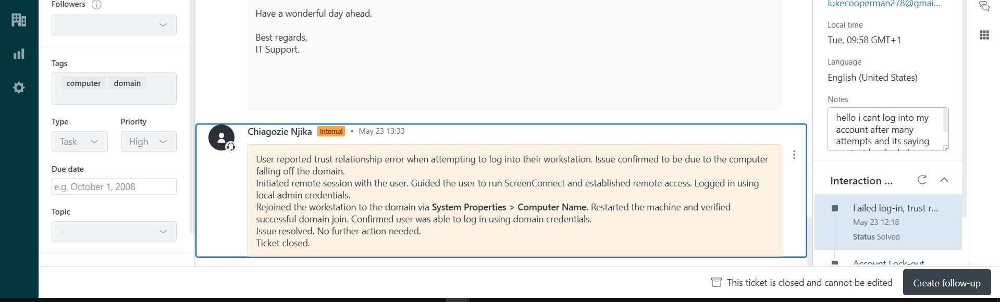
- **Closed the ticket**.
# Handling a Ticket Using Zendesk

-  **User reported** having issues with a printer.
-  **Assigned to Support group** (re-assigned to self).  
-  **Reached out to the user**, acknowledging receipt of the ticket.  
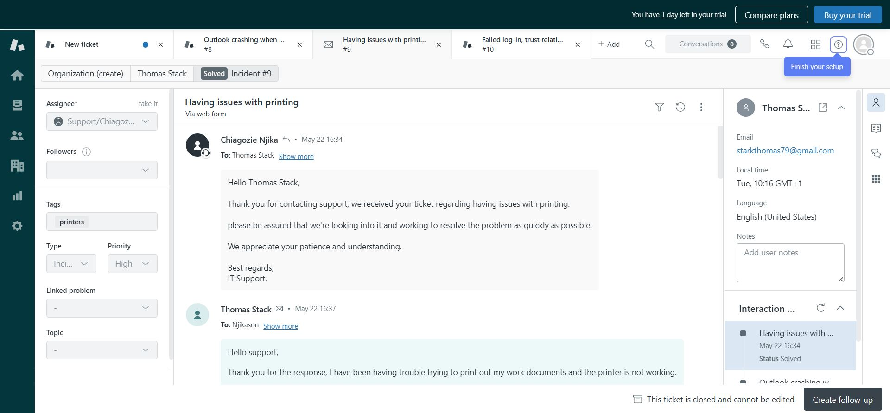
- **The user reported** it might be a general issue with the printer.  

-  Turns out it has to do with **Spooler error**.  
-  **Resolved the issue** and instructed the user to try printing a document. 
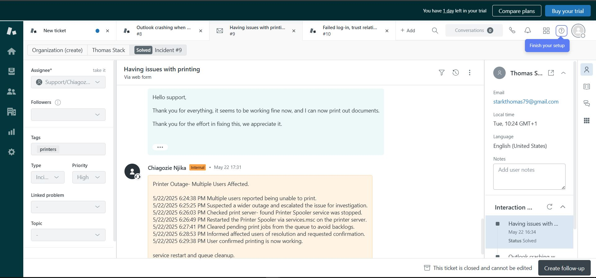
-  **User was able to print**; issue has been resolved.  
-  Updated my **work notes** on steps taken to achieve a resolution.
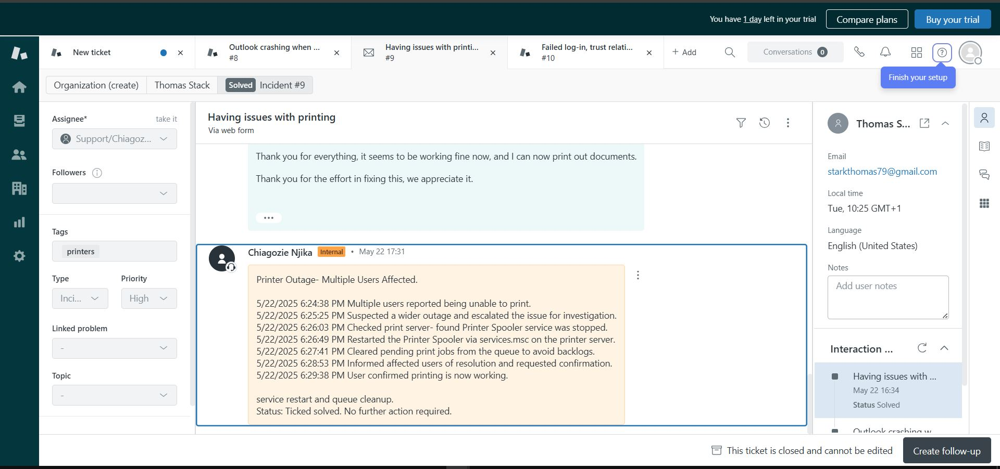
-  **Closed the ticket**.

---
# Handling a Task Request from My Supervisor

-  **supervisor/manager requested** to onboard a new employee and set up the necessary account.  
-  **Supervisor created a ticket** to onboard and set up the account.  
-  Ticket like this **usually comes with low priority** since it's not affecting productivity. 
-  Usually comes as a **task to complete with a deadline**.
- Set up the user account, add to relevant group, set right permissions and outlook

 