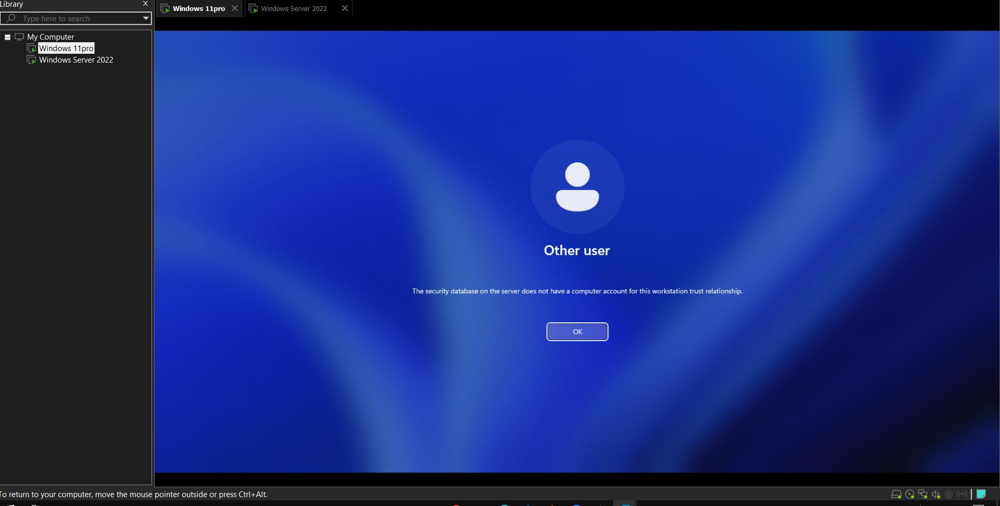

# Domain Trust Relationship Failed

## Description
Domain trust relationship failure usually means that the computer’s secure connection to the domain has been broken, which is commonly referred to as the account "falling off" the domain.

### This often happens when:
- The computer was disconnected from the network for too long.
- An IT person restored an old system image or cloned a machine without properly rejoining the domain.

---

## How to Fix It

1. Log in with a **local admin account** (e.g., `ComputerName\localadmin` and password).
   > Now you can access the computer as a local admin user.

2. Go to **File Explorer** → Right-click on **This PC** → **Properties**  
   → **Advanced system settings** → **Computer Name** tab  
   → Click on **Change**.

3. Set to **Workgroup** (type any name like `Workgroup`) → Click **OK** → **Restart**.

> **Note:** You will get a prompt to enter the username and password of the administrator.

## Rejoin the Domain

1. **Log back in with your local account**  
   → Go to **File Explorer**  
   → Right-click on **This PC**  
   → Click **Properties**  
   → Go to **Advanced System Settings**  
   → Select **Computer Name** tab  
   → Click on **Change**.

2. **Rejoin the domain**  
   → Select **Domain**  
   → Re-enter the domain name  
   → Enter **Username** (e.g., `administrator`) and **password**.

3. **Restart the computer**  
   > The computer has now been re-added back to the domain.

---

### NOTE:
- Check if the **computer name** is now showing in **Active Directory Users and Computers** under the **Computers** container.
