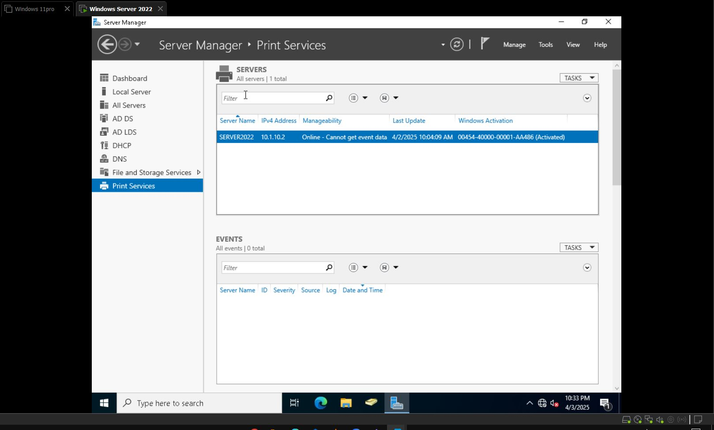
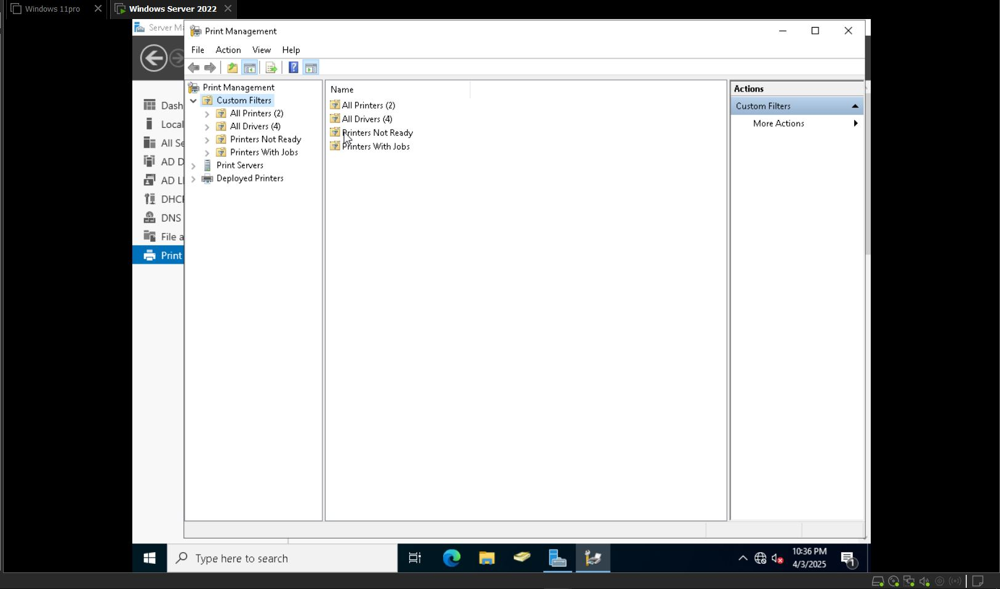
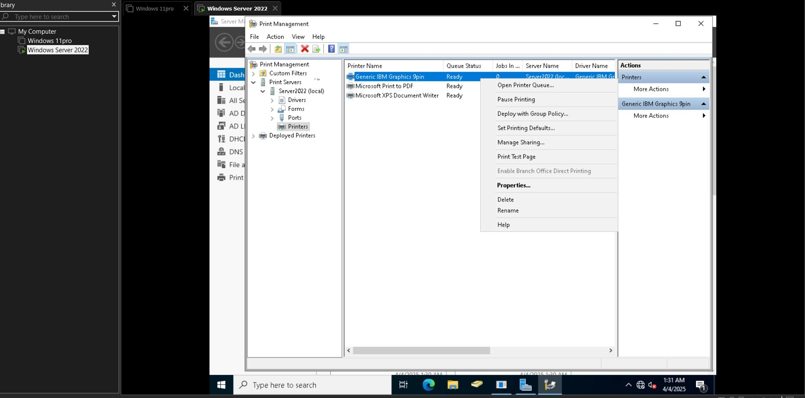
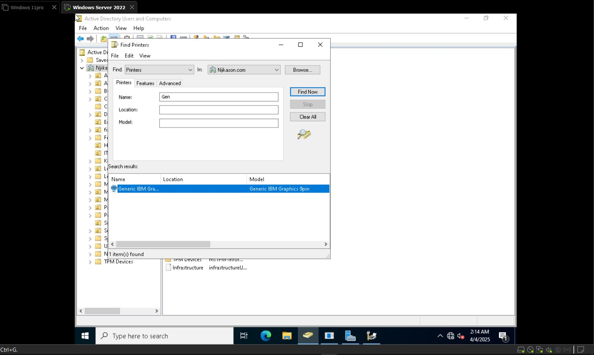
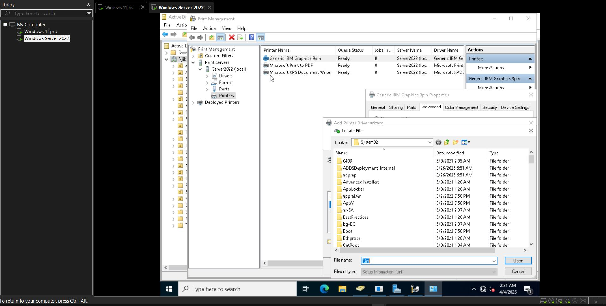

# Printer Setup on Server 2022

Printers are often set up on servers in business environments for centralized management. It allows IT administrators to manage all network printers from a single location, monitor them, and troubleshoot issues.

---
## Setting up a Print Server on Windows Server

1. Open **Server Manager**
2. Go to **Add roles & features**
3. Select **Role-based or feature-based installation**
4. Choose the **Server**
5. Under **Server Roles**, select:
   - **Print and Document Services**
6. Add required features
7. Under **Role Services**, select:
   - **Print Server**
8. Confirm and Install

---
## On the Server Manager:

Navigate to:  
**Tools → Print Management → Print Servers → Server 2022 (Local)**

### Components:
- **Drivers**:  
  Software that allows the server to communicate with different printer models.
- **Forms**:  
  Predefined paper sizes and layouts (e.g. A4, A3).
- **Ports**:  
  Lists printer ports, which determine how printers connect to the server.
- **Printers**:  
  This section displays all installed and shared printers, including their status (Online, Offline, or Experiencing Errors).
# Creating a Printer on Windows Server

## Add a New Printer

1. Right-click on **Printers** → **Add Printer**  
2. Choose:
   - Use an existing port **or**
   - **Install a new driver**
3. For installation:
   - Select the printer **or**
   - Install from disk using the CD/disk path
4. Enter:
   - **Printer name**
   - **Sharing** (Uncheck if you don't want to share yet)
5. Click **Next → Finish**

---
## Configure Printer Sharing

1. Right-click the printer → **Properties**
2. Go to **Sharing** tab:
   - Check **Share this printer**
   - You can list it in the directory to show on **Active Directory**
   - Click **Apply** and **OK**

---
## Set Printer Permissions

1. Go to **Security** → **Advanced**
2. (This is for granting & removing permissions for people or groups who can access the printer.)
3. Remove **Everyone**
4. Click **Add** → **Select a principal**
5. Add a group (e.g., **HR**, **IT**, or any organization-specific group)
6. Click **Apply** and **OK**

---
## Active Directory Listing

- Use "List in the directory" to publish printers to **Active Directory**

---
## Confirm Printer on Client Computer

To verify the printer is showing on a client machine:

1. Log into the **client computer**
2. Search for **Control Panel**
3. Navigate to:
   - **Hardware and Sound → View Devices and Printers**
# Add a New Driver to the Printer

1. Go to **Tools** in **Server Manager** → **Printer Management**
2. Under **Print Servers**, right-click on the printer name → **Properties**
3. Uncheck **List in the Directory** (temporarily)
4. Remove **Everyone** (connected to the printer)
5. Go to **Advanced** → **Driver**:
   - Select the printer → **Next/Next**
   - Welcome Wizard → Ports → Driver Selection
6. Select the **Manufacturer**
7. Choose **Have Disk** → Click **Browse** to find the driver and **Install**
8. Go back to **Sharing** and check **List in the Directory**
9. On the client machines or groups:
   - Remove and re-add the printer against start printing issues

---
# Network Printer Configuration

## How to Set Up a Network Printer

1. Navigate to the **DHCP Server** from **Server Manager**:
   - DHCP Server → IPv4 → Scope
1. **Setting up a Scope (IP Range)**:
   - Example Range: `10.1.10.41` to `10.1.10.50`
1. Click on **Reservations** → **New Reservation**
   - Enter **Reservation Name**: `Printer1` (or as needed)
   - Enter **IP Address**: `10.1.10.15`
