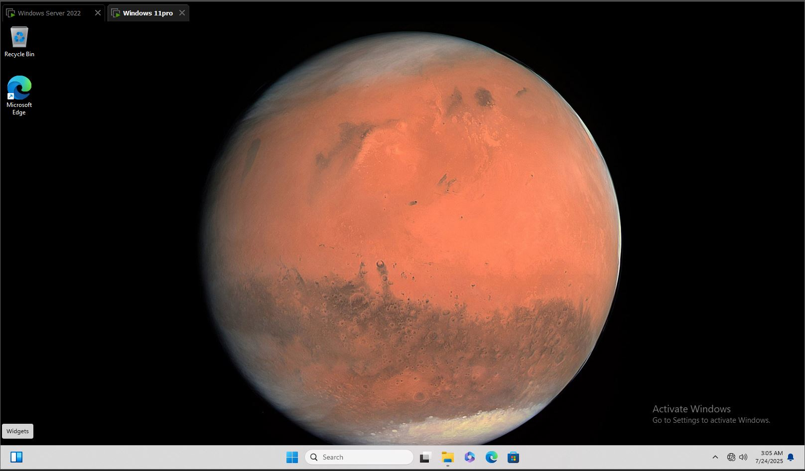
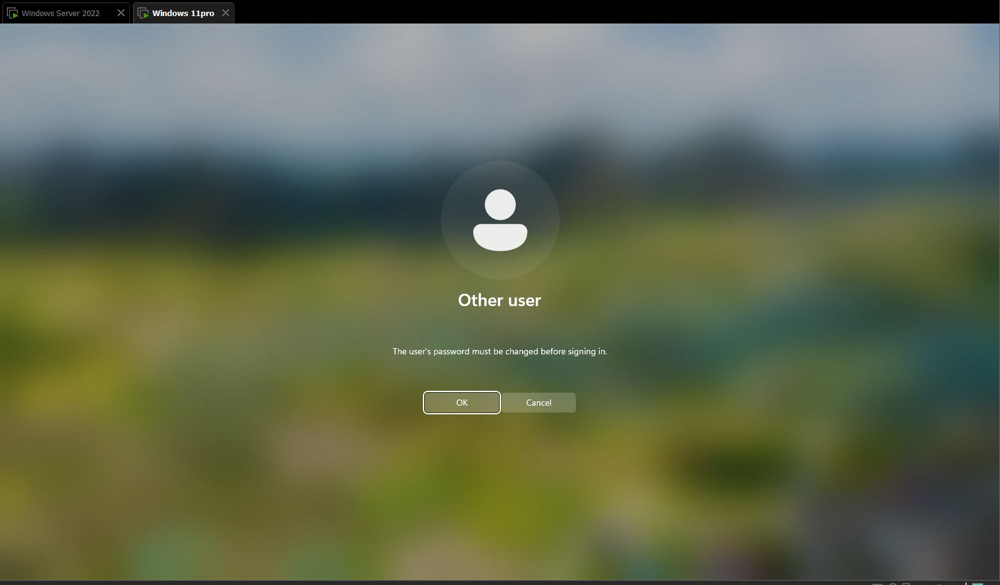
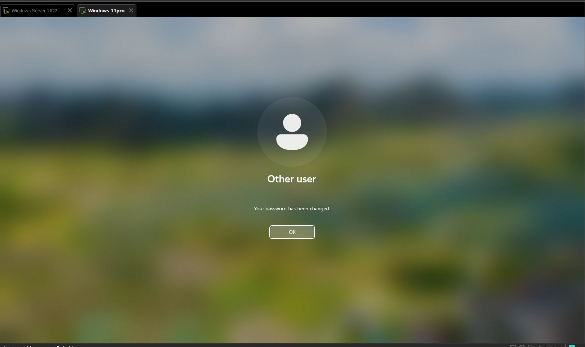
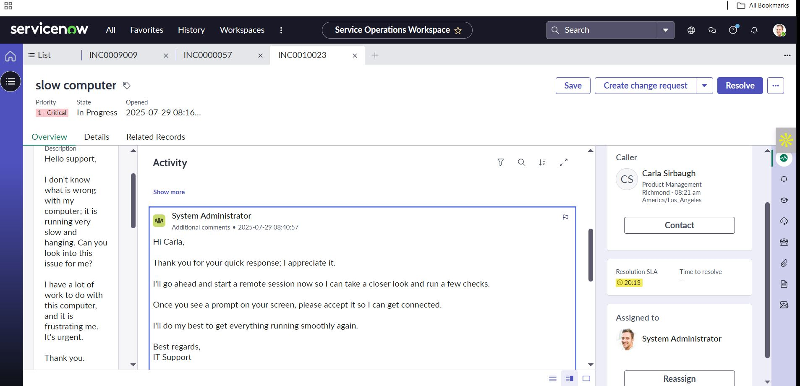

## IT Troubleshooting & Common Issues

- Troubleshooting steps used to solve IT issues, helping users stay productive whether it’s password reset issue, account lock-out, computer doesn’t work.
- Knowing how to troubleshoot is very important and a success factor in any IT career.
---
## Troubleshooting IT Issues

### Locked Account - User Cannot Log In
- User reached out support that account has been locked and can’t log in.

- Receive the ticket, head over to **Active Directory Users & Computers**:
  - Find → Type in user log-in name → Account →  

  - Unlock account: check the box, then apply and OK.

- Confirm: The account has been unlocked.

---
### Password Reset - User Forgot Password
- User needs a password reset and can’t log in.
- Reach out to the user → Verify identity → Ask for user log-in details.
- Navigate to **Active Directory**:
  - Right-click on the domain → Click on *Find*
  - Entire directory → Type the name →

  - Right-click → Reset password → Provide a temporary password
  - Check “User must change password at next logon” → OK.

- User logs in with the new password after changing it.

---
### Outlook Crashing When Sending Email
- Outlook keeps crashing when opened and trying to send an email.
- Web version works fine.
- Outlook wasn’t properly set up on the user’s workstation:
  - Log out and sign in again.
- Another fix:
  - Check the email and account to see if an account created for emails
  - Go to the search bar and type email & account, add a work or school account. This should fix the problem.

---

---
## Unable to Access the Shared Folder

### User: David Miller

- User reported: "Unable to access the shared folder, please provide access."
- Reached out to the user to get a better understanding of the problem.

- Asked a few questions such as:
  - "Have you accessed the folder before?"
  - "Which shared folder do you need access to?"
- User replied that he had access before but can't find it now.
- Identified the folder as the Finance network drive.

### Resolution Steps

- Reached out to the user to remote in and map the network drive to restore access.
- Navigated to the file server:
  - `This PC > Local Disk C: > FinanceNetworkDrive`
  - Right-click on the folder → Properties → Sharing → Got the network path
- Remoted into the user's computer:
  - Opened File Explorer
  - Right-clicked → Map Network Drive → Entered network path

- Email sent to the user to confirm access was restored and the user was satisfied.

- Updated my ticket note

---
## Issue: User Unable to Access Team File Share

### User: Rick Benzle

- User reported: "I can access my personal folder, but can't access my team's folder on the file share."

- Reached out to the user to confirm access is denied when trying to open the folder.

- User replied: "I do get access denied. I contacted HR and told my manager. I need access now."
- Called the manager and got approval (confirmed by me).

### Resolution Steps

- Navigated to the target folder on the file server:
  - `\\Server2022\HR \Team Files`
  - Right-clicked the folder → Selected Properties → Navigated to the Security tab
  - Clicked Edit → Added the user's name and granted appropriate permissions

  - Clicked Apply and saved changes

- Reached out to the user and asked them to check again.

- User confirmed access to the team folder.

- Updated my ticket note and closed the ticket.

---
## Outlook Crashes on Launch

- User reports: "Outlook crashes when I open it, but the web version works fine."
- Reached out for support, asked the user to connect to their workstation to find the root cause.

- Initiated a remote session with the user (email or TeamViewer), watched out for any prompt to connect to their session.

### Solution
- Press `Windows + R` → Type `outlook.exe /safe` → Press Enter.
- Outlook opens in **Safe Mode**, indicating the issue is likely due to an **add-in** or **profile**.
- Go to: Outlook → File → Options → Add-Ins → Click "Go" (at the bottom of the window).
- Ask the user which add-ins are unnecessary → Remove them all

- User logged off and back in. Outlook seems to be working fine.
## Outlook Issue - Additional Steps
- Also tried to repair Office installation.
- Closed the TeamViewer session → Session ended.
- Sent an email to the user to confirm Outlook is working before closing the ticket.
- Issue resolved.

---
## Internet Intermittency Issue
### Reported By: Emma Baker
- User reported having issues with the internet.
- Connection drops or becomes unstable at random times.
### Common Causes Considered
- Weak Wi-Fi signal.
- Faulty Ethernet cable.
- ISP issues.
- Network adapter
- Reached out to user via HaloPSA, trying to get more information before troubleshooting.

- User said it’s only affecting her, and she is the only one using the connection.
- Instructed the user to reboot her system (and check any backup app). Sometimes a reboot solves the problem.

### User Response

- User confirmed: "Oh! It's working. Looks like it is working now , My system hasn't been rebooted for a while now.

- Initiated a remote session and confirmed everything is working fine.
- Thanked the user for being patient throughout the process and documented everything.

### Issue: Help Connection Seems Slow

- User reported help connection seems slow, webpages are taking a long time to load.
- Reached out to the user to ask a few questions to understand more about the problem.

- User reported they tried rebooting and still getting slow connection.
- Replied to initiate a remote session and troubleshoot.

- Troubleshot the issue, did the following:
  - Recreated the problem
  - `ipconfig /release` & `renew`

  - Enabled and disabled network adapter
  - Confirmed network signal
  - The user confirmed network strength has improved

- Updated the ticket note.

---
### Issue: Slow Computer

- User reached out to support about slow computer issue and marked it urgent.

- Reached out to the user, empathized, and requested a remote session to take a closer look.

- Initiated a remote session with the user (call), remoted into the computer.

- Entered the Task Manager:
  - Found background consuming high resource

  - Disabled unnecessary startup apps

  - Cleaned temporary files on the C: drive
  - Adjust for best performance on the advanced setting on settings
![]
- Ran malware scan and ensured Windows is updated.

- Emailed the user and updated my ticket note.

## New Hire Set-up

### Scenario:
HR Manager submits a ticket asking IT to provision a new user who starts next Monday.
### Steps:
- Open **Active Directory Users & Computers (ADUC)** →  
  Right-click the appropriate OU (New User)
- Enter first name, last name  
  Username (First name with last name)  
  Set user must change password at next login  
  Click Finish

---
## Add to Group (Project Design)

- Right-click on the user → Properties → Member Of  
  Search for the group and add the user → Apply

---
## Shared Drive Access

- If access is needed to **Project Design**,  
  Add to the corresponding AD group that maps to the share  
  Add to local PC, connect to the system, and map the drive.

## Email Group / Teams

- I will go in and add the user to the necessary groups and Microsoft Teams.  
  (To receive emails, onboarding process, and the rest)
---

## Net User  / Domain 

`net user RickB /domain`

- Shows **detailed information** about the domain user 
    
    - Account status (active/locked)
        
    - Group memberships
        
    - Last password change and expiration

## Microsoft Excel Issues
### Scenario:
User submits a ticket that Excel won’t open or crashes when opening a file.
### Steps:
- Reach out to the user (empathy) → Ask the following:
  - Is it happening with a specific file or all files?
  - Try opening Excel in Safe Mode:  
    Press `Win + R` → Type `excel /safe` → Enter
### Disable Add-ins
- File → Options → Add-ins  
- At the bottom, manage → COM Add-ins → Go → Uncheck all  
- Restart and see if it solves the problem
## Repair Office
- Go to Control Panel → Programs → Installed Apps  
- Find Microsoft 365 or Office → Modify → Quick Repair  
  - If it didn’t solve the issue, do Online Repair
- Install **SARA** Repairs from Microsoft and run a quick repair
