## What is Active Directory?

Active Directory (AD) is a Microsoft directory service used in Windows Server environments to manage users, computers, groups, and other network resources.  
It helps organizations:
- Control access to resources  
- Enforce security policies  
- Simplify administration  
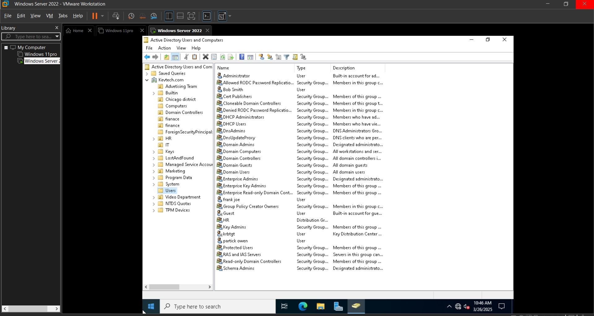

---
## Active Directory Domain Services Installation

**Before you begin:**
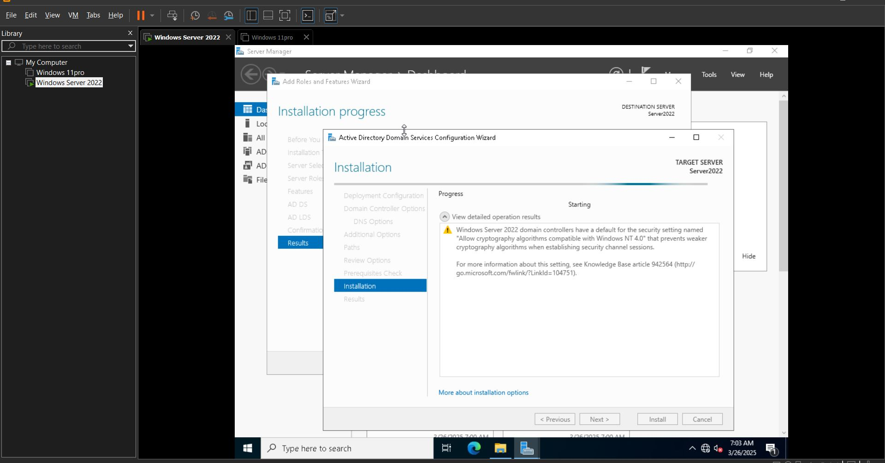
1. Open **Server Manager**.
2. Click **Next**.
3. Select **Role-based or feature-based installation**.
4. Click **Next**.
5. Click on **Active Directory Domain Services**.
6. Click **Add Features**.
7. Click **Next**, then **Install** (wait for it to succeed).
8. Click **Promote this server to a domain controller**.
9. Select **Add a new forest**.
10. Enter the **Root domain name** (e.g., `Njikason.com).
11. Create a password (e.g., `Capital123).
12. Click **Next**.
13. Wait for **Prerequisites check**.
14. Click **Install**  it will restart your computer.

> **Note:** Active Directory Users & Computers are now installed in the server.

---
## Creating a New Account in Active Directory

1. From the **Start Menu**, click on **Windows Administrative Tools**.
2. Go to **Active Directory Users & Computers**.
3. Right-click on **Users**.
4. Scroll down to **New** → **User**.
5. Fill in:
   - User's name  
   - Password (check "User must change password at next login")  
6. Click **Finish**.
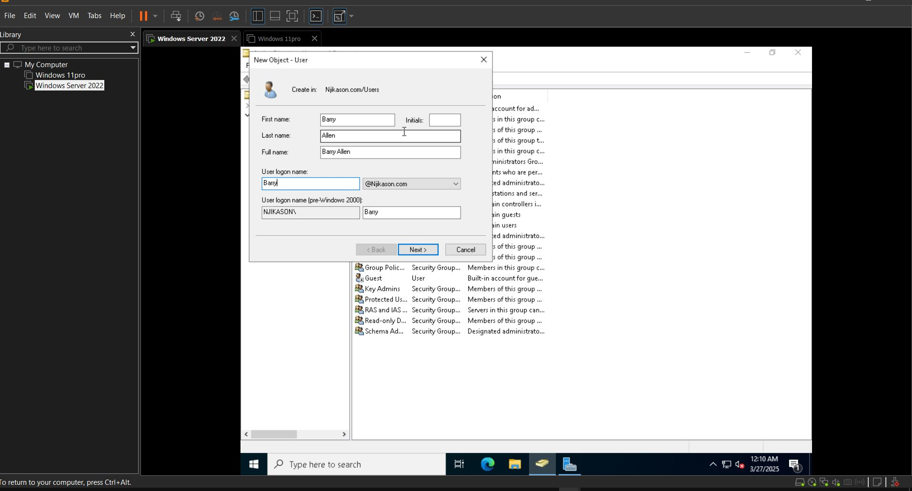
---

## Show More Details About a User

If you want more features displayed (like showing more details about a user):

- Right-click on **View** (in the top menu).
- Scroll down to **Advanced Features** and check it.

---

## How to Find a User, Contact, and Groups in Active Directory

- Open **Active Directory Users & Computers**.
- In the left-hand panel, select your domain (e.g., **Njikason.com**).
- Go to the **Find** option.
- Select the object type (User, Contact, or Group).
- Set the location to **Entire Directory**.
- Type the name or description of the object.
- Click **Find Now**.
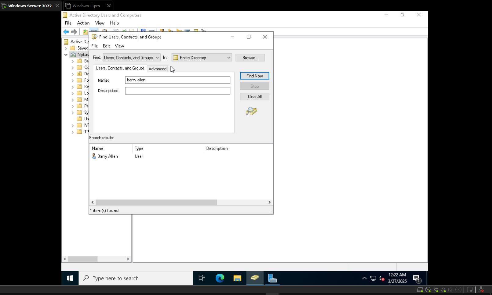
---

## Enable Recycle Bin in Active Directory

1. On your **Start Menu**, click on **Active Directory Administrative Center**.
2. Select your **Domain Name** (e.g., **Njikason.com**).
3. On the right-hand pane, look for **Enable Recycle Bin for Domain Level**.
4. Click to enable. You’ll get a prompt → Click **OK**.
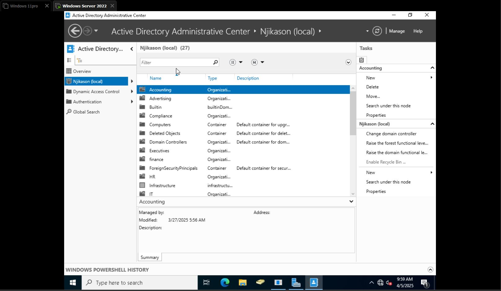
> This allows you to retrieve accidentally deleted accounts or objects using the Recycle Bin.

---

## Using the Copy Method

- **Copying a user account** gives you the ability to fast-track account creation—especially when the new user should have similar group memberships and permissions as an existing user.
- This is useful when the user belongs to the same groups, OUs, etc.

### Steps:

1. Right-click on the existing user.
2. Select **Copy**.
3. Enter a **New Username** and **Password**.
4. Click **Next**, then **Finish**.
5. check the members of and the new users has the same memberships and groups as the former.
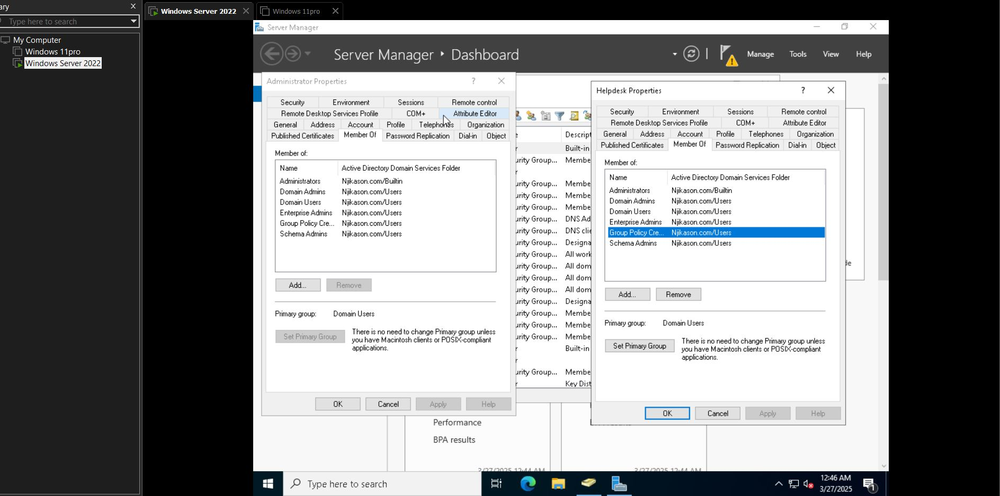
> Now both users have the same privileges and are members of the same groups.

---

* **Creating an Organizational Unit in Active Directory**

- Start Menu → Active Directory Users & Computers → Navigate to your domain Controller (**Njikason**)  
Right click on it → New → Organizational Unit → Name it (HR) and OK.
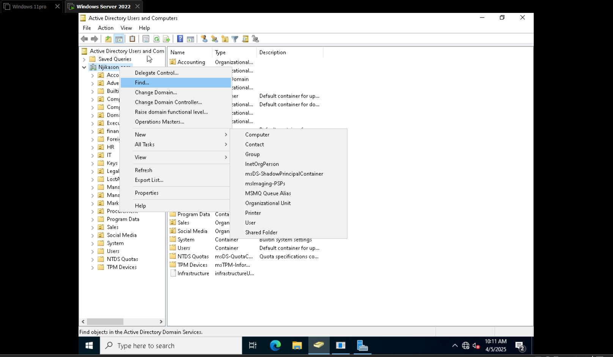

# Attribute Editor

- Displays detailed properties on an object that are not visible with standard GUI tabs.
- **Steps to Access:**
  - Open **Active Directory Users & Computers**.
  - Click **View** > Enable **Advanced Features**.
  - Navigate to the desired object (User, Computer, Group).
  - Right-click the object and select **Properties**.
  - Click on the **Attribute Editor** tab.
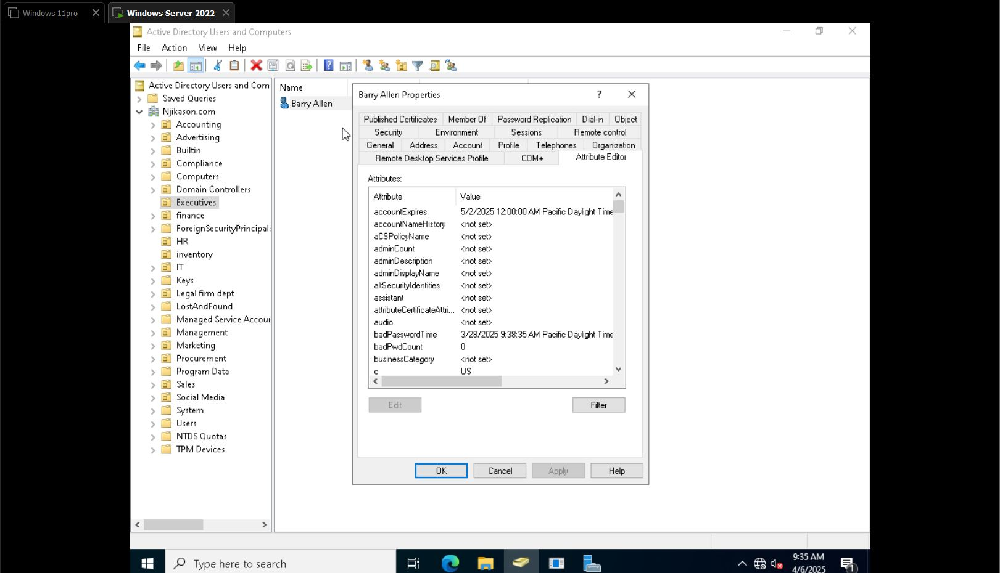
---

# Creating Groups in Active Directory

## Group Scope

- **Universal**: Account from any domain in the same forest.
- **Global**: Account from the same domain.
- **Domain Local**: Account from any domains or any trusted domains.

## Group Type

- **Security**: Used to assign permissions to shared resources.
- **Distribution**: Used to create email distribution lists (used to send email to a collection of users by using an email application like Exchange Server).
---
# How to Create a Group and Add Members in Active Directory

## Step 1: Open Active Directory Users and Computers (ADUC)
- Press `Win + R`, type `dsa.msc`, and press `Enter`.
- This opens the **Active Directory Users and Computers** console.

## Step 2: Navigate to the Desired OU (Organizational Unit)
- Browse to the **Organizational Unit** where you want to create the group.
- Right-click the OU → Select **New** → Click **Group**.

## Step 3: Configure the Group
- **Group Name**: Enter a name for the group (e.g., `Senior Engineers).
- **Group Scope**: Choose one of the following:
  - **Global** (default for user groups)
  - **Domain Local**
  - **Universal**
- **Group Type**:
  - **Security** (used for permissions)
  - **Distribution** (used for email distribution lists)

Click **OK** to create the group.
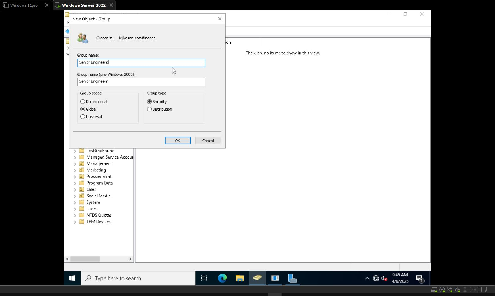

---

## Step 4: Add Members to the Group
- Right-click the group you just created → Click **Properties**.
- Go to the **Members** tab → Click **Add**.
- In the dialog box, type the names of users you want to add.
- Click **Check Names** to verify → Click **OK** to add the users.
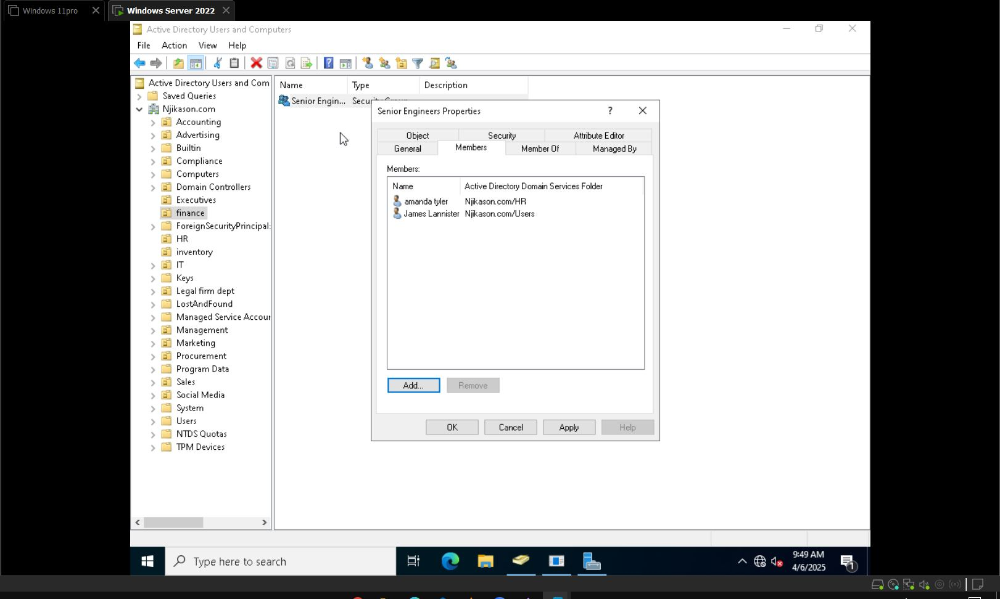
##  Verify Group Membership
- Open a user’s properties → Go to the **Member Of** tab to see their group memberships
---
## How to Reset Password on Active Directory:

1. Navigate to **Windows Admin Tools** from the Start menu.
2. Open **Active Directory Users & Computers** > select **Domain**.
3. Right-click > Find > **Enter Directory**.
4. Type the name of the user and find the name.
5. Right-click on the user > **Reset Password**.
6. Enter new password and confirm it (Reset & OK).
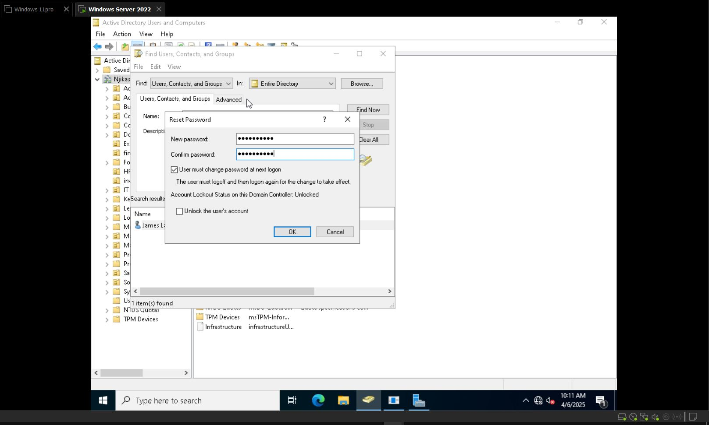
> The user account password has been reset.

---

# Unlocking a User in Active Directory

## How to Unlock a User from Active Directory:

1. Go to **Active Directory** > Domain.
2. Right-click and search for the user (or their OU or group).
3. Select the correct entry in **Entire Directory**.
4. Type the name correctly > tap on the user.
5. Go to **Account** tab.
6. Check **Unlock Account**.
7. Click **Apply** and **OK**.
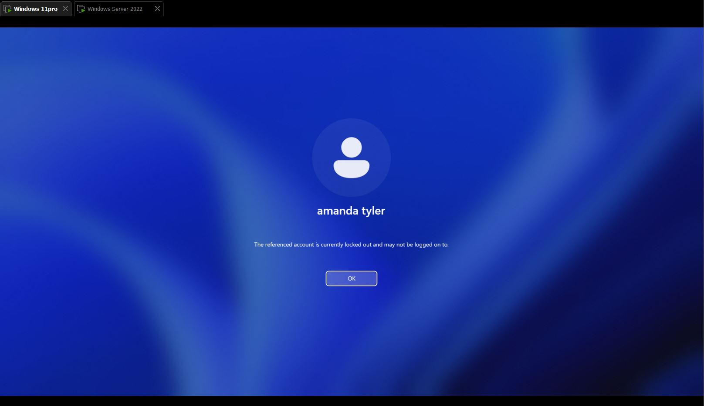
> The account has been unblocked and the user can now log in.
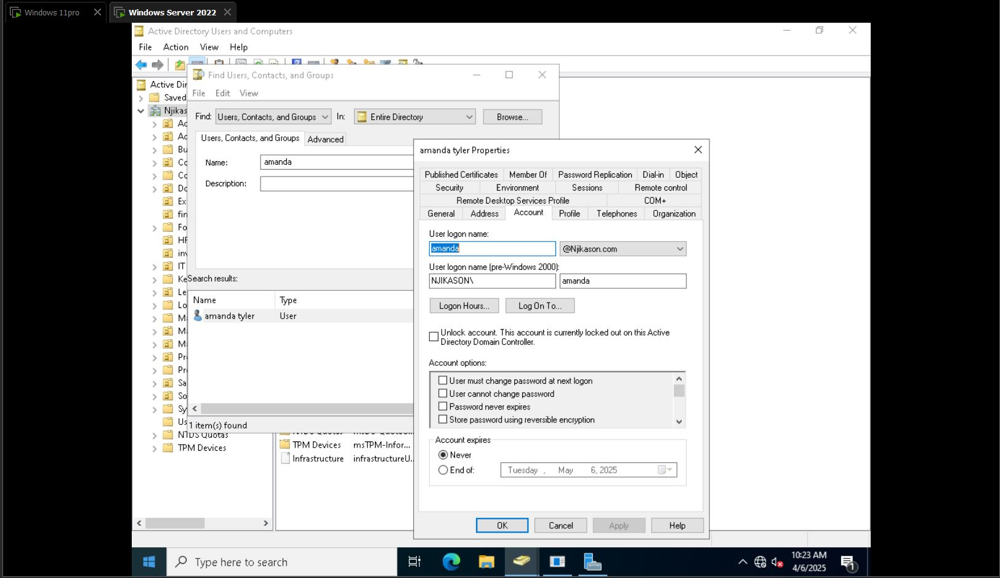

---

# Disabling and Enabling User Accounts

- You can **disable an account** by right-clicking on the user profile in **Active Directory** and selecting **Disable**.
-  To **enable** the account, perform the same steps and select **Enable**.
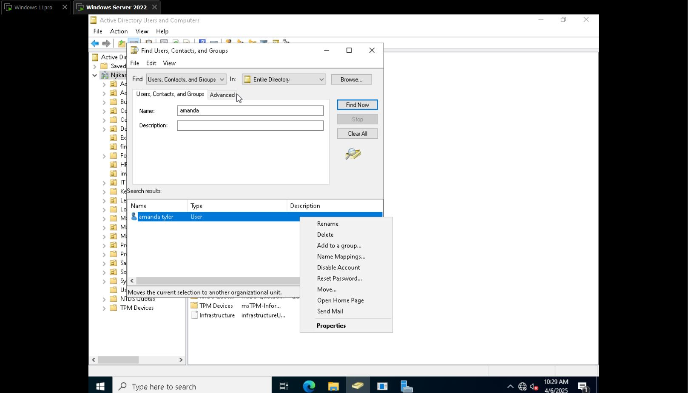

---

## Account Expires on Active Directory

**Steps to fix an expired account:**

1. Go to **Active Directory**.
2. Click on the domain to find the user or go to the **OU** where the user is located.
3. Click on the **User**.
4. Go to the **Account** tab.
5. Look for **Account Expires** (shows a date when an account expires).
6. Reset the end date according to the **Company policy**.
7. Click **Apply** and **OK**.
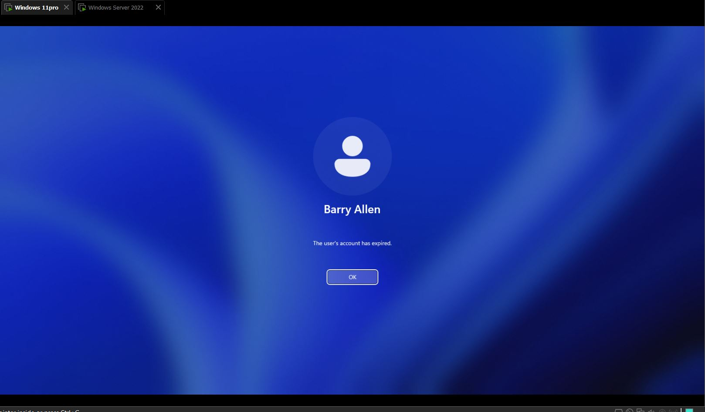
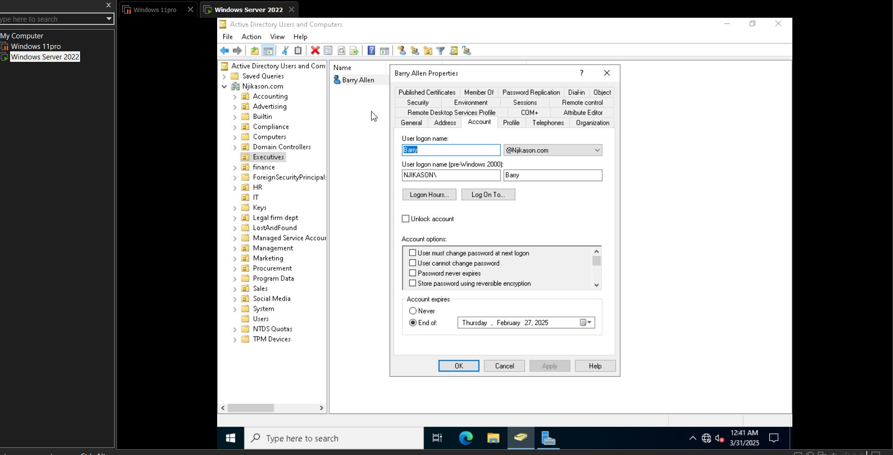
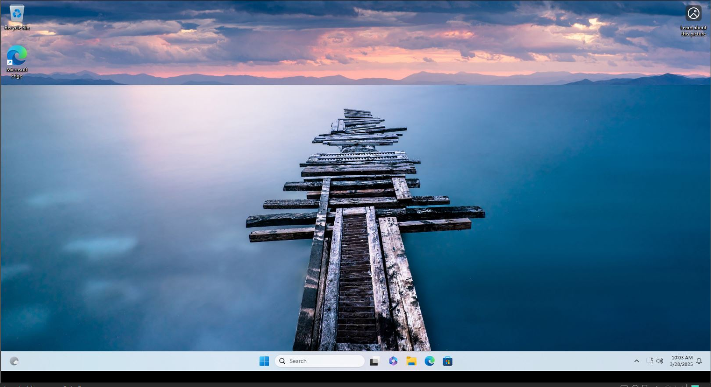
> Now the user account will be functional again. it is bad practice to use never for account expires.

- Computer added to the domain shows in Active Directory:  
  Go to **Active Directory → Computers** → You can see the desktops all added.

- Right-click on the computer → **Properties → Attribute Editor** → This gives an overview of last logon & last logon timestamp.
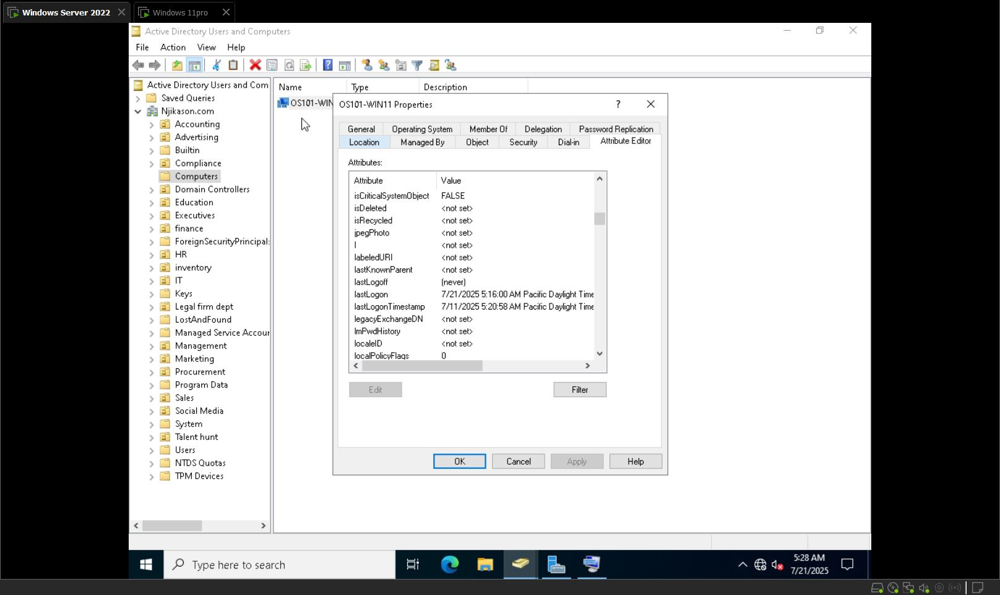
- Managing the computer from Active Directory:  
  Go to **Users** → Right-click → **Manage** → You can view the local users (Computer Management).

- **3389** port is used for Remote Desktop.

- Add the computer to a group (e.g., HR):  
  This is a distribution of group policy.  
  Add the computer to HR group → The computer gets every policy from the HR group to the computer.

---
## Creating a New User Account on Active Directory

- Go to **Users → Right-click → New → User**
- Scroll down to user
- Add the username (Login name)
- Add temporary password
- Finish

---
## Moving the User to a Different OU

- Right-click on the user → **Click on Move** → Select the container → Click OK.
