## What is a File Server?

A file server is a computer or server that stores files in one central place and lets other computers access those files over a network.

A file server also controls who can access which files, lets multiple users access files at the same time, and keeps files available even if someone's computer is turned off.

This is how a file server works in Active Directory.

The key components include:

- Domain Controller (DC), which runs Active Directory.
- Stores user accounts, groups, and permissions.
- Authenticates users when they log in.
---
# Getting Started with File Server

Go to the server and open **File Explorer**.

- Navigate to the **C:** drive.
- Create a new folder called **Company Data**.
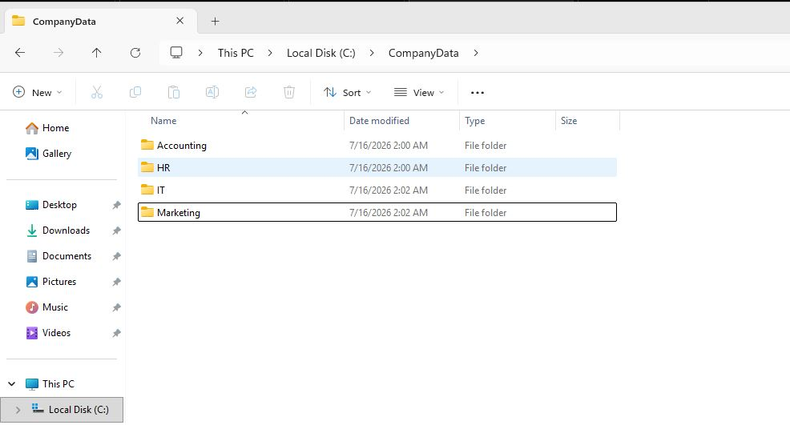
- For this lab practice, create four department folders:
  - HR
  - IT
  - Marketing
  - Accounting

After creating the folders, continue with Active Directory configuration.

---
# Create Security Groups in Active Directory

Navigate to **Windows Server 2025**.

- Open **Server Manager**.
- Click **Tools**.
- Select **Active Directory Users and Computers**.
- When Active Directory opens, expand your domain.
- Browse to the **USA OU**.
- Open the **Users** OU.
- Create security groups for each department folder:
  - Accounting
  - HR
  - IT
  - Marketing

These security groups will later be used to assign folder permissions instead of assigning permissions directly to individual users.

---
# Add Users to Security Groups

Add users to their appropriate department security groups.

Example:

- Add Accounting users to the **Accounting** security group.
- Add HR users to the **HR** security group.
- Add IT users to the **IT** security group.
- Add Marketing users to the **Marketing** security group

Open the required security group.

Example:
- Open the **Accounting** security group.
- Select the **Members** tab.
- Click **Add**.
- Type the username.
- Click **Check Names** until the user is resolved.
- Click **OK**.
- Click **Apply**.
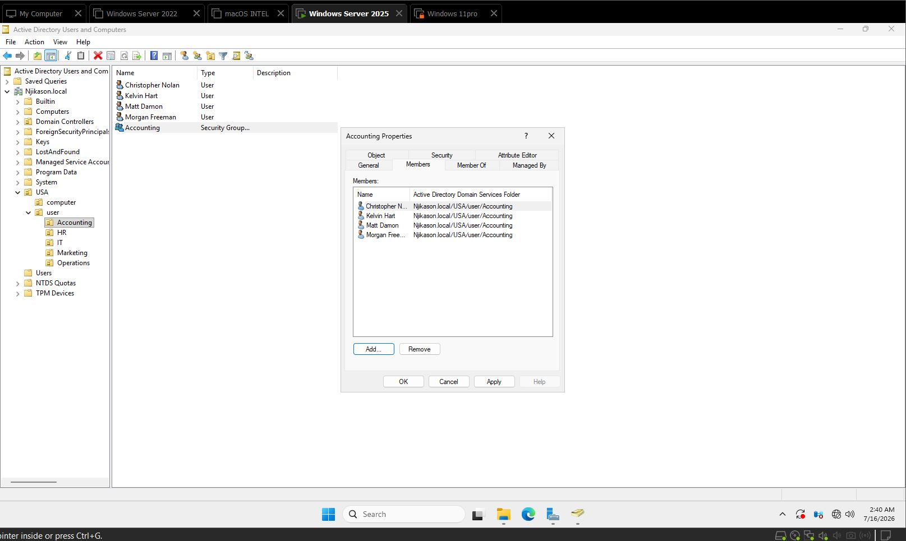
The selected users are now members of the **Accounting** security group.

---
# Windows File Permissions

In Windows environments, especially file servers and shared folders, there are two main permission types:

- NTFS Permissions
- Share Permissions

Both control who can access files and what actions users can perform. They work together but apply in different situations.

---
## NTFS Permissions

NTFS permissions are stored on drives formatted with the **New Technology File System (NTFS)**.

They apply both:

- Locally (when logged into the computer)
- Over the network

### Common NTFS Permission Levels

- **Full Control**
  - Read
  - Write
  - Modify
  - Delete
  - Change permissions

- **Modify**
  - Read
  - Write
  - Edit
  - Delete

- **Read & Execute**
  - View files
  - Open files
  - Run programs

- **List Folder Contents**
  - View files and folders inside a directory

- **Read**
  - Open files
  - View file contents

- **Write**
  - Create new files and folders
  - Modify existing files

---
## Share Permissions

Share permissions control access when a folder is shared over the network.

They only apply when users access the folder through a shared network path.

Example:

```text
\\FileServer\SharedFolder
```

### Common Share Permission Levels

- **Full Control**
  - Read
  - Write
  - Modify
  - Delete
  - Change permissions

- **Change**
  - Read
  - Write
  - Modify

- **Read**
  - View files
  - View subfolders
  - Read file data
  - Run programs

When a user connects to a shared folder from another computer, **Share Permissions** determine the user's initial level of access. NTFS permissions are then combined with Share Permissions to determine the user's effective permissions.

# Configuring NTFS Permissions

Right-click the **HR** folder inside the **Company Data** folder and select **Properties**.

The goal is to modify the permissions so that only members of the **HR** security group can access the folder.

1. Click the **Security** tab.
2. Select **Edit**.
3. Remove the **Users** group if necessary.
4. Click **Add**.
5. Type **HR**.
6. Click **Check Names**.
7. Click **OK**.
8. Select the required NTFS permissions (Modify).
9. Click **Apply**, then **OK**.
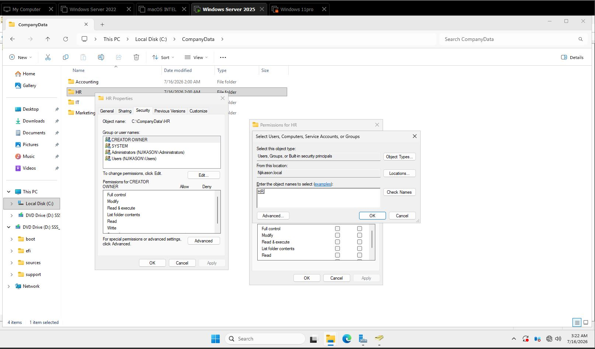

---

## Removing Inherited Permissions

Due to inherited permissions, other groups may still have access to this folder.

To ensure that only the HR team can access the folder:

1. Right-click the **HR** folder.
2. Select **Properties**.
3. Open the **Security** tab.
4. Click **Advanced**.
5. Select **Disable Inheritance**.
6. Choose **Convert inherited permissions into explicit permissions** (or the appropriate option depending on your lab).
7. Remove unnecessary entries such as the **Users** group if required.
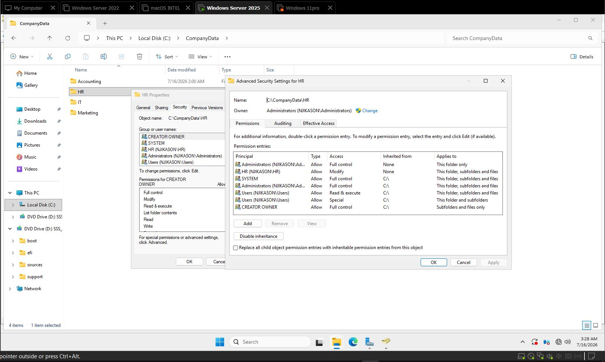
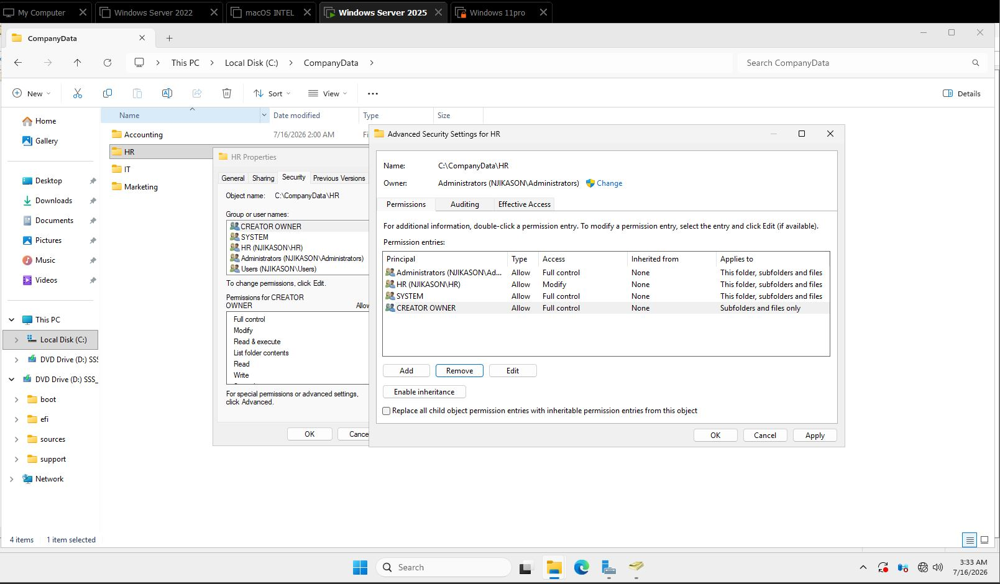

---
## Best Practice

Leave the following accounts with administrative permissions:

- Administrators
- SYSTEM
These accounts are required for Windows to function correctly and for administrative management.

Click **Apply**, then **OK**.

---
# Configuring Share Permissions

Navigate to the **Company Data** folder.

1. Right-click the folder.
2. Select **Properties**.
3. Open the **Sharing** tab.
4. Click **Advanced Sharing**.
5. Check **Share this folder**.
6. Click **Permissions**.
7. Configure the required share permissions.
8. Click **Apply**, then **OK**.
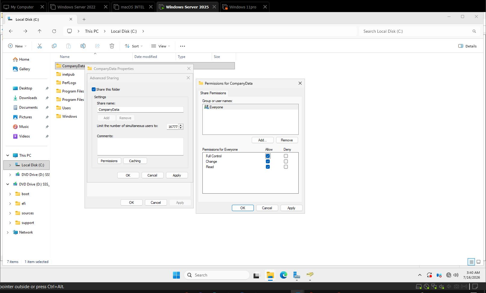
---
# Mapping the Shared Folder as a Network Drive

Log into the **Windows 11** client computer.

Open **File Explorer**.

1. Right-click **This PC**.
2. Select **Map network drive**.
3. Choose a drive letter.
4. Enter the shared folder path.

Example:

```text
\\Server2022\CompanyData
```

5. Click **Finish** to map the network drive.
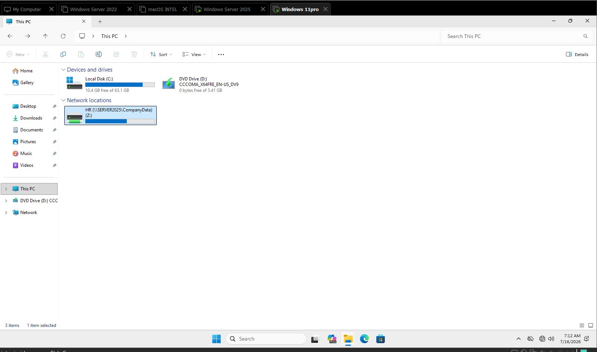

The shared folder is now available in File Explorer as a mapped network drive.

---
# Drive Mapping with Group Policy

Drive mapping using **Group Policy** allows administrators to automatically map network drives for users whenever they sign in. This provides a consistent user experience and eliminates the need for users to manually map shared drives.

## Opening Group Policy Management

1. Open **Server Manager**.
2. Select **Tools**.
3. Click **Group Policy Management**.

The Group Policy Management console opens and displays:

- Forest
- Domains
- Domain (e.g., `Njikason.local`)
- Organizational Units (OUs)
- Sub-OUs
- Group Policy Objects (GPOs)
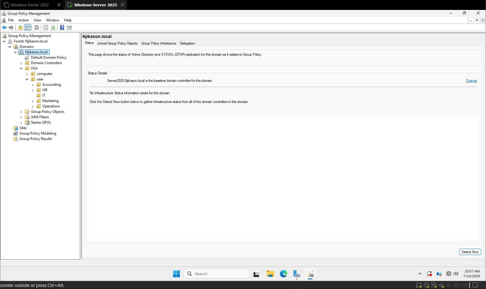

---

## Creating a Group Policy Object (GPO)

1. Right-click the **Accounting** Organizational Unit (OU).
2. Select **Create a GPO in this domain, and Link it here**.
3. Enter a name for the policy.

Example:

```text
Tech-Map
```
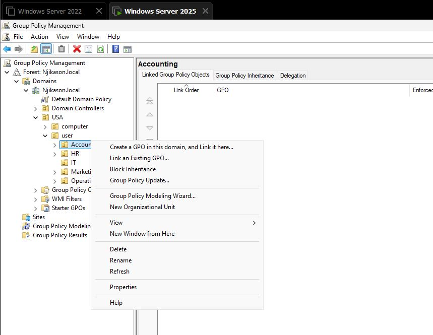

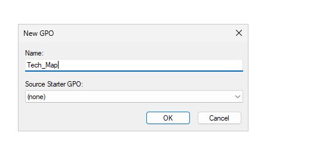
4. Click **OK**.
---
## Editing the Group Policy

Expand the **Accounting** OU.

Right-click the newly created GPO (**Tech-Map**) and select **Edit**.

The Group Policy Editor displays two main sections:

- Computer Configuration
- User Configuration

Since drive mapping is applied to users when they sign in, configure the policy under **User Configuration**.

---
## Configuring Drive Mapping

Navigate to:

```text
User Configuration
    └── Preferences
        └── Windows Settings
            └── Drive Maps
```

1. Right-click **Drive Maps**.
2. Select **New**.
3. Click **Mapped Drive**.
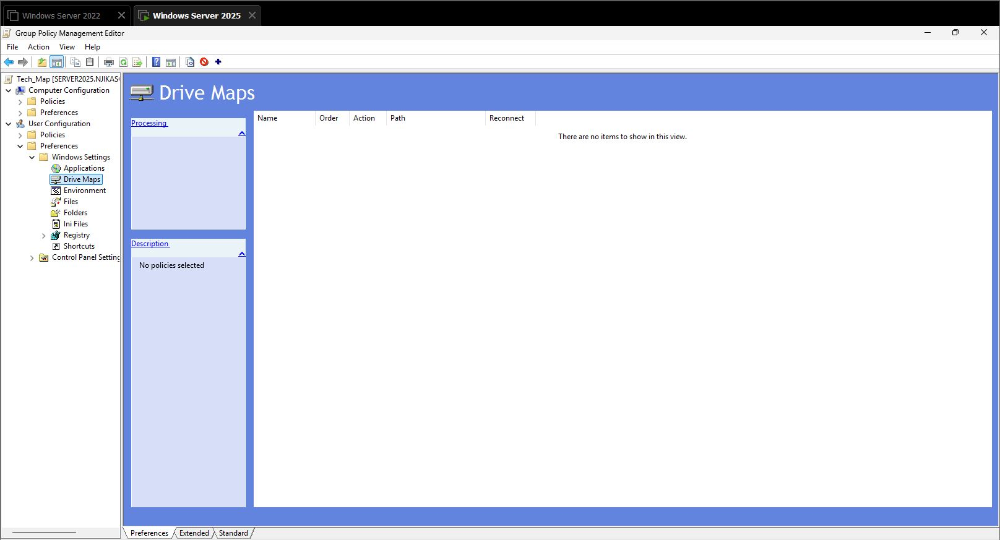

Configure the following settings:
### Action

Change the action to:

```text
Create
```
### Location

Copy the network share path from the shared folder.

Example:

```text
\\SERVER2025\CompanyData
```

Paste the path into the **Location** field.

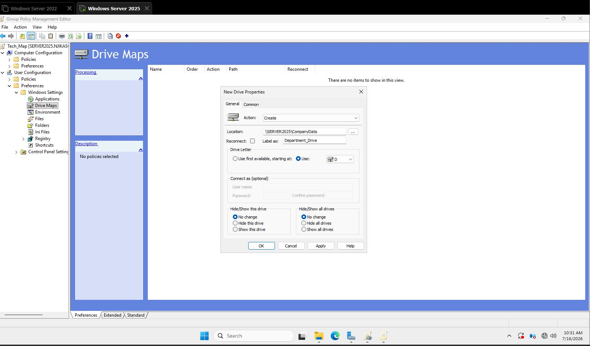
### Label

Enter a friendly drive name.

Example:

```text
Department_Drive
```
### Drive Letter

Select an available drive letter.
Example:

```text
D:
```
---
## Common Tab
Open the **Common** tab.

Enable:

- Item-level targeting

This allows the mapped drive to be applied only to specific users or groups based on the configured targeting rules.
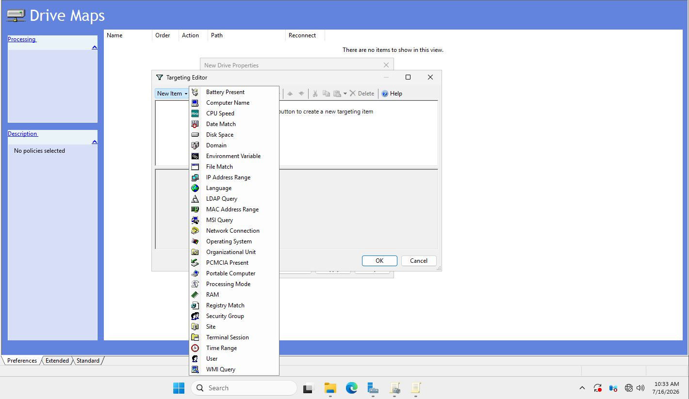
# Applying Security Group Filtering

Configure the Group Policy to apply only to the **Accounting** security group.

1. Locate the **Accounting** Security Group.
2. Select the group.
3. Click **OK**.
4. Click **Apply**.
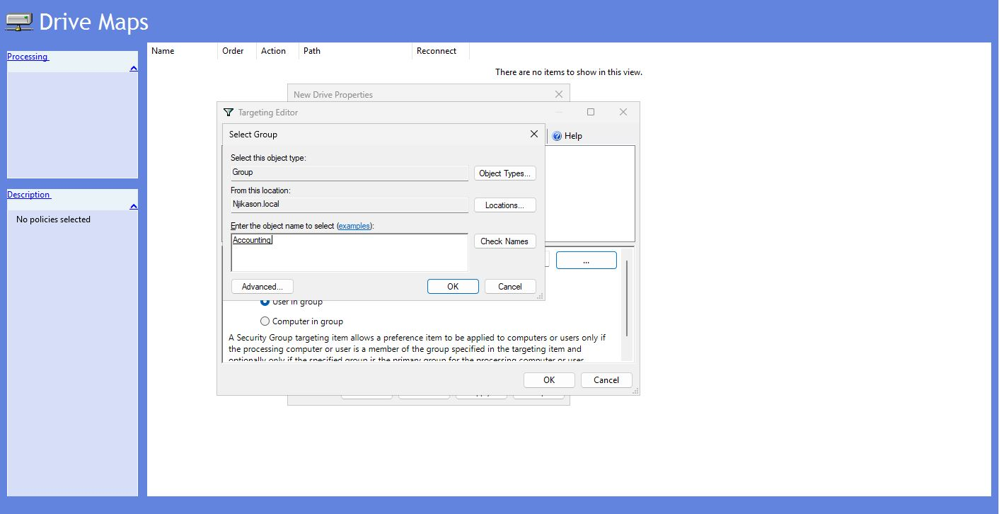

The Group Policy configuration is now complete.
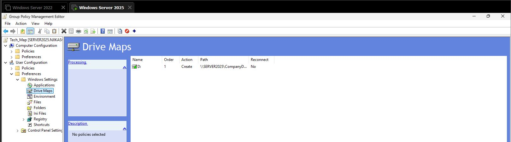

---

# Testing the Drive Mapping

To verify that the policy works correctly:

1. Log into the **Windows 11** client computer using a user account that belongs to the **Accounting** security group.

Example:

```text
Christopher Nolan
```

2. Open **File Explorer**.

At this stage, the mapped drive was **not displayed**.

---
# Troubleshooting

Since the mapped drive did not appear:

1. Return to **Group Policy Management**.
2. Locate the **Tech-Map** Group Policy Object.
3. Right-click the policy.
4. Select **Enforced**.
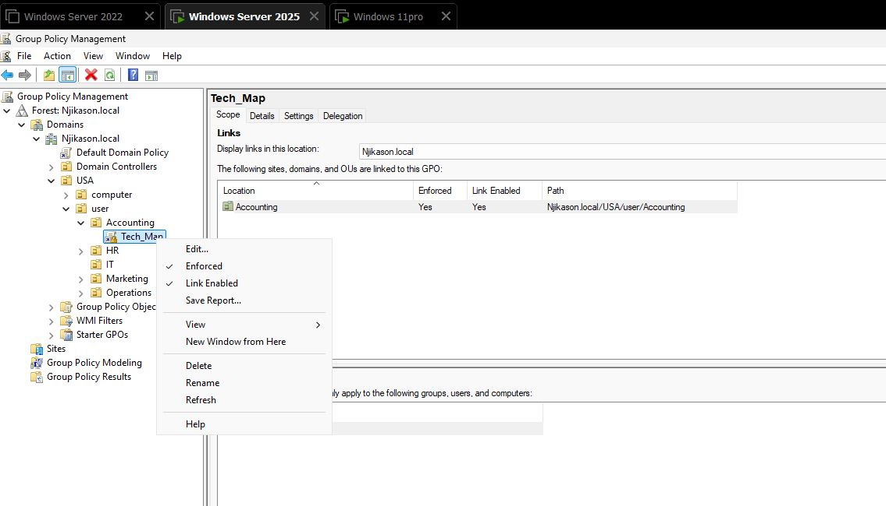
5. Return to the Windows 11 client.
6. Sign out and sign back in.

If the mapped drive is still unavailable, manually refresh Group Policy.

---
# Refreshing Group Policy

Open **Command Prompt** and run:

```cmd
gpupdate /force
```


After the policy refresh completes:

1. Sign out if prompted.
2. Sign back into Windows.
3. Open **File Explorer**.

The mapped network drive should now appear automatically for users who belong to the **Accounting** security group.


