# Group Policy Management

## What is Group Policy Management?

Group Policy is the primary mechanism for enforcing configuration standards across a Windows Active Directory environment. It allows IT administrators to define configurations once and apply them centrally to thousands of computers and users, significantly reducing manual configuration time.

## Objective

This section documents my hands-on experience using the **Group Policy Management Console (GPMC)** in Active Directory to:

- Enforce security baselines
- Automate client configurations
- Centralize user and computer settings across a domain
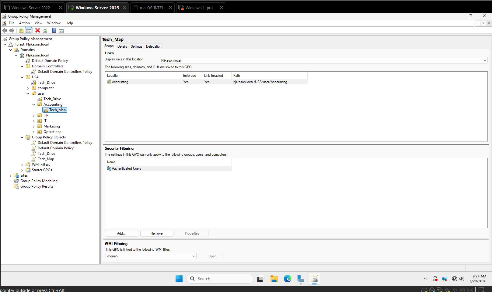

## Prerequisites

Before working with Group Policy Management, ensure the following prerequisites are met:

- Active Directory Domain Services (AD DS) is configured and operational.
- A Domain Administrator account or delegated administrative permissions are available.
- Group Policy Management tools are installed.
- A Windows 11 client machine is joined to the domain for testing Group Policy Objects (GPOs).
# Getting Started

## Launching Group Policy Management Console (GPMC)

There are two ways to open the Group Policy Management Console:

### Method 1: Run Command

1. Press **Windows + R** to open the **Run** dialog.
2. Type:

   ```text
   gpmc.msc
   ```

3. Press **Enter** to launch the **Group Policy Management Console (GPMC)**.

### Method 2: Server Manager

1. Open **Windows Server Manager**.
2. Click **Tools**.
3. Select **Group Policy Management**.
---
# Creating a New Group Policy Object (GPO)

1. Expand **Group Policy Objects**.
2. Right-click **Group Policy Objects**.
3. Select **New**.
4. Enter a name for the policy (for example, **Test GPO**).
5. Click **OK**.
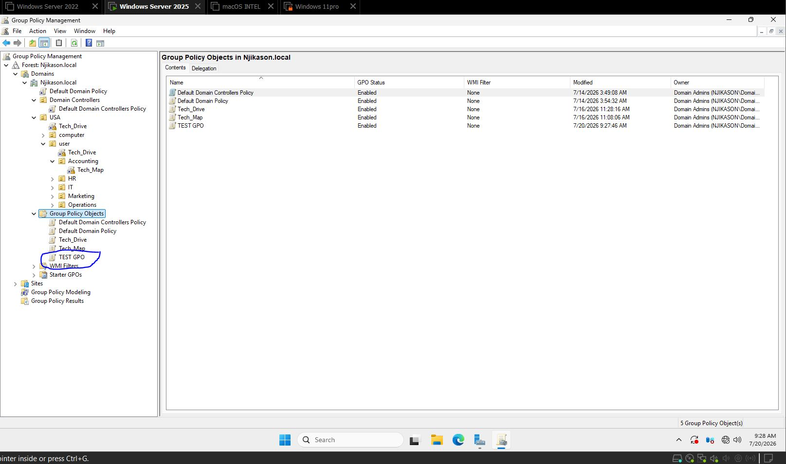
---
# Configuring Security Filtering

To apply the policy to only a specific user:

1. Select the newly created **Test GPO**.
2. Under **Security Filtering**, you will see **Authenticated Users** by default.
3. Click **Add**.
4. Enter the name of the test user.
5. Click **Check Names**.
6. Click **OK**.
7. Remove **Authenticated Users** from the Security Filtering list.
8. If prompted, confirm the removal and click **OK**.
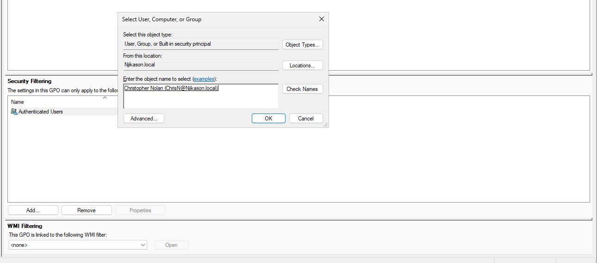
---
# Linking the GPO

1. Link the GPO to the target Organizational Unit (OU) (for example, **Users**).
2. This allows the policy to be applied within that OU while Security Filtering ensures only the specified test user receives the policy.
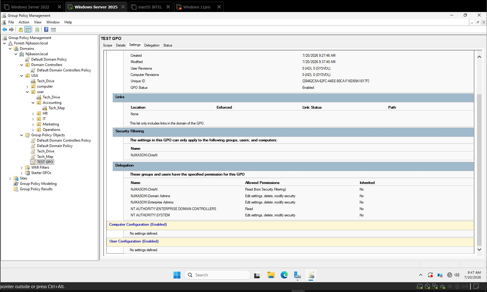
---
## Note

Even if the GPO is linked to the top-level **Users** OU, the policy will only apply to the specific user added in **Security Filtering**, since **Authenticated Users** has been removed.

# Group Policy Management – GPO Delegation and Configuring Windows Defender Firewall

## GPO Delegation

At the top of the **Test GPO**, the **Delegation** tab allows administrators to grant specific permissions to users or groups that the policy applies to, such as:

- Full Control
- Edit
- Read

The **Settings** tab displays the details of the Group Policy Object (GPO), including:

- The configured policy settings.
- Whether the GPO contains **Computer Configuration** or **User Configuration** settings.
- Which users or computers the GPO applies to.

---

# Lab: Disable the Domain Firewall Using Group Policy

## Step 1: Create a New GPO

1. Open **Group Policy Management**.
2. Expand **Group Policy Objects**.
3. Right-click **Group Policy Objects** and select **New**.
4. Name the policy:

   ```
   Disable Domain Firewall
   ```

5. Click **OK**.

---

## Step 2: Edit the GPO

1. Right-click the newly created **Disable Domain Firewall** GPO.
2. Select **Edit**.
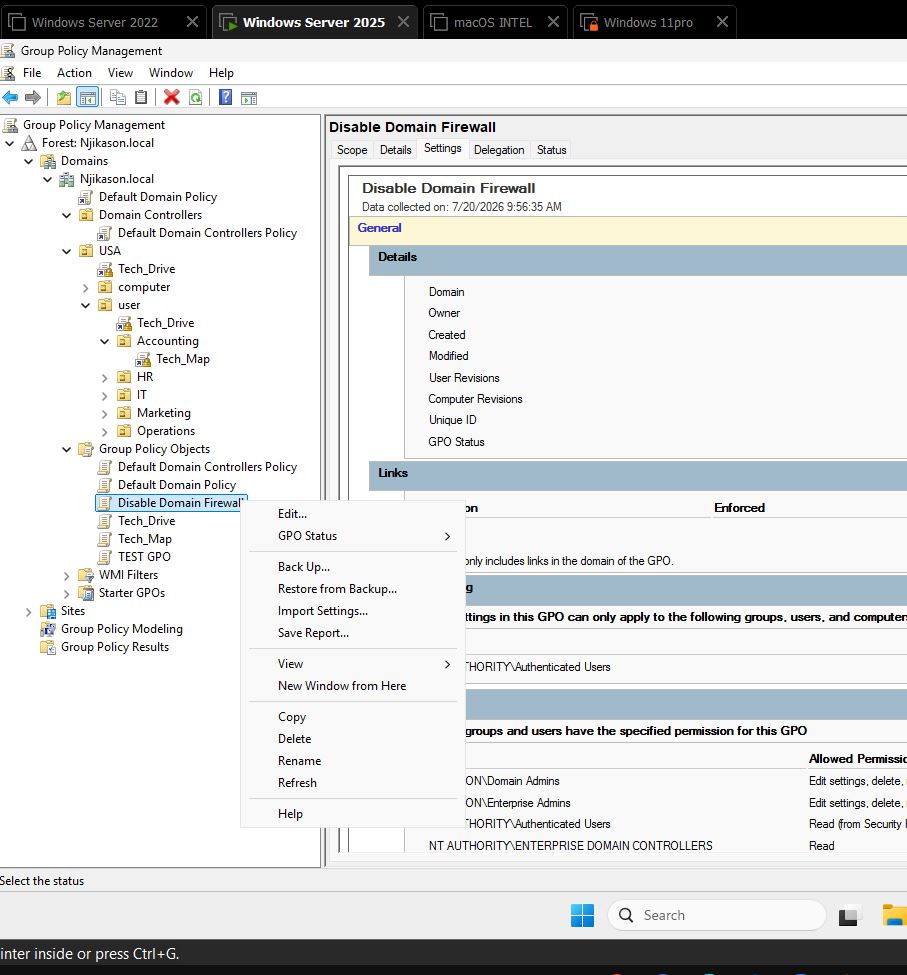

The editor displays two main sections:

- Computer Configuration
- User Configuration

> **Note:** Since disabling the Windows Defender Firewall is a computer-wide setting, this configuration must be made under **Computer Configuration**, not **User Configuration**.

### Policies vs Preferences

- **Policies** enforce settings that users generally cannot change.
- **Preferences** configure settings that users can usually modify later if necessary.


---
## Step 3: Navigate to Windows Defender Firewall Settings

Navigate to:

```text
Computer Configuration
└── Policies
    └── Windows Settings
        └── Security Settings
            └── Windows Defender Firewall with Advanced Security
```

Expand **Windows Defender Firewall with Advanced Security** to configure the firewall profiles and settings for domain-joined computers.
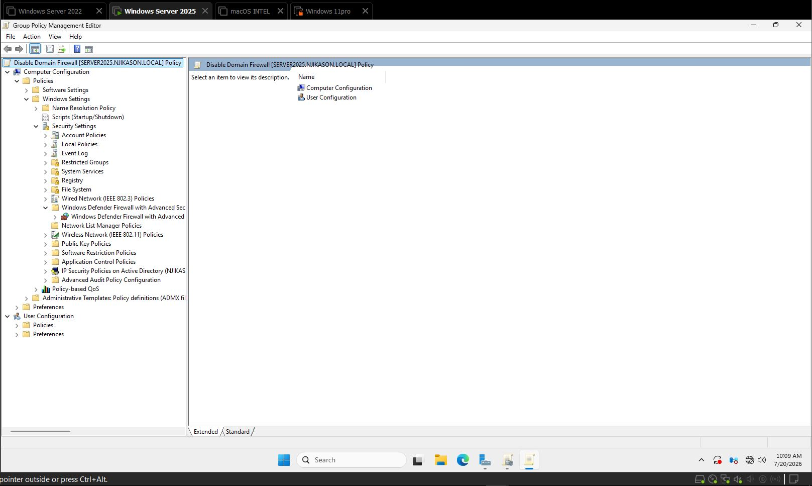
# Testing a Group Policy Object (GPO)

## Configure the Windows Defender Firewall Policy

1. Open **Windows Defender Firewall Properties**.
2. Under the **Domain Profile**:
   - Set **Firewall State** to **Off**.
   - Leave **Inbound Connections** and **Outbound Connections** at their default settings.
3. Click **Apply**, then **OK**.
4. Close the Group Policy Editor.
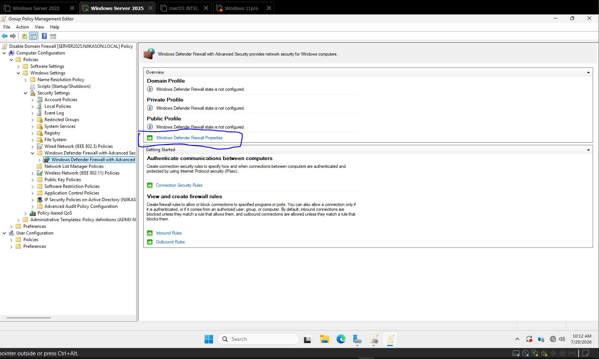
## Apply the GPO to a Test Computer

1. Navigate back to **Group Policy Objects**.
2. Select the **Disable Domain Firewall** GPO.
3. Open the **Scope** tab.
4. Remove **Authenticated Users**.
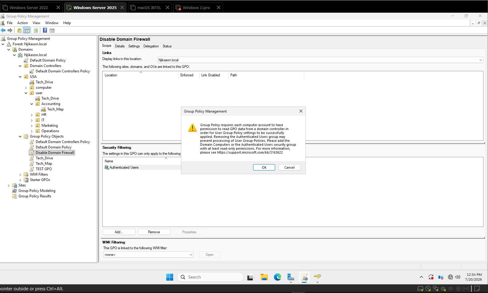
5. Since this policy is being tested on a specific computer:
   - Click **Add**.
   - Change **Object Types** to **Computers** only.
   - Enter the name of the domain-joined computer.
   - Click **OK**.
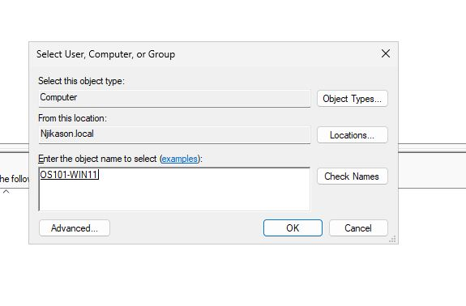
## Link the GPO to an Organizational Unit (OU)

1. Navigate to the target OU (e.g., **USA**).
2. Right-click the OU.
3. Select **Link an Existing GPO**.
4. Choose the **Disable Domain Firewall** GPO.
5. Click **OK** to link the policy.
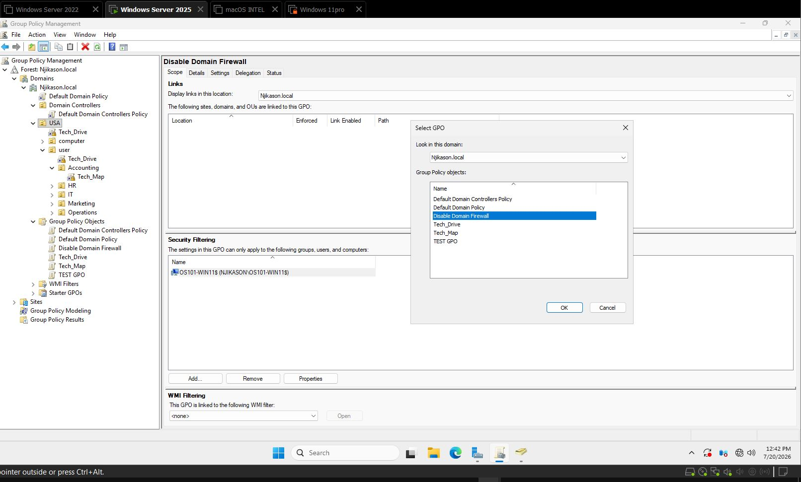
## Test the GPO

1. Sign in to the domain-joined Windows 11 client computer.
2. Open **Command Prompt** as Administrator.
3. Run the following command to immediately apply the policy:

```cmd
gpupdate /force
```

This forces Group Policy to refresh immediately so the new settings take effect without waiting for the next policy refresh cycle.
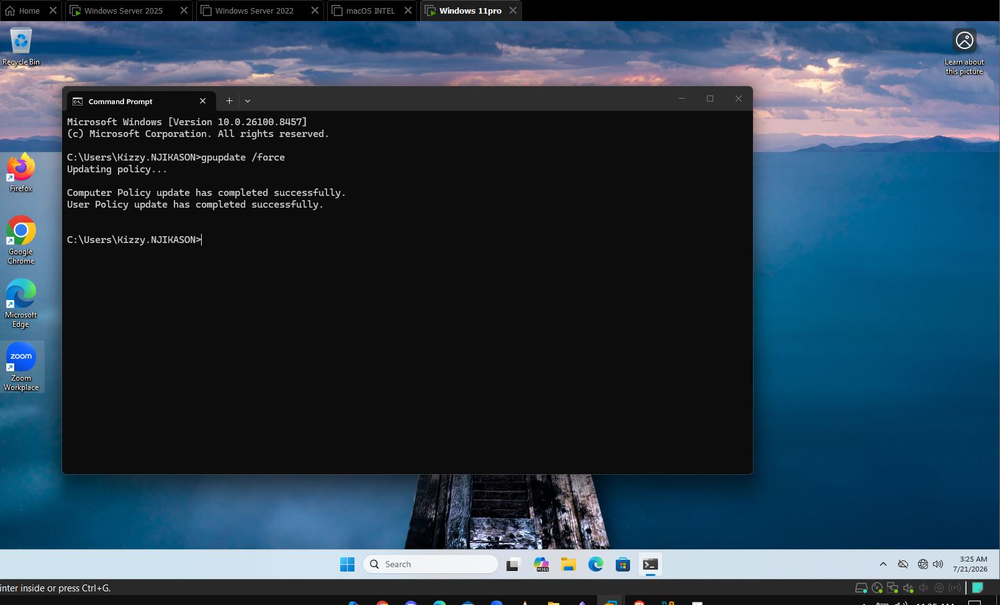
# Verifying and Testing the GPO

> **Note:** Since the user is **not** a local administrator, open **Command Prompt** using an administrator account.

Run the following command:

```cmd
gpresult /r /scope:computer
```

This displays the applied Group Policy Objects (GPOs) for the computer.

Verify that the following policies are listed:

- Disable Domain Firewall
- Default Domain Policy
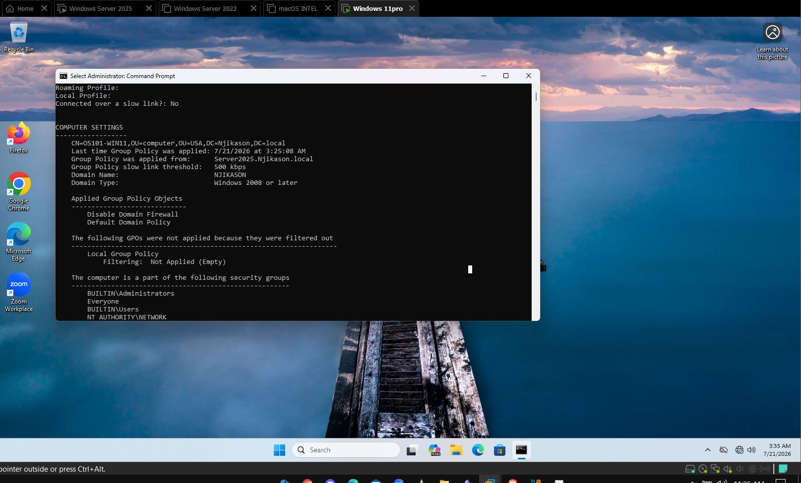

Next, open the **Start** menu and search for:

```
Firewall & Network Protection
```

If the **Domain Firewall** is shown as **Off** (as configured by the GPO), then the policy has been successfully applied.
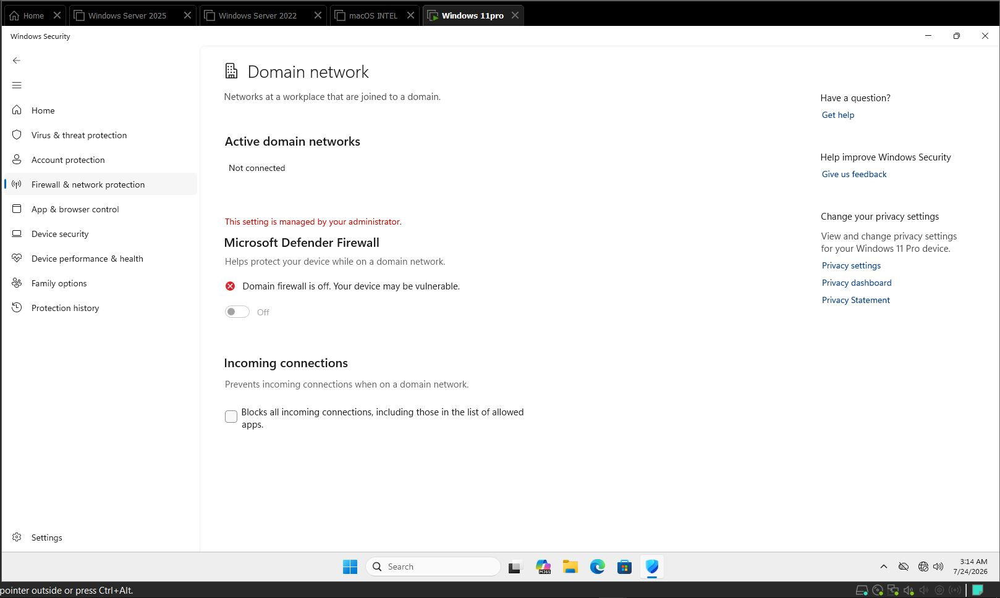
## Clean Up the GPO Scope

Once testing is complete:

1. Return to the GPO.
2. Open the **Scope** tab.
3. Add **Authenticated Users** back.
4. Remove the test computer if it is no longer needed.

This restores the policy to its intended scope.
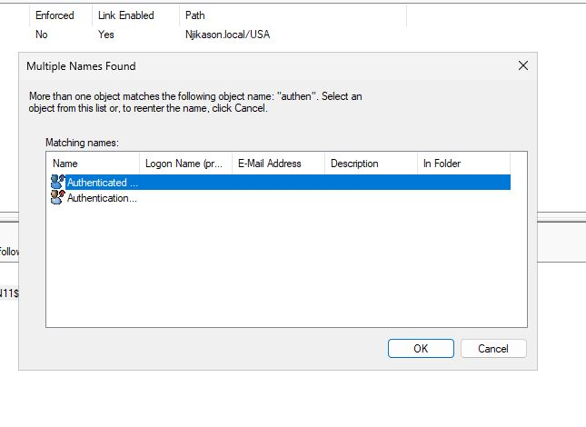

---

# Case Study 2: Hide Control Panel for Users (GPO)

## Create a New GPO

1. Open **Group Policy Objects**.
2. Right-click and select **New**.
3. Name the policy:

```
Hide Control Panel
```

4. Click **OK**.
5. Right-click the new GPO and select **Edit**.
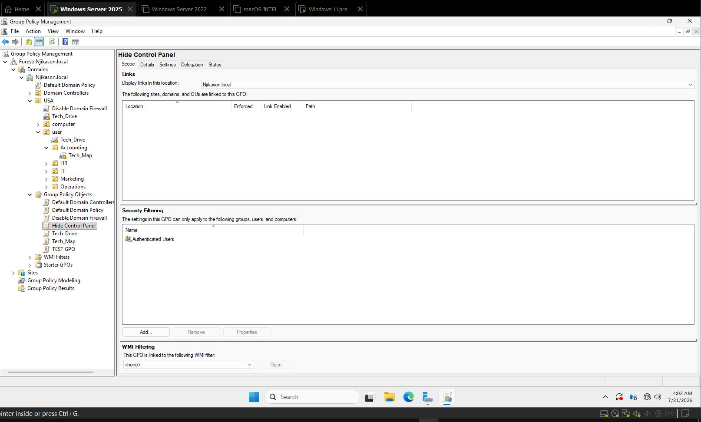

> **Note:** This is a **User Configuration** policy because it targets user accounts rather than computers.

## Configure the Policy

Navigate to:

```text
User Configuration
└── Policies
    └── Administrative Templates
        └── Control Panel
```

Open the policy:

```
Prohibit access to Control Panel and PC settings
```

Configure it as follows:

- Select **Enabled**.
- Click **Apply**.
- Click **OK**.
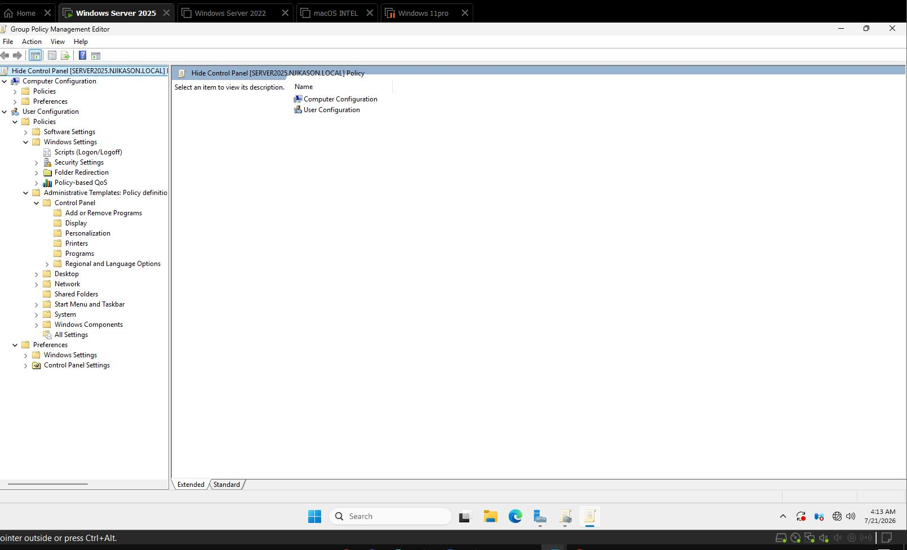
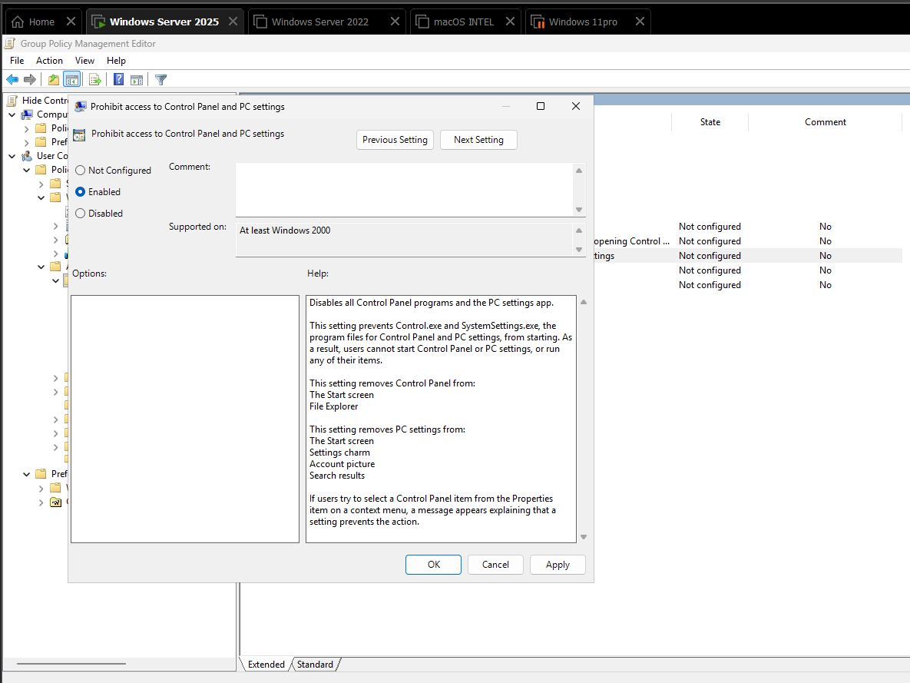

## Apply the Policy to a Test User

1. In the **Scope** tab, add your test user (e.g., **Christopher Nolan**).
2. Remove **Authenticated Users** so the policy only applies to the selected test account.
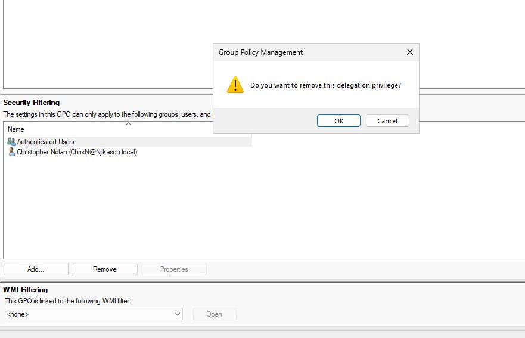
# Link the GPO to an Organizational Unit (OU)

1. Right-click the target **OU** (e.g., **USA**).
2. Select **Link an Existing GPO**.
3. Choose the **Hide Control Panel** GPO.
4. Click **OK**.
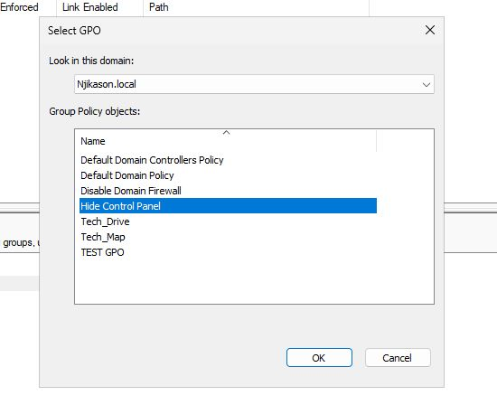
## Test the Policy

1. Log in to the client computer.
2. Open **Command Prompt** as an administrator.
3. Run the following command:

```cmd
gpupdate /force
```

4. Verify the applied policies by running:

```cmd
gpresult /r /user:ChrisN /f
```

This confirms that the **Hide Control Panel** policy has been applied to the user.
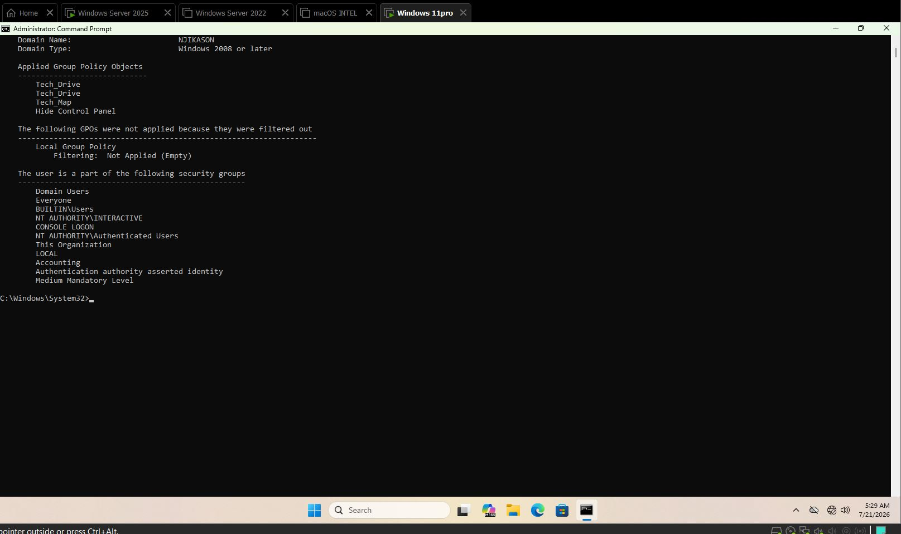

> **Note:** The policy did not initially work for **ChrisN** because the **Scope** also required **Domain Computers** to be added.

## Fix the Scope

Navigate to:

```
Hide Control Panel GPO
→ Scope
→ Add
→ Domain Computers
```

This ensures the policy applies to computers that are joined to the domain.

Click **OK** to save the changes.
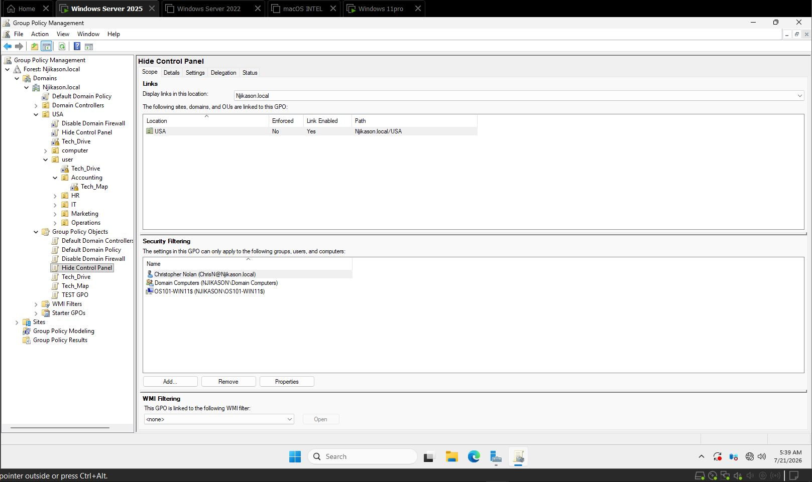
## Verify the Result

On the user's computer:

1. Open the **Start Menu**.
2. Search for **Control Panel**.
3. Attempt to open it.

Expected result:

- Control Panel cannot be opened.
- The user receives a message instructing them to contact their system administrator.
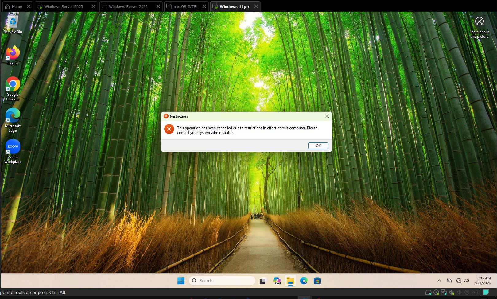

---

# Case Study 3: Password Policy for Users (GPO)

## Overview

Use Group Policy to create and enforce password policies for domain users. Password policies help improve security by enforcing password requirements and reducing the risk of unauthorized access or brute-force attacks.

They also allow administrators to manage:

- Password complexity requirements
- Minimum password length
- Password expiration
- Account lockout policies
- Password reset and account unlock procedures for users
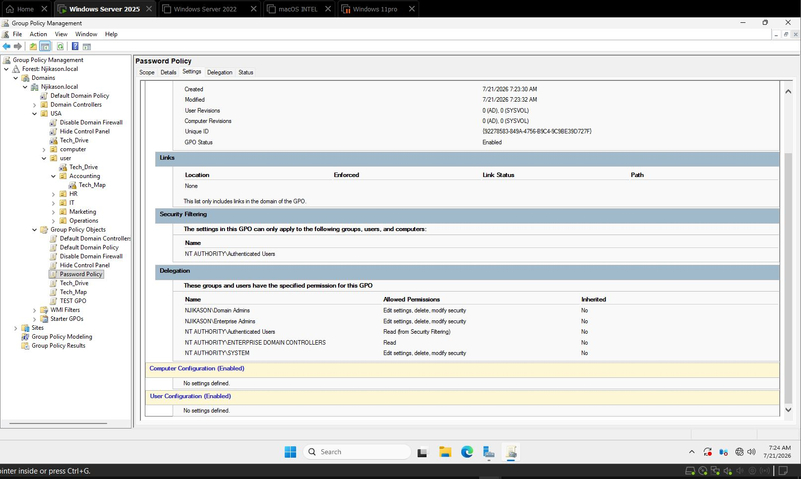
```

# Case Study 3: Password Policy for Users (GPO)

## Objective

Create and enforce a password policy using Group Policy to improve domain security by requiring stronger passwords and password expiration.

## Create the Password Policy GPO

1. Open **Group Policy Management**.
2. Navigate to **Group Policy Objects**.
3. Right-click **Group Policy Objects** and select **New**.
4. Name the policy **Password Policy**.
5. Right-click the newly created GPO and select **Edit**.

## Configure Password Policy

Navigate to:

```text
Computer Configuration
└── Policies
    └── Windows Settings
        └── Security Settings
            └── Account Policies
                └── Password Policy
```

Configure the following settings:

- **Enforce Password History**
  - Set to **5 remembered passwords**.

- **Maximum Password Age**
  - Set to **90 days**.

- **Minimum Password Age**
  - Set to **30 days**.

## Link the GPO

1. Navigate to the target **Branch OU (USA)**.
2. Right-click the OU.
3. Select **Link an Existing GPO**.
4. Choose the **Password Policy** GPO.
5. Click **OK**.

## Test the Policy

1. Log in to the test computer (**ChrisN OS**).
2. Update Group Policy if necessary.
3. Change the user's password several times.

Expected result:

- Windows prevents the user from reusing any of the last **5 passwords** because of the **Enforce Password History** policy.

> **Note:** The Account Lockout Policy was later modified to reduce the lockout threshold to **5 invalid sign-in attempts**.

---

# Case Study 4: Account Lockout Policy (GPO)

## Objective

Configure an Account Lockout Policy to protect domain accounts from brute-force password attacks.

The policy temporarily locks a user's account after a specified number of failed sign-in attempts. This helps:

- Prevent brute-force attacks.
- Improve domain security.
- Reduce the risk of unauthorized access.
- Allow administrators to unlock accounts or assist users with password resets when necessary.

## Create the GPO

1. Open **Group Policy Management**.
2. Navigate to **Group Policy Objects**.
3. Right-click **Group Policy Objects**.
4. Select **New**.
5. Create a new GPO for the **Account Lockout Policy**

6. Open **Group Policy Management**.
7. Navigate to **Group Policy Objects**.
8. Right-click **Group Policy Objects** and select **New**
9. Name the policy **Account Lockout Policy**.
10. Right-click the newly created GPO and select **Edit**.

## Configure the Account Lockout Policy

Navigate to:

```text
Computer Configuration
└── Policies
    └── Windows Settings
        └── Security Settings
            └── Account Policies
                └── Account Lockout Policy
```

Configure the following setting:

- **Account Lockout Threshold**
  - Defines how many failed sign-in attempts are allowed before a user account is locked.
  - Set the threshold to **5 invalid logon attempts**.
  - Click **Apply** and **OK**.

## Configure the Scope

After editing the GPO:

1. Open the **Scope** tab.
2. Add the **test user** or allow **Authenticated Users**, depending on your testing requirements.
3. Ensure the appropriate test computer is included if required.

## Link the GPO

1. Navigate to the target **Branch OU (USA)**.
2. Right-click the OU.
3. Select **Link an Existing GPO**.
4. Choose the **Account Lockout Policy** GPO.

The policy will be inherited by child OUs, allowing users within those OUs to receive the policy.

## Test the Policy

1. Log in as the test user (**ChrisN**).
2. Open **Command Prompt** as Administrator.
3. Run:

```cmd
gpupdate /force
```

This refreshes both **Computer** and **User** Group Policies.

Verify that the policy has been applied by running:

```cmd
gpresult /r /user:ChrisN /f
```

Review the applied Group Policy Objects to confirm the **Account Lockout Policy** is listed.

## Additional Notes

Group Policy can also be used to manage other Windows settings, including:

- Disable Control Panel
- Disable the Lock Screen
- Disable Start Menu options
- Restrict access to specific Windows features

These policies allow administrators to centrally control what users can and cannot do on domain-joined computers.