# Windows Server 2025 Lab Documentation

## Overview

Windows Server 2025 is Microsoft's latest Long-Term Servicing Channel (LTSC) operating system built on the Windows 11 codebase. It is designed for modern infrastructure, offering deeper cloud integration, significantly enhanced storage performance, and updated security baselines compared to its predecessor, Windows Server 2022.

---
# Getting Started

- Download the **Windows Server 2025 Evaluation ISO** from the Microsoft Evaluation Center.

- After downloading the ISO file, launch **VMware Workstation Pro**.
## VMware Baseline Configuration

- **vCPUs:** 2
- **Memory:** 4 GB - 8 GB RAM
- **Virtual Disk:** 60 GB NVMe
## Creating the Virtual Machine

- Navigate to **File** → **Create New Virtual Machine**.

- Click **Next**.

- Select **I will install the operating system later**, then click **Next**.

- Select **Microsoft Windows Server 2025** as the operating system.
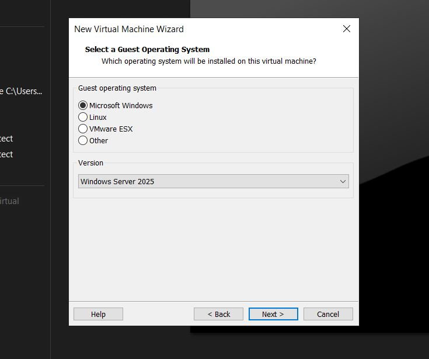

- Allocate the virtual disk size (**Recommended: 60 GB**).

- Click **Customize Hardware**.

- Locate the downloaded Windows Server 2025 ISO:
  - Select **New CD/DVD (SATA)**.
  - Choose **Use ISO Image File**.
  - Browse to the downloaded Windows Server 2025 ISO.
  - Click **Close**, then **Finish**.
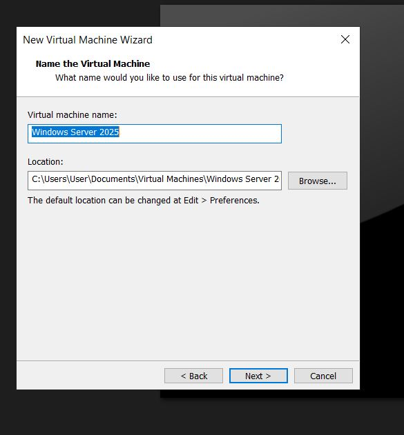
## Powering On the Virtual Machine

- Click **Power On This Virtual Machine**.
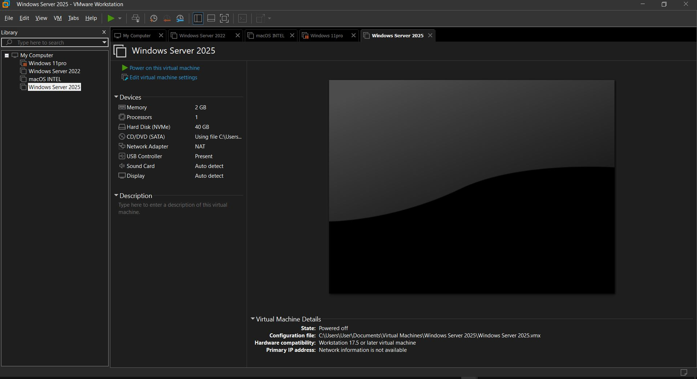

- Click inside the virtual machine window.

- Press the **Spacebar** when prompted to boot from the Windows Server 2025 ISO.

- Select the preferred language settings.
- Select **Keyboard: US**.
- Click **Next**.
- Select the Windows Server edition (**Desktop Experience**).
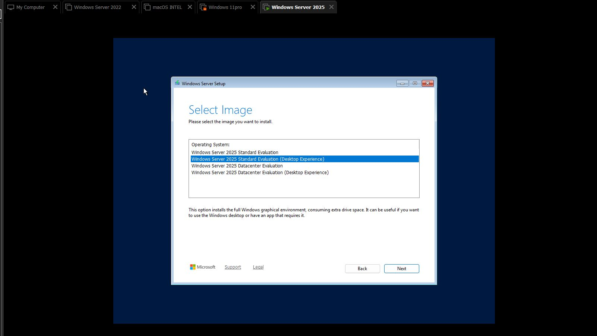
- Click **Next**.
- Accept the Microsoft License Terms.
- Click **Install**.
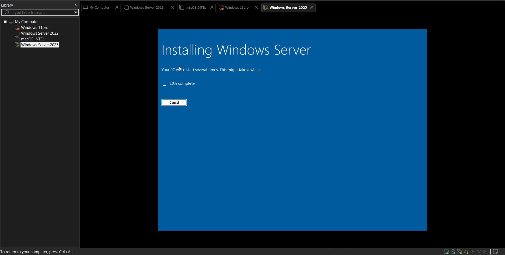

- After the installation completes, create and configure the **Administrator** password.
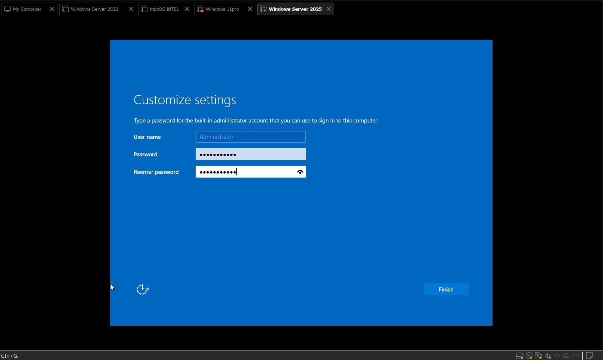
- Windows Server 2025 is now fully installed. The Evaluation ISO license is valid for **180 days**.
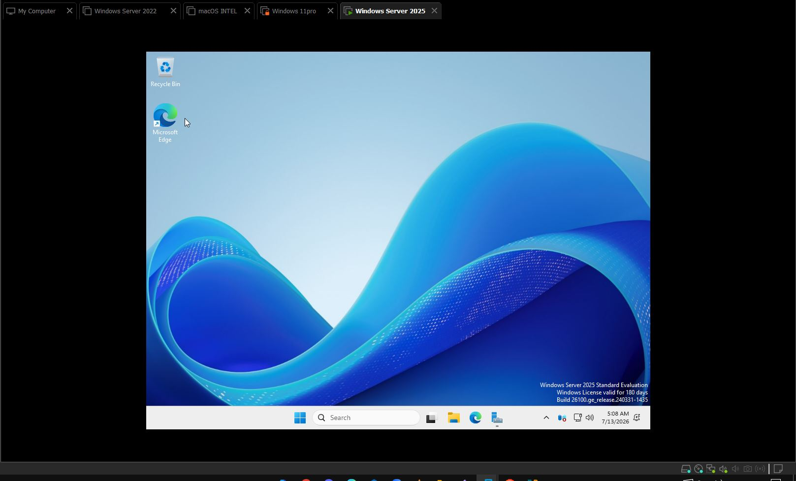

---
## Installing VMware Tools

For a better performance and user experience, install VMware Tools.

- Open **File Explorer**.
- Navigate to the **VMware Tools** virtual CD.
- Run **Setup64.exe**.
- Follow the VMware Tools installation wizard.
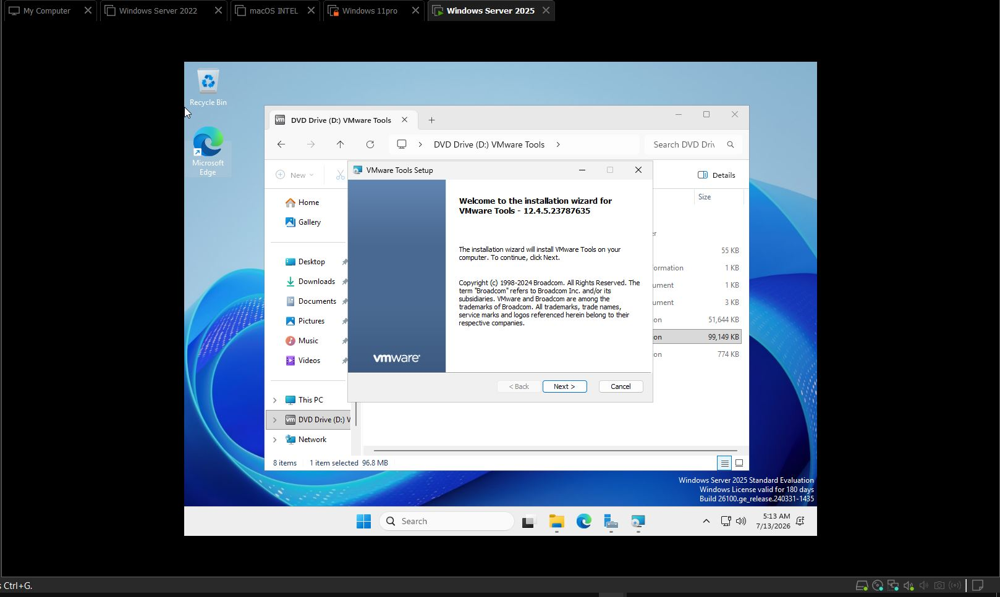
- Complete the installation.
- Restart the virtual machine.
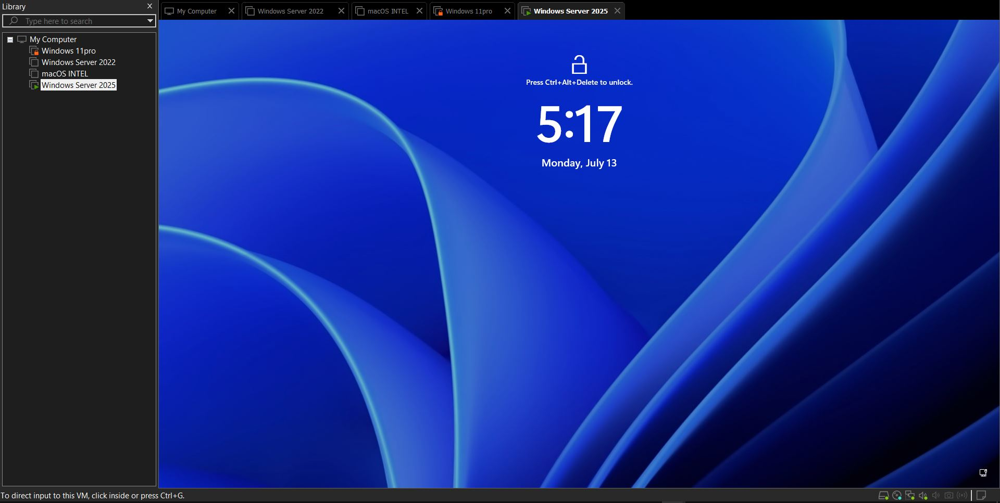
---
# Rename the Windows Server 2025

Renaming the server provides a consistent naming convention before configuring Active Directory roles and features. It also makes the server easier to identify instead of using the default Windows Server computer name.
### Steps

- Open **File Explorer**.
- Right-click **This PC**.
- Select **Properties**.
- Click **Advanced System Settings**.
- Open the **Computer Name** tab.
- Click **Change**.
- Enter a new computer name of your choice.
- Click **OK**.
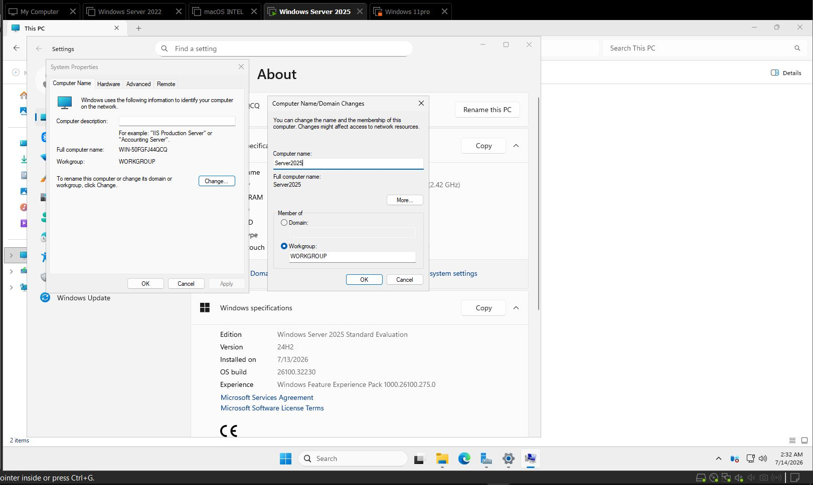
- Restart the server when prompted for the changes to take effect.
---
# Installing Active Directory Users and Computers (AD DS)

### Opening the Add Roles and Features Wizard

- Open **Server Manager**.
- In the upper-right corner, click **Manage**.
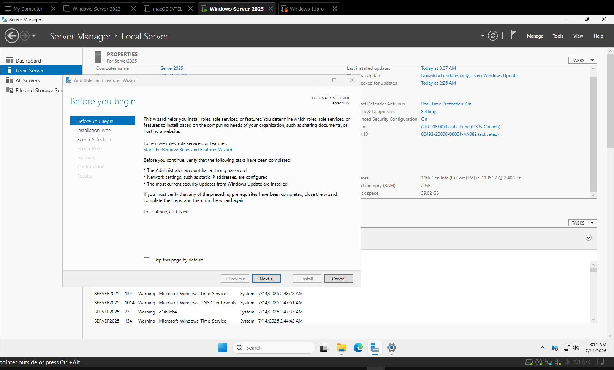
- Select **Add Roles and Features**.
- The **Add Roles and Features Wizard** opens.
- Under **Installation Type**, select:

  - **Role-based or feature-based installation**.
- Select the target server (the server appears with its IP address).
- Click **Next**.
- Under **Server Roles**, select:

  - **Active Directory Domain Services (AD DS)**
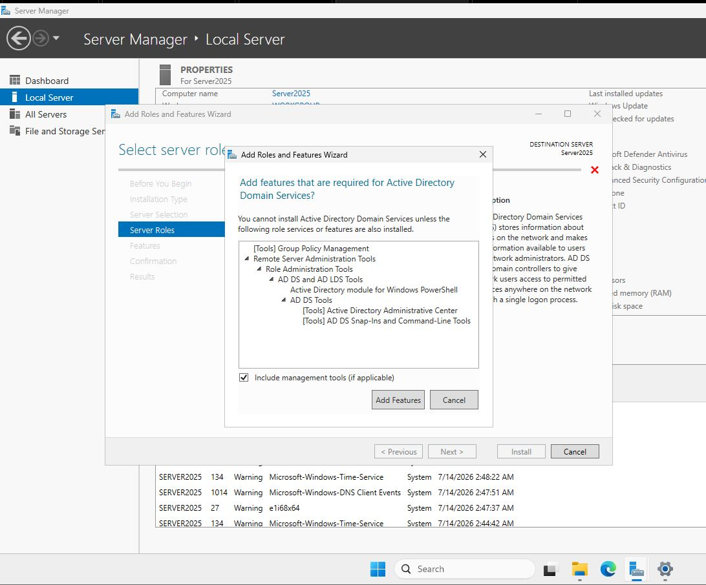
- Click **Next** through the remaining pages.
- On the **Features** page, accept the required features.

This installs the following Active Directory components:

- Active Directory Domain Services
- Group Policy Management
- AD DS Role Administration Tools
- Required management features
- Click **Install**.
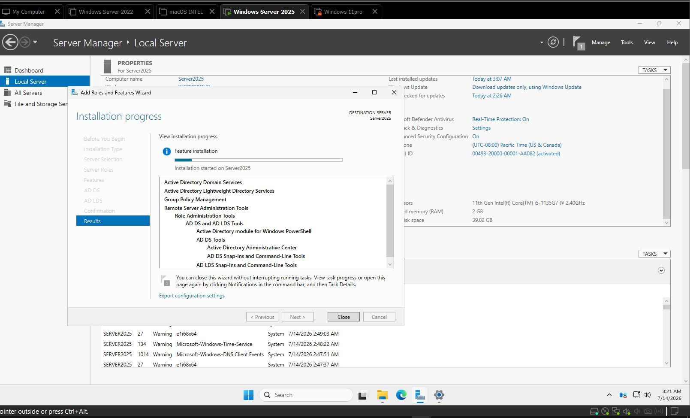
---
## Promoting the Server to a Domain Controller

After the installation is complete:

- Click **Promote this server to a domain controller**.
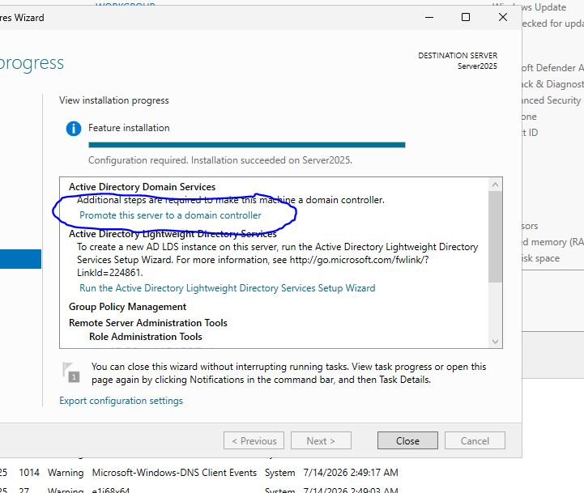
### Deployment Configuration

- Select **Add a new forest**.
- Enter the root domain name.

Example:

```text
Njikason.local
```

- Click **Next**.
### Domain Controller Options

- Enter the **Directory Services Restore Mode (DSRM)** password.
- Ignore the DNS delegation warning for now.
- Click **Next**.
### Additional Options

- Leave the default settings.
- Click **Next**.
### Prerequisites Check

- Wait for the prerequisite checks to complete successfully.
- Click **Install**.
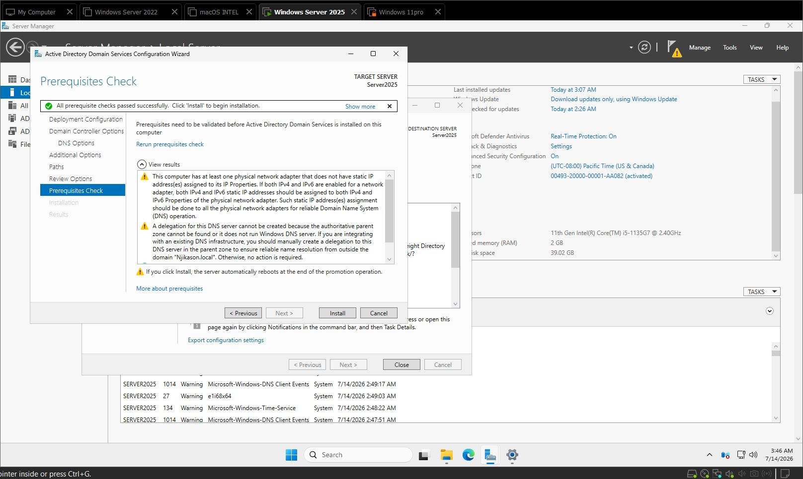
After the installation finishes:

- The server automatically restarts.
- The server is now configured as a **Domain Controller**.
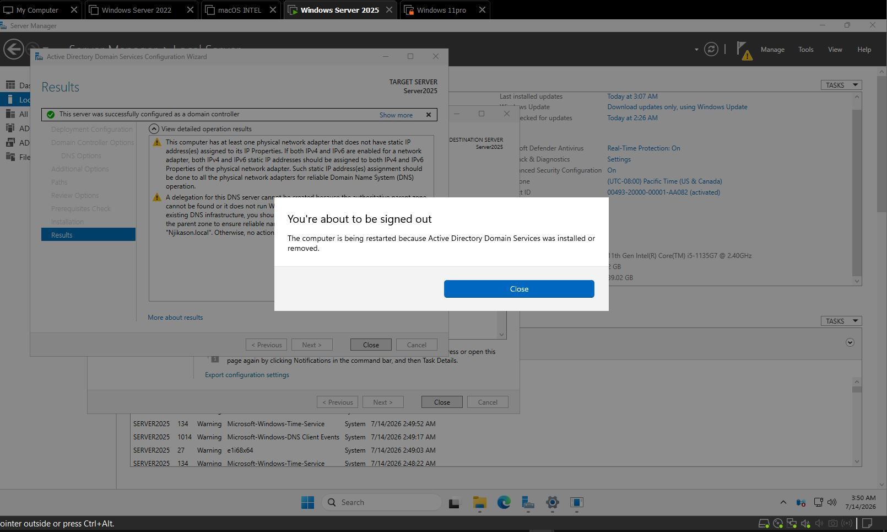
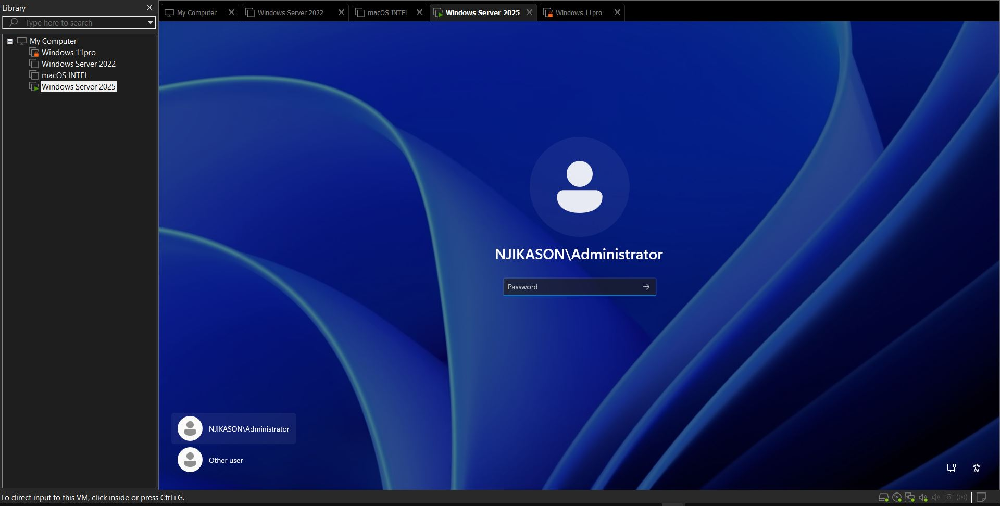

---
# Opening Active Directory Users and Computers

### Method 1

- Open the **Start Menu**.
- Select **Windows Tools**.
- Open **Active Directory Users and Computers**.
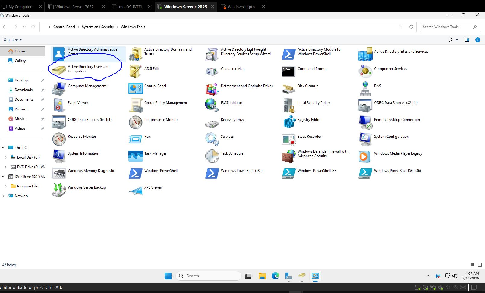
### Method 2

- Open **Server Manager**.
- Click **Tools**.
- Select **Active Directory Users and Computers**.

The Active Directory management console opens.

---
# Joining Windows 11 to an Active Directory Domain

Joining a Windows 11 computer to Active Directory allows administrators to centrally manage users, computers, and security policies across the organization's network.

Some common administrative tasks include:

- Creating and managing user accounts.
- Managing computer objects.
- Resetting user passwords.
- Unlocking locked user accounts.
- Applying Group Policy settings.
- Controlling user access to company resources.

Joining a computer to the domain gives IT administrators centralized control over devices while allowing users to securely access company network resources and services.

# Setting a Static IP Address for Windows Server 2025

Setting a static IP address on a Windows Server is a best practice because servers should always have a consistent IP address. This ensures the server can always be reached on the network and allows administrators to reliably manage server roles and services.

## View the Current IP Configuration

1. Open **Command Prompt**.
2. Run the following command:

```cmd
ipconfig
```

This displays the current IP address assigned to the server.
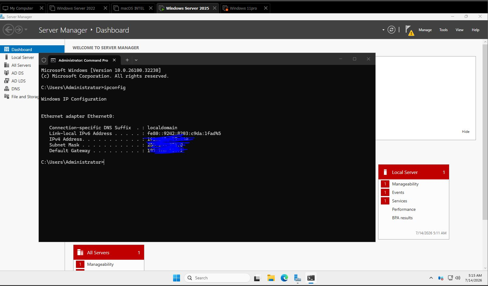

---
## Configure a Static IP Address

1. Open **Control Panel** from the search button 
2. Select **Network and Internet**.
3. Open **Network and Sharing Center**.
4. Click **Change adapter settings**.
5. Right-click **Ethernet0**.
6. Select **Properties**.
7. Double-click **Internet Protocol Version 4 (TCP/IPv4)**.
8. Change the setting from **Obtain an IP address automatically** to **Use the following IP address**.
9. Enter the following information:
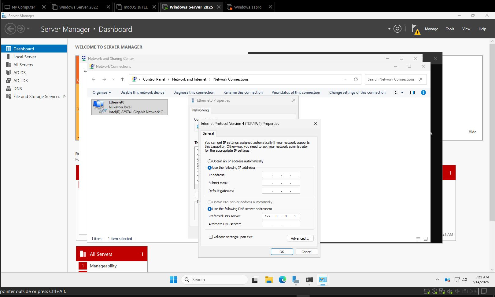
- IP Address (from the `ipconfig` output)
- Subnet Mask
- Default Gateway
- Preferred DNS Server (Loopback Address)

10. Click **OK** to save the configuration.

---
## Verify the Configuration

1. Restart the Windows Server.
2. Open **Command Prompt**.
3. Run:

```cmd
ipconfig /all
```

Confirm that the static IP address has been successfully applied.
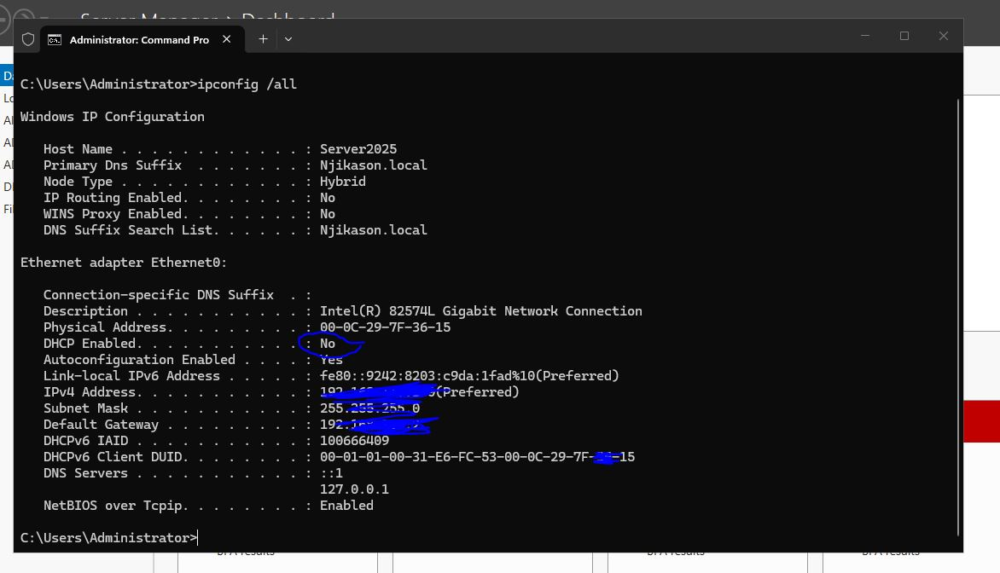

---
# Creating Organizational Units (OUs) for Users and Computers

Organizational Units (OUs) help organize users, computers, and departments within Active Directory. They also make it easier to apply Group Policies and delegate administrative permissions.

## Create the Parent OU

1. Open **Server Manager**.
2. Click **Tools**.
3. Open **Active Directory Users and Computers**.
4. Expand the domain controller.
5. Right-click the domain.
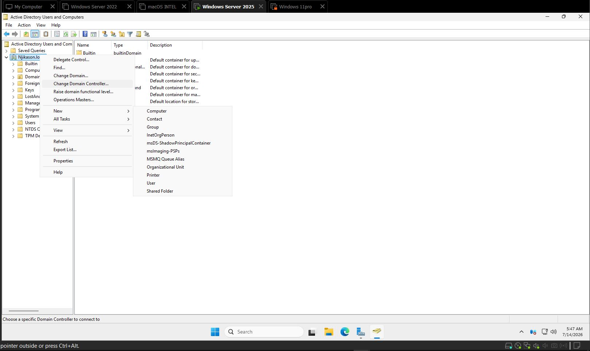
6. Select **New** → **Organizational Unit**.
7. Enter the OU name.
Example:

```text
USA
```

8. Click **OK**.

---
## Create Child Organizational Units

Inside the **USA** OU:

1. Right-click the **USA** OU.
2. Select **New** → **Organizational Unit**.
3. Create the following child OUs:
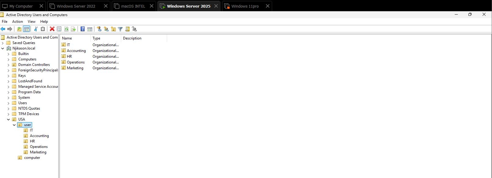
- Users
- Computers
---
## Create Departmental OUs

Create additional Organizational Units to separate departments within the organization.

Examples include:

- IT
- Accounting
- HR

This structure helps organize Active Directory objects and simplifies administration, Group Policy management, and permission delegation.

# Creating User Accounts in Active Directory

Creating user accounts in Active Directory allows users within the organization to authenticate and access company resources using their assigned usernames and passwords.

## Creating a New User Account

1. Open **Active Directory Users and Computers**.
2. Navigate to the Organizational Unit (OU) where the user account will be created.
3. Right-click the OU.
4. Select **New** → **User**.
5. Enter the following information:

- First Name
- Last Name
- User Logon Name (Username)

6. Click **Next**.
7. Create a password for the user.
8. Select **User must change password at next logon**
!
9. Click **Next**.
10. Click **Finish**.

The user account has now been created.

---

## Creating Additional User Accounts

To create another user:

1. Navigate to the appropriate Organizational Unit (Example: **IT**).
2. Right-click the OU.
3. Select **New** → **User**.
4. Enter:

- First Name
- Last Name
- User Logon Name
- Password

5. Click **Next**.
6. Click **Finish**.

Repeat the process for additional users as required.

---

## Adding a User to a Security Group

1. Double-click the user account.

Example:

```text
Kizito Njika
```

2. Open the **Member Of** tab.
3. Click **Add**.
4. Search for the required security group.
5. Click **Check Names**.
6. Click **OK**.
7. Click **Apply** and **OK**.

The user is now a member of the selected security group.

---

# Joining Windows 11 to the Domain Controller (Windows Server 2025)

Joining a Windows 11 computer to an Active Directory domain allows users to sign in using their domain credentials and enables centralized management by the Domain Controller.

Once joined:

- Windows Server and Windows 11 can communicate over the network.
- Users can log in using their Active Directory accounts.
- Group Policies can be applied.
- IT administrators can centrally manage the device.

---

## Preparing the Windows 11 Client

Before joining the domain, the Windows 11 computer must be on the same network as the Domain Controller.

1. Obtain the IP address of the Windows Server.
2. Open **Network Adapter Properties** on the Windows 11 computer.
3. Open **Internet Protocol Version 4 (TCP/IPv4)**.
4. Configure the network settings so the Windows 11 computer is on the same IP subnet as the Windows Server.
5. Configure the **Preferred DNS Server** to point to the Domain Controller.

Once the network configuration is complete, the Windows 11 computer is ready to join the Active Directory domain

### Configure the Windows 11 Network Settings

The next step is to configure the Windows 11 computer so it can communicate with the Windows Server 2025 Domain Controller.

1. Open the **Search Bar**.
2. Search for and open **Control Panel**.
3. Navigate to:

   **Network and Internet** → **Network and Sharing Center** → **Change adapter settings**

4. Right-click **Ethernet0** and select **Properties**.
5. Double-click **Internet Protocol Version 4 (TCP/IPv4)**.
6. Change the configuration from **Obtain an IP address automatically** to **Use the following IP address**.
7. Enter the IP address manually using the same network range as the Windows Server.
8. Click **OK** to save the configuration.

---

### Verify Network Connectivity

Open **Command Prompt** and test communication with the Windows Server.

```cmd
ping <Windows Server IP Address>
```

A successful reply confirms that the Windows 11 client can communicate with the Windows Server.

For my lab environment, I changed the VMware network adapter from **NAT** to **Host-Only** to allow communication between the virtual machines.

---

### Join the Windows 11 Computer to the Domain

1. Open **File Explorer**.
2. Right-click **This PC** and select **Properties**.
3. Scroll down and click **Domain or Workgroup**.
4. Click **Computer Name** → **Change**.
5. Under **Member of**, select **Domain**.
6. Enter the domain name.

Example:

```text
nyksson.local
```

7. Click **OK**.
8. When prompted, enter the Domain Administrator username and password.
9. After authentication is successful, restart the Windows 11 computer.

---
### Sign In with a Domain User Account

After the restart:

1. Select **Other User** on the Windows sign-in screen.
2. Sign in using the Active Directory user credentials created earlier.
3. Confirm that the user can successfully log in to the domain.
---
### Verify the Computer in Active Directory

On the Windows Server:

1. Open **Active Directory Users and Computers**.
2. Expand the domain.
3. Open the **Computers** container (or the Organizational Unit where the computer was joined).
4. Verify that the Windows 11 computer appears in Active Directory.

This confirms that the Windows 11 device has successfully joined the Active Directory domain and is being managed by the Domain Controller.