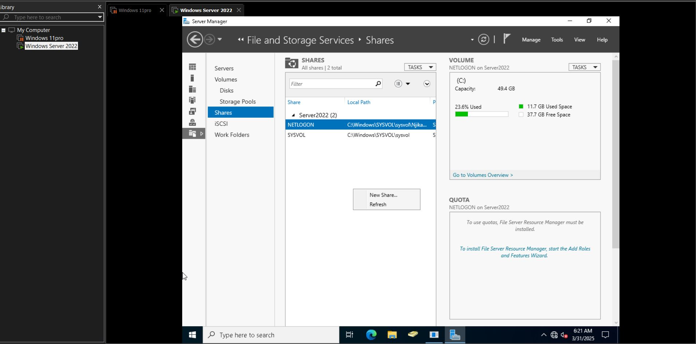
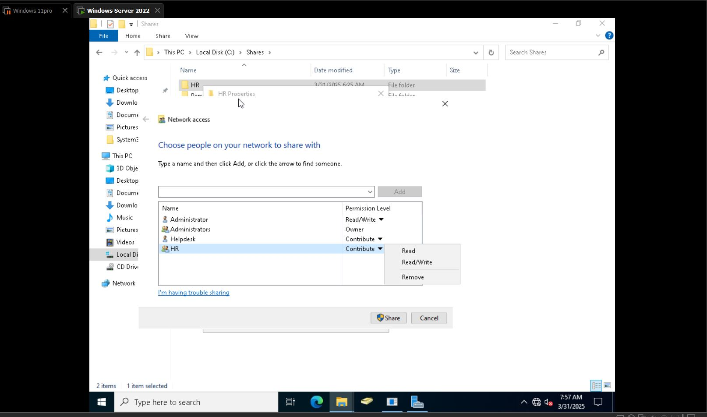
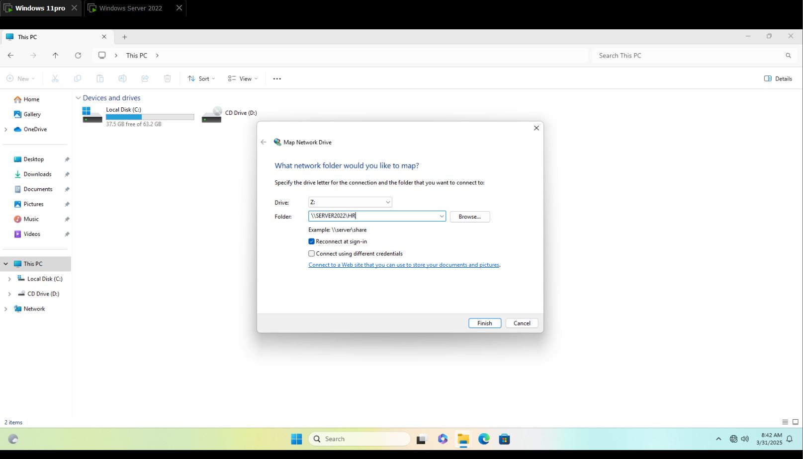
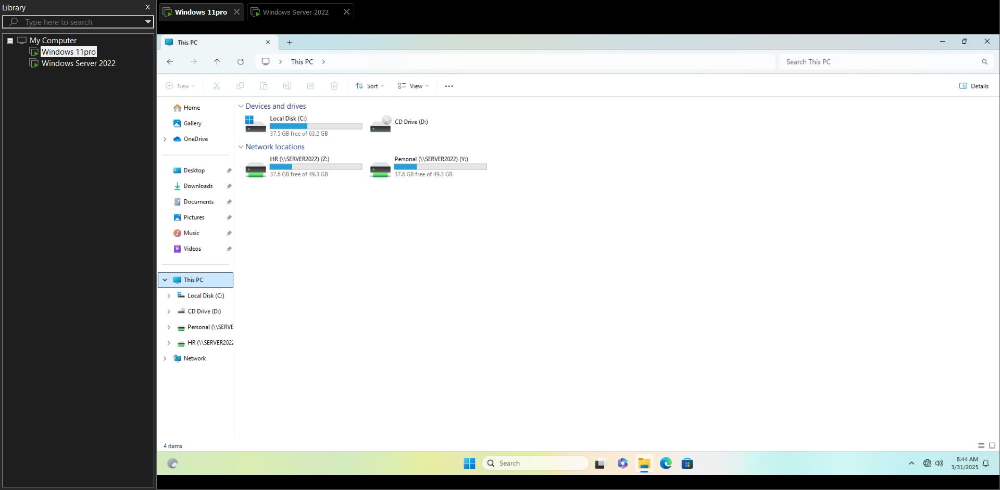
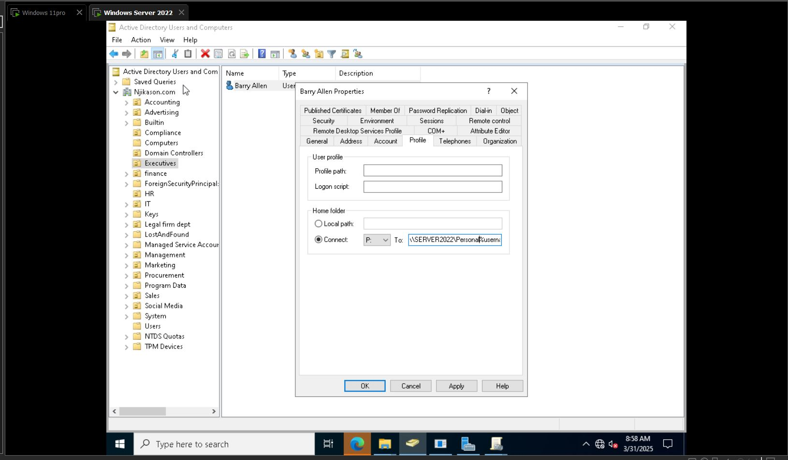
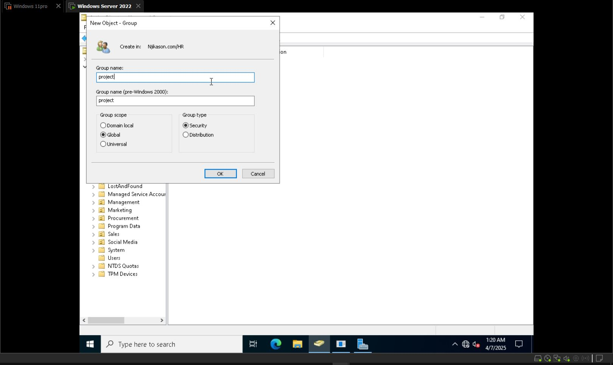
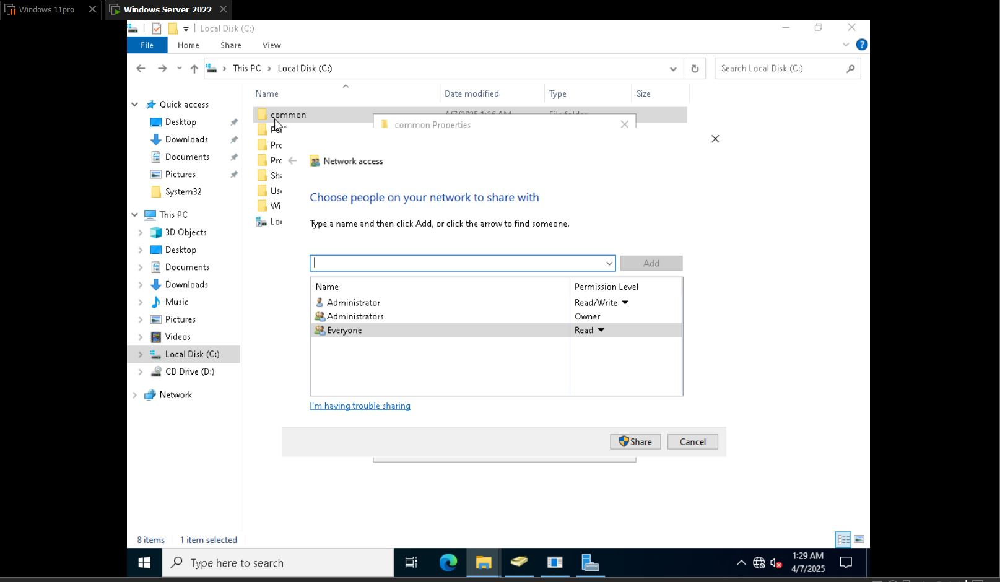
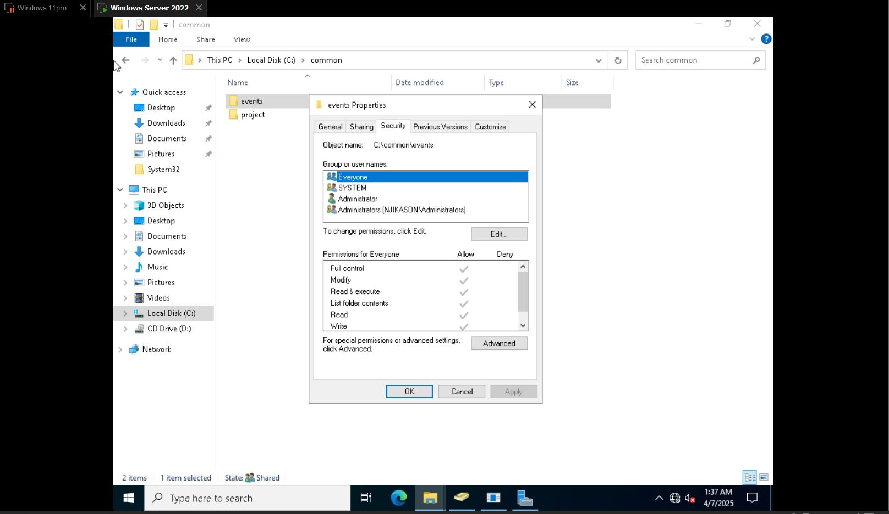
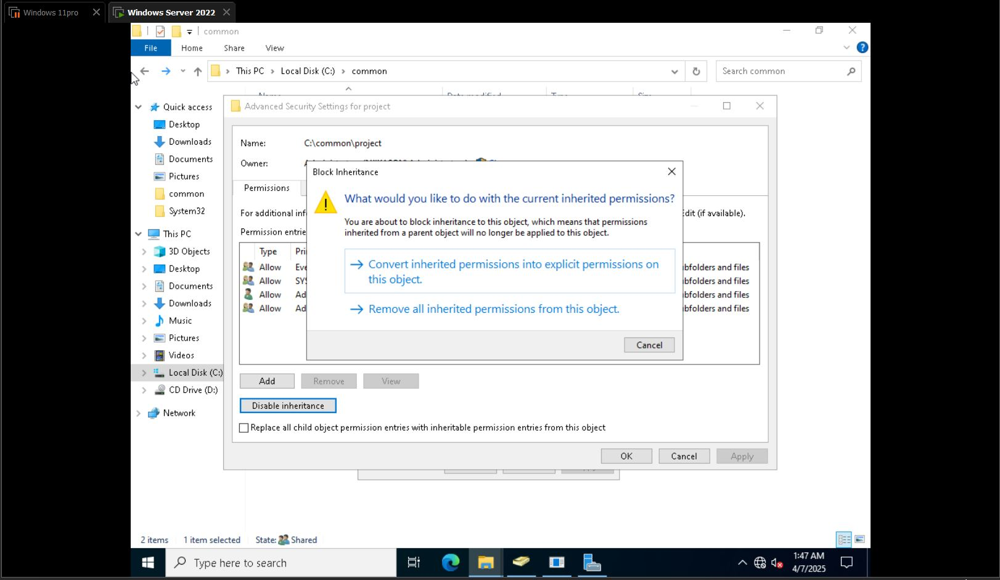
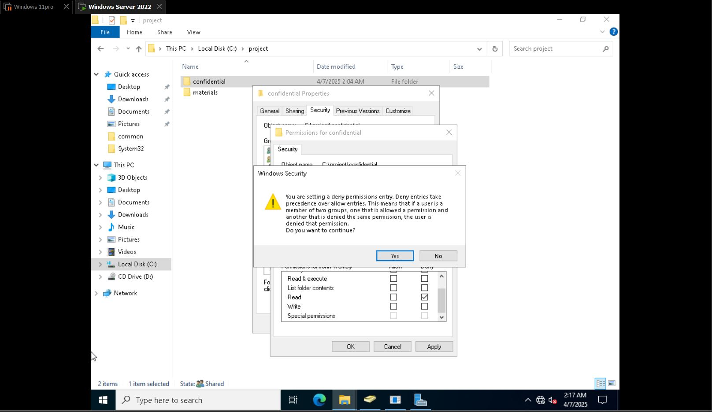

# File-Sharing

## How to map a drive (Share Drive Permissions) - Home Lab

A mapped drive or shared folder is a network location assigned a drive letter on a computer, allowing users to access files and folders on a remote server as if they were stored locally.

---
## Steps to Create a Shared Folder

1. Go to **Start menu** → Search for **Server Manager**
2. Navigate to **File and Storage Services**
3. Tap on **Shares** → **New Share**
4. Choose **SMB Share - Quick** → Click on it and click **Next**
5. Select **Share location** → Click **Next**
6. Enter **Share name** (e.g., `HR` or `Sales`) → Click **Next**
7. Configure **Other Settings** → Click **Next**
8. Set **Permissions** → Confirm and click **Create**

---
## Access the Shared Folder

1. Go to **File Explorer** → **This PC** → **Local Disk (C:)**
2. Check under **HR Folders** (This is the shared folder we just created)

---
## Note

- Typically in a work environment, shared folders are assigned to a **group**.
- Only group members are allowed to access that folder.
- These groups are created in **Active Directory Users and Computers** (Group type: *Security*) to be able to access the files.

## Create a Group in Active Directory

1. Go to **Active Directory Users & Computers**
2. Create a group:
   - Navigate to **Users** → Right-click → **New** → **Group**
   - Name the group (e.g., HR)
3. Tap on the group and add members:
   - Go to **Members** → Click **Add**
   - Enter the usernames and click **Check Name**
   - Click **Apply** and then **OK**

Added members to the group

---
## How to Set Permissions on the Folder

1. On the folder:
   - Right-click → **Properties** → **Security**
   - Tap **Advanced**
   - Click **Disable Inheritance**
   - Choose **Convert inherited permissions into explicit permissions on this object**
   - Remove existing users
2. Add permissions:
   - Click **Add** → **Select Principal**
   - Enter the username → Click **Check Name** → Click **OK**
   - Set **Basic permissions** (e.g., Modify) and click **OK**
3. Also add the personal group and modify permissions

---
## Share the Folder

- Go to **Sharing** tab → Click on **Share** (below the network path)
- Grant **Read/Write** permissions as required

---
## Note

- **Disabling inheritance** prevents other users from accessing the folder.
- It blocks unwanted permissions and ensures that **only the groups added** can access the files.

---
## Map the Drive

- Log in to the user account and map the drive using the correct path.
Example:
\\server2022\hr

## Mapping Network Drives on a User Computer

1. **Log into the user computer**
2. Navigate to **File Explorer** → **This PC**
3. Type in the search bar the UNC path:
- Log into the User Computer → Navigated to File Explorer → This PC → If the User has been mapped to a drive before, try to confirm the path `\\Server2022\hr`

- This PC → Right click on it → Select Map network drive and select a drive (Z: or any letter based on available drive in the Company) → Folder (Type the path, `\\Server2022\hr` and finish)

> The Reconnect at Sign in allows the User to access the drive whenever they re-login to the Computer, it connects automatically

---

- ## You can also map a network drive in active directory 

→ Go to active directory → Select the User's properties → go to Profile → Home Folder → Connect

→ Select a network path then type the path as:  
`\\Server2022\hr`

→ Use username to it allows each User to automatically map personal drive when they log in.

---

> You can also sign in how to save with that script:  
`\\Server2022\` → Map the drive

# Effective Permissions and Inheritance

## Step 1: Create a Security Group in Active Directory

- Navigate to **Active Directory Users & Computers**
- Create a **Security Group** under an Organization Unit  
  - Example:  
    - Right-click on `HR` → `New` → `Group`
    - Enter group name  
    - Select `Global` and `Security` for group scope and group type  
    - Click `OK`

---
## Step 2: Create Shared Folder Structure

- Open **File Explorer** → `This PC` → `Local Disk (C:)`
- Create a new folder named: `Common`
- Inside the folder, create subfolders: `Projects` and `events`
---
## Step 3: Set Sharing Permissions

- Right-click on the `Common` folder → `Properties` → `Sharing` tab
- Click on `Share` → Add `Everyone` → Click on `Share` and `Done`

---
## Step 4: Set NTFS Permissions

- Click on `Advanced Settings` → `Permissions`
- Set permissions for **Everyone (Allow)** → Click `OK`

- Go to the **Security** tab  
  - Tap `Edit` → Select `Everyone`  
  - Grant **Full Control** and **Modify**  
  - Click `Apply` and `OK`

---
## Step 5: Verify Inheritance
- Check the subfolders:
  - They should inherit permissions from the parent folder (`Common`)
  - Any files or folders created inside the subfolders will carry the **same inheritance**

# NTFS Permissions

## Disable Inheritance
- **Give permissions only to Project group** and disable non-group members from accessing the folder.
- Right-click on **Project folder** → **Properties** → **Security** → **Advanced** → Click on **Disable Inheritance**.
  - Click on **Everyone** → **Remove** → **Apply** → **OK**
- Click on **Add** (from advanced) → **Add** → Select a **Principal** (type the group & OK)
  - Set **Basic permissions** → **Full Control** → **Apply** → **OK**

---
## Implementing Explicit Deny in NTFS Permissions

- **Create a folder** (parent folder) → **Create a Subfolder** (Confidential & materials)
  - Go to **Project** → Right-click → **Properties** → **Share** → Add **Everyone** → **Share** & Done

- Navigate to the **Subfolder** (Confidential) → Right-click → **Properties** → **Security** → Click on **Edit** → Add and OK
  - Click on **User** (that you want to deny NTFS permissions) → Tap on **Deny (Read)**

- **Prompt Windows Security** → **YES**

## Shared Drive - Mapping Network Drive via Group Policy

- It is very important to guide the user and avoid any technical terms.
- Make it simple and interactive with the user.
### Topics Covered
- Shared drive
- How to map network drive
- Creating a network drive via group policy that allows automatic mapping for files for users on the same group permissions.
### Steps

1. **Create a New Group**
   - Example: Financial Group in Active Directory.
   - Add users to the group (e.g., David Miller, Bony Allen).

1. **Navigate to the Server**
   - Go to: `File & Storage Services`.
   - Right-click on `Shares` → `New Share`.
   - Select `SMB Share - Quick`.
   - Share location: `C:\drive` → Click Next.
   - Share name: `FinanceNetworkDrive` → Click Next.

3. **Permissions**
   - Click on `Permissions` → `Customize permissions`.
   - Disable inheritance.
   - Convert inherited permissions into explicit permissions on this object.
   - Click on `Add` → `Select a Principal`.
   - Click `Advanced` → `Find Now` → Select and add `Financial Group`.
   - Click `Apply` and `OK` → Click `Next`.
   - **Drive is Now Created**
### Mapping Drive via Group Policy

1. Open `Server Manager` → Go to `Tools` → `Group Policy Management`.
2. Navigate:
   - Forest → Domain → `nykason.com`.
1. Right-click on `Finance` → Create a GPO linked to `Finance`.
