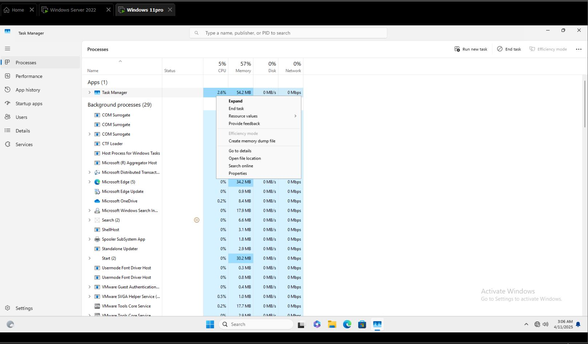
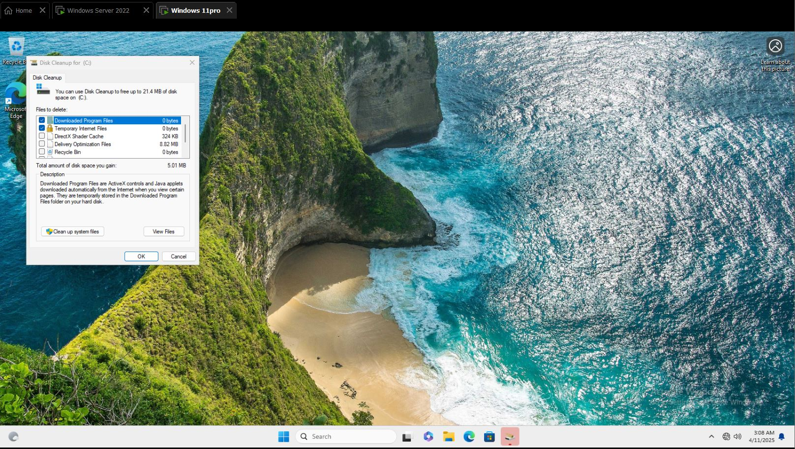
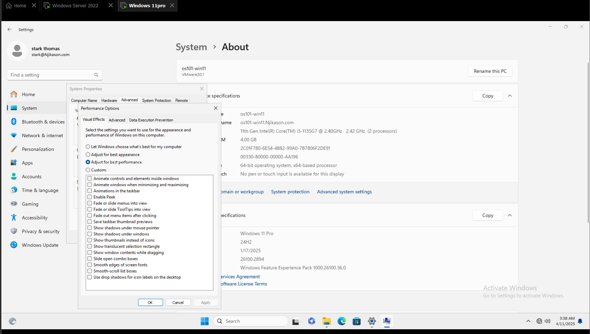
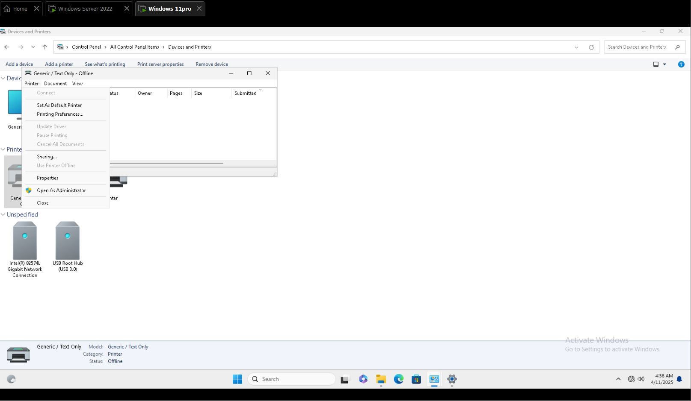
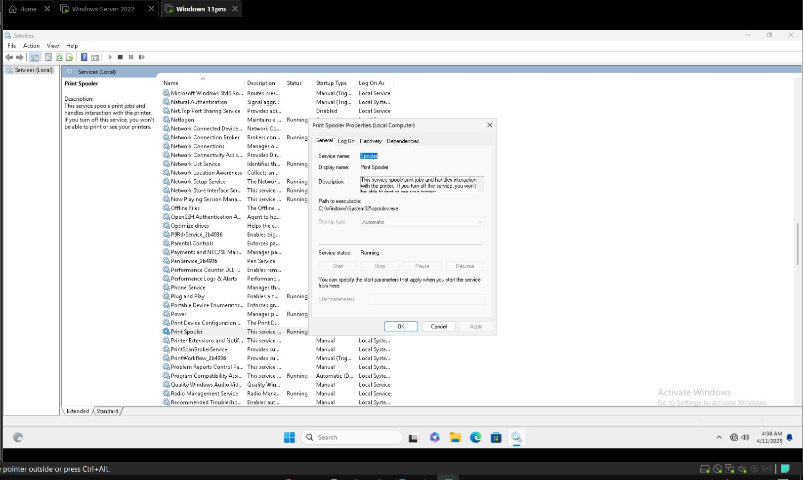
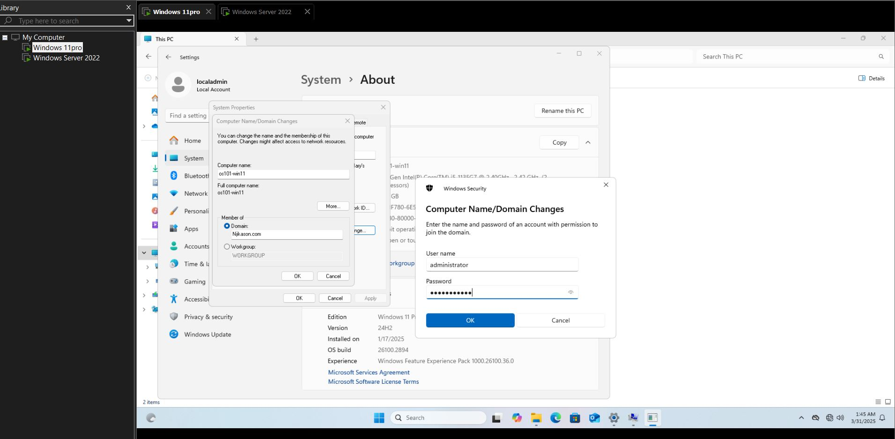

# Windows Troubleshooting

Identifying and fixing problems with the hardware, operating system to help users get their computer working properly again.  
As Windows operating system is popular in a business environment, knowing how to troubleshoot issues is an important skill to have for tech support.

---
## Troubleshooting a Slow Computer

1. **Search for Task Manager**  
   Press `Ctrl + Shift + Esc`

2. **Look Under Processes and Performance Tabs**  
   - Check for applications taking memory or anything consuming power.
   - **End Task** on unnecessary apps.

3. **Restart the Computer**  
   (Most computer uptime can cause system to malfunction.)

4. **Run Disk Cleanup**  
   - Press `Windows + R`
   - Type `cleanmgr` and run Disk Cleanup  
   - Check for Windows updates (install any pending updates & reboot)




---
## Speed Up a Slow Computer  
(Adjust for best performance)

1. Go to **File Explorer** → **This PC**
2. Right-click → **Properties**
3. Click on **Advanced System Settings**
4. Under the **Advanced** tab → Under **Performance (Settings)** →  
   Select **"Adjust for best performance"**
5. Click **Apply** and **OK**

# Printer Troubleshooting - Print Queue Stuck

When a printer is not responding and the print queue maybe stuck:

---
## Steps to Clear Print Queue

1. **Cancel all print jobs**  
   - Go to **Control Panel** → **Devices & Printers**  
   - Right-click the printer → Click **"Cancel all documents"** to clear the queue

2. **If the print jobs don’t cancel, reboot the printer**

3. **Restart the Print Spooler service**
   - Press `Windows + R`, type `services.msc`, and press **Enter**
   - Scroll down to **Print Spooler**
   - Right-click it and choose **Restart**

> This clears the print queue and refreshes the Print Spooler.


##  Hosts File - Fix Website Access Issues

### GUI Method:
1. Open **File Explorer** and navigate to:
   ```
   C:\Windows\System32\drivers\etc
   ```
2. Right-click **hosts** file → Open with **Notepad (Run as Administrator)**.
3. Remove unwanted entries and **Save**.
4. Restart the browser.

### CMD Method:
```powershell
notepad C:\Windows\System32\drivers\etc\hosts
```
Edit and save the file.

---
##  Encryption & BitLocker

### GUI Method:
1. Open **Control Panel > BitLocker Drive Encryption**.
2. Click **Turn on BitLocker** and follow the setup.
3. Save the recovery key in **OneDrive or a USB drive**
```

---
##  Check Windows Version

### GUI Method:
1. Open **Settings > System > About**.
2. Check **Edition**.
### CMD Method:
```powershell
winver
---
##  Virus & Malware Removal

### GUI Method:
1. Open **Windows Security > Virus & Threat Protection**.
2. Click **Quick Scan**.
### CMD Method:
```powershell
MpCmdRun -Scan -ScanType 2
```

---
## Fix Internet Connection Issues

### GUI Method:
1. Open **Settings > Network & Internet > Status**.
2. Click **Change Adapter Options**.
3. Right-click **Wi-Fi** → **Disable > Enable**.
4. Click **Network Troubleshooter**.
### CMD Method:
```powershell
ipconfig /release
ipconfig /renew
```


---
## Manage Power Options

### GUI Method:
1. Open **Control Panel > Power Options**.
2. Select **Balanced** or **High Performance**.
### CMD Method:
```powershell
powercfg /setactive SCHEME_MIN
```

---
##  Manage Windows Updates

1. Open **Settings > Windows Update**.
2. Click **Pause Updates**.
### CMD Method:
```powershell
wuauclt /detectnow
```

---
## Check System Information

### GUI Method:
1. Right-click **Start > System**.
2. Open **Task Manager > Performance Tab**.
### CMD Method:
```powershell
systeminfo
```

---
## Install & Uninstall Applications

### GUI Method:
1. Open **Control Panel > Programs & Features**.
2. Click an app and select **Uninstall**.
### CMD Method:
```powershell
wmic product where name="appname" call uninstall
```

---
## 10. Rename PC & Join a Domain

### GUI Method:
1. Open **Settings > System > About > Rename this PC**.
2. To join a domain: Open **Settings > Accounts > Access Work or School**.
### CMD Method:
```powershell
wmic computersystem where name="%computername%" call rename name="NewPCName"
netdom join %computername% /domain:yourdomain.com /userd:AdminUser /passwordd:*
```


---
##  Check Windows Activation

### GUI Method:
1. Open **Settings > System > Activation**.
### CMD Method:
```powershell
slmgr /xpr
```

---
##  End Processes

### GUI Method:
1. Press **Ctrl + Shift + Esc** to open **Task Manager**.
2. Right-click a process and select **End Task**.
### CMD Method:
```powershell
taskkill /IM processname.exe /F
```

---
##  Check & Fix Disk Errors

### GUI Method:
1. Open **File Explorer > This PC**.
2. Right-click **C: Drive > Properties > Tools > Error Checking > Check**.
### CMD Method:
```powershell
chkdsk C: /f /r
```

---
##  Increase Virtual RAM

### GUI Method:
1. Open **Settings > System > About > Advanced System Settings**.
2. Click **Performance Settings > Advanced > Virtual Memory**.
3. Increase the **Page File size**.
---
more troubleshooting soon.