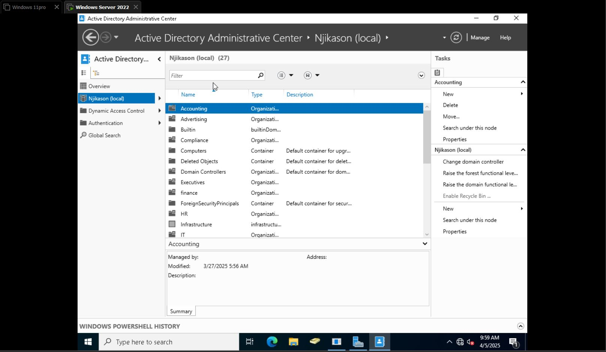

## What is Active Directory?

Active Directory (AD) is a Microsoft directory service used in Windows Server environments to manage users, computers, groups, and other network resources.  
It helps organizations:
- Control access to resources  
- Enforce security policies  
- Simplify administration  

---
## Active Directory Domain Services Installation

**Before you begin:**

1. Open **Server Manager**.
2. Click **Next**.
3. Select **Role-based or feature-based installation**.
4. Click **Next**.
5. Click on **Active Directory Domain Services**.
6. Click **Add Features**.
7. Click **Next**, then **Install** (wait for it to succeed).
8. Click **Promote this server to a domain controller**.
9. Select **Add a new forest**.
10. Enter the **Root domain name** (e.g., `mykasm.com`).
11. Create a password (e.g., `Password@123`).
12. Click **Next**.
13. Wait for **Prerequisites check**.
14. Click **Install** — it will restart your computer.

> **Note:** Active Directory Users & Computers are now installed in the server.

---
## Creating a New Account in Active Directory

1. From the **Start Menu**, click on **Windows Administrative Tools**.
2. Go to **Active Directory Users & Computers**.
3. Right-click on **Users**.
4. Scroll down to **New** → **User**.
5. Fill in:
   - User's name  
   - Password (check "User must change password at next login")  
6. Click **Finish**.

---

## Show More Details About a User

If you want more features displayed (like showing more details about a user):

- Right-click on **View** (in the top menu).
- Scroll down to **Advanced Features** and check it.

---

## How to Find a User, Contact, and Groups in Active Directory

- Open **Active Directory Users & Computers**.
- In the left-hand panel, select your domain (e.g., **Njikason.com**).
- Go to the **Find** option.
- Select the object type (User, Contact, or Group).
- Set the location to **Entire Directory**.
- Type the name or description of the object.
- Click **Find Now**.

---

## Enable Recycle Bin in Active Directory

1. On your **Start Menu**, click on **Active Directory Administrative Center**.
2. Select your **Domain Name** (e.g., **Njikason.com**).
3. On the right-hand pane, look for **Enable Recycle Bin for Domain Level**.
4. Click to enable. You’ll get a prompt → Click **OK**.

> This allows you to retrieve accidentally deleted accounts or objects using the Recycle Bin.

---

## Using the Copy Method

- **Copying a user account** gives you the ability to fast-track account creation—especially when the new user should have similar group memberships and permissions as an existing user.
- This is useful when the user belongs to the same groups, OUs, etc.

### Steps:

1. Right-click on the existing user.
2. Select **Copy**.
3. Enter a **New Username** and **Password**.
4. Click **Next**, then **Finish**.
![Screenshot]
> Now both users have the same privileges and are members of the same groups.
