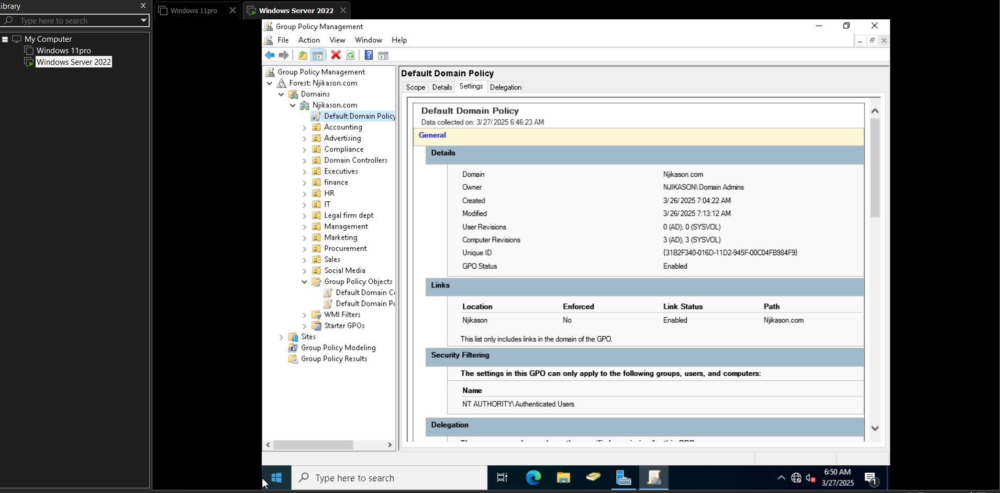
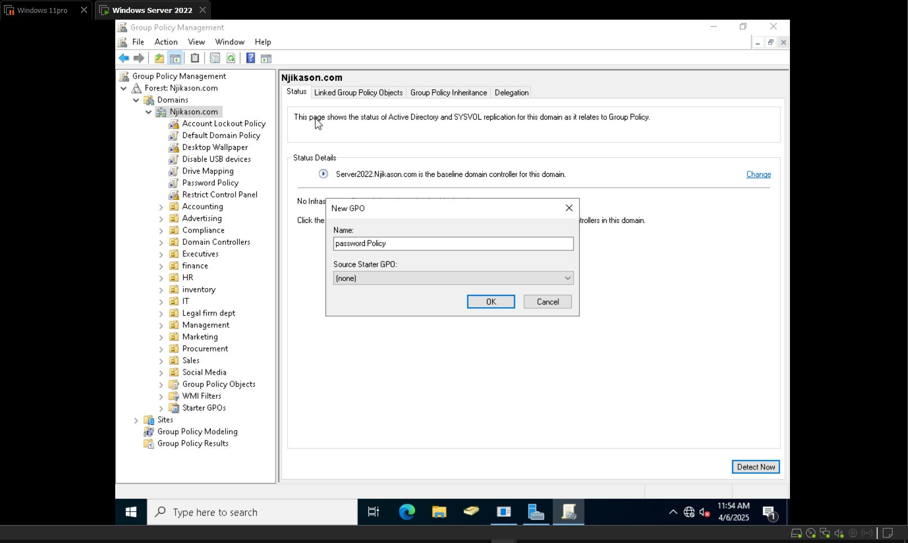
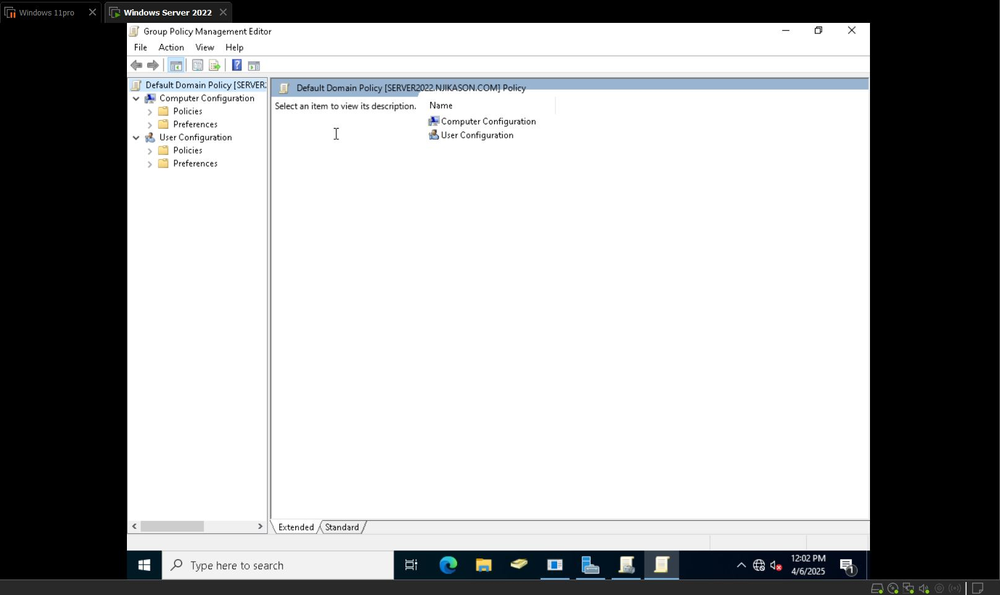
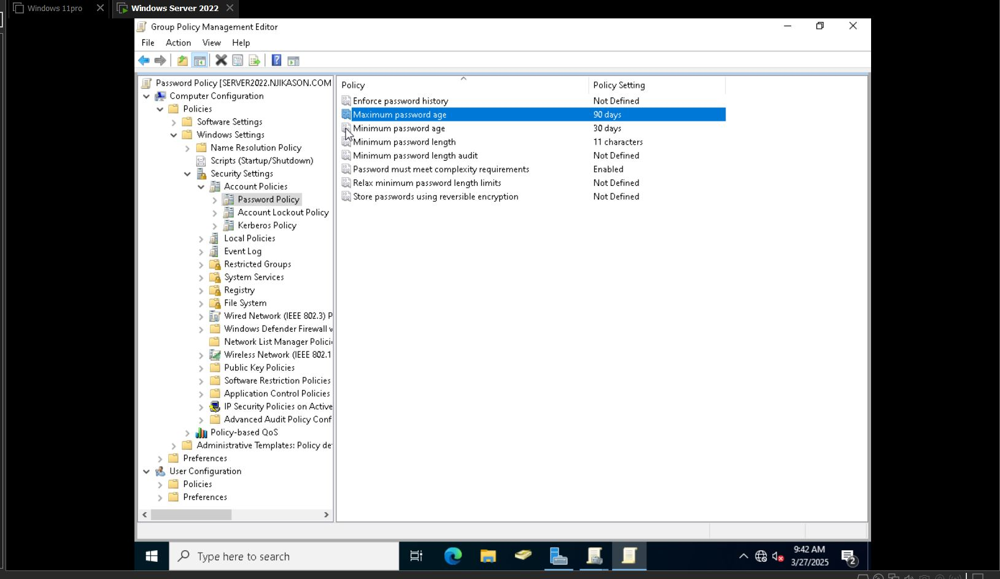
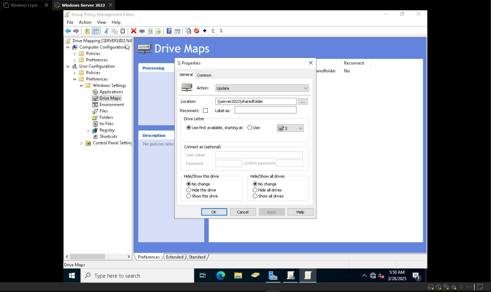
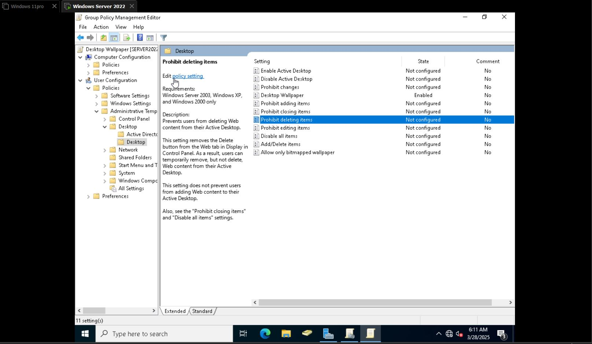

# Group Policy

**Group Policy (GPO)** is a tool in Windows that helps IT administrators control and configure multiple computers in a network. It allows them to set rules and settings for users and computers without having to configure each one manually.

---
## How It Works

- **Group Policy Objects (GPOs)** contain the rules and settings.
- GPOs are linked to **Active Directory (AD)** and applied to users or computers.
- When a user logs in or a computer starts, it checks for policies and applies them.

---
## How to Locate Group Policy Management

1. Navigate to **Server Manager** → **Tools** → **Group Policy Management**.
2. Click on **Forest** → **Domains** → Right-click on **Domain**.
3. Select **Create a GPO in this domain**.

---

## Create a GPO (e.g., for Password Policy)

- Setting a password policy to enforce strong passwords and enhance security.

**Example:**
- Name: `Password Policy`
- Click **OK** and right-click to configure settings.
- Click and **edit** 
# Local Group Policy Editor Notes

## Computer Configuration
- Applies to the **local computer** and doesn't change per user.

## User Configuration
- Applies to **users on the local machine**.
- Will apply to **any new users in the future** on a local computer.

### Under Configuration:
- **Policies** – Can't be changed by users (e.g., password policies, account lockout policies).
- **Preferences** – Can be changed by users (e.g., mapped network drives, printers, desktop shortcuts).

---
## Configuring Password Policies

**Steps:**
1. Go to `Computer Configuration` → `Windows Settings` → `Security Settings`
2. Click on `Account Policies` → `Password Policy`
3. Configure the following:
   - **Minimum password length** – Define the policy and change
   - **Password must meet complexity requirements** – Enable
   - **Maximum password age** – Set to 90 days

Click **Apply** and **OK**.

---
## Account Lockout Policy

**Steps:**
1. Click on `Account Policies` → `Account Lockout Policy`
2. Define:
   - **Account lockout duration** – Define this policy setting → Change → Apply → OK
---
# Group Policy Notes (Drive Mapping & Desktop Wallpaper)

## Drive Mapping

- **Purpose**: Map network drives for users when they log in using Group Policy Object (GPO).

**Steps:**
1. Create a GPO within the domain:
   - Right-click on the domain → Click `Create a GPO` → Name it **Drive Mapping** → Click OK

2. Right-click on the **Drive Mapping GPO** and click `Edit`.

3. Navigate to:
   - `User Configuration` → `Preferences` (Expand based on Windows Settings) → `Drive Maps`  
   - Right-click and choose **New** → **Mapped Drive**

4. Set the following:
   - **Location**: (e.g., \\Server2021\ShareFolder)
   - **Use**: Set to available (e.g., E: drive) or set as available to anyone.

4. Click **Apply** and **OK**

---
## Desktop Wallpaper Policy

- **Purpose**: Set a default desktop wallpaper for all users.

**Steps:**
1. Create a GPO in the domain:
   - Name it **Desktop Wallpaper**
2. Right-click the GPO and select **Edit**
3. Navigate to:
   - `User Configuration` → `Policies` → Expand `Administrative Templates` → Expand `Desktop` → `Desktop`  
   - Double-click on **Desktop Wallpaper**
4. Configure the policy:
   - Set to **Enabled**
   - **Wallpaper Name**: Provide full path to the wallpaper
   - **Wallpaper Style**: Choose **Center** or **Fill**

1. Click **Apply** and **OK**
---
# Group Policy Notes (Control Panel Restriction & USB Storage)

## Restrict Access to Control Panel

- **Purpose**: Prevent users from accessing the Control Panel.

**Steps:**
1. Create a GPO within the domain:
   - Name it **Restrict Control Panel**
1. Right-click on the GPO and click **Edit**.
2. Navigate to:
   - `User Configuration` → `Policies` → Expand `Administrative Templates` → `Control Panel`

4. Double-click on:
   - **Prohibit access to Control Panel and PC Settings**

5. Set it to **Enabled**, then click **Apply** and **OK**.

---

## Disable USB Storage

- **Purpose**: Prevent users from using USB storage devices.

**Steps:**

1. Right-click on the domain and create a GPO:
   - Name it **Disable USB Devices**

2. Right-click on the GPO and click **Edit**.

3. Navigate to:
   - `Computer Configuration` → `Policies` → Expand `Administrative Templates` → `System` → `Removable Storage Access`

4. Double-click on:
   - **All Removable Storage classes: Deny all access**

5. Set it to **Enabled**, then click **Apply** and **OK**.

---

## Note

You can configure any type of Group Policy depending on the company's need and apply it to the desired computers.
