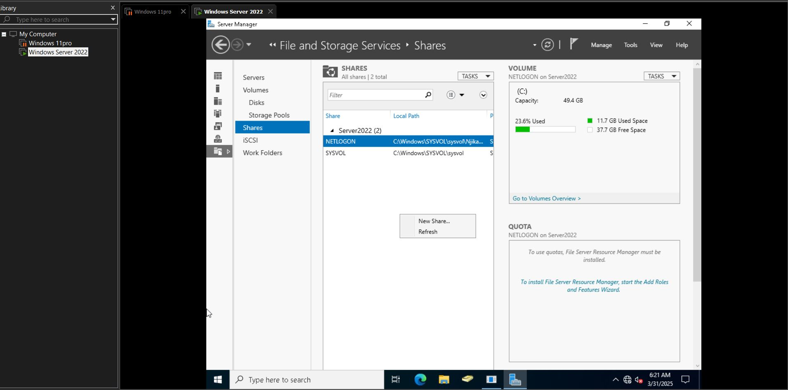
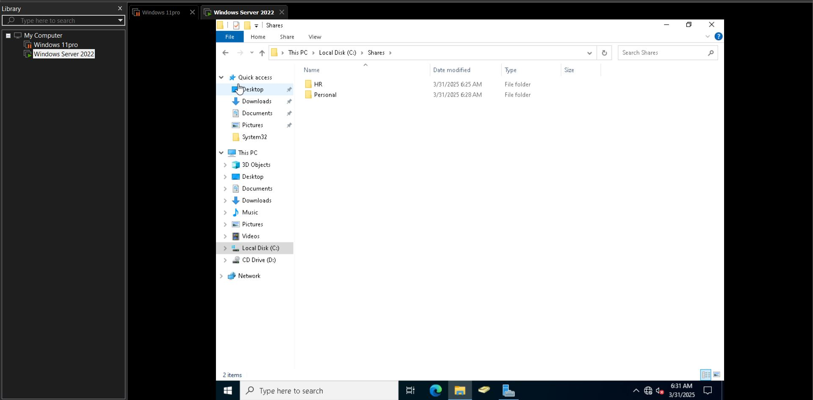
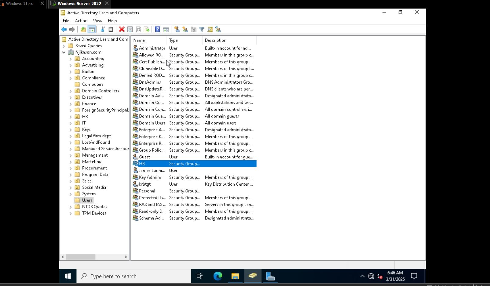
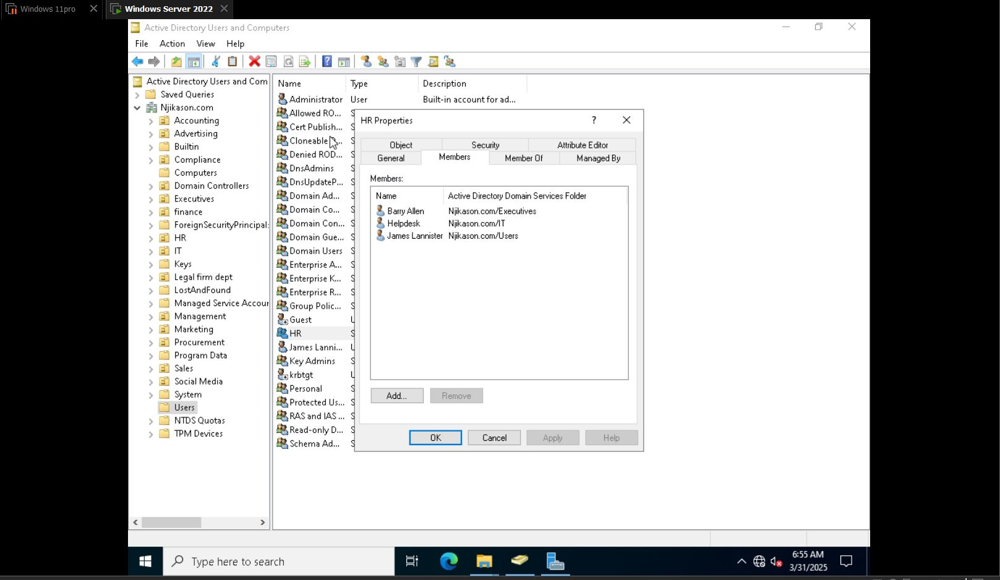
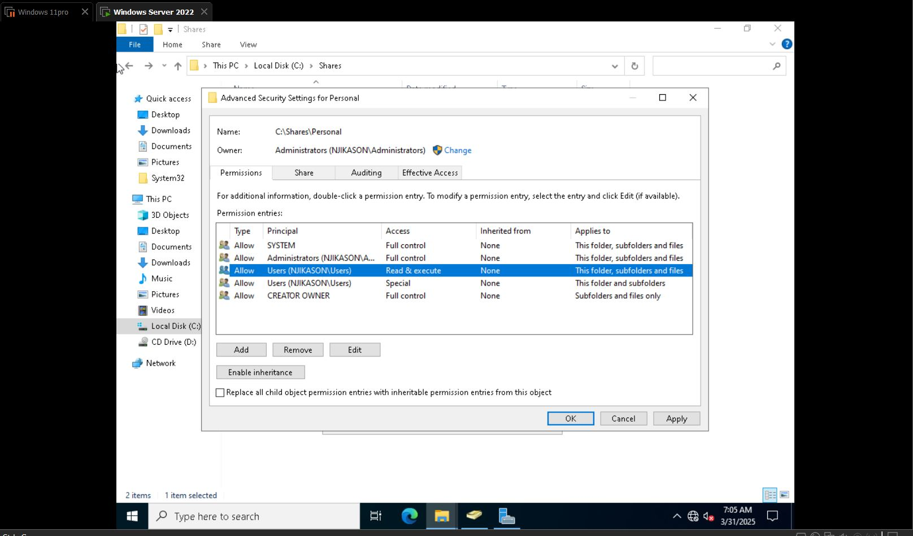

# Map Drive

## How to map a drive (Share Drive Permissions) - Home Lab

A mapped drive or shared folder is a network location assigned a drive letter on a computer, allowing users to access files and folders on a remote server as if they were stored locally.

---
## Steps to Create a Shared Folder

1. Go to **Start menu** → Search for **Server Manager**
2. Navigate to **File and Storage Services**
3. Tap on **Shares** → **New Share**
4. Choose **SMB Share - Quick** → Click on it and click **Next**
5. Select **Share location** → Click **Next**
6. Enter **Share name** (e.g., `HR` or `Sales`) → Click **Next**
7. Configure **Other Settings** → Click **Next**
8. Set **Permissions** → Confirm and click **Create**

---
## Access the Shared Folder

1. Go to **File Explorer** → **This PC** → **Local Disk (C:)**
2. Check under **HR Folders** (This is the shared folder we just created)

---
## Note

- Typically in a work environment, shared folders are assigned to a **group**.
- Only group members are allowed to access that folder.
- These groups are created in **Active Directory Users and Computers** (Group type: *Security*) to be able to access the files.

## Create a Group in Active Directory

1. Go to **Active Directory Users & Computers**
2. Create a group:
   - Navigate to **Users** → Right-click → **New** → **Group**
   - Name the group (e.g., HR)
3. Tap on the group and add members:
   - Go to **Members** → Click **Add**
   - Enter the usernames and click **Check Name**
   - Click **Apply** and then **OK**

Added members to the group

---
## How to Set Permissions on the Folder

1. On the folder:
   - Right-click → **Properties** → **Security**
   - Tap **Advanced**
   - Click **Disable Inheritance**
   - Choose **Convert inherited permissions into explicit permissions on this object**
   - Remove existing users
2. Add permissions:
   - Click **Add** → **Select Principal**
   - Enter the username → Click **Check Name** → Click **OK**
   - Set **Basic permissions** (e.g., Modify) and click **OK**
3. Also add the personal group and modify permissions

---
## Share the Folder

- Go to **Sharing** tab → Click on **Share** (below the network path)
- Grant **Read/Write** permissions as required

---
## Note

- **Disabling inheritance** prevents other users from accessing the folder.
- It blocks unwanted permissions and ensures that **only the groups added** can access the files.

---
## Map the Drive

- Log in to the user account and map the drive using the correct path.
Example:
\\server2022\hr

## Mapping Network Drives on a User Computer

1. **Log into the user computer**
2. Navigate to **File Explorer** → **This PC**
3. Type in the search bar the UNC path:
- Log into the User Computer → Navigated to File Explorer → This PC → If the User has been mapped to a drive before, try to confirm the path `\\Server2022\hr`

- This PC → Right click on it → Select Map network drive and select a drive (Z: or any letter based on available drive in the Company) → Folder (Type the path, `\\Server2022\hr` and finish)

> The Reconnect at Sign in allows the User to access the drive whenever they re-login to the Computer, it connects automatically.

---

- ## You can also map a network drive in active directory 

→ Go to active directory → Select the User's properties → go to Profile → Home Folder → Connect

→ Select a network path then type the path as:  
`\\Server2022\hr`

→ Use username to it allows each User to automatically map personal drive when they log in.

---

> You can also sign in how to save with that script:  
`\\Server2022\` → Map the drive
